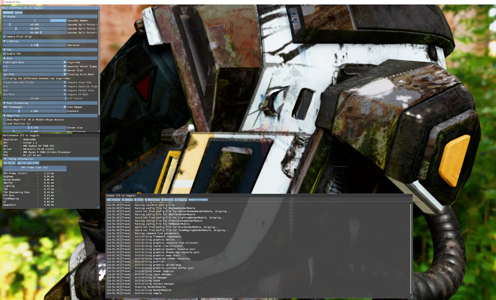

<!-- @page page_samples_blur FidelityFX Blur -->

<h1>FidelityFX Blur</h1>

FidelityFX Blur demonstrates a single pass Gaussian blur effect which is functionally the same as a standard two pass separable Gaussian blur (but more performant).

For details on the techniques that underpin the FidelityFX Blur effect you can refer to the respective [technique documentation](../techniques/blur.md).

<h2>Requirements</h2>

 - Windows
 - DirectX(R)12
 - Vulkan(R)

<h2>UI elements</h2>

The UI elements included in the sample enable switching between different Gaussian kernel weights, different kernel sizes, and floating point precision. Also, the UI provides a comparison mode to compare the FidelityFX Blur technique to standard blur techniques. The table below summarises the UI elements and what they control within the sample.

| Element name | Value | Description |
| --- | --- | --- |
| **Algorithm** | `FidelityFX Blur, Single Pass Filter, Multi-pass Separable Filter, Multi-pass Separable Filter Transpose` | Switches the currently used algorithm. | 
| **Gaussian Kernel Sigma** | `1.6, 2.8, 4.0` | Switches the sigma used for generating the Gaussian kernel. |
| **Kernel Size** | `3x3, 5x5, ..., 21x21` | Switches the size of the blur kernel. |
| **Floating Point Math** | `Use FP32, Use FP16` | Switches between FP32 and FP16 implementations of the technique. |
| **Display the difference** | `On/Off` | Enables/Disables the comparison mode. |
| **Comparison mode settings** | `Compare Algorithm, Compare Gaussian Sigma, Compare Kernel Size, Compare FP Math` | Same options as above, but for the comparison mode filter. |
| **Diff Factor** | `1.0..10.0` | Scale to apply to the comparison difference for display. |

<h3>Comparison mode</h3>

The comparison mode is enabled by selecting the `Display the difference between two algorithms` checkbox, displays the difference between the two selected blur algorithms. 

The image generated by the algorithm selected in the `Compare Algorithm` dropdown and its corresponding kernel sigma, size, and math settings, are subtracted from the image generated by the algorithm, and corresponding settings, selected in the `Algorithm` dropdown. In order to better visualize very tiny differences, the `Diff Factor` slider specifies a value that the difference between the two images is multiplied by before it is displayed on screen.

<h2>Sample controls and configurations</h2>

For sample controls, configuration, and FidelityFX Cauldron Framework UI element details, see [Running the samples](../getting-started/running-samples.md).

<h2>See also</h2>

- [FidelityFX Blur](../techniques/blur.md)
- [FidelityFX Naming guidelines](../getting-started/naming-guidelines.md)
