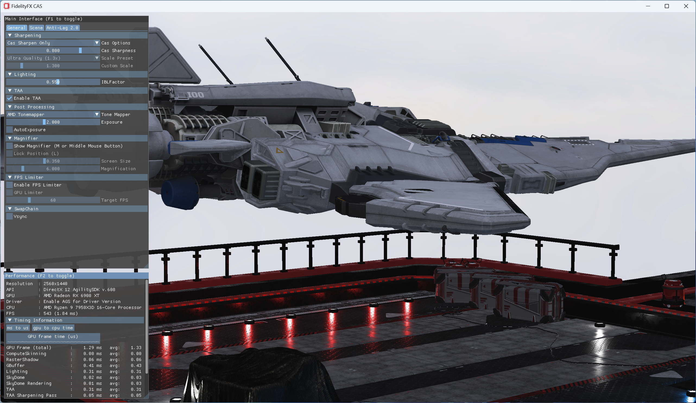

<!-- @page page_samples_contrast-adaptive-sharpening FidelityFX Contrast Adaptive Sharpening -->

<h1>FidelityFX Contrast Adaptive Sharpening</h1>



This sample demonstrates the use of the FidelityFX Contrast Adaptive Sharpening (CAS) post process effect.

For details on the techniques that underpin the CAS effect you can refer to the respective [technique documentation](../techniques/contrast-adaptive-sharpening.md).

<h2>Requirements</h2>

 - Windows
 - DirectX(R)12
 - Vulkan(R)`

<h2>UI elements</h2>

The sample contains various UI elements to help you explore the techniques it demonstrates. The table below summarises the UI elements and what they control within the sample.

| Element name              | Value                    | Description                                                                                                                                     |
| --------------------------|--------------------------|-------------------------------------------------------------------------------------------------------------------------------------------------|
| **Cas Options**           | `Upsample, Sharpen, Off` | If `Off` then disables use of contrast adaptive sharpening shader. If `Upsample` then CAS shader will sharpen and upsample from the selected 'Render Dim' to the display resolution as specified by the JSON configuration file (see above). |
| **Cas Sharpness**           | `0..1`                   | Sliding left of right controls the amount of sharpening (0 - least amount, 1 - max amount).                                                     |
| **Scale Preset**           | `Ultra Quality, Quality, Balanced, Performance, Ultra Performance, Custom`  | Combo preset selection. Affect upscale ratio.                                                     |
| **Custom Scale**           | `1..3`                   | Sliding left of right controls the amount of scaling (1 - least amount, 3 - max amount). Note that custom scale preset must be enabled to use the custom scale slider.   |

<h2>Setting up CAS</h2>

The Contrast Adaptive Sharpening (CAS) sample takes as input the color buffer produced by the geometry rendering passes, including the opaque, transparent, and sky box geometry, and also any post processing passes, but before any UI elements are rendered. The CAS shader also has some uniform parameter inputs `const0` and `const1` which are passed as input to the shader function `CasFilter`, which is defined in [`ffx_cas.h`](../../sdk/include/FidelityFX/gpu/cas/ffx_cas.h).

The value of these constants are computed either on the CPU (preferred) or the GPU by calling the function `CasSetup`, defined in the same file. The output of the CAS shader is an image of the same or larger dimensions as the input image. The valid dimensions for the output image is a function of the input image's dimensions and can be determined by calling the function `CasSupportScaling` (see comments in [`ffx_cas.h`](../../sdk/include/FidelityFX/gpu/cas/ffx_cas.h) for more details on all these functions).

The [`ffx_cas.h`](../../sdk/include/FidelityFX/gpu/cas/ffx_cas.h) header file is designed to be included from both C++ and HLSL/GLSL via `#define` macros (see below).


C++:
```C++
#define FFX_CPU
#include <gpu/ffx_core.h>
#include <gpu/ffx_cas.h>
```

HLSL:
```HLSL
#define FFX_GPU
#define FFX_HLSL
#include "ffx_core.h"
#include "ffx_cas.h"
```

GLSL:
```GLSL
#define FFX_GPU
#define FFX_GLSL
#include "ffx_core.h"
#include "ffx_cas.h"
```

Note that [`ffx_cas.h`](../../sdk/include/FidelityFX/gpu/cas/ffx_cas.h) is dependent on [`ffx_core.h`](../../sdk/include/FidelityFX/gpu/ffx_core.h), so both must be included.

<h3>Shader options</h3>

The CAS shader or more specifically the `CasFilter` function has a few different options. One option is support for using 16-bit floating point (FP16) math versus 32-bit floating point (FP32) math. In general, FP16 math is more efficient than FP32 math on AMD hardware. Another option is the ability to produce upscaled output or to only sharpen the output without upscaling. For best performance, the sample compiles these options into the multiple shader permutations and chooses the specific permutations of the shader at runtime depending on the sample's current configuration (see UI Elements section above). In all there are four permutations of the shader:

* FP16-sharpen-only
* FP16-sharpen-and-upscale
* FP32-sharpen-only
* FP32-sharpen-and-upscale

<h2>Sample controls and configurations</h2>

For sample controls, configuration, and FidelityFX Cauldron Framework UI element details, see [Running the samples](../getting-started/running-samples.md).

<h2>See also</h2>

- [FidelityFX Contrast Adaptive Sharperning](../techniques/contrast-adaptive-sharpening.md)
- [FidelityFX Naming guidelines](../getting-started/naming-guidelines.md)
