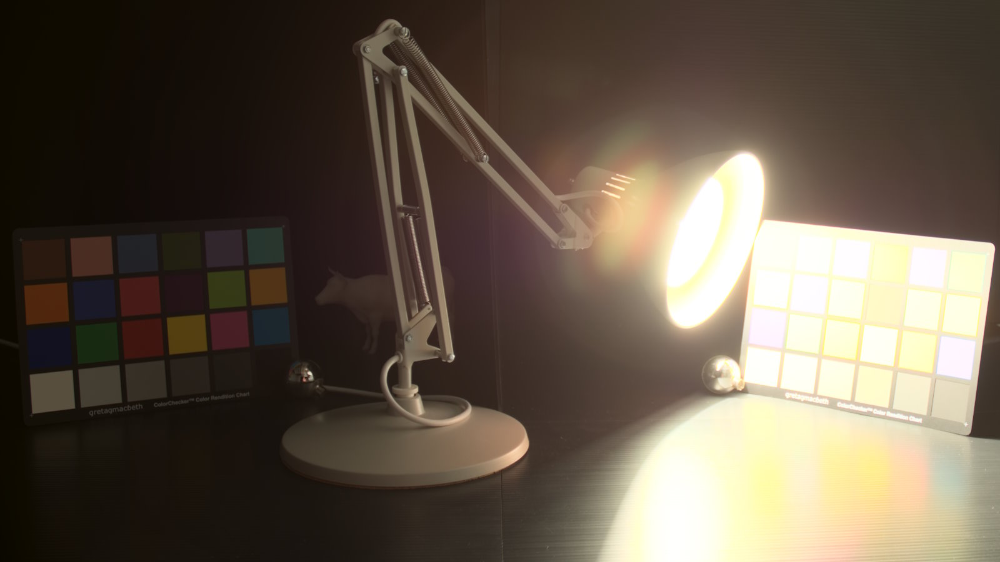

<!-- @page page_samples_luminance-preserving-mapper FidelityFX Luminance Preserving Mapper -->

<h1>FidelityFX Luminance Preserving Mapper</h1>

FidelityFX Luminance Preserving Mapper (or LPM) is a tone and gamut mapping solution for high dynamic range (HDR) and wide gamut content. FidelityFX LPM tone maps the luma of the red-green-blue (RGB) pixel instead of the color itself, but it ensures that `tonemap(luma(RGB))` would be very similar to `luma(tonemap(RGB))`, preserving the luminance of the pixel.

For details on the techniques that underpin the FidelityFX LPM effect you can refer to the respective [technique documentation](../techniques/luma-preserving-mapper.md).

<h2>FidelityFX LPM off</h2>


<h2>FidelityFX LPM on</h2>



<h2>Requirements</h2>

 - Windows
 - DirectX(R)12
 - Vulkan(R)

<h2>UI elements</h2>

The sample contains various UI elements to help you explore the techniques it demonstrates. The table below summarises the UI elements and what they control within the sample.

| Element name | Value | Description |
| --- | --- | --- |
| **IBLFactor** | `0..1` | Contribution of image-based lighting to the lit scene. |
| **Soft Gap** | `0..0.5` | Controls how much to feather region in out-of-gamut mapping. Range from 0 to a little over zero, 0 == clip. |
| **HDR Max** | `1..FLT_MAX` | Brightest linear input RGB pixel value. |
| **LPM Exposure** | `1..2^n=FLT_MAX` | Set `n` to how many times you need to double 18% mid level on the input. |
| **Contrast** | `0..1` | Input range {0.0 (no extra contrast) to 1.0 (maximum contrast)}. |
| **Shoulder Contrast** | `1..1.5` | Shoulder shaping, 1.0 = no change (fast path) |
| **SaturationRGB** | `-1..1` | A per channel adjustment, use < 0 decrease, 0 == no change, > 0 increase. |
| **crosstalkRGB** | `0..1` | One channel must be 1.0, the rest can be <= 1.0 but not zero. Lengthens color path to white by walking across gamut. |

<h2>Setting up the LPM compute shader</h2>

The FidelityFX LPM compute shader takes as input the linear color buffer produced by the geometry rendering passes, including the opaque, transparent, and sky box geometry, and also any post processing passes - but before any GUI elements are rendered. 

The FidelityFX LPM shader also has some uniform parameters which are passed into the LPM constant setup call described above. They then get passed into the LPM filter call where the tone and gamut mapping happens. Both are defined in `ffx_lpm.h`.

The `ffx_lpm.h` header file is designed to be included from both C++ and HLSL/GLSL via `#define` macros (see below).

C++:
```C++
#define FFX_CPU
#include <gpu/ffx_core.h>
#include <gpu/ffx_lpm.h>
```

HLSL:
```HLSL
#define FFX_GPU
#define FFX_HLSL
#include "ffx_core.h"
#include "ffx_lpm.h"
```

GLSL:
```GLSL
#define FFX_GPU
#define FFX_GLSL
#include "ffx_core.h"
#include "ffx_lpm.h"
```

Note that `ffx_lpm.h` is dependent on `ffx_core.h`, so both must be included.

<h3>Shader options</h3>

The FidelityFX LPM shader or more specifically the `LpmFilter` function has options for using 16-bit floating point (FP16) math versus 32-bit floating point (FP32) math. In general, FP16 math is more efficient than FP32 math on AMD hardware and for FidelityFX LPM it can enable processing two pixels per thread giving double the throughput. 

For best performance, the sample compiles these options into the multiple shader permutations and chooses the specific permutations of the shader at runtime depending on the sample's current configuration (see UI Elements section above). In all there are two permutations of the shader:

* FP16-LpmFilter
* FP32-LpmFilter

<h2>Sample controls and configurations</h2>

For sample controls, configuration, and FidelityFX Cauldron Framework UI element details, see [Running the samples](../getting-started/running-samples.md).

## See also

- [FidelityFX Luma Preserving Mapper](../techniques/luminance-preserving-mapper.md)
- [FidelityFX Naming guidelines](../getting-started/naming-guidelines.md)
