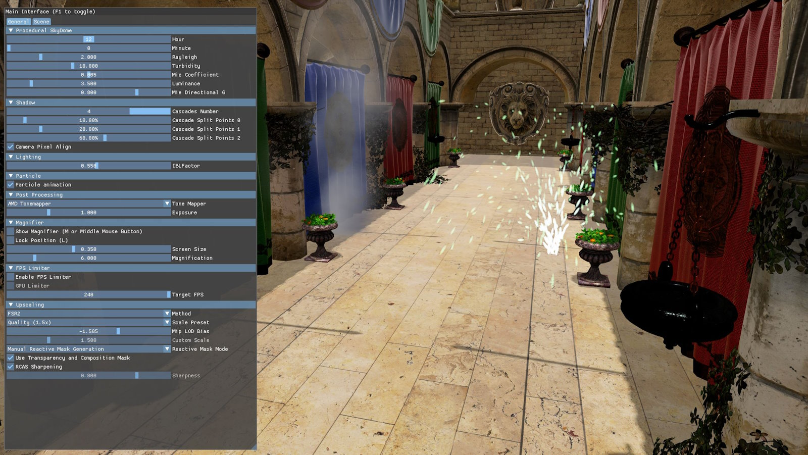
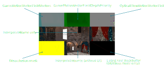

<!-- @page page_samples_super-resolution FidelityFX Super Resolution -->

<h1>FidelityFX Super Resolution</h1>

This sample demonstrates the use of FidelityFX Super Resolution 3.1.3 for upscaling and frame generation.

For details on the underlying algorithms you can refer to the per-technique documentation for [FSR3 upscaling](../techniques/super-resolution-upscaler.md) and [frame interpolation](../techniques/frame-interpolation.md).

<h2>Requirements</h2>

 - Windows
 - DirectX(R)12
 - Vulkan(R)

<h2>UI elements</h2>

The sample contains various UI elements to help you explore the techniques it demonstrates. The table below summarises the UI elements and what they control within the sample.

| Element name | Value | Description |
| -------------|-------|-------------|
| **Particle animation** | `Checked, Unchecked` | Enables or disables particle emission which is used to demonstrate the use of the Reactive mask. |
| **Method** | `Native, FSR` | Used to select the method of upscaling, either native resolution with no upscaling or upscaling using FSR. |
| **FSR Version** | `3.1.0` | Select the FSR upscaler version to use. |
| **Scale Preset** | `Native AA (1.0x), Quality (1.5x), Balanced (1.7x), Performance (2x), Ultra Performance (3x), Custom` | Select upscaling preset which represents the scaling factor per dimension from render resolution to display resolution. |
| **Mip LOD Bias** | `-5.0..0.0` | Used for choosing the amount of mipmap biasing applied for sampling textures during the G-Buffer pass.  |
| **Custom Scale** | `1.0..3.0` | Allows to set a custom scaling factor when Scale Preset is set to 'Custom'. |
| **Letterbox size** | `0.2..1.0` | Adds a black border around the frame when set to values below 1. |
| **Reset Upscaling** |  | When clicked, sets the upscaling reset flag for one frame, simulating a discontinuous camera change. |
| **Draw upscaler debug view** | `Checked, Unchecked` | Toggles upscaler debug view. See the explanation below. |
| **Reactive Mask Mode** | `Disabled, Manual Reactive Mask Generation, Autogen FSR2 Helper Function` | Used to select the method of generating the Reactive mask. Either disables it completely, generates it manually by drawing transparent objects or generates it automatically using the helper function provided by FSR 2. |
| **Use Transparency and Composition Mask** | `Checked, Unchecked` | Toggles the use of the Transparency and Composition Mask. |
| **RCAS Sharpening** | `Checked, Unchecked` | Toggles the use of RCAS sharpening. |
| **Sharpness** | `0.0..1.0` | Changes the amount of sharpening applied if RCAS is enabled. |
| **Frame Interpolation** | `Checked, Unchecked` | Toggles frame generation. |
| **Support Async Compute** | `Checked, Unchecked` | Toggles async compute flag set during context creation. |
| **Allow async compute** | `Checked, Unchecked` | Toggles use of async compute queue. |
| **Use callback** | `Checked, Unchecked` | Toggles use frame generation callback. |
| **Draw frame generation tear lines** | `Checked, Unchecked` | Toggles tearing indicators on the left and right sides of the window. |
| **Draw frame generation reset indicators** | `Checked, Unchecked` | Toggles reset indicators at the top side of the window. |
| **Draw frame generation debug view** | `Checked, Unchecked` | Toggles frame generation debug view. See the explanation below. |
| **Present interpolated only** | `Checked, Unchecked` | When enabled, only interpolated frames are shown. |
| **Reset Frame Interpolation** | | When clicked, sets the frame generation reset flag for one frame, simulating a discontinuous camera change. |
| **Simulate present skip** | | When clicked, simulates skipping presentation of one frame by incrementing the frame ID by two. |
| **UI Composition mode** | `No UI handling (not recommended), UiTexture, UiCallback, Pre-Ui Backbuffer` | Select method for rendering the user interface for generated frames. |
| **DoubleBuffer UI resource in swapchain** | `Checked, Unchecked` | Toggles double-buffering of UI resource in the swapchain context. |

<h3>Upscaler debug view</h3>

When the upscaler debug view is enabled, the following will be shown:

<h3>Frame generation debug view and markers</h3>

When the frame generation debug view is enabled, the following will be shown:

In addition to the debug view, several markers can be enabled that may appear at the sides and top of the window.

If tear lines are enabled, a green bar will be drawn on the left of every generated frame and a color changing bar on the right of every generated frame. This will assist visualizing if interpolated frames are getting presented and if the frames are presented with tearing enabled.

If reset indicators are enabled, a red bar will appear at the top of the screen if frame generation is manually reset and a blue bar if the optical flow algorithm detects a discontinuous camera change.

<h2>Setting up FidelityFX Super Resolution 3</h2>

The sample contains a [dedicated Render Module for FSR](../../samples/fsrapi/fsrapirendermodule.h) which creates the contexts and controls their lifetime. See the FidelityFX Super Resolution 3.1 Overview and Integration document for more information.

<h2>Sample controls and configurations</h2>

For sample controls, configuration, and FidelityFX Cauldron Framework UI element details, see [Running the samples](../getting-started/running-samples.md).

<h2>See also</h2>

- [FidelityFX Super Resolution 3](../techniques/super-resolution-upscaler.md)
- [FidelityFX Frame Interpolation](../techniques/frame-interpolation.md)
