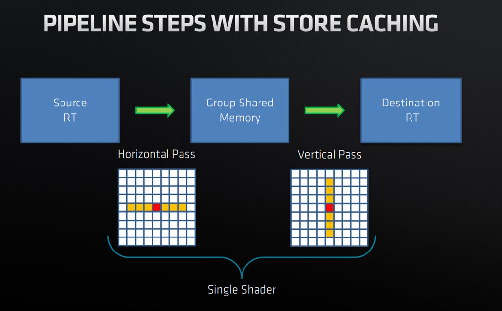

<!-- @page page_techniques_blur FidelityFX Blur 1.1 -->

<h1>FidelityFX Blur 1.1</h1>

**FidelityFX Blur** is a compute-based, highly-optimized, single-pass Gaussian blur technique.

<h2>Requirements</h2>

- `HLSL` `CS_6_0`
- `GLSL` `version 450`

<h2>Table of contents</h2>

- [Integration Guidelines](#integration-guidelines)
- [Under the Hood: Gaussian Blur](#under-the-hood-gaussian-blur)
- [Further Reading](#further-reading)


<h2>Integration guidelines</h2>

<h3>C++ SDK integration</h3>

The easiest way to integrate the FidelityFX Blur effect is by using the FFX SDK C++ API.

Example C++:

```cpp
// Initialize the FFX backend and blur context (do this once)
size_t scratchBufferSize = ffxGetScratchMemorySize(FFX_BLUR_CONTEXT_COUNT);
void* scratchBuffer = malloc(scratchBufferSize);
FfxInterface backendInterface;
ffxGetInterface(&backendInterface, GetDevice(), scratchBuffer, scratchBufferSize, FFX_BLUR_CONTEXT_COUNT);

FfxBlurContextDescription desc = {};
desc.backendInterface = backendInterface;
desc.floatPrecision   = FFX_BLUR_FLOAT_PRECISION_32BIT;
desc.kernelPermutations = FFX_BLUR_KERNEL_PERMUTATIONS_ALL; // mask to support some Guassian sigma kernels or ALL
desc.kernelSizes = FFX_BLUR_KERNEL_SIZE_ALL; // mask to support some kernel sizes or ALL

FfxBlurContext blurContext;
ffxBlurContextCreate(&blurContext, &desc);

// Execute blur effect (multiple times)
FfxBlurDispatchDescription desc = {};

desc.commandList = ffxGetCommandList(pCmdList);

desc.kernelPermutation = FFX_BLUR_KERNEL_PERMUTATION_2; // Guassian sigma (1.6, 2.8, or 4.0)
desc.kernelSize = FFX_BLUR_KERNEL_SIZE_15x15; // Kernel sizes (3x3 ... 21x21)

desc.input = ffxGetResource(inputResource, L"BLUR_InputSrc", FFX_RESOURCE_STATE_PIXEL_COMPUTE_READ);

desc.inputAndOutputSize.width  = desc.input.description.width;
desc.inputAndOutputSize.height = desc.input.description.height;

desc.output = ffxGetResource(outputResource, L"BLUR_Output", FFX_RESOURCE_STATE_UNORDERED_ACCESS);

ffxBlurContextDispatch(&blurContext, &desc);

// When done using the blur effect, clean up.
ffxBlurContextDestroy(&blurContext);
```

<h3>Customization via callbacks and main functions</h3>

Blur provides default implementations for blur kernel weights and I/O functions in [`ffx_blur_callbacks_hlsl.h`](../../sdk/include/FidelityFX/gpu/blur/ffx_blur_callbacks_hlsl.h) and [`ffx_blur_callbacks_glsl.h`](../../sdk/include/FidelityFX/gpu/blur/ffx_blur_callbacks_glsl.h). SDK users can override them to integrate with their own application.

Blur expects the 1D kernel weights to be embedded in the compiled shader for the maximum performance, with the following requirements:

- `FfxFloat32` or `FfxFloat16` type for the kernel weight in the function signatures depending on half precision support. These types are defined in the [`ffx_core.h`](../../sdk/include/FidelityFX/gpu/ffx_core.h) FFX SDK header file.
- A unique set of kernel weights to be defined as a static array, representing the normalized Gaussian weight distribution with elements sorted in decreasing order

Example Blur kernel override:
```hlsl
#if FFX_HALF
    #define FFX_BLUR_KERNEL_TYPE FfxFloat16
#else
    #define FFX_BLUR_KERNEL_TYPE FfxFloat32
#endif

inline FFX_BLUR_KERNEL_TYPE GetKernelWeight(int iKernelIndex) 
{ 
    static FFX_BLUR_KERNEL_TYPE kernel_weights[] = { 0.257030201088974, 0.22378581991669, 0.147699079538823 }; // for a 5x5 Gaussian kernel
    return kernel_weights[iKernelIndex]; 
} 
FFX_BLUR_KERNEL_TYPE FfxBlurLoadKernelWeight(FfxInt32 iKernelIndex) { return GetKernelWeight(iKernelIndex); }
```

Example Blur I/O function override:
```hlsl
#if FFX_HALF
  FfxFloat16x3 FfxBlurLoadInput(FfxInt16x2 inPxCoord) { return texColorInput[inPxCoord].rgb; }
  void FfxBlurStoreOutput(FfxInt32x2 outPxCoord, FfxFloat16x3 color) { texColorOutput[outPxCoord] = min16float4(color, 1); }
#else
  FfxFloat32x3 FfxBlurLoadInput(FfxInt32x2 inPxCoord) { return texColorInput[inPxCoord].rgb; }
  void FfxBlurStoreOutput(FfxInt32x2 outPxCoord, FfxFloat32x3 color) { texColorOutput[outPxCoord] = float4(color, 1); }
#endif
```

It is also possible to integrate the Blur effect via your own `main` function. 
* The `FFX_BLUR_TILE_SIZE_X` and `FFX_BLUR_TILE_SIZE_Y` macros must be defined. Generally these two are set to 8.

Example HLSL:
```hlsl
#include "blur/ffx_blur_callbacks_hlsl.h"
#include "blur/ffx_blur_blur.h"

[numthreads(FFX_BLUR_TILE_SIZE_X, FFX_BLUR_TILE_SIZE_Y, 1)]
void CS(
    uint3 LocalThreadId    : SV_GroupThreadID,
    uint3 WorkGroupId      : SV_GroupID,
    uint3 DispatchThreadID : SV_DispatchThreadID)
{
    // Run FidelityFX - Blur
    ffxBlurPass(int2(DispatchThreadID.xy), int2(LocalThreadId.xy), int2(WorkGroupId.xy));
}
```

Example GLSL:
```glsl
#include "blur/ffx_blur_callbacks_glsl.h"
#include "blur/ffx_blur_blur.h"

layout (local_size_x = FFX_BLUR_TILE_SIZE_X, local_size_y = FFX_BLUR_TILE_SIZE_Y, local_size_z = 1) in;
void main()
{
    // Run FidelityFX Blur
    ffxBlurPass(
        FfxInt32x2(gl_GlobalInvocationID.xy),
        FfxInt32x2(gl_LocalInvocationID.xy),
        FfxInt32x2(gl_WorkGroupID.xy));
}
```

<h2>Under the hood: Gaussian blur</h2>



<h3>Algorithm</h3>

Blur employs a 3-step algorithm implemented in a **single compute dispatch** by utilizing thread group shared memory to store the intermediate blur results.

The three steps are as follows:

- Pre-fill step 
    - Fill the cache with horizontal blur from the image source
- Loop top-down
    - Fill the cache with horizontal blur from the image source
    - Do vertical blur from cached results
    - Write out to the destination resource
- Loop over the last few tiles
    - Vertical blur from cache 
    - Write out to the destination resource

<br/>

| Dispatch time complexity |  Wave execution time complexity | Group Shared Memory space complexity |
| :--: | :--: | :--: |
| `O(W * H * K)` | `O(H * K)` | `O(Th * (Tw + K))` | 

where:

 - `W : Image Width`
 - `H : Image Height`
 - `K : 1D Kernel Size`
 - `Tw : Blur Tile Size X`
 - `Th : Blur Tile Size Y`

<h3>Work distribution</h3>

Blur works with 8x8 thread groups, covering a 'tile' in the image. 

The work distribution is influenced by the following `#define`s


<h3>Shared memory</h3>

| | |
| :--- | :--- |
| Blur uses a region of shared memory as a ring-buffer of tiles to store the intermediate results. <br/> The thread group, corresponding to a single tile, is sampling the source image and running a horizontal blur before storing the results in the shared memory. <br/> The thread group later on reads from the shared memory and runs a vertical blur on the intermediate results before storing the fully blurred image in the destination texture. |  |


<h2>Further reading</h2>

- GDC 2019: A Blend of GCN Optimization & Color Processing, *Part I: Store Caching in Separable Filters* [PDF View Link](https://gpuopen.com/gdc-presentations/2019/gdc-2019-s5-blend-of-gcn-optimization-and-color-processing.pdf)
- GDC 2018: Engine Optimization Hot Lap [PPTX Download Link](https://gpuopen.com/wp-content/uploads/2018/05/gdc_2018_sponsored_engine_optimization_hot_lap.pptx)
- Rastergrid: Efficient Blur w/ Linear Sampling [Webpage Link](https://www.rastergrid.com/blog/2010/09/efficient-gaussian-blur-with-linear-sampling/)

<h2>See also</h2>

- [FidelityFX Blur](../samples/blur.md)
- [FidelityFX Naming guidelines](../getting-started/naming-guidelines.md)
