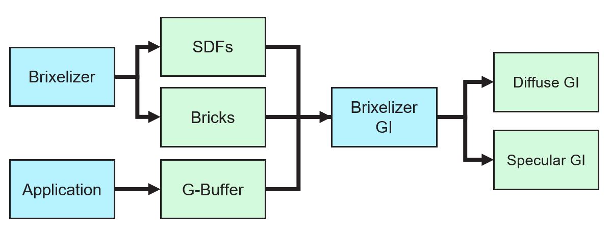
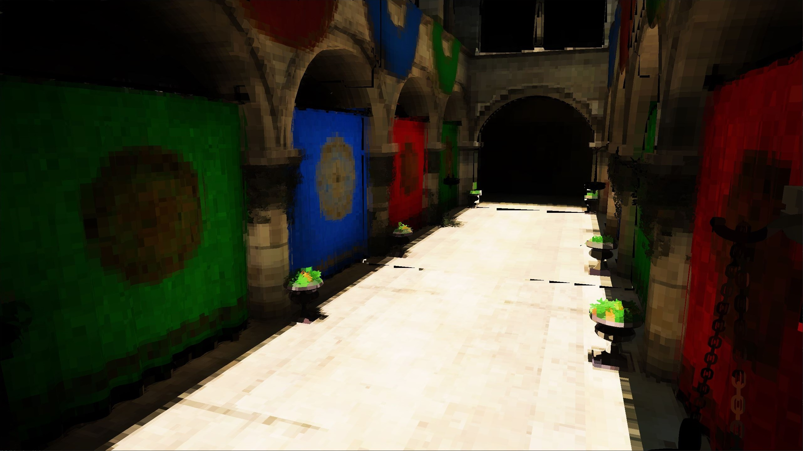
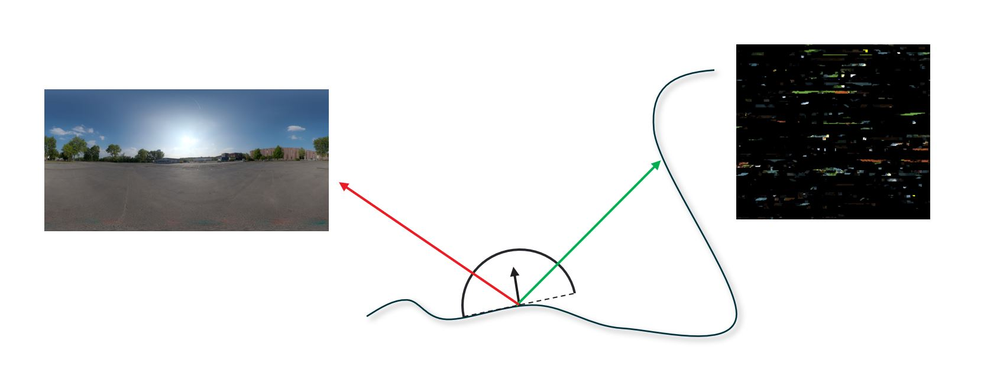
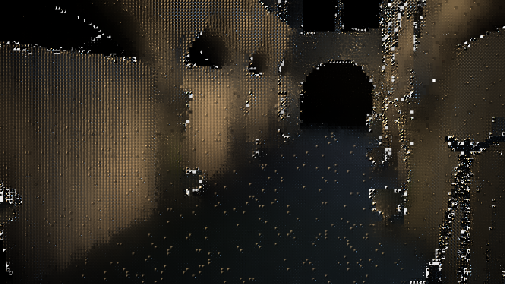
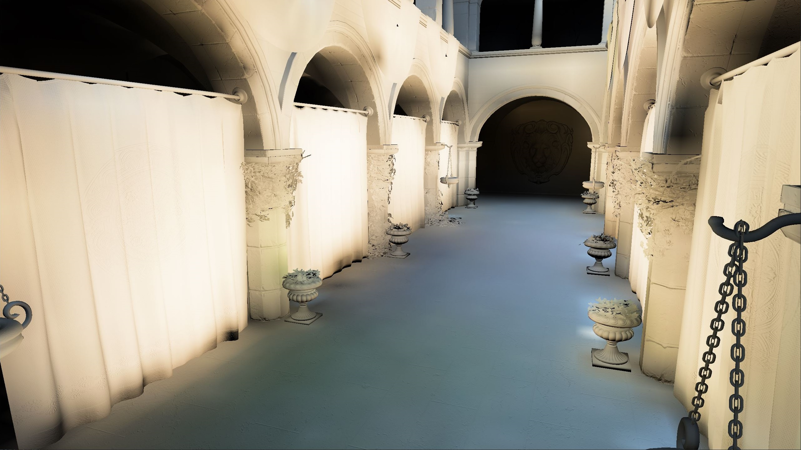
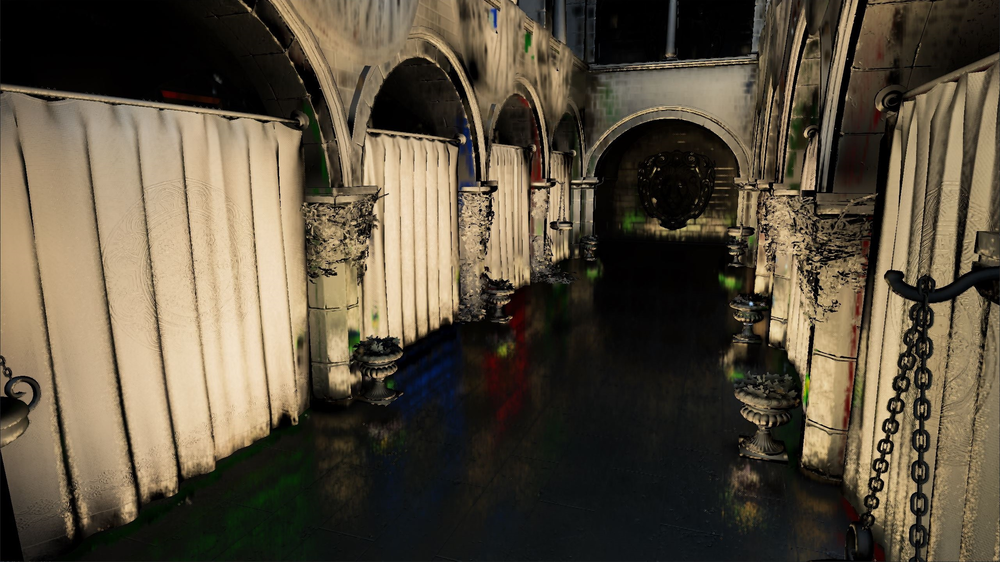

<!-- @page page_techniques_brixelizer_gi FidelityFX Brixelizer GI 1.0 -->

<h1>FidelityFX Brixelizer GI 1.0</h1>

**FidelityFX Brixelizer GI** is a compute-based, highly-optimized global illumination technique implemented in HLSL.

<h2>Table of Contents</h2>

- [Requirements](#requirements)
- [Integration Guidelines](#integration-guidelines)
- [Algorithm Overview](#algorithm-overview)
- [Implementation](#implementation)

<h2>Requirements</h2>

- `HLSL` `CS_6_6`

<h2>Integration Guidelines</h2>

**FidelityFX Brixelizer GI**

<h3>API</h3>

```cpp
// =============================================================================
// Initialize/destroy the FFX Brixelizer GI backend
// =============================================================================

FfxBrixelizerGIContextDescription desc = {};

desc.flags              = ...;                    ///< A bit field representings various options.
desc.internalResolution = ...;                    ///< The scale at which Brixelizer GI will output GI at internally. The output will be internally upscaled to the specified displaySize.
desc.displaySize        = ...;                    ///< The size of the presentation resolution targeted by the upscaling process.
desc.backendInterface   = ffxGetInterface(...);   ///< An implementation of the FidelityFX backend for use with Brixelizer.

FfxBrixelizerGIContext context = {};
FfxErrorCode error = ffxBrixelizerGIContextCreate(&context, &desc);
assert(error == FFX_OK);

// ...

FfxErrorCode error = ffxBrixelizerGIContextDestroy(&context);
assert(error == FFX_OK);

// =============================================================================
// Brixelizer GI frame update
// =============================================================================

FfxBrixelizerGIDispatchDescription desc = {};

desc.view = ...;                    ///< The view matrix for the scene in row major order.
desc.projection = ...;              ///< The projection matrix for the scene in row major order.
desc.prevView = ...;                ///< The view matrix for the previous frame of the scene in row major order.
desc.prevProjection = ...;          ///< The projection matrix for the scene in row major order.

desc.cameraPosition = ...;          ///< A 3-dimensional vector representing the position of the camera.
desc.startCascade = ...;            ///< The index of the start cascade for use with ray marching with Brixelizer.
desc.endCascade = ...;              ///< The index of the end cascade for use with ray marching with Brixelizer.
desc.rayPushoff = ...;              ///< The distance from a surface along the normal vector to offset the diffuse ray origin.
desc.sdfSolveEps = ...;             ///< The epsilon value for ray marching to be used with Brixelizer for diffuse rays.
desc.specularRayPushoff = ...;      ///< The distance from a surface along the normal vector to offset the specular ray origin.
desc.specularSDFSolveEps = ...;     ///< The epsilon value for ray marching to be used with Brixelizer for specular rays.
desc.tMin = ...;                    ///< The TMin value for use with Brixelizer.
desc.tMax = ...;                    ///< The TMax value for use with Brixelizer.

desc.environmentMap = ...;          ///< The environment map.
desc.prevLitOutput = ...;           ///< The lit output from the previous frame.
desc.depth = ...;                   ///< The input depth buffer.
desc.historyDepth = ...;            ///< The previous frame input depth buffer.
desc.normal = ...;                  ///< The input normal buffer.
desc.historyNormal = ...;           ///< The previous frame input normal buffer.
desc.roughness = ...;               ///< The resource containing roughness information.
desc.motionVectors = ...;           ///< The input motion vectors texture.
desc.noiseTexture = ...;            ///< The input blue noise texture.

desc.normalsUnpackMul = ...;        ///< A multiply factor to transform the normal to the space expected by Brixelizer GI.       
desc.normalsUnpackAdd = ...;        ///< An offset to transform the normal to the space expected by Brixelizer GI.
desc.isRoughnessPerceptual = ...;   ///< A boolean to describe the space used to store roughness in the materialParameters texture. If false, we assume roughness squared was stored in the Gbuffer.  
desc.roughnessChannel = ...;        ///< The channel to read the roughness from the roughness texture       
desc.roughnessThreshold = ...;      ///< Regions with a roughness value greater than this threshold won't spawn specular rays.     
desc.environmentMapIntensity = ...; ///< The value to scale the contribution from the environment map.
desc.motionVectorScale = ...;       ///< The scale factor to apply to motion vectors.      

desc.sdfAtlas = ...;                ///< The SDF Atlas resource used by Brixelizer.
desc.bricksAABBs = ...;             ///< The brick AABBs resource used by Brixelizer.
for (uint32_t i = 0; i < 24; ++i) {
    desc.cascadeAABBTrees[i] = ...; ///< The cascade AABB tree resources used by Brixelizer.
    desc.cascadeBrickMaps[i] = ...; ///< The cascade brick map resources used by Brixelizer.
}

desc.outputDiffuseGI = ...;         ///< A texture to write the output diffuse GI calculated by Brixelizer GI.
desc.outputSpecularGI = ...;        ///< A texture to write the output specular GI calculated by Brixelizer GI.

desc.brixelizerContext = ...;       ///< A pointer to the Brixelizer context for use with Brixelizer GI.

FfxCommandList commandList = ffxGetCommandList(...);

FfxErrorCode error = ffxBrixelizerGIContextDispatch(&context, &desc, commandList);
assert(error == FFX_OK);

// =============================================================================
// Brixelizer GI debug visualization
// =============================================================================

FfxBrixelizerGIDebugDescription desc = {};

desc.view = ...;                    // The view matrix for the scene in row major order.
desc.projection = ...;              // The projection matrix for the scene in row major order.
desc.startCascade = ...;            // The index of the start cascade for use with ray marching with Brixelizer.
desc.endCascade = ...;              // The index of the end cascade for use with ray marching with Brixelizer.

desc.outputSize = ...;              // The dimensions of the output texture.

desc.debugMode = ...;               // The mode for the debug visualization. See <c><i>FfxBrixelizerGIDebugMode</i></c>.

desc.depth = ...;                   // The input depth buffer.
desc.normal = ...;                  // The input normal buffer.

desc.sdfAtlas = ...;                // The SDF Atlas resource used by Brixelizer.
desc.bricksAABBs = ...;             // The brick AABBs resource used by Brixelizer.
for (uint32_t i = 0; i < 24; ++i) {
    desc.cascadeAABBTrees[24];      // The cascade AABB tree resources used by Brixelizer.
    desc.cascadeBrickMaps[24];      // The cascade brick map resources used by Brixelizer.
}

desc.outputDebug = ...;             // The output texture for the debug visualization.

desc.brixelizerContext = ...;       // A pointer to the Brixelizer context for use with Brixelizer GI.

FfxCommandList = ffxGetCommandList(...);

FfxErrorCode error = ffxBrixelizerGIContextDebugVisualization(&context, &desc, commandList);
assert(error == FFX_OK);
```

<h2>Algorithm Overview</h2>

FidelityFX Brixelizer GI is a simplified implementation of [AMD GI-1.0](https://gpuopen.com/learn/amd-capsaicin-framework-release-gi/).

It takes in the G-Buffer resources of your application alongside the output resources from Brixelizer to generate Diffuse and Specular GI outputs.



Due to the lack of material information in the distance field from Brixelizer, we maintain an internal radiance cache which is populated by the previous frames' lighting output.


Including just direct lighting will result in 1-bounce diffuse GI, whereas including the composited output from the previous frame gives you multiple bounces effectively for free.



Next we spawn screen probes on the visible surfaces in the depth buffer and shoot rays using Brixelizer and sample the radiance cache for shading. 



Screen probes are internally stored in an 8x8 octahedral mapping:



These screen probes are then used to feed a world space irradiance cache by performing a parallel reduction in shared memory to project the 8x8 incoming radiance values on to 2nd order spherical harmonics that are stored at each valid brick. 



The final Diffuse GI output is resolved by projecting the nearest SH probe on to G-Buffer normal.


For Specular GI we perform a pre-trace at quarter resolution to figure out the brick IDs at hit points and afterwards use a full-resolution dispatch to skip directly to ray-marching the bricks, finding the hit point and sample the radiance cache.



After the update you composite the diffuse and specular GI outputs into your direct lighting output the same way you would do with Image based lighting. Usually by plugging it into Epic’s split-sum approximation.

<h2>Implementation</h2>

<h3>Resources</h3>

<h4>User Created Resources</h4>

| Name  | Type | Format/Stride | Dimensions/Size in bytes |
|------|------|---------------|--------------------------|
| Output Diffuse GI      | `Texture2D` | `RGBA16_FLOAT` | `displaySize.width` x `displaySize.height`  |
| Output Specular GI      | `Texture2D` | `RGBA16_FLOAT` | `displaySize.width` x `displaySize.height`  |
| Debug Output | `Texture2D` | A user defined `RGB` format | `displaySize.width` x `displaySize.height` |

<h4>Internal Frame Persistent Resources</h4>

The following is a table of all structured buffers managed internally by the Brixelizer context.

<div class="scrollable-table"></div>

| Name | Format/Stride | Length/Dimensions | Description |
|------|---------------|--------|-------------|
| `BrixelizerGI_RadianceCache`      | `R11G11B10_FLOAT` | `FFX_BRIXELIZER_STATIC_CONFIG_SDF_ATLAS_SIZE / 2` x `FFX_BRIXELIZER_STATIC_CONFIG_SDF_ATLAS_SIZE / 2` x `FFX_BRIXELIZER_STATIC_CONFIG_SDF_ATLAS_SIZE / 2` | A 3D texture containing the incoming direct lighting at each brick volume represented using 4x4x4 texels. |
| `BrixelizerGI_StaticGITarget0` | `R16G16B16A16_FLOAT` | `internalSize.width` x `internalSize.height` | One of two ping-pong textures for storing internal Diffuse GI output. |
| `BrixelizerGI_StaticGITarget1` | `R16G16B16A16_FLOAT` | `internalSize.width` x `internalSize.height` | One of two ping-pong textures for storing internal Diffuse GI output. |
| `BrixelizerGI_StaticScreenProbes0` | `R16G16B16A16_FLOAT` | `probeBufferWidth` x `probeBufferHeight` | One of two ping-pong textures for storing screen probes output. |
| `BrixelizerGI_StaticScreenProbes1` | `R16G16B16A16_FLOAT` | `probeBufferWidth` x `probeBufferHeight` | One of two ping-pong textures for storing screen probes output. |
| `BrixelizerGI_SpecularTarget0` | `R16G16B16A16_FLOAT` | `internalSize.width` x `internalSize.height` | One of two ping-pong textures for storing internal Specular GI output. |
| `BrixelizerGI_SpecularTarget1` | `R16G16B16A16_FLOAT` | `internalSize.width` x `internalSize.height` | One of two ping-pong textures for storing internal Specular GI output. |
| `BrixelizerGI_DisocclusionMask` | `R8_UNORM` | `internalSize.width` x `internalSize.height` | A texture that stores the generated disocclusion mask for rejecting history. |
| `BrixelizerGI_StaticScreenProbesStat` | `R16G16B16A16_FLOAT` | `tileBufferWidth` x `tileBufferHeight` | A texture that stores the average color of a screen probe. |
| `BrixelizerGI_TempSpawnMask` | `R32_UINT` | `tileBufferWidth` x `tileBufferHeight` | A texture that stores the spawn information for screen probes. |
| `BrixelizerGI_TempSpecularPretraceTarget` | `R32_UINT` | `tileBufferWidth * 2` x `tileBufferHeight * 2` | A texture that stores brick IDs at specular trace hits. |
| `BrixelizerGI_TempRandSeed` | `R8_UINT` | `tileBufferWidth` x `tileBufferHeight` | A texture that stores the random seeds for screen probes. |
| `BrixelizerGI_RaySwapIndirectArgs` | `UINT32` | `4 * sizeof(FfxUInt32)` | A buffer that stores indirect dispatch arguments. |
| `BrixelizerGI_DownsampledDepth` | `R32_FLOAT` | `internalSize.width` x `internalSize.height` | A texture that stores the downsampled depth. |
| `BrixelizerGI_DownsampledHistoryDepth` | `R32_FLOAT` | `internalSize.width` x `internalSize.height` | A texture that stores the downsampled history depth. |
| `BrixelizerGI_DownsampledNormals` | `R16G16B16A16_FLOAT` | `internalSize.width` x `internalSize.height` | A texture that stores the downsampled normals. |
| `BrixelizerGI_DownsampledHistoryNormals` | `R16G16B16A16_FLOAT` | `internalSize.width` x `internalSize.height` | A texture that stores the downsampled history normals. |
| `BrixelizerGI_DownsampledRoughness` | `R8_UNORM` | `internalSize.width` x `internalSize.height` | A texture that stores the downsampled roughness. |
| `BrixelizerGI_DownsampledMotionVectors` | `R16G16_FLOAT` | `internalSize.width` x `internalSize.height` | A texture that stores the downsampled motion vectors. |
| `BrixelizerGI_DownsampledLitOutput` | `R16G16B16A16_FLOAT` | `internalSize.width` x `internalSize.height` | A texture that stores the downsampled previous frames' shading output. |
| `BrixelizerGI_DownsampledDiffuseGI` | `R16G16B16A16_FLOAT` | `internalSize.width` x `internalSize.height` | A texture that stores the output Diffuse GI prior to upsampling. |
| `BrixelizerGI_DownsampledSpecularGI` | `R16G16B16A16_FLOAT` | `internalSize.width` x `internalSize.height` | A texture that stores the output Specular GI prior to upsampling. |
| `BrixelizerGI_BrickSH` | `UINT32x2` | `FFX_BRIXELIZER_MAX_BRICKS_X8 * sizeof(FfxUInt32x2) * 9` | A buffer that stores the spherical harmonics probes at bricks. |
| `BrixelizerGI_BrickDirectSH` | `UINT32x2` | `FFX_BRIXELIZER_MAX_BRICKS_X8 * sizeof(FfxUInt32x2) * 9` | A buffer that stores the incoming direct lighting at bricks as second order spherical harmonics. |
| `BrixelizerGI_BrickSHState` | `UINT32x4` | `FFX_BRIXELIZER_MAX_BRICKS_X8 * sizeof(FfxUInt32x4)` | A buffer that stores the direction of the screen probe sample as second order spherical harmonics. |
| `BrixelizerGI_StaticProbeSH` | `UINT32x2` | `tileBufferWidth * tileBufferHeight * sizeof(FfxUInt32x2) * 9` | A buffer that stores the spherical harmonics representation ofthe screen probes. |
| `BrixelizerGI_TempProbeSH` | `UINT32x2` | `tileBufferWidth * tileBufferHeight * sizeof(FfxUInt32x2) * 9` | A buffer that stores the spherical harmonics representation ofthe screen probes. |
| `BrixelizerGI_StaticProbeInfo` | `UINT32x4` | `tileBufferWidth * tileBufferHeight * sizeof(FfxUInt32x4) * 9` | A buffer that stores packed information of screen probe. |
| `BrixelizerGI_TempProbeInfo` | `UINT32x4` | `tileBufferWidth * tileBufferHeight * sizeof(FfxUInt32x4) * 9` | A buffer that stores packed information of screen probe. |

The following is a list of the different constant buffers managed by the Brixelizer GI context.

| Name                           | Format                     | Description                                            |
|--------------------------------|----------------------------|--------------------------------------------------------|
| `FfxBrixelizerGI_Constants`   | `FfxBrixelizerGIConstants`   | Parameters describing the Brixelizer GI context.                   |
| `FfxBrixelizerGI_PassConstants`   | `FfxBrixelizerGIPassConstants`   | Parameters describing the emit irradiance pass. |
| `FfxBrixelizerGI_ScalingConstants`   | `FfxBrixelizerGIScalingConstants`   | Parameters for downsampling and upsampling constants. |
| `Brixelizer_ContextInfoBuffer` | `FfxBrixelizerContextInfo` | Parameters describing the Brixelizer context.          |
| `Brixelizer_CascadeInfoBuffer` | `FfxBrixelizerCascadeInfo` | Parameters describing a single cascade.                |

<h3>Shader Passes</h3>

Here is a list of all the shader passes used by Brixelizer GI.

<div class="scrollable-table"></div>

| Function | File | Group Dimensions | Description |
|----------|------|------------------|-------------|
| `FfxBrixelizerGIDownsample`      | `ffx_brixelizergi_main.h` | `8 x 8 x 1`   |  Downsample input resources if using a non-native internal resolution scale. |
| `FfxBrixelizerGIGenerateDisocclusionMask`      | `ffx_brixelizergi_main.h` | `8 x 8 x 1`   |  Generate a disocclusion mask into `BrixelizerGI_DisocclusionMask`. |
| `FfxBrixelizerGIPrepareClearCache`      | `ffx_brixelizergi_radiance_cache_update.h` | `1 x 1 x 1`   |  Write indirect dispatch arguments into `BrixelizerGI_RaySwapIndirectArgs` for clearing radiance cache. |
| `FfxBrixelizerGIClearCache`      | `ffx_brixelizergi_radiance_cache_update.h` | `64 x 1 x 1`   |  Clear radiance cache entries for invalidated bricks. |
| `FfxBrixelizerGIEmitPrimaryRayRadiance`      | `ffx_brixelizergi_radiance_cache_update.h` | `8 x 8 x 1`   |  Inject reprojected radiance from the last frame into the radiance cache. |
| `FfxBrixelizerGIPropagateSH`      | `ffx_brixelizergi_radiance_cache_update.h` | `64 x 1 x 1`   |  Propagate the SH probes at each brick into the neighboring bricks. |
| `FfxBrixelizerGISpawnScreenProbes`      | `ffx_brixelizergi_main.h` | `8 x 8 x 1`   |  Spawn new screen probes on the depth buffer and output probe information. |
| `FfxBrixelizerGIReprojectScreenProbes`      | `ffx_brixelizergi_main.h` | `8 x 8 x 1`   |  Reproject screen probes from the previous frame into the current frame. |
| `FfxBrixelizerGIFillScreenProbes`      | `ffx_brixelizergi_main.h` | `8 x 4 x 1`   |  Trace diffuse rays using Brixelizer to inject new radiance information into screen probes. |
| `FfxBrixelizerGISpecularPreTrace`      | `ffx_brixelizergi_main.h` | `8 x 4 x 1`   |  Trace specular rays using Brixelizer and output brick IDs at hit points. |
| `FfxBrixelizerGIReprojectGI`      | `ffx_brixelizergi_main.h` | `8 x 8 x 1`   |  Reproject the diffuse and specular GI outputs from the previous frame into the current frame. |
| `FfxBrixelizerGISpecularTrace`      | `ffx_brixelizergi_main.h` | `8 x 4 x 1`   |  Resolve specular output by ray marching the bricks from the Specular Pre Trace pass and sampling the radiance cache. |
| `FfxBrixelizerGIProjectScreenProbes`      | `ffx_brixelizergi_main.h` | `8 x 8 x 1`   |  Project the octahedral screen probes into spherical harmonics. |
| `FfxBrixelizerGIEmitIrradianceCache`      | `ffx_brixelizergi_main.h` | `8 x 8 x 1`   |  Update the irradiance cache using spherical harmonics screen probes. |
| `FfxBrixelizerGIInterpolateScreenProbes`      | `ffx_brixelizergi_main.h` | `8 x 8 x 1`   |  Resolve final diffuse and specular GI output and perform temporal accumulation. |
| `FfxBrixelizerGIBlurGI`      | `ffx_brixelizergi_main.h` | `8 x 8 x 1`   |  Spatially denoise the diffuse and specular GI outputs. |
| `FfxBrixelizerGIUpsample`      | `ffx_brixelizergi_main.h` | `8 x 8 x 1`   |  Upscale diffuse and specular GI outputs if using a non-native internal resolution scale. |