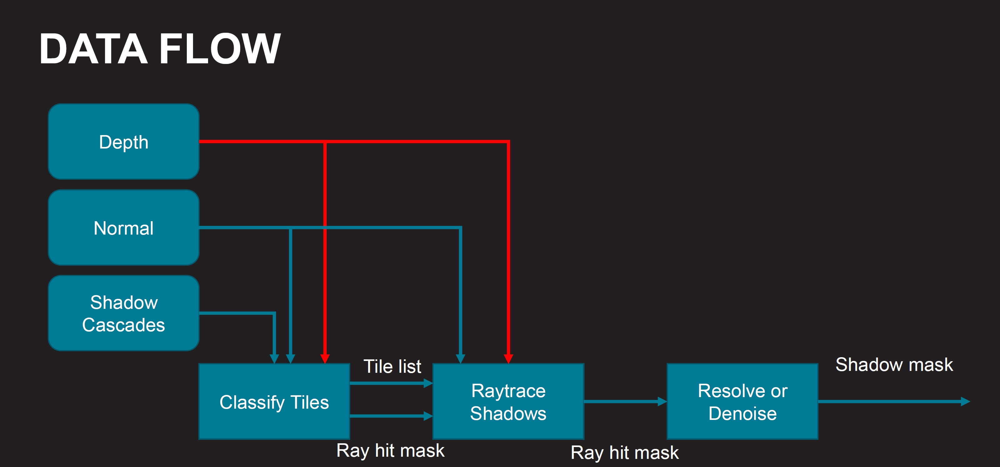
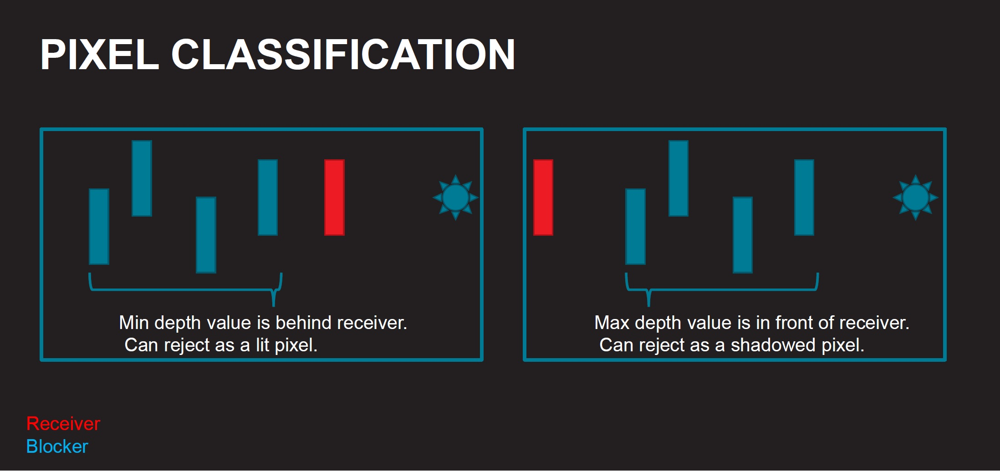
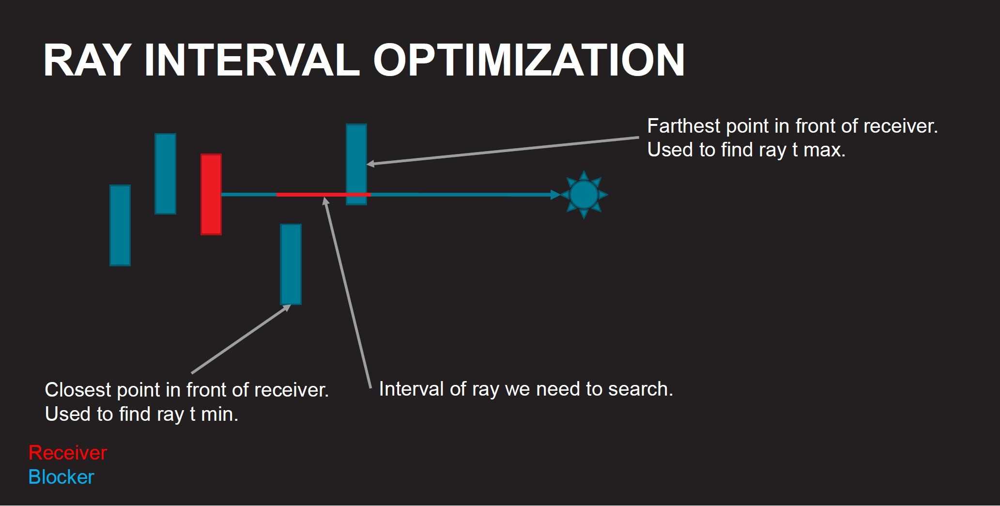

<!-- @page page_techniques_classifier FidelityFX Classifier 1.3 -->

<h1>FidelityFX Classifier 1.3</h1>

**AMD FidelityFX Classifier** includes specialized tile classifiers optimized for specific workloads:

- **Shadow classifier** - Designed to classify pixels that need ray tracing to determine shadow information
- **Reflection classifier** - Designed to classify hybrid pixels and hardware raytracing pixels based on surface roughness.

<h2>AMD FidelityFX Shadow Classifier</h2>

<h3>Introduction</h3>

The FidelityFX Shadow Classifier is designed to help accelerate the generation of raytraced shadows. It works by analyzing the scene and dividing the screen into 8x4 tiles that represent pixel-level requirements for ray tracing. The returned list of tiles represents all the tiles which contain at least one pixel that needs ray tracing applied.
 

<h3>Shading language requirements</h3>

The tile position is encoded using explicit fp16 types.

`HLSL` `GLSL` `CS_6_2`

<h3>Inputs</h3>

This section describes the inputs to FidelityFX Shadow Classifier.

| Input name                    | Type                               | Notes                                                                                                                     |
| ------------------------------|------------------------------------|---------------------------------------------------------------------------------------------------------------------------|
| **depth**                     | `2D Texture`                       | The depth buffer for the current frame. |
| **normal**                    | `2D Texture`                       | The normal buffer for the current frame. |
| **shadowMaps**                | `Array of 2D Textures`             | The shadow cascades for the current frame. |
| **workQueue**                 | `Buffer`                           | The tile list returned by the classifier. |
| **workQueueCount**            | `Buffer`                           | The atomic counter containing the number of tiles returned for this frame. |
| **rayHitMask**                    | `2D Texture`                       | The results of the shadow map blocker search. |

Moreover, it is possible to initialize the classifier context with a classification mode. The two options available are:
- `ClassifyByNormals` - Classifies tiles based on the normal texture only.
- `ClassifyByCascades` - Classifies tiles using both normal texture and shadow map cascades.

<h3>The technique</h3>

The following diagram shows the input resources needed by the tile classifier and how its results can be used in a subsequent "RayTrace Shadows" pass. For more information on an effect which uses this structure, you can refer [Hybrid Shadows](../samples/hybrid-shadows.md).

<h4>Data flow</h4>

Classifier Inputs:

- Depth buffer
    - Used to reconstruct world position.
    - Used to reject sky pixels.  

- Normal buffer
    - Used to reject pixels that don’t face the sun.  

- Cascade shadow maps
    - Used to reject pixels that don’t need raytracing.  

Classifier Outputs:

- Tile list
    - List of all 8x4 tiles that need to ray trace.
    - Each tile has a mask of which pixels in the tile need raytracing.
    - Each tile also has min and max ray length.  

- Ray hit mask
    - `uint` mask for each 8x4 tile.
    - Preloaded with results of the cascaded shadow map blocker search.  

<h4>Blocker search</h4>

When classifying tiles using shadow map cascades, a crucial step is to check whether there are any blockers between the current pixel and the shadow near plane. To do this we use the light space depth to scale the sun size to the shadow map's near plane and subsequently use Poisson disc distribution to uniformely sample the search area.

<h4>Pixel classification</h4>

At this stage, we reject pixels using the maximum and minimum depth values from the shadow map cascades.

<h4>Ray interval</h4>

It is also possible to calculate the ray interval using the shadow cascade maps. This information can be stored in the tiles and can later be used in the raytracing pass.

<h4>Ray tracing pass</h4>

After the tile classification pass, it is possible to use the generated `rayHitMask` and the list of tiles to launch a raytracing kernel. An example of this can be found in the [Hybrid Shadows sample](../samples/hybrid-shadows.md). The following are the expected inputs and outputs of such a pass.

Ray Tracing Inputs:

- Depth buffer
    - Used to reconstruct world position.  

- Normal buffer
    - Used to offset the ray along the pixel normal.  

- Tile list
    - Used to decide what pixels to fire a ray from.  

Ray Tracing Outputs:

- Ray hit mask
    - `uint` mask for each 8x4 tile.  

- Combined ray hit results with the prefilled mask.

This pass uses the tile data generated by the FidelityFX Shadow Classifier to setup each workgroup to operate on an 8x4 tile, which perfectly maps to a thread group size of 32. This pass also makes use of a blue noise texture, which is sampled every frame to create a new ray to fire into the scene. If using the depth interval, the rays can be reversed, as to trace from the sun to the surface for faster traversal though the acceleration structure.

<h4>Optimizations used</h4>

- Wave active mask
    - Using a `uint` to store the results of the blocker search allows a 32:1 reduction in the amount of memory needed to store results.  

- Ray hit mask
    - With one ray per pixel, the hit result buffer memory size can be reduced by 32:1.  

- Replace point sampling with image loads
    - Loads are faster at moving data from the cache to the shader core on RDNA.  

<h2>AMD FidelityFX Reflection Classifier</h2>

<h3>Introduction</h3>

The FidelityFX Reflection Classifier is a feedback based tile classifier designed for raytraced reflections. It makes use of 8x8 tiles to detect ray tracing needs based on feedback statistics. A safe band area is used to avoid flickering in rapid movement scenarios.

<h3>Shading language requirements</h3>

`HLSL` `GLSL` `CS_6_0`

<h3>Inputs</h3>

This section describes the inputs to FidelityFX Reflection Classifier.

| Input name | Type | Notes |
| --- | --- | --- |
| **depth** | `Texture2D` | The depth buffer for the current frame |
| **motionVectors** | `Texture2D` | The motion vectors for the current frame |
| **normal** | `Texture2D` | The normals for the current frame |
| **materialParameters** | `Texture2D` | The `aoRoughnessMetallic` buffer for the current frame |
| **environmentMap** | `Texture2D` | The environment map to fallback to when screenspace data is not sufficient |
| **radiance** | `Texture2D` | The scene radiance |
| **varianceHistory** | `Texture2D` | The variance history |
| **hitCounter** | `Texture2D` | The ping-pong feedback counter |
| **hitCounterHistory** | `Texture2D` | The previous ping-pong feedback counter |
| **extractedRoughness** | `Texture2D` | Extracted roughness |
| **rayList** | `Buffer` | The ray list to trace with hybrid reflection (uses FidelityFX SSSR) |
| **rayListHW** | `Buffer` | The ray list to trace with full hardware raytracing |
| **denoiserTileList** | `Buffer` | The tiles requiring denoising |
| **constants** | `Constant buffer` | A constant buffer containint information about the camera position, a few transformation matrices and other miscelaneous settings |

<h3>The technique</h3>

The FidelityFX Reflection Classifier detects ray tracing class of 8x8 tiles based on the statistics from the previous frame.

There are three classes of tiles: Full raytracing, checkerboard hybrid, and full hybrid. 

For full raytracing, a roll of the dice is used with values of 0 and 1 to allow those tiles to be turned to pure hybrid tiles. 

The hit counter is incremented when screen space intersections are successful, otherwise the miss counter is incremented. The hit and miss counters are merged into a feedback counter and are reprojected using the motion vectors. 

The feedback counter uses one `FfxUint32` value for each 8x8 tile of pixels, represented as 4 8-bit counters for 2 frames of statistics.

<h2>See also</h2>

- [FidelityFX Hybrid Shadows](../samples/hybrid-shadows.md)
- [FidelityFX Hybrid Reflections](../samples/hybrid-reflections.md)
- [FidelityFX Stochastic Screen-Space Reflections](../samples/stochastic-screen-space-reflections.md)
- [FidelityFX Naming guidelines](../getting-started/naming-guidelines.md)
