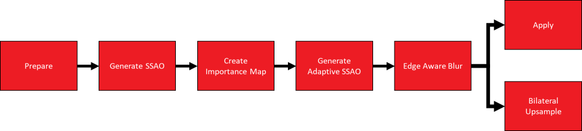
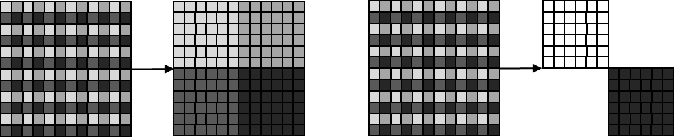
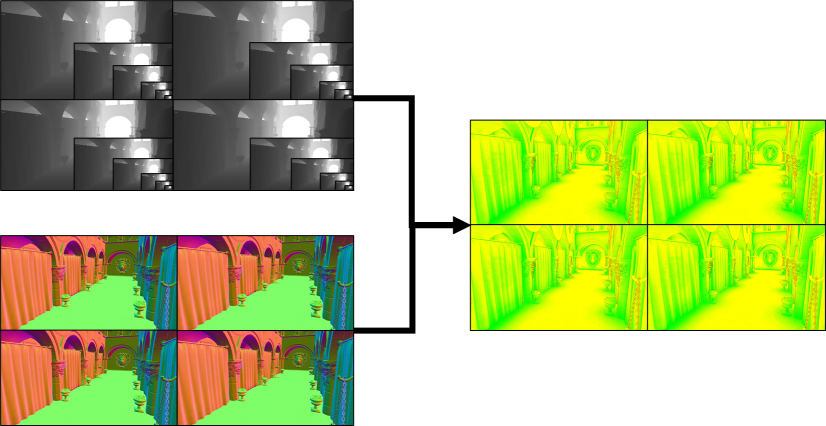
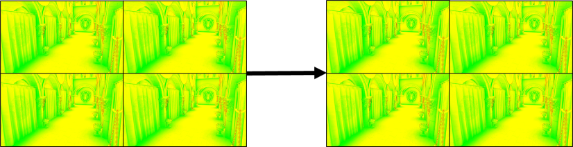
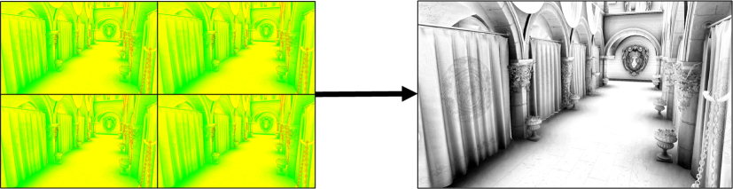
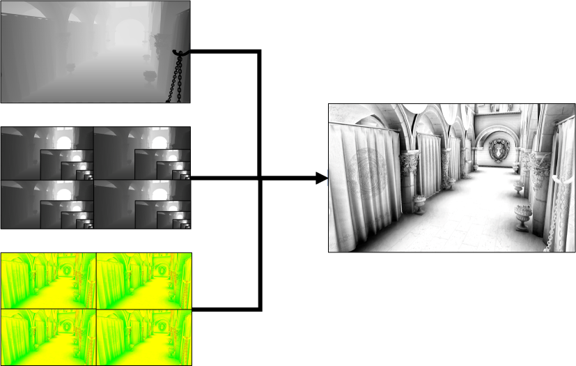

<!-- @page page_techniques_combined-adaptive-compute-ambient-occlusion FidelityFX Combined Adaptive Compute Ambient Occlusion 1.4 -->

<h1>FidelityFX Combined Adaptive Compute Ambient Occlusion (CACAO) 1.4</h1>

**Combined Adaptive Compute Ambient Occlusion** (or **CACAO** for short) is a highly optimised adaptation of the Intel(R) ASSAO screen space ambient occlusion implementation [[ASSAO-16](#references)]. 

CACAO provides 5 quality levels for SSAO generation (``FFX_CACAO_QUALITY_LOWEST``, ``FFX_CACAO_QUALITY_LOW``, ``FFX_CACAO_QUALITY_MEDIUM``, ``FFX_CACAO_QUALITY_HIGH``, ``FFX_CACAO_QUALITY_HIGHEST``), the last of which uses an adaptive approach.

<h2>Shading language requirements</h2>

`HLSL` `GLSL` `CS_6_0`

Note that the GLSL compiler must also support `GL_EXT_samplerless_texture_functions` and `GL_GOOGLE_include_directive` for `#include` handling used throughout the GLSL shader system.

<h2>Integration guidelines</h2>

Two matrices (`projection`, `normalsToView`) are required for CACAO to operate. The depth buffer is required as input, with normals being an optional input or otherwise computed from the depth buffer. The output is a one channel texture of ambient occlusion (AO) values.

A constant buffer needs to be filled with relevant values. Many values should be left as is in the provided implementation. Some values will be needed when integrating the effect. This can be due to different resolutions, different camera matrices, or altered settings. Such values are shown with a `Y` in the `Modify` column. Values shown with an `N` in the `Modify` column will normally be left as they are in the provided implementation.

|Modify| Element name | Type | Description |
| --- | --- | --- | --- |
|Y| DepthUnpackConsts | ``float2`` | Multiply and add values for `clip to view depth conversion`. | 
|Y| CameraTanHalfFOV | ``float2``| $tan({fov \over 2})$ for the `x` and `y` dimensions. | 
|Y| NDCToViewMul | ``float2``| Multiplication value for normalized device coordinates (NDC) to View conversion. | 
|Y| NDCToViewAdd | ``float2``| Addition value for NDC to view conversion. | 
|Y| DepthBufferUVToViewMul | ``float2``| Multiplication value for the depth buffer's UV to View conversion. | 
|Y| DepthBufferUVToViewAdd | ``float2``| Addition value for the depth buffer's UV to view conversion. | 
|Y| EffectRadius | ``float``| The radius in world space of the occlusion sphere. A larger radius will make further objects contribute to the ambient occlusion of a point. | 
|Y| EffectShadowStrength | ``float``| The linear multiplier for shadows. Higher values intensify the shadow. | 
|Y| EffectShadowPow | ``float``| The exponent for shadow values. Larger values create darker shadows. | 
|Y| EffectShadowClamp | ``float``| Clamps the shadow values to be within a certain range. | 
|Y| EffectFadeOutMul | ``float``| Multiplication value for effect fade out. $EffectFadeOutMul = {-1 \over fadeOutTo - fadeOutFrom}$.| 
|Y| EffectFadeOutAdd | ``float``| Addition value for effect fade out. $EffectFadeOutAdd = {fadeOutFrom \over (fadeOutTo - fadeOutFrom)} + 1$. | 
|Y| EffectHorizonAngleThreshold | ``float``| Minimum angle necessary between geometry and a point to create occlusion. Adjusting this value helps reduce self-shadowing. | 
|N| EffectSamplingRadiusNearLimitRec | ``float``| Default: $EffectRadius * 1.2$ . See implementation for details.| 
|N| DepthPrecisionOffsetMod | ``float``| Default: $0.9992$. Offset used to prevent artifacts due to imprecision. | 
|Y| NegRecEffectRadius | ``float``| Set to:  $-1 \over EffectRadius$ | 
|N| LoadCounterAvgDiv | ``float``|  Set to: $9 \over importanceMapWidth * importanceMapHeight * 255.0$ | 
|Y| AdaptiveSampleCountLimit | ``float``| Limits the total number of samples taken at adaptive quality levels. | 
|Y| InvSharpness | ``float``| Set to $1 \over sharpness$. The sharpness controls how much blur should bleed over edges. | 
|Y| BlurNumPasses | ``int``| Default is $4$. On lowest quality level default is $2$. | 
|Y| BilateralSigmaSquared | ``float``| Only affects downsampled SSAO. Higher values create a larger blur. | 
|Y| BilateralSimilarityDistanceSigma | ``float`` | Only affects downsampled SSAO. Lower values create sharper edges. | 
|N| PatternRotScaleMatrices | ``float4[4][5]``| Used for the sampling pattern. See implementation for details. | 
|Y| NormalsUnpackMul | ``float``| Multiplication value to unpack normals. Set to $1$ if normals are already in $[-1, 1]$ range. | 
|Y| NormalsUnpackAdd | ``float``| Addition value to unpack normals. Set to $0$ if normals are already in $[-1, 1]$ range | 
|Y| DetailAOStrength | ``float``| Adds in more detailed shadows based on edges. These are less temporally stable. |  
|Y| SSAOBufferDimensions | ``float2``| Dimensions of SSAO buffer. | 
|Y| SSAOBufferInverseDimensions | ``float2``| $1 \over SSAOBufferDimensions$ | 
|Y| DepthBufferDimensions | ``float``| Dimensions of the depth buffer. | 
|Y| DepthBufferInverseDimensions | ``float``| $1 \over DepthBufferDimensions$ | 
|Y| DepthBufferOffset | ``int2``| Default is $(0, 0)$. | 
|N| PerPassFullResUVOffset | ``float4[4]``| See implementation. | 
|Y| InputOutputBufferDimensions | ``float2``| Dimensions of the output AO buffer. | 
|Y| InputOutputBufferInverseDimensions | ``float2``| $1 \over InputOutputBuffer$. | 
|Y| ImportanceMapDimensions | ``float2``| Dimensions of the importance map. | 
|Y| ImportanceMapInverseDimensions | ``float2``| $1 \over ImportanceMapDimensions$. | 
|Y| DeinterleavedDepthBufferDimensions | ``float2``| Dimensions of the deinterleaved depth buffer. | 
|Y| DeinterleavedDepthBufferInverseDimensions | ``float2``| $1 \over DeinterleavedDepthBufferDimensions$. | 
|Y| DeinterleavedDepthBufferOffset | ``float2``| Default is $0$. | 
|Y| DeinterleavedDepthBufferNormalisedOffset | ``float2``| Default is $0$. | 
|Y| NormalsWorldToViewspaceMatrix | ``mat4``| Normal matrix. | 

<h2>The technique</h2>

<h3>Algorithm structure</h3>

The FidelityFX CACAO algorithm is comprised of several passes which are configured in different ways depending on the variant of the FidelityFX CACAO algorithm that is being used.

The table below summarizes which passes of the FidelityFX CACAO algorithm are present in the different configurations one might choose to operate the algorithm with. Depending on the desired performance level, the level of quality may be adjusted. By adjusting the quality level, some passes which constitute the effect will be omitted. 

In the table, a tick in the box denotes that the pass is present while a cross means that the pass is omitted. In all configurations, FidelityFX CACAO integrations should execute the passes in the order shown by the diagram shown above. 

In addition to configuring the quality level, FidelityFX CACAO has an other option which allows the algorithm to run at scaled-down resolution. If this option is selected, an additional bilateral upsample will be performed as a final step in the algorithm. This is also illustrated in the rows of the table below.  

| Quality mode | Native |  Prepare | Generate SSAO | Create importance map | Generate adaptive SSAO | Edge aware blur  | Apply | Bilateral upsample |
| --- | --- | --- | --- | --- | --- | --- | --- | --- |
| ``FFX_CACAO_QUALITY_LOWEST`` |  |   |  |  |  |  |  |  |
| ``FFX_CACAO_QUALITY_LOW``|  |  |  |  |  |  |  |  |
| ``FFX_CACAO_QUALITY_MEDIUM``|  |  |  |  |  |  |  |  |
| ``FFX_CACAO_QUALITY_HIGH``|  |  |  |  |  |  |  |  |
| ``FFX_CACAO_QUALITY_HIGHEST``|  |  |  |  |  |  |  |  |
| ``FFX_CACAO_QUALITY_LOWEST`` |  |  |  |  |  |  |  | |
| ``FFX_CACAO_QUALITY_LOW``|  |  |  |  |  |  |  |  |
| ``FFX_CACAO_QUALITY_MEDIUM``|  |  |  |  |  |  |  |  |
| ``FFX_CACAO_QUALITY_HIGH``|  |  |  |  |  |  |  |  |
| ``FFX_CACAO_QUALITY_HIGHEST``|  |  |  |  |  |  |  |  |

<h3>Prepare stage</h3>

The prepare stage transforms rendering data - such as depth and normal buffers - provided in the conventional formats into a more optimized data layout for consumption for the rest of the passes. 

For all quality settings, this means generating a de-interleaved version of the depth buffer and normal buffers. Depending on the quality level selected, FidelityFX CACAO may also generate a mipmap chain for the de-interleaved depth buffers. This is done using FidelityFX SPD [[SPD-19](#references)].

If the FidelityFX CACAO algorithm is operating at the ``FFX_CACAO_QUALITY_LOWEST`` quality mode, instead of generating four buffers (each with half resolution in each dimension), the algorithm will instead generate just two buffers (again at half resolution in each dimension), effectively discarding 50% of the input data from further consideration. Moreover, when operating at a downscaled resolution, the prepare pass will also generate lower resolution de-interleaved buffers (quarter resolution in each dimension, instead of half resolution in each dimension).

> **Please note**: While this stage of the algorithm is implemented as two separate dispatches, they do not share any data. Therefore no pipeline barriers are required between the two dispatches that form the prepare pass.

The following tables describe the compute shader entry points that should be used depending on your resolution and quality mode. Depending on the resolution and quality mode, you should select an appropriate main function for the compute shader used in the prepare depth and prepare normals dispatches.

<h4>Depth preparation entry points</h4>

| Depth preparation entry point | Resolution | Quality mode |
|-------------------------------|------------|--------------|
| ``FFX_CACAO_PrepareNativeDepthsAndMips`` | Native | ``FFX_CACAO_QUALITY_MEDIUM`` or above. | 
| ``FFX_CACAO_PrepareDownsampledDepthsAndMips`` | Downsampled | ``FFX_CACAO_QUALITY_MEDIUM`` or above. | 
| ``FFX_CACAO_PrepareNativeDepths`` | Native | ``FFX_CACAO_QUALITY_LOW`` | 
| ``FFX_CACAO_PrepareDownsampledDepths`` | Downsampled | ``FFX_CACAO_QUALITY_LOW`` | 
| ``FFX_CACAO_PrepareNativeDepthsHalf`` | Native | ``FFX_CACAO_QUALITY_LOWEST`` | 
| ``FFX_CACAO_PrepareDownsampledDepthsHalf`` | Downsampled | ``FFX_CACAO_QUALITY_LOWEST`` | 

<h4>Normal preparation entry points</h4>

| Normal preparation entry point                             | Resolution | Application normals provided |
|------------------------------------------------------------|------------|--------------|
| ``FFX_CACAO_PrepareNativeNormalsFromInputNormals``         | Native |  | 
| ``FFX_CACAO_PrepareDownsampledNormalsFromInputNormals``    | Downsampled |  | 
| ``FFX_CACAO_PrepareNativeNormals``                         | Native |  | 
| ``FFX_CACAO_PrepareDownsampledNormals``                    | Downsampled |  | 

<h4>Resource inputs</h4>

The following table describes the inputs to the prepare process.

| Name | Type | Notes |  
| --- | --- | --- |
| Application's depth buffer | ``Depth buffer``  | A depth buffer generated during the rendering of the scene. FidelityFX CACAO can support both a traditional Z buffer, as well as reverse Z. |
| **[Optional]** Application's normal buffer  | ``Normal buffer`` | An optional buffer containing normals which have been generated during the rendering of the scene. If you choose not to provide this buffer, FidelityFX CACAO will generate a normal buffer from the depth buffer that has been provided. It achieves this by calculating an `implied` normal from the partial derivatives of a neighborhood of pixels in the depth buffer. The format of the normal buffer can be modified by changing ``FFX_CACAO_Prepare_LoadNormal`` during the integration process. |

<h4>Resource outputs</h4>

The following table describes the outputs which are computed by the prepare process.

| Name | Type | Notes |  
| --- | --- | --- |
| De-interleaved depth buffer | ``R16_SFLOAT texture``  | A depth buffer generated during the rendering of the scene. |
| De-interleaved depth MIP chain   | ``R16_SFLOAT texture``  | A MIP chain containing a filtered set of de-interleaved depth buffers. NOTE: This is only generated at ``FFX_CACAO_QUALITY_MEDIUM`` quality or higher. |
| De-interleaved normal buffer | ``R8B8B8A8_SNORM texture`` | A de-interleaved normal buffer is generated using the partial derivatives of the depth buffer when no normal buffer is passed as an input. |

<h4>Description</h4>

The process of de-interleaving is identical for both the depth and normal buffers, and is shown in the diagram below. Each group of 2x2 pixels is considered and separated into four separate textures, each a quarter of the resolution of the original input. The reason for this is to improve the efficiency of the cache hierarchy present in the GPU.

In the diagram above, each square present in the image to the left represents a single pixel. You can see that each set of 2x2 pixels contains four unique colors. 

Turning now to the right hand side of the diagram, we can see that pixels of each color are collected into their own textures, effectively creating four very similar downsampled textures from the original.

If ``FFX_CACAO_QUALITY_LOWEST`` is used, then 50% of the input pixels are discarded during the preparation pass. This is done by discarding the top right and bottom left pixels in each 2x2 grid. As one might expect, this does translate into a noticeable degradation in the resulting quality of the AO, but delivers a substantial improvement in the level of performance.

<h2>Generate SSAO (non-adaptive)</h2>

The generate SSAO stage calculates obscurance values, as well as detecting edges which are used in the subsequent edge aware blurring pass. Obscurance values encode the probability that a pixel is obscured by neighboring geometry (as reconstructed from the depth and normal buffers passed to FidelityFX CACAO) and are stored in the red channel of the output texture of the generate SSAO pass. The edge values are encoded with 2 bits per cardinal direction (north, east, south, and west). The edge values are determined by the strength of the depth discontinuity between the current pixel in the cardinal direction to the next pixel.

<h3>Resource inputs</h3>

| Name | Type | Notes |  
| --- | --- | --- |
| De-interleaved depth MIP chain | ``R16_SFLOAT texture`` | The de-interleaved depth buffer generated during the [prepare](#prepare) pass. If you are using ``FFX_CACAO_QUALITY_MEDIUM`` quality or higher, then you should provide the de-interleaved depth buffer complete with a MIP chain. See [prepare pass](#prepare) for more details about the MIP chain generation.  |
| De-interleaved normal buffer        | ``RGB888 normal buffer`` | The normal buffer generated by the [prepare](#prepare) pass. |

<h3>Resource outputs</h3>

| Name | Type | Notes |  
| --- | --- | --- |
| Intermediate target | ``RG88 texture``  | An intermediate render target with obscurance values in the red channel, and edge values in the green channel. |

<h3>Description</h3>

For each pixel, the depth and normal values are sampled in a rotationally symmetric pattern around the pixel (see the diagram below). At higher quality levels, FidelityFX CACAO will sample depth values from multiple MIP levels. The sampling pattern is scaled depending on the depth of the pixel. The sampling pattern is rotated for neighboring pixels. For each pixel that is sampled, FidelityFX CACAO calculates an obscurance value. The final obscurance value for each pixel is a weighted average of all obscurance values from the samples.

The calculated obscurance value for a pixel with position **p** and normal **n** from a sample at position **q** is as follows.

The obscurance terms are the cosine of the angle between the hit direction and the normal, multiplied by a falloff which increases with the square of the distance between the pixel and the sample.

<h2>Generate adaptive SSAO, part 1</h2>

At adaptive quality levels, the purpose of the initial generate SSAO pass serves a slightly different purpose. 

While the base pass calculates SSAO in the same way as the non-adaptive pass, it will exit early after writing untransformed obscurance values, as well as skipping the edge detection calculations. The adaptive SSAO generation takes additional inputs (the importance map, load counter, and output from the base pass), and then performs a variable number of additional samples after the base pass based on the computed importance for the location given by the importance map.

<h3>Resource inputs</h3>

| Name | Type | Notes |  
| --- | --- | --- |
| De-interleaved depth mipmap chain | ``R16_SFLOAT texture``  | The de-interleaved depth buffer generated during the [Prepare](#prepare) pass. If you are using ``FFX_CACAO_MEDIUM`` quality or higher, then you should provide the de-interleaved depth buffer complete with a mipmap chain. See [Prepare](#prepare) pass for more details about the mipmap chain generation.  |
| De-interleaved normal buffer        | ``R8G8B8A8_SNORM texture`` | A de-interleaved normal buffer is generated using the partial derivatives of the depth buffer when no normal buffer is passed as an input. |

<h3>Resource outputs</h3>

| Name | Type | Notes |  
| --- | --- | --- |
| Intermediate target | ``R8G8_UNORM`` | An intermediate render target where the red channel contains the obscurance values. |

<h3>Description</h3>

Same as the [generate SSAO (non-adaptive) pass](#generate-ssao-non-adaptive), but early exits after writing untransformed obscurance values and skipping the edge detection calculations.

<h2>Importance map generation</h2>

In adaptive quality, after the [SSAO base pass](#generate-ssao-non-adaptive) has been run, an importance map is generated to determine where to use most samples in the final effect.

<h3>Resource inputs</h3>

| Name | Type | Notes |  
| --- | --- | --- |
| Base Pass SSAO | ``R8G8_UNORM`` | The intermediate texture from [the SSAO base pass](#generate-ssao-non-adaptive) containing obscurance values. |

<h3>Resource outputs</h3>

| Name | Type | Notes |  
| --- | --- | --- |
| Importance map | ``R8_UNORM`` | Each importance value in the importance map corresponds to an 8x8 square of SSAO values, and the importance is set to the difference between the minimum and maximum values in that square. The importance map is then blurred to avoid sharp transitions from important to unimportant areas. |
| Load Counter. | ``R32_UINT`` | Counter containing total importance sum.      

<h3>Description</h3>

For each 8x8 square of the base pass SSAO obscurance values, the difference between the min and max values are computed. This is then blurred to create smoother transitions from areas of high importance to low importance. 

<h2>Generate adaptive SSAO, part 2</h2>

<h3>Resource inputs</h3>

| Name | Type | Notes |  
| --- | --- | --- |
| De-interleaved depth buffer. | ``R16_FLOAT`` | The de-interleaved depth buffer generated from the input depth buffer in the [prepare pass](#prepare). |
| De-interleaved normal buffer. | ``R8G8B8A8_FLOAT`` | The de-interleaved normal buffer generated from the input normal buffer in the [prepare pass](#prepare), or, generated from the depth buffer. |
| Base pass SSAO | ``R8G8_UNORM`` | The intermediate texture from [the SSAO base pass](#generate-ssao-non-adaptive) containing obscurance values. |
| Importance map. | ``R8_UNORM`` | The blurred importance map. |
| Load Counter. | ``R32_UINT`` | Counter used to calculate the average total importance. |

<h3>Resource outputs</h3>

| Name | Type | Notes |  
| --- | --- | --- |
| SSAO Buffer | ``R8G8_UNORM`` | The output SSAO buffer containing the transformed obscurance values as well as edge values. |

<h3>Description</h3>

For each pixel, extra samples of the depth and normal values are taken. This is done by sampling depths in a rotationally symmetric pattern around the pixel, effectively continuing from where it left off in the base pass. The amount of extra samples taken is based on the importance value stored in the importance map. For each pixel, CACAO computes an obscurance value per sample, combines this with the previously stored untransformed obscurance values from the [base pass](#generate-ssao-non-adaptive) SSAO. The final obscurance value for each pixel is the weighted average of all the obscurance values from the base pass and this pass combined.

The calculated obscurance value for a pixel with position **p** and normal **n** from a sample at position **q** is as follows.

The obscurance terms are the cosine of the angle between the hit direction and the normal, multiplied by a falloff which increases with the square of the distance between the pixel and the sample.

<h2>Edge-aware blur</h2>

<h3>Resource inputs</h3>

| Name | Type | Notes |  
| --- | --- | --- |
| Generated SSAO texture w/ edges | ``R8G8_UNORM`` | The non-blurred SSAO texture containing obscurance values and edges. |

<h3>Resource outputs</h3>

| Name | Type | Notes |  
| --- | --- | --- |
| Blurred SSAO texture w/ edges | ``R8G8_UNORM`` | The output SSAO buffer containing blurred obscurance values. |

<h3>Description</h3>

The edge sensitive blur is applied after SSAO generation to help remove noise created by the random sampling. The blur has a 3x3 kernel, where each pixel is weighted by its edge value. The blur may be run for between 0 and 8 passes to effectively create a wider kernel.

<h2>Application</h2>

The final stage for the non-downsampled quality levels.

<h3>Resource inputs</h3>

| Name | Type | Notes |  
| --- | --- | --- |
| De-interleaved SSAO textures | ``R8G8_UNORM`` | A texture containing the blurred obscurance and edge values generated by either the [edge-aware blur](#edge-aware-blur) pass, or the generate SSAO pass depending on if the number of edge-aware blur passes is greater than 0. |

<h3>Resource outputs</h3>

| Name | Type | Notes |  
| --- | --- | --- |
| Final output | ``Output AO texture`` | An output texture containing the final AO values. This is provided to the [`ffxCacaoContextDispatch`](../../sdk/include/FidelityFX/host/ffx_cacao.h#L508) function. |

<h3>Description</h3>

The de-interleaved SSAO textures generated by the previous passes are taken and re-interleaved to output at the correct resolution. Neighbor samples are then taken for a high resolution blur to be applied. The result is written to the output AO texture.

<h2>Bi-lateral upsampling</h2>

A bi-lateral upsampler is used to create the final output for the downsampled quality levels. The upsampler uses a 5x5 kernel of input SSAO values and their corresponding depths and creates a blended output value.

<h3>Resource inputs</h3>

| Name | Type | Notes |  
| --- | --- | --- |
| De-interleaved SSAO textures | ``R8G8_UNORM`` | The texture containing the previously compute AO values. |
| De-interleaved depth | ``R16_FLOAT`` | The De-interleaved depth textures from the [prepare](#prepare)] pass. |
| Input depth | ``R32_FLOAT`` | The depth buffer. |

<h3>Resource outputs</h3>

| Name | Type | Notes |  
| --- | --- | --- |
| Final output | ``Output AO texture``    | An output texture containing the final AO values. This is provided to the [`ffxCacaoContextDispatch`](../../sdk/include/FidelityFX/host/ffx_cacao.h#L508) function. |

<h3>Description</h3>

The bi-lateral upsampler creates a blended output value using a kernel of 5x5 input SSAO and depth values. This upsampler can run with edge awareness using the previously generated edges, or with no edge awareness. 

<h2>Version history</h2>

| Version | Date | Notes | 
| --- | --- | --- |
| **1.0** | May 2020 | Initial release of FidelityFX CACAO. |
| **1.1** | August 2020 | Adding vulkan version |
| **1.2** | February 2021 | Minor sample updates |
| **1.3** | May 2023 | Port to FidelityFX SDK |

<h2>References</h2>

- [ASSAO-16] Adaptive Screen Space Ambient Occlusion, https://github.com/GameTechDev/ASSAO

<h2>See also</h2>

- [FidelityFX Combined Adaptive Compute Ambient Occlusion](../samples/combined-adaptive-compute-ambient-occlusion.md)
- [FidelityFX Single Pass Downsampler](../samples/single-pass-downsampler.md)
- [FidelityFX Naming guidelines](../getting-started/naming-guidelines.md)
