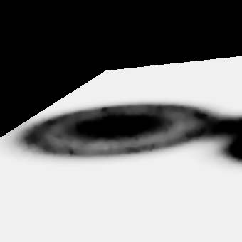
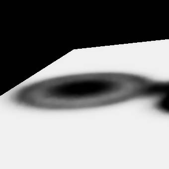
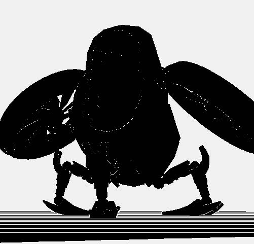
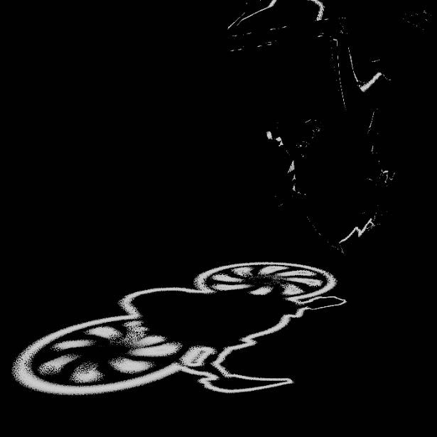
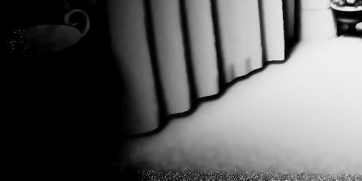
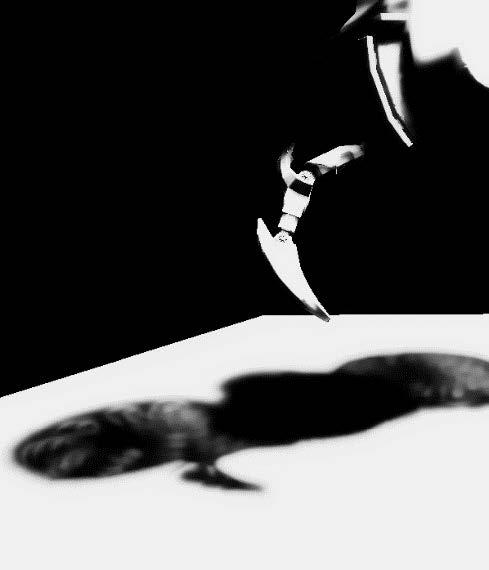
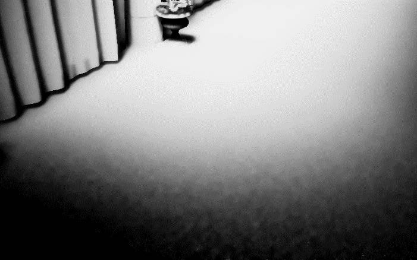
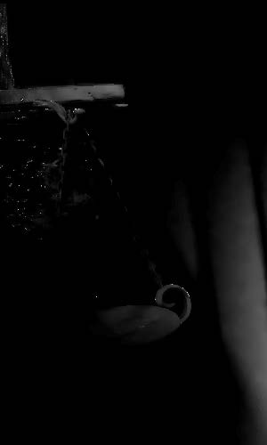
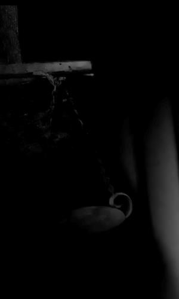

<!-- @page page_techniques_denoiser FidelityFX Denoiser 1.3 -->

<h1>FidelityFX Denoiser 1.3</h1>

**AMD FidelityFX Denoiser** includes specialized spatio-temporal denoisers optimized for specific workloads:

- **Shadow denoiser** - Designed to denoise a shadow mask created from tracing jittered rays towards a single light source.
- **Reflection denoiser** - Designed to remove noise from the results of tracing jittered reflection rays based on surface roughness.

<h2>AMD FidelityFX Shadow Denoiser</h2>

<h3>Introduction</h3>

The FidelityFX Shadow Denoiser is a spatio-temporal denoiser for raytraced soft shadows. It is intended to be used on a shadow mask that was created from at most one jittered shadow ray per pixel. It makes use of a tile classification pass to skip work on areas without spatial variance in the shadow mask. In cases of low temporal sample counts, the contribution from the spatial filters are increased, which successively cools off as the temporal sample count increases. The denoiser aims to avoid ghosting artifacts by analyzing the local pixel neighborhood and clamping the accumulated history.

[Youtube presentation](https://www.youtube.com/watch?v=RTtVC-Zk5yI) 

<h3>Shading language requirements</h3>

`HLSL` `GLSL` `CS_6_2`

<h3>Inputs</h3>

This section describes the inputs to FidelityFX Shadow Denoiser.

| Input name | Type | Notes |
| --- | --- | --- |
| **hitMaskResults** | `Texture2D` | A shadow mask containing the results of the raytracing pass, where a single pixel contains the visibility results of an 8x4 tile
| **depth** | `Texture2D` | The depth buffer for the frame |
| **velocity** | `Texture2D` | The motion vectors for the frame |
| **normal** | `Texture2D` | The normals for the frame |
| **shadowMaskOutput** | `Texture2D` | The shadow mask output |
| **constants**     | `Constant buffer` | A constant buffer containing information about the camera position, various transformation matrices and other miscellaneous settings |

<h3>The technique</h3>

The following is a pass by pass breakdown of the FidelityFX Shadow Denoiser<br>

<h4>Denoiser shadows prepare</h4>

The output from the raytracing pass is packed into a buffer laid out in a 32bit `uint` bitmask to represent 8x4 pixel tiles. This assists with bandwidth reduction in later passes. An optimization can be made for a raytracing pass to work as a group and write these bitmasks directly. In that case this preparation pass can be skipped. 

While it is possible to extend this idea beyond one ray per pixel in theory, the current implementation is designed with one ray per pixel in mind.<br>

<h4>Denoiser shadows tile classification</h4>

Tile classification performs three major steps:
1. Local neighborhood encoding
2. Disocclusion mask generation
3. Reprojection

**Local neighborhood encoding**

Local neighborhood encoding stores the first two moments of the shading values (in this case, the noisy shadow values) surrounding a pixel.

These moments are:
- The mean average of the neighboring samples.
- The variance.

The moments are created from sampling acording to a variable kernel size. Below are the results when sampling with a number of different kernel sizes under heavy shadow motion:

| 5x5 kernel | 17x17 kernel (default) | 29x29 kernel|
|:---:|:---:|:---:|
| | ||

The FidelityFX Shadow Denoiser sets the kernel radius value to 8, which corresponds to a 17x17 kernel, and was selected as a balance between quality and performance.

However, a 17x17 kernel would require 289 taps per pixel, which is prohibitively expensive. The solution here is to realize that the variance calculation kernel is separable, meaning we can perform a horizontal pass, store the intermediate results, and finish with a vertical pass. This drops the number of per-pixel taps
down to 34 across the two passes. Utilizing the compressed bitmask for ray hits we can further bring the 289 taps down to 18 scalar loads.

Both the horizontal and the vertical pass are integrated into the temporal reprojection pass itself to avoid the memory bandwidth requirements of having to write to and read from an additional intermediate target. That comes with the cost of having to recalculate some of the horizontal values (however this is
comparably negligeable due to using the compressed shadow mask).

**Disocclusion mask** 

The disocclusion mask determines new areas on the screen. These are regions that were previously outside of screen-space but are now visible due to camera motion, or now visible due to occluders moving.

This information is typically referred to as disocclusion and in this pass we determine a binary mask flagging which pixels were disoccluded and which were not. 

In order to determine which areas are new, we calculate the depth value that each pixel should have had in the previous frame were it present and compare it with the actual value using the depth buffer from the previous frame. If the depth values do
not match, this is a disocclusion. 

To calculate the previous depth value, we use a reprojection matrix that
takes a clip-space position in the current frame and returns the clip-space position in the previous frame from which we can retrieve the desired depth value. 

The reprojection value is sensitive to numerical errors, thus we recommend calculating the intermediate steps with higher precision:

<center>

*reprojection_matrix = view_projection_inverse_matrix * previous_view_projection_matrix;*


</center>

In the above image, a larger than 1% depth error is enough to trigger a disocclusion and while this works well in the general case, it breaks down for areas of the screen that exhibit large depth variations (which typically occurs at grazing angles). 

This is fixed by dynamically changing the threshold value per pixel based on the surface grazing angle (estimated using the dot product of the camera look at and
the surface normal):

<center>

| Constant depth threshold | Adaptive depth threshold |
|:---:|:---:|
| | |

</center>

Notice the invalid horizontal lines on the floor caused by the large depth variations, which are removed in the adaptive version.

**Reprojection**

Reprojection uses the local neighborhood encoding data, disocclusion data, and temporal history buffers provided to perform velocity based reprojection.

First we calculate temporal variance, which is an estimate of the amount of noise in the image. This value will be used by the spatial passes to drive the amount of blur needed for denoising:



When few temporal samples are available due to masked disoccluded regions resetting the per-pixel sample count, the temporal variance is combined with the spatial variance as found in the local neighborhood encoding section of this pass:

```C++
if (moments_current.z < 16.0f)
{
    const float variance_boost = max(16.0f – moments_current.z, 1.0f);
    variance = max(variance, spatial_variance);
    variance *= variance_boost; // boost variance on first frames
}
```

We boost the value of the variance when few samples are available to get rid of the noise in the regions where temporal reprojection does not work:

<center>

| Without variance boost | With variance boost |
|:---:|:---:|
 | |
</center>

Notice how the bottom and far-left parts of the image are much noisier without applying the variance boost. Increasing the variance value will mean a more aggressive spatial blur for those pixels that have little to no temporal history. This blur will eventually dissipate as the history grows longer.

Once moments and variance have been calculated, shadow values are reprojected using a combination of values from the previous frame, the history buffer, and the denoiser samples.

One important issue here is that shadows can move, and this motion is not reflected in the velocity map. Therefore, a method is needed to accept or reject history samples for these cases. This is done by clamping the reprojected history values to the local neighborhood encoding that was calculated earlier:

<center>

| Naïve blending | Neighborhood clamping |
|:---:|:---:|
 | |
</center>

Notice how the shadow disappears as many temporal samples get incorrectly blended. Conversely, neighborhood clamping helps with obtaining a much more responsive filter and preserves the shadow details under motion.

```C++
// Compute the clamping bounding box
const float std_deviation = sqrt(local_variance);
const float nmax = local_mean + 0.5f * std_deviation;
const float nmin = local_mean - 0.5f * std_deviation;

// Clamp reprojected sample to local neighborhood
const float shadow_previous = SampleHistory(uv - velocity);
const float shadow_clamped = clamp(shadow_previous, nmin, nmax);
```

The neighborhood clamping implementation resembles the above code and can be seen towards the end of the `FFX_DNSR_Shadows_TileClassification` function.

The clamped history information is then merged with the current frame using a simple exponential moving average blend. Take care when selecting the proper blend factor to use in merging as:

- A low blend factor will keep the current frame values resulting in a responsive but unstable filter.
- A high blend factor will keep the clamped history values resulting in a stable but unresponsive filter

One solution is to choose the blend factor per pixel based on the amount of history available. Where we have little to no history, a low blend factor is used, whereas a high blend factor can be used where we are confident in the reprojection:

<center>

| Constant blend factor | Adaptive blend factor |
|:---:|:---:|
 | |
</center>

Notice how the adaptive version produces a more responsive filter, eliminating most of the temporal bleeding from the initial render.

<h4>Denoiser shadows filter</h4>

The final pass of the FidelityFX Shadow Denoiser is responsible for performing the spatial filtering and is run three times. 

The three passes have a relatively small region where they sample from so these run
optimized kernels that utilize groupshared memory to cache samples.

It implements the `Edge-Avoiding À-Trous Wavelet (EAW)` filtering technique, where blurs are performed repeatedly with increasing radius values over multiple passes:

<center>

| No `EAW` pass | Single `EAW` pass | 3 `EAW` passes |
|:---:|:---:|:---:|
| | ||
</center>

Additionally, the variance estimated in the temporal pass is updated with its filtered value after each subsequent blur pass. This reduces the amount of blurring over time where it is not needed:

<center>

| Variance after 1 blur pass | Variance after 2 blur passes | Variance after 3 blur passes |
|:---:|:---:|:---:|
| | ||
</center>

Notice how the variance reduces with each subsequent blur pass.

<h4>TAA</h4>

Temporal anti-aliasing (TAA) works by smoothing over edges using temporal reprojection of previous results. TAA can further stabilize and clean up the image after the denoiser has run.

<center>

| Without TAA | With TAA |
|:---:|:---:|
| | |

</center>

Notice how the render without TAA exhibits artifacts at the edges where the spatial blur fails to find matching samples. Experimentation is encouraged to identify the right about of TAA to apply on for a particular scene.

<h2>AMD FidelityFX Reflection Denoiser</h2>

<h3>Introduction</h3>

The FidelityFX Reflection Denoiser is a high performance spatio-temporal denoiser, specialized for reflection denoising.
A tile classification pass is used to skip non reflective areas. The denoiser supports variable rate traversal: from full rate
for mirror reflections down to quarter rate for glossy reflections. It also supports temporal variance guided tracing.

<h3>Shading language requirements</h3>

`HLSL` `GLSL` `CS_6_0`

<h3>Inputs</h3>

This section describes the inputs to FidelityFX Reflection Denoiser.

| Input name | Type | Notes |
| --- | --- | --- |
| **depthHierarchy** | `Texture2D` | The depth buffer with full mip maps for the current frame |
| **motionVectors** | `Texture2D` | The motion vectors for the current frame |
| **normal** | `Texture2D` | The normals for the current frame |
| **radianceA** | `Texture2D` | The ping-pong radiance buffers to filter |
| **radianceB** | `Texture2D` | The ping-pong radiance buffers to filter |
| **varianceA** | `Texture2D` | The ping-pong variance buffers used to filter and guide reflections |
| **varianceB** | `Texture2D` | The ping-pong variance buffers used to filter and guide reflections |
| **extractedRoughness** | `Texture2D` | The roughness of the current frame |
| **output** | `Texture2D` | The stored denoised reflections |
| **denoiserTileList** | `Buffer` | The tiles to be denoised |
| **indirectArgumentsBuffer** | `Buffer` | The indirect arguments used by the indirect dispatch calls invoked by the denoiser |
| **constants** | `Constant buffer` | A constant buffer containint information about the camera position, various transformation matrices and other miscellaneous settings |

<h3>The technique</h3>

The following is a pass by pass breakdown of the FidelityFX Reflection Denoiser

<h4>Reprojection pass</h4>

The reprojection pass detects disocclusions, estimates variance, and computes an 8x8 radiance MIP. There are two reprojection paths.

The fast path either finds mirror reflection parallax based on similarity to the local neighborhood, or uses surface motion vector reprojection with extra distance checks based on neighborhood statistics to avoid ghosting. 

The slow path, only triggered on edges, tries to construct a better sample out of a 2x2 interpolation neighborhood. The 8x8 average radiance is also used for low sample areas and to filter out outlying results.

<h4>Spatial denoiser pass</h4>

The spatial denoiser pass makes use of the variance guided edge aware filter to remove outliers and blur in image-space. 15 samples in a 7x7 region are used for the edge aware blur. The weighting of each sample depends on the similarity to the 8x8 average.

<h4>Temporal denoiser pass</h4>

The temporal denoiser pass removes outliers and uses 9x9 gaussian region statistics to clip history(reprojected results from the reprojection pass). New signals are blended with the history depending on the sample count.

<h2>References</h2>

- [EA Seed presentation on Hybrid Real-Time Rendering](https://www.ea.com/seed/news/seed-dd18-presentation-slides-raytracing)
- [SVGF](https://cg.ivd.kit.edu/publications/2017/svgf/svgf_preprint.pdf)

<h2>See also</h2>

- [Hybrid Shadows](../samples/hybrid-shadows.md)
- [Hybrid Reflections](../samples/hybrid-reflections.md)
- [Stochastic Screen-Space Reflections](../samples/stochastic-screen-space-reflections.md)
- [Naming guidelines](../getting-started/naming-guidelines.md)
