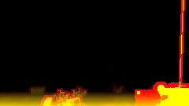
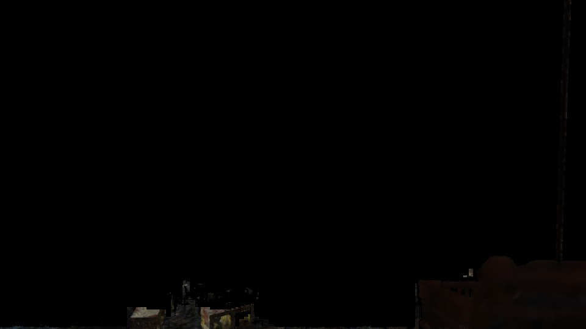
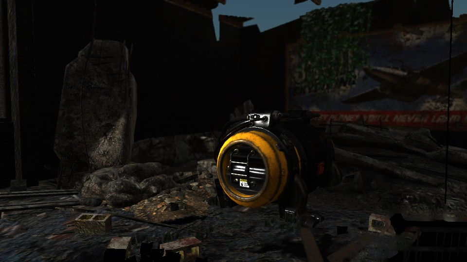

<!-- @page page_techniques_depth-of-field FidelityFX Depth of Field 1.1 -->

<h1>FidelityFX Depth of Field 1.1</h1>


<h2>Table of contents</h2>

* [Introduction](#introduction)
* [Integration guidelines](#integration-guidelines)
* [The technique](#the-technique)
* [Limitations](#limitations)
* [References and further reading](#references-and-further-reading)

<h2>Introduction</h2>

**FidelityFX Depth of Field** (or **DoF** for short) is a technique that aims to recreate the bokeh depth of field effect produced by camera lenses.

<h3>Shading language and API requirements</h3>

<h4>DirectX 12 + HLSL</h4>

- `HLSL`
  - `CS_6_2`
  - `CS_6_6†`


† `CS_6_6` is used on some hardware which supports 64-wide wavefronts.

<h4>Vulkan + GLSL</h4>

- Vulkan 1.x

- `GLSL 4.50` with the following extensions
  - `GL_EXT_samplerless_texture_functions`
  - `GL_EXT_control_flow_attributes` (optional)
  - `GL_EXT_shader_subgroup_extended_types_float16`
  - `GL_EXT_shader_16bit_storage`
  - `GL_EXT_shader_explicit_arithmetic_types`
  - `GL_KHR_shader_subgroup_basic`
  - `GL_KHR_shader_subgroup_vote`
  - `GL_KHR_shader_subgroup_arithmetic`
  - `GL_KHR_shader_subgroup_ballot`
  - `GL_KHR_shader_subgroup_quad`
  - `GL_KHR_shader_subgroup_shuffle`

Note that the GLSL compiler must also support `GL_GOOGLE_include_directive` for `#include` handling used throughout the GLSL shader system.

<h2>Integration guidelines</h2>

<h3>Input resources</h3>

The only inputs required are the frame color buffer and per-pixel circle of confusion (CoC) radii, usually generated from the depth buffer.

As the technique runs on a half-resolution (or quarter area resolution) buffer, the inputs must first be downsampled. Supplying multiple MIP levels can also aid performance and quality in areas with large circles of confusion. The [FidelityFX Single Pass Downsampler](../techniques/single-pass-downsampler.md) is recommended for this, and a helper function for a bilateral reduction is included in the source code.

Additionally, the minimum and maximum CoC values per tile are required, and a shader for their calculation is included as well.

When using the SDK context, only the current frame color and depth buffers need to be provided in `FfxDofDispatchDescription`. CoC radii are calculated from the depth buffer. Downsampling is run as part of the effect.

<h3>Calculating the circle of confusion radius</h3>

For a believable depth-of-field effect, a thin lens model is recommended. In this model, the CoC radius is calculated by the formula

```
CocRadius = abs( (ApertureRadius * FocalLength * (FocusedDistance - ObjectDistance)) / (ObjectDistance * (FocusedDistance - FocalLength)) )
```

By substituting the function for converting z-buffer values to view-space depth for the object distance and simplifying all invariant variables, we get a function of the form `CocRadius = abs(z * CocScale + CocBias)`. The scale and bias terms should be supplied in `FfxDofDispatchDescription`.

Helper functions for their calculation from the projection matrix and lens model parameters are included (`ffxDofCalculateCocScale`/`Bias`).

Important note: the sign of the radius is used to differentiate between near-field and far-field. Use a negative sign for far-field pixels and positive for near-field. If the camera points in the negative Z direction, the focus distance in the above calculation should be negative as well.

The input radius is expected in units of half-resolution pixels.

For the sake of performance, it can be beneficial to limit the radius values, e.g. by clamping (note that the limit should be scaled with
the input resolution for the output to look the same regardless of resolution).

The `cocLimitFactor` field of `FfxDofContextDescription` can be used to implement this. It is given as a factor multiplied by the input/output image height.

This mechanism can also be used to limit the effect to far-field or to near-field only, although the SDK does not expose separate near and far limits.

<h3>Quality settings</h3>

There are several settings that contribute to quality. First and foremost, the number of kernel samples is controlled indirectly through the `quality` parameter in `FfxDofContextDescription`, which controls the number of sample rings.

The number of samples is asymptotically quadratic in this number.
Note that the actual number of sample rings also depends on the kernel radius; the parameter is an upper limit. This option is also available as `FFX_DOF_OPTION_MAX_RINGS` in the shader code.

In the shader code, the `FFX_DOF_OPTION_MAX_MIP` constant determines the maximum MIP level sampled. It should be set to the maximum MIP level available. The first MIP is used by default and higher MIPs are used if the number of rings is less than the kernel radius (i.e. there is less than one sample per pixel). Note: this option is not exposed in the SDK, which always uses 4 MIP levels.

The `FFX_DOF_DISABLE_RING_MERGE` flag controls ring merging through the shader option `FFX_DOF_OPTION_MAX_RING_MERGE_LOG`. That setting is the base-2 log of the maximal number of rings to be merged in flat regions.

It is set either to 1 or 0, based on the `FFX_DOF_DISABLE_RING_MERGE` as higher values can cause visible blocky artifacts.

<h3>Inverted depth buffer</h3>

For the CoC tiling pass, if the depth buffer is inverted, the generated CoC values must be swapped. Simply set the `FFX_DOF_REVERSE_DEPTH` flag on context creation to take care of this, or `#define FFX_DOF_OPTION_REVERSE_DEPTH 1` before including the `ffx_dof_downsample_depth.h` header.

This setting does not affect any other passes. Notably, depth values are never used directly; they are always converted to CoC radii.

<h3>Temporal stability</h3>

The blur effect will amplify any temporal instability in the input. It is thus recommended to pass a temporally stabilized image, i.e. place DoF after TAA in the frame. Do note that with some TAA implementations, this may cause edges to bleed color into nearby pixels.

<h3>Upscaling</h3>

When using Depth of Field with render upscaling, DoF should be applied at render resolution, i.e. before upscaling. This is because per-pixel CoC information is required, which is usually derived from the depth buffer.

Depth is typically only available at render resolution and not upscaled.

<h2>The technique</h2>


<h3>Bilateral downsampling</h3>

The downsampling generates MIP maps using a bilateral kernel. Weights for each pixel in a 2x2 quad are calculated based on the absolute difference in CoC radii compared to the top-left pixel.

If all pixels have the same CoC radius, this is equivalent to simple averaging. If the difference is greater than one (pixel of radius), the pixel is assigned zero weight.

The same kernel is used for all levels of the MIP map chain.

<h3>Tile map creation</h3>

This pass takes the minimum and maximum radius per tile. The global maximum radius in tiles is also stored in preparation for the dilation pass.


<h3>Tile map dilation</h3>



The global maximum radius is used in the dilation pass as the kernel size.

The dilation function uses a scatter-as-gather algorithm. The near and far radii affecting any pixel in the central tile are accumulated. All tiles in range are examined.

For each tile, the spreading radius of that tile is checked against the distance to the center. If the distance is less, meaining some pixels from that tile may spread to at least one pixel in the central tile, the gathered radii are updated.

<h3>Tile classification</h3>

At the beginning of the blur pass, each tile is classified according to its dilated near and far CoC values. If the radius is less than half of one half-resolution pixel, the tile is simply copied to the far field output.

If the entire tile is in the near field or far field, irrelevant code sections will be skipped. If the difference between the near and far radii is small, a simplified version is run, where all sample weights
are equal.

<h3>Near-field blur</h3>



Any samples in the near field are accumulated using a weighted average using a scatter-as-gather algorithm. Out of range samples are discarded. Weights are calculated using a normalized inverse of the CoC radius.

The opacity for the near color is determined by the number of nearby background samples and stored in the alpha channel of the near-field output.

<h4>Hole filling</h4>

For objects in the near field, edges should blur equally to the inside and outside of the silhouette to maintain their apparent size. Replicating this effect requires color samples from behind the object in question, which are not available in the color buffer due to occlusion. As an approximation, these samples are extrapolated from the surrounding area instead.

Concretely, if the center sample is in the near field, any background samples (regardless their range or occlusion) are accumulated as a "fill" color, and added to the far color at the end.

<h3>Far-field blur</h3>



For the far field, samples are gathered in rings from the outside in, as suggested by _Abadie 2018_. This approximates proper occlusion, as inner samples tend to be closer to the camera.

<h4>Ring bucket gathering</h4>

For each ring, samples are accumulated into two buckets: one for the current ring and one for all previous rings. After each ring, the current bucket is merged into the previous bucket.

For color, a weighted sum is used, using the same weight calculation as for the near-field blur.

In addition, we average the samples' (normalized) radii. When merging, the buckets are approximated as rings and the overlap is used to occlude the previous bucket.

<h3>Ring merging</h3>

In flat regions all weights are assumed to be equal. We can thus gather from higher MIP levels, since for flat regions these contain simple averages. We must however maintain the circular shape of the kernel. This is achieved by gathering the outermost ring at the highest resolution and increasing the mip level for inner rings.

This allows a reduction of the total ring count and thus the number of samples.

<h3>Combination pass</h3>

The final output image is composed from the full-resolution input and the blurred near-field and far-field images with full-resolution CoC information (typically from the depth buffer).

To reduce noise and holes in the blurred images from low sample amounts and randomized sub-pixel kernel origins, some filtering is applied. The filtered images are bilinearly upscaled and composed in layers with the full-resolution input, which may be blurred on-the-fly to bridge the gap between full and half resolution.

<h4>Post-filtering</h4>

A 3x3 median filter is applied to color values from both the near and far field images. The filter selects the median luminance from the neighborhood and adjusts the central pixel brightness accordingly.
Some clamping is applied to avoid overbrightening.

In the near field, a 3x3 average filter is applied to the opacity values for smoothing. To counteract bleeding around the border values (0 and 1), these values are mapped to blend weights using a cubic function.

To ensure continuity of these layers, pixels for which the median luminance is zero are not changed and invalid near-field pixels are filled using the highest opacity corner pixel.

<h4>Upscaling</h4>

The post-filtered near and far colors are scaled up using bilinear interpolation. Since invalid pixels may be present in both layers, their interpolation must be handled.

In the near-field, the interpolation is invalidated if any of the corners has zero opacity. In this case, the opacity of the interpolated pixel is set to zero as well.

In the far-field, the boolean validity is interpolated as well, so that bordering pixels receive a fractional validity value. The color is then divided by this to effectively extend the valid region by one pixel. This ensures continuity between layers even in cases where they do not overlap.

<h4>Fixed 3x3 blur</h4>

A simple fixed-size 3x3 pixel blur is calculated on-the-fly to account for pixels with CoC values between half a pixel and two pixels, which is the range that half-resolution blurring cannot achieve.

The kernel weights approximate the coverage of a circle with a diameter of three pixels centered in the kernel.

<h4>Blending</h4>

All layer colors are blended together using linear interpolation (standard alpha blending). The base color is taken from the full-resolution input. The fixed blur and far-field colors are blended on top based on the absolute value of the CoC radius for that pixel.

Some ad-hoc fixes are needed for these weights. If the far-field color is invalid, the corresponding weight is set to zero. If the near-field opacity is above an empirically determined threshold of 0.3, the fixed-blur color must not be used, otherwise it may bleed the color of a foreground object into the background near an edge.

The near-field color is composed over this color using a cubic weight based on the filtered and interpolated opacity.

<h2>Limitations</h2>

The technique is unable to handle translucency or volumetrics, as only one depth value can be specified per pixel. Fully transparent (invisible) elements are handled correctly as long as they do not modify depth.

When using the pre-compiled shaders in the SDK, only circular bokeh is supported. For other shapes, two functions must be implemented to specify the number and locations of samples per ring.

<h2>References and further reading</h2>

- "Depth of Field: A Survey of Techniques" in "GPU Gems", Chapter 23, Joe Demers, 2004.
- "Graphics Gems from CryENGINE 3", Tiago Sousa, in Advances in Real-Time Rendering in Games, SIGGRAPH 2013.
- "Next Generation Post Processing in Call Of Duty: Advanced Warfare", Jorge Jimenez, in Advances in Real-Time Rendering in Games, SIGGRAPH 2014.
- "A Life of a Bokeh", Guillaume Abadie, in Advances in Real-Time Rendering in Games, SIGGRAPH 2018.

<h2>See also</h2>

- [FidelityFX Depth Of Field](../samples/depth-of-field.md)
- [FidelityFX Naming guidelines](../getting-started/naming-guidelines.md)
