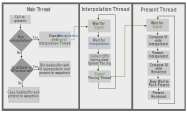
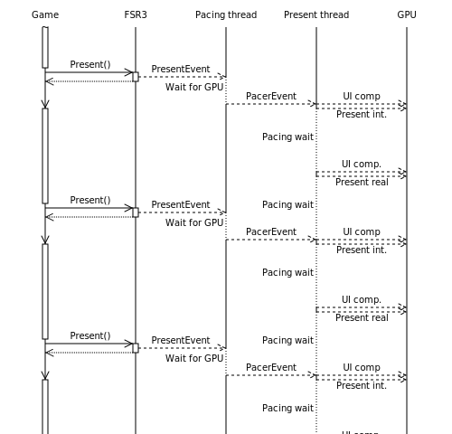

<!-- @page page_techniques_frame-interpolation-swap-chain FidelityFX Frame Interpolation Swapchain 1.1.2 -->

<h1>FidelityFX Frame Interpolation Swapchain 1.1.2</h1>

<h2>Table of contents</h2>

- [Introduction](#introduction)
- [Description](#description)
- [Integration](#integration)
    - [Recording and dispatching the frame interpolation workload](#recording-and-dispatching-the-frame-interpolation-workload)
    - [UI composition](#ui-composition)
    - [Frame pacing and presentation](#frame-pacing-and-presentation)
- [Additional Information](#additional-information)
    
<h2>Introduction</h2>

The `FrameInterpolationSwapChain` implements the `IDXGISwapChain4` and `VkSwapchainKHR` interfaces to provide an easy way to handle dispatching the workloads required for frame interpolation and pacing presentation.

Though this implementation may not work for all engines or applications, it was designed to provide an easy way to integrate FSR3 frame generation in a way that it is (almost) transparent to the underlying application.

<h2>Description</h2>

`FrameInterpolationSwapChain` can be used as a replacement of the DXGI or Vulkan swapchain and from the application point of view behavior should be similar.

When frame generation is disabled, the main difference will be that present is slightly more expensive (one extra surface copy) compared to using the swapchain directly.

In this case, the frame interpolation swapchain still supports handling the UI composition, so applications don't have to handle their UI differently when disabling frame interpolation.

Internally the `FrameInterpolationSwapChain` will create 2 additional CPU threads:

- The first thread is used to not stall the application while waiting for interpolation to finish on the GPU. After that the thread will get the current CPU time and compute pacing information.
- The second thread dispatches the GPU workloads for UI composition (calling the callback function if needed) and pacing the non-interpolated frames' present.

<h2>Integration</h2>

The `FrameInterpolationSwapChain` should be integrated using the [FidelityFX API](../getting-started/ffx-api.md) as described in the [combined FSR integration document](super-resolution-interpolation.md).

The rest of this section describes integration for platforms not supported by FidelityFX API.

`FrameInterpolationSwapChain` for DirectX 12 implements the `IDXGISwapChain4` interface, so once created it behaves just like a normal swapchain.

Creation can be done by either calling `ffxReplaceSwapchainForFrameinterpolationDX12`, which will replace an existing swapchain, or by calling `ffxCreateFrameinterpolationSwapchainDX12` or `ffxCreateFrameinterpolationSwapchainForHwndDX12` similar to calling `CreateSwapChain` or `CreateSwapChainForHwnd`.

`FrameInterpolationSwapChain` for Vulkan provides an interface of replacement swapchain functions that can be used just like a normal `VkSwapchainKHR`.

Creation can be done by calling `ffxReplaceSwapchainForFrameinterpolationVK`, which will replace an existing swapchain if present or create a new one.
Calling `ffxGetSwapchainReplacementFunctionsVK` provides the replacements for Vulkan swapchain functions.

<h3>Recording and dispatching the frame interpolation workload</h3>

The `FrameInterpolationSwapchain` has been designed to be independent of `FfxOpticalFlow` or `FfxFrameInterpolation` interfaces. To achieve this, it does not interact directly with those interfaces. The frame interpolation workload can be provided to the `FrameInterpolationSwapchain` in 2 ways:

1. Provide a callback function (`frameGenerationCallback`) in the `FfxFrameGenerationConfig`.
   This function will get called from the `FrameInterpolationSwapChain` during the call to `::Present` on the game thread, if frame interpolation is enabled to record the command list containing the frame interpolation workload.
2. Call `ffxGetFrameinterpolationCommandlist{DX12,VK}(FfxSwapchain, FfxCommandList&)` to obtain a command list from the `FrameInterpolationSwapChain` and record the frame interpolation workload into it.
   In this case the command list will be executed when present is called.

The command list can either be executed on the same command queue present is being called on, or on an asynchronous compute queue: 
- Synchronous execution is more resilient to issues if an application calls upscale but then decides not to call present on a frame.
- Asynchronous execution may result in higher performance depending on the hardware and what workloads are running alongside the frame interpolation workload.

Either way, UI composition and present will be executed an a second graphics queue in order to not restrict UI composition to compute and allow the driver to schedule the present calls during preparation of the next frame.

Note: to ensure presents can execute at the time intended by FSR3's frame pacing logic, avoid micro stuttering and assure good VRR response by the display, it is recommended to ensure the frame consists of multiple command lists.

<h3>UI Composition</h3>

When using frame interpolation, it is highly advisable to treat the UI with special care, since distortion due to game motion vectors that would hardly be noticeable in 3D scenes will significantly impact readability of any UI text and result in very noticeable artifacts, especially on any straight, hard edges of the UI.

To combat any artifacts and keep the UI nice and readable, FSR3 offers 3 ways to handle UI composition in the `FrameInterpolationSwapChain`:

1. Register a call back function, which will render the UI on top of the back buffer.
   This function will get called for every back buffer presented (interpolated and real) so it allows the application to render UI animations at display rate or apply effects like film grain differently for each frame sent to the monitor. 
   However this approach obviously has some impact on performance as the UI will have to be rendered twice, so care should be taken to only record small workloads in the UI callback.
2. Render the UI to a separate surface, so it can be alpha-blended to the final back buffer.
   This way the UI can be applied to the interpolated and real back buffers without any distortion.
3. Provide a surface containing the HUD-less scene to the `FrameInterpolationSwapChain` in addition to the final back buffer.
   In this case the frame interpolation shader will detect UI areas in the frame and suppress distortion in those areas.

<h3>Waitable Object</h3>

It is advisable that the game uses GetFrameLatencyWaitableObject to get a waitable object, then use that object to prevent the CPU from running too far ahead of the GPU. This is espcially important when VSync is on on a low refresh rate monitor, as the GPU render rate can fall far below the CPU submission rate. Alternatively, the app can use a frame limiter set to half monitor refresh rate.

<h3>Frame pacing and presentation</h3>

The `FrameInterpolationSwapchain` handles frame pacing automatically. Since Windows is not a real-time operating system and variable refresh rate displays are sensitive to timing imprecisions, FSR3 has been designed to use a busy wait loop in order to achieve the best possible timing behavior.

With frame generation enabled, frames can take wildly different amounts of time to render. The workload for interpolated frames can be much smaller than for application rendered frames ("real" frames). It is therefore important to properly pace presentation of frames to ensure a smooth experience. The goal is to display each frame for an equal amount of time.

Presentation and pacing are done using two additional CPU threads separate from the main render loop. A high-priority pacing thread keeps track of average frame time, including UI composition time, and calculates the target presentation time delta. It also waits for GPU work to finish to avoid long GPU-side waits after the CPU-side presentation call.

To prevent any frame time spikes from impacting pacing too much, the moving average of several frames is used to estimate the frame time.

A present thread dispatches frame composition work for the generated frame, waits until the calculated present time delta has passed since the last presentation, then presents the generated frame. It repeats this for the real frame.

The application should ensure that the rendered frame rate is slightly below half the desired output frame rate. When VSync is enabled, the render performance will be implicitly limited to half the monitors maximum refresh rate.

It is recommended to use normal priority for any GPU queues created by the application to allow interpolation work to be scheduled with higher priority. In addition, developers should take care that command lists running concurrently with interpolation and composition are short (in terms of execution time) to allow presentation to be scheduled at a precise time.

<h4>Expected behavior</h4>

To further illustrate the pacing method and rationale behind it, the following sections will lay out expected behavior in different scenarios. We differentiate based on the post-interpolation frame rate as well as whether the display uses a fixed or variable refresh rate.

<h5>Fixed refresh rate</h5>

<h6>VSync enabled</h6>

Here, tearing is disabled and every frame is displayed for at least one sync interval. Presentation is synchronized to the display's vertical blanking period ("vsync"). This may result in uneven display timings and may increase input latency (by up to one refresh period).

In the diagram, the first real frame is presented slightly after the vertical blanking interval, leading to the prior interpolated frame being shown for two refresh intervals and increased latency compared to immediate display.

<h6>VSync disabled</h6>

In this case, tearing is likely to occur. Presentation is not synchronized with the display. The benefit of this is reduced input latency compared to lower frame rates.

<h5>Variable refresh rate</h5>

This section applies to display and GPU combinations with support for variable refresh rate (VRR) technologies, such as AMD FreeSync, NVIDIA G-SYNC® and VESA AdaptiveSync.

The timing between display refreshes is dictated by the variable refresh rate window. The delta time between two refreshes can be any time inside the window. As an example, if the VRR window is 64-120Hz, then the delta time must be between 8.33 and 15.625 milliseconds. If the delta is outside this window, tearing will likely occur.

If no new present happens inside the window, the prior frame is displayed again.

<h6>Interpolated frame rate inside VRR window</h6>

The variable refresh window usually does not extend above the reported native refresh rate of the display, so tearing will be disabled in this case.

<h6>Interpolated frame rate outside VRR window</h6>

If the frame rate is below the lower bound of the VRR window, the expected behavior is the same as if the frame rate is below the refresh rate of a fixed refresh rate display (see above).

If the frame rate is above the upper bound of the VRR window, the expected behavior is the same as if the frame rate is above the refresh rate of a fixed refresh rate display (see above).

<h2>Additional Information</h2>

List of resources created by the `FrameInterpolationSwapChain`:

- Two CPU worker threads. One of those will be partially spinning between present of the interpolated frame and the real frame to precisely time the presents
- One asynchronous compute queue (only used `FFX_FSR3_ENABLE_ASYNC_WORKLOAD_SUPPORT` is set on FSR3 context creation and `allowAsyncWorkloads` is true in the `FfxFrameGenerationConfig`)
- One asynchronous present queue. This queue will be used to execute UI composition workloads and present
- A set of command lists, allocators and fences for the interpolation and UI composition workloads
- The GPU resources required to blit the back buffer to the swapchain and compose the UI (if no callback is used)
- The swapchain attached to the actual game window

The `FrameInterpolationSwapchain` has been designed to minimize dynamic allocations during runtime:

- System memory usage of the class is constant during the lifetime of the swapchain, no STL is being used
- DirectX or Vulkan resources are created on first use and kept alive for reuse
