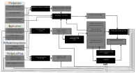

<!-- @page page_techniques_frame-interpolation FidelityFX Frame Interpolation 1.1.2 -->

<h1>FidelityFX Frame Interpolation 1.1.2</h1>

<h2>Table of contents</h2>

- [Introduction](#introduction)
    - [Shading language requirements](#shading-language-requirements)
- [Integration](#integration)
    - [Creation](#creation)
    - [Dispatch](#dispatch)
    - [Destruction](#destruction)
- [The technique](#the-technique)
    - [Algorithm structure](#algorithm-structure)
    - [Setup pass](#setup-pass)
    - [Estimate interpolated frame depth](#estimate-interpolated-frame-depth)
    - [Compute game motion vector field](#compute-game-motion-vector-field)
    - [Compute game motion vector field inpainting pyramid](#compute-game-motion-vector-field-inpainting-pyramid)
    - [Compute optical flow vector field](#compute-game-motion-vector-field)
    - [Compute disocclusion mask](#compute-disocclusion-mask)
    - [Compute interpolation](#compute-interpolation)
    - [Compute inpainting pyramid](#compute-inpainting-pyramid)
    - [Inpainting](#inpainting)
- [Debug output](#debug-output)

<h2>Introduction</h2>

The FidelityFX Frame Interpolation technique takes 2 back buffers, and several resources shared with `FSR3Upscaler` and `FfxOpticalFlow` to compute an interpolated image between the 2 back buffers.
The resources shared with the upscaler can also be computed in a preparation pass.

This technique has been designed to work together with the `FfxOpticalFlow` (by taking textures generated by this technique) and `FfxFsr3Upscaler` (by using internal surfaces of that technique). Although `FfxFrameInterpolation` does not use the interface of those techniques directly, it will requires references to some surfaces on dispatch, so `FfxOpticalFlow` must be used together with `FfxFrameInterpolation` to compute those surfaces.

The `FfxFrameInterpolation` effect only computes the interpolated image. Once this is accomplished, the interpolated and real back buffers still need to be used, i.e. usually sent to the swapchain. On the topic of how to handle presentation and pacing of the back buffers, please refer to the [frame interpolation swapchain](frame-interpolation-swap-chain.md) documentaion.

<h3>Shading language requirements</h3>

- `HLSL`
  - `CS_6_2`
  - `CS_6_6†`

† `CS_6_6` is used on some hardware which supports 64-wide wavefronts.

- Vulkan 1.x
- `GLSL 4.50` with the following extensions:
  - `GL_EXT_samplerless_texture_functions`
  - `GL_EXT_shader_image_load_formatted`

Note that the GLSL compiler must also support `GL_GOOGLE_include_directive` for `#include` handling used throughout the GLSL shader system.

<h3>Integration</h3>

FidelityFX Frame Interpolation should be integrated using the [FidelityFX API](../getting-started/ffx-api.md) as described in the [combined FSR integration document](super-resolution-interpolation.md).

This section covers how to use the FidelityFX Frame Interpolation API directly and should help understand the inner workings of the component.

<h3>Creation</h3>

The effect can be created by calling the `ffxFrameInterpolationContextCreate` function, with a pointer to a `FfxFrameInterpolationContext` container for the context, and a pointer to a `FfxFrameInterpolationContextDescription` structure which is filled with data relevant for the frame interpolation context.

The `FfxFrameInterpolationContextDescription` structure contains configuration data:
 * A FidelityFX backend interface to use
 * A set of initialization flags
 * The maximum resolution the rendering will be performed at
 * The resolution of the resources that will get interpolated
 * The format of the resources that will get interpolated

The initialization flags are provided though the `FfxFrameInterpolationInitializationFlagBits` enumeration:

| Flag                                            | Note                                                                                                                         |
|-------------------------------------------------|------------------------------------------------------------------------------------------------------------------------------|
| `FFX_FRAMEINTERPOLATION_ENABLE_DEPTH_INVERTED`  | A bit indicating that the input depth buffer data provided is inverted [1..0].A bit indicating the depth buffer is inverted. |
| `FFX_FRAMEINTERPOLATION_ENABLE_DEPTH_INFINITE ` | A bit indicating that the input depth buffer data provided is using an infinite far plane.                                   |
| `FFX_FRAMEINTERPOLATION_ENABLE_TEXTURE1D_USAGE` | A bit indicating that the backend should use 1D textures.                                                                    |
| `FFX_FRAMEINTERPOLATION_ENABLE_HDR_COLOR_INPUT` | A bit indicating if the input color data provided is using a high-dynamic range.                                             |

<h3>Dispatch</h3>

To dispatch the effect and gain relevant results, call the `ffxFrameInterpolationContextDispatch` function with a `FfxFrameInterpolationDispatchDescription` structure filled as follows:

| `FfxFrameInterpolationDispatchDescription` member | Note                                                                                                                               |
|---------------------------------------------------|------------------------------------------------------------------------------------------------------------------------------------|
| `flags`                                           | A combination of `FfxFrameInterpolationDispatchFlags`.                                                                             |
| `commandList`                                     | The `FfxCommandList` to record frame interpolation commands into.                                                                  |
| `displaySize`                                     | The destination output dimensions.                                                                                                 |
| `renderSize`                                      | The dimensions used to render game content. `dilatedDepth` and `dilatedMotionVectors` are expected to be of this size.             |
| `currentBackBuffer`                               | The current presentation color buffer. If `currentBackBuffer_HUDLess` is not used, this will be used as interpolation source data. |
| `currentBackBuffer_HUDLess`                       | The current presentation color buffer without HUD content. When use it will be used as interpolation source data.                  |
| `output`                                          | The output resource to store the interpolated result.                                                                              |
| `dilatedDepth`                                    | The dilated depth buffer data.                                                                                                     |
| `dilatedMotionVectors`                            | The dilated motion vector data.                                                                                                    |
| `reconstructPrevNearDepth`                        | The estimated previous frame's depth buffer.                                                                                       |
| `interpolationRect`                               | The area of the backbuffer that should be used for interpolation in case only a part of the screen is used e.g. due to movie bars. |
| `opticalFlowVector`                               | The optical flow motion vectors.                                                                                                   |
| `opticalFlowSceneChangeDetection`                 | The optical flow scene change detection data.                                                                                      |
| `opticalFlowBufferSize`                           | The optical flow motion vector resource dimensions.                                                                                |
| `opticalFlowScale`                                | The optical flow motion vector scale factor, used to scale resoure values into [0.0,1.0] range.                                    |
| `opticalFlowBlockSize`                            | The optical flow block dimension size.                                                                                             |
| `cameraNear`                                      | The distance to the near plane of the camera.                                                                                      |
| `cameraFar`                                       | The distance to the far plane of the camera. This is used only used in case of non infinite depth.                                 |
| `cameraFovAngleVertical`                          | The camera angle field of view in the vertical direction (expressed in radians).                                                   |
| `viewSpaceToMetersFactor`                         | The unit to scale view space coordinates to meters.                                                                                |
| `frameTimeDelta`                                  | The time elapsed since the last frame (expressed in milliseconds).                                                                 |
| `reset`                                           | A boolean value which when set to true, indicates the camera has moved discontinuously.                                            |
| `backBufferTransferFunction`                      | The transfer function use to convert interpolation source color data to linear RGB.                                                |
| `minMaxLuminance[2]`                              | Min and max luminance values, used when converting HDR colors to linear RGB.                                                       |

The `flags` attribute of `FfxFrameInterpolationDispatchDescription` can be a combination of the following:

| `FfxFrameInterpolationDispatchFlags`                    | Note                                                                                                  |
|---------------------------------------------------------|-------------------------------------------------------------------------------------------------------|
| `FFX_FRAMEINTERPOLATION_DISPATCH_DRAW_DEBUG_TEAR_LINES` | A flag indicating [Debug output](#debug-output) visualization of tear lines should be enabled.        |
| `FFX_FRAMEINTERPOLATION_DISPATCH_DRAW_DEBUG_VIEW`       | A flag indicating [Debug output](#debug-output) visualization of internal surfaces should be enabled. |

The resource passed in `output` must have a format with an alpha channel, which is used to store some intermediate data.

<h3>Destruction</h3>

A context can be destroyed using the `ffxFrameInterpolationContextDestroy` function, passing in the pointer to the relevant context container.

<h2>The technique</h2>

<h3>Algorithm structure</h3>

The `FfxFrameInterpolation` algorithm is implemented in a series of stages, which are as follows:

1. [Setup pass](#setup-pass)
2. [Estimate interpolated frame depth](#estimate-interpolated-frame-depth)
3. [Compute game motion vector field](#compute-game-motion-vector-field)
4. [Compute game motion vector field inpainting pyramid](#compute-game-motion-vector-field-inpainting-pyramid)
5. [Compute optical flow vector field](#compute-optical-flow-vector-field)
6. [Compute disocclusion mask](#compute-disocclusion-mask)
7. [Compute interpolation](#compute-interpolation)
8. [Compute inpainting pyramid](#compute-inpainting-pyramid)
9. [Inpainting](#inpainting)

<h3>Prepare inputs</h3>

If using FSR3 upscaler, some of the resources generated during upscaling are consumed by frame interpolation. If the upscaler is not used, they must be generated by the prepare pass with a call to [`ffxFrameInterpolationPrepare`](../../sdk/include/FidelityFX/host/ffx_frameinterpolation.h#L209). This runs similarly to the [upscaler's prepare inputs pass](super-resolution-upscaler.md#prepare-inputs), although it only generates the subset of resources required by frame interpolation.

<h3>Setup pass</h3>

The setup pass clears the internal `Counter`, `GameMotionVectorFieldXY`, `OpticalFlowVectorFieldXY` and `DisocclusionMask` surfaces, as those will be used through atomic operations.

<h3>Estimate interpolated frame depth</h3>

This pass (using the `ReconstructPreviousDepthPass` pipeline) computes the estimated dilated depth buffer of the interpolated frame. It is based on the logic of the reconstruct depth reconstruction of the [`ReconstructAndDilate` pass](super-resolution-temporal.md#reconstruct-and-dilate) used in the temporal upscaler.

To compute the depth buffer of the interpolated frame, this pass consumes the dilated depth and motion vectors surfaces from the `Fsr3Upscaler` and reprojects and dilates them by half the motion vector length.

<h3>Compute game motion vector field</h3>

The `GameMotionVectorField` pass constructs the frame of reference of the interpolated frame location. This means, when sampling previous and current frame data using the game motion vectors, an interpolated frame is generated.

To do this, the pass packs the `DilatedMotionVectors` into the low 16 bits of a pair of 32-bit UINT values. The high 16 bits contain a priority, consisting of the highest 1-bit to indicate if the vector is primary or secondary, 10-bits to indicate high priority based on the distance from the camera, and the low 5 bits of priority are based on color similarity of the previous and current back buffers.

The values get written using atomic operations and it is not guaranteed that all locations get written in this pass, so there may be some holes in the field.

<h3>Compute game motion vector field inpainting pyramid</h3>

Locations not written by the previous pass will get filled in by adjacent vector information. To accomplish this, this pass generates a full mip chain of the game motion vector field using [SPD](single-pass-downsampler.md).

In this mip chain the game motion vectors will be stored in `.xy` channels, the high, depth-based, priority factor will be stored in the `.z` channel and low, color similarity-based, priority factor will be stored in the `.w` channel.

For computing the mip-chain the closest vector in 2D and the farthest in depth will be selected.

<h3>Compute optical flow vector field</h3>

This pass is similar to the [`GameMotionVectorField` pass](#compute-game-motion-vector-field) but uses the motion vectors generated by [`FfxOpticalFlow`](optical-flow.md) vectors as input.

The high priority value is computed based on vector magnitude and the low priority value is based on color similarity of reprojected colors using the optical flow motion vectors.

<h3>Compute disocclusion mask</h3>

This pass is based on the [temporal upscaler disocclusion logic](super-resolution-temporal.md#depth-clip) but will produce two disocclusion masks:

- One mask represents the disocclusion area between the interpolated frame and the previous frame
- One mask represents the disocclusion area between the interpolated frame and the current frame

Using this mask the [compute interpolation pass](#compute-interpolation) will determine if any reprojection direction is to be discarded.

<h3>Compute interpolation</h3>

This pass computes the interpolated image using the disocclusion mask and the motion vector fields.

To do so, it first reads the counters and checks if this is the first image after a reset, in which case it will simply copy the latest back buffer.

After this the algorithm operates in 2 stages:

  - First, it computes an interpolated color for each pixel by blending the two color values based on the disocclusion mask value
  - Next, it computes an interpolated color based on the optical flow motion vectors and blends it with the game motion vector based result
    - The blend factor for this operation is based on the color similarity between previous and current color for each case, so in a nutshell, if optical flow motion vectors result in a better match the algorithm prefers them to the game motion vectors.

The resulting image may contain some holes, which will get filled by [inpainting pass](#inpainting) in the final step of the algorithm.
  
<h3>Compute inpainting pyramid</h3>

This pass uses [SPD](single-pass-downsampler.md) to generate a full mip chain of the interpolated color. Holes in the interpolated color will be ignored, so sampling from the mip chain will result in a color averaged from the closest color values in 2D space.

<h3>Inpainting</h3>

This pass fills in any holes left in [compute interpolation pass](#compute-interpolation) by using the inpainting pyramid to find the closest available color.

After this, the pass cleans up the UI in case the HUD-less UI mode is being used, and then optionally adds debug information to the interpolated image.

<h3>Debug output</h3>

The frame interpolation API supports 2 types of debug view:

When `FFX_FRAMEINTERPOLATION_DISPATCH_DRAW_DEBUG_TEAR_LINES` is set in the flags attribute of `FfxFrameGenerationConfig`, the inpainting pass will add bars of changing color on the left and right border of the interpolated image. This will assist visualizing if interpolated frames are getting presented and if the frames are presented with tearing enabled.

When `FFX_FRAMEINTERPOLATION_DISPATCH_DRAW_DEBUG_VIEW` is set in the flags attribute of `FfxFrameGenerationConfig`, the [FrameInterpolationSwapChain](frame-interpolation-swap-chain.md) will only present interpolated frames and execute an additional pass to render debug data from internal surfaces onto the interpolated frame, to allow you to debug.

