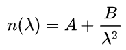

<!-- @page page_techniques_lens FidelityFX Lens 1.1 -->

<h1>FidelityFX Lens 1.1</h1>

FidelityFX Lens is a light-weight shader with lens and film effects. Its purpose is to help move effects, such as film and camera effects, which can interfere with the operation of upscalers and sharpeners, which can be sensitive to noise, to after those respective algorithms/passes. It requires no textures and only a few constants that probably already exist in an engine.

Currently, FidelityFX Lens features chromatic aberration, vignette, and film grain effects.

<h2>Shading language requirements</h2>

`HLSL` `GLSL` `CS_6_0`

<h2>Inputs</h2>

This section describes the inputs to FidelityFX Lens 1.0.

| Input name | Type | Notes |
| --- | --- | --- |
| **Input texture** | `Texture2D` | A resource containing the source color target rendered thus far, after render passes such as geometry, effects, and upscaling. |
| **Constants**     | `Constant buffer` | A constant buffer with the artistic values chosen for the effects, such as intensity of film grain, vignette, and chromatic aberration. |

<h2>Integration guidelines</h2>

<h3>Callback functions</h3>

FidelityFX Lens requires the following callback functions defined ([H] versions if FidelityFX Lens should work with half types):

<h4>FfxLensSampleR[H]</h4>
Samples the red channel from the color input.

<h4>FfxLensSampleG[H]</h4>
Samples the green channel from the color input.

<h4>FfxLensSampleB[H]</h4>
Samples the blue channel from the color input.

<h4>StoreLensOutput[H]</h4>
Stores the final computed color from Lens into the output color buffer.

Note for the above callback functions: If transversal chromatic aberration is needed, R and B can point to blurred versions of the main texture. Otherwise, all three can refer to the same texture.

<h3>Main function</h3>

[`FfxLens[H]`](../../sdk/include/FidelityFX/gpu/lens/ffx_lens.h#L264) is called in the main function.  

```HLSL
void CS(uint LocalThreadID : SV_GroupThreadID,
        uint2 WorkGroupID : SV_GroupID)
{
    FfxLens(LocalThreadID, WorkGroupID);
}
```

<h3>Chromatic aberration (CA)</h3>

Use the auxilary function `FfxLensGetRGMag` with the strength of the CA needed to get the Red and Green magnification values.  
  
Call `FfxLensSampleWithChromaticAberration` with the following parameters to get a sampling of the main color texture properly offset by the chromatic aberration effect:
* pixel coodinates
* screen center coord
* red and green magnification values  
  
<h3>Vignette</h3>

This function is a simple pixel-in, pixel-out function.  
  
Call `FfxLensApplyVignette` with the following parameters to write out a new calculated color with the vignette effect applied to it:
* pixel coordinates
* screen center coord
* current calculated color to apply vignette to 
* intensity value  

<h3>Film grain</h3>

Like vignette, this is also a pixel-in, pixel-out function.  
  
Call `FfxLensApplyFilmGrain` with the following parameters to write out a new calculated color with the film grain effect applied to it:
* pixel coordinates
* current calculated color to apply the grain to
* grain size/scale value
* grain intensity value  

<h2>The techniques</h2>

<h3>Chromatic aberration (CA)</h3>

Chromatic aberration has two [types](https://en.wikipedia.org/wiki/Chromatic_aberration#Types) that arise when the lens system of a camera either:
* magnifies each color differently (transverse), or  
* focuses each color differently (axial).  
  
To achieve this effect, we sample each channel at a magnified offset, and optionally from a slightly blurred texture.  
  
To allow for a linear control and a realistic lens, we calculate the degree of magnification of red and green using Cauchy's equation:



We chose A and B for K5 glass, a common lens material. The B factor can vary linearly, creating a smooth and physically plausible chromatic aberration effect.

<h3>Vignette</h3>

The vignette effect is created by windowing a `Cos^4` attenuation function. We chose `Cos^4` as it is the physical response of film with angle of light. The controls vary the window size, mimicking the difference in size between the film and the aperture. 


<h3>Film grain</h3>

Film grain represents the light-sensitive crystals of real film. To mimic the effect, we start with ordered "grains": 


which are chopped-up with a high quality random number generator (RNG) [PCG-3D]:


This creates a realistic distribution of grains. The controls vary the size and attenuation factor of the grains to achieve the final desired effect.

<h2>References</h2>

[PCG-3D] Hash Functions for GPU Rendering https://www.jcgt.org/published/0009/03/02/paper.pdf

<h2>See also</h2>

- [FidelityFX Lens Sample](../samples/lens.md)
- [FidelityFX Naming guidelines](../getting-started/naming-guidelines.md)
