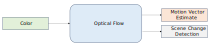
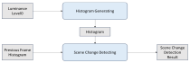
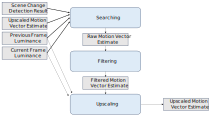

<!-- @page page_techniques_optical-flow FidelityFX Optical Flow 1.1.2 -->

<h1>FidelityFX Optical Flow 1.1.2</h1>

<h2>Introduction</h2>

The FidelityFX Optical Flow technique estimates the motion between the current and the previous scene inputs.

Based on AMD Fluid Motion Frames technology, and highly optimized for game inputs, the algorithm works on 8x8 blocks and calculates motion for each of these blocks. It is used in FSR3 and combined with upscaled game motion vectors.

There is a single scene input and two outputs that correspond to the estimated motion vectors at block granularity, and a scene change detection flag. The scene change detection result is also required internally by the Optical Flow algorithm.

The algorithm consists of two phases: preparation, and main. The preparation phase builds a luminance pyramid and detects any significant scene change. The main phase iterates through the luminance pyramid trying to detect estimated motion. At each iteration step, except iteration 0, refinements are made to previous estimate data. 

The final iteration result is what is output to the consumer of the technique.

<h2>Integration</h2>

<h3>Technical Requirements</h3>

SM 6.2 is required. The effect uses wave operations, and also uses the [HLSL `msad4`](https://learn.microsoft.com/en-us/windows/win32/direct3dhlsl/dx-graphics-hlsl-msad4) intrinsic extensively. In architectures where `msad4` is not natively executed by the GPU, this may result in reduced performance.

<h3>Create the effect</h3>

The effect can be created by calling the `ffxOpticalflowContextCreate` function, with a pointer to an `FfxOpticalflowContext` container for the context, and a pointer to a `FfxOpticalflowContextDescription` structure which is filled with data relevant for the optical flow context.

The `FfxOpticalflowContextDescription` structure contains configuration data:

 * A FidelityFX backend interface to use
 * A set of initialization flags
 * The resolution that optical flow is to run at

The initialization flags are provided though the `FfxOpticalflowInitializationFlagBits` enumeration:

| flag                                     | Note                                                       |
|------------------------------------------|------------------------------------------------------------|
| `FFX_OPTICALFLOW_ENABLE_TEXTURE1D_USAGE` | A bit indicating that the TEXTURE1D resources can be used. |

The optical flow effect can register shared resources via the `ffxOpticalflowGetSharedResourceDescriptions` function.

Resource handles should be provided through this function using the members of `FfxOpticalflowSharedResourceDescriptions` as such:

| Shared Resource name | Note |
|----------------------------------|--------------------------------------------------------------------------------------------|
| `opticalFlowVector` | A resource of `R16G16_SINT` format containing the block-based motion estimation output from Optical Flow. It's size is dictated by the `GetOpticalFlowTextureSize` function, which is `(displaySize.W/H + opticalFlowBlockSize - 1) / opticalFlowBlockSize`. `opticalFlowBlockSize` is always 8 in this release. |
| `opticalFlowSCD` | A 3x1 resource of `R32_UINT` indicating scene shading change output |

<h3>Dispatch the effect</h3>

To dispatch the effect and gain relevant results, call the `ffxOpticalflowContextDispatch` function with a `FfxOpticalflowDispatchDescription` structure filled as follows.

| `FfxOpticalflowDispatchDescription` member                        | Note                                                      |
|----------------------------------|--------------------------------------------------------------------------------------------|
| `commandList` | The command list to use for dispatch of the workload. |
| `color`| The input color buffer to operate on. |
| `opticalFlowVector`| The output optical flow vector resource. |
| `opticalFlowSCD` | The output scene change detection resource. |
| `reset` | A boolean value which when set to true, indicates the camera has moved discontinuously. |
| `backbufferTransferFunction` | A value indicating the color space transforms required. |
| `minMaxLuminance` | Luminance values for the current HDR pipeline. |

<h3>Destroy the effect</h3>

A context can be destroyed using the `ffxOpticalflowContextDestroy` function, passing in the pointer to the relevant context container.

<h2>Stage Description</h2>

<h3>Preparation</h3>

To build the luma pyramid, first a luminance resource is prepared and then a pyramid of 6 additional downscaled resources is prepared. There are two pyramids of those 7 resources, which are ping-ponged so there is always a history pyramid available except for the first frame after any reset event.

The conversion from the input color resource to the luminance is separated from computing the rest of the pyramid with the lower resolution luminance resources. Single Pass Downsampler (SPD) is used for downsampling.

To detect a significant change in the sequence of input images, first a histogram is computed for 9 sections of full resolution luminance input. There are 2 histogram resources that ping-pong to provide history. The histograms of each section are compared between the current frame and the previous frame. If the change is greater than a threshold then a flag is set indicating the scene change detection result.

<h3>Main</h3>

The algorithm of computing the motion vector estimates repeats 7 times in a sequence of 3 passes: searching, filtering and upscaling.

1. The searching pass is finding the best match between a current frame block and the previous frame blocks located within a search window. The search window location is determined by the previous iteration result. The best match is computed as a minimum of sum of absolute differences of luminance pixels in a block. 
2. The filtering pass removes outliers by using a 3x3 median filter.
3. The upscaling pass prepares 2x larger resolution resources with the motion vector estimates that will be the input for the next iteration. Each estimate is replaced by four estimates chosen from four candidates.

After 7 iterations of the above steps, the result is available.

<h4>Searching Pass</h4>

Input Resources:
* Scene change detection result
* Previous luminance of current pyramid level
* Current luminance of current pyramid level
* Upscaled motion vector estimate

Output Resources:
* Raw motion vector estimate

The scene change detection result is checked first and if true the zero motion estimate is returned to avoid providing random false positive estimates. The input motion vector estimate is used for computing the location of the search area in the previous frame luminance. Search area size is 24x24 pixels (an 8px radius around an 8x8 pixel block).

Each 8x8 pixel block of the current luminance resource is processed. The blocks do not overlap. Only one motion vector estimate is provided for all 64 pixels in an 8x8 block. Every possible offset in the search window is checked. This results in 16x16 (256) cases. A sum of absolute differences (SAD) of all pixels in a block is computed. The offset for which a minimum SAD value is computed becomes a correction to the input motion vector estimate. The sum of the input estimate and the correction is written to the output motion vector estimate resource.

<h4>Filtering Pass</h4>

Input Resources:
* Raw motion vector estimate

Output Resources:
* Filtered motion vector estimate

A group of 3x3 input raw motion vector estimates is loaded. A "middle" vector is found in the group, which is a vector which has a minimum sum difference to the other vectors. The result vector is written to the filtered motion vector estimate resource.

<h4>Upscaling Pass</h4>

Input Resources:
* Previous luminance of current pyramid level
* Current luminance of current pyramid level
* Filtered motion vector estimate

Output Resources:
* Upscaled motion vector estimate for the next pyramid level

A 2x upscaling is performed by multiplying the motion vector estimate value by 2. An additional step considers 4 candidates: the current upscaled value, and 3 adjacent input motion vector estimates.

To find the best candidate, a block SAD is computed between input luminance resources: the current luminance pixels covered by the upscaled block, and the previous luminance block pointed by the candidate motion vector and covered by the upscaled block. Both blocks are 4x4 pixels of the current pyramid level resolution. The best candidate has the minimum value of sum of absolute differences (SAD) of luminance pixels in the blocks.

This pass is not executed on the last iteration. The filtered motion vector estimate becomes the result of the whole algorithm.

<h2> Memory Information </h2>

| GPU                | 4K input/output memory use* |
|--------------------|-----------------------------|
| Radeon RX 7900 XTX | 28MB                        |
| Radeon RX 6600     | 28MB                        |
| GeForce RTX 4080   | 26MB                        |
| GeForce RTX 3060   | 26MB                        |

*Figures are rounded up.

<h2>Limitations</h2>

The maximum tracking movement is 512 pixels.
