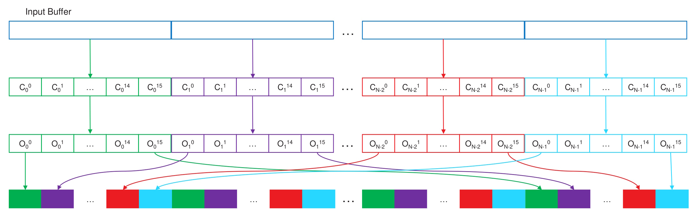

<!-- @page page_techniques_parallel-sort FidelityFX Parallel Sort 1.3 -->

<h1>FidelityFX Parallel Sort 1.3</h1>

FidelityFX Parallel Sort is a technique which uses a GPU-based radix sort algorithm to sort a provided buffer of keys, and an optional payload.

<h2>Shading language requirements</h2>

`HLSL` `GLSL` `CS_6_0`

<h2>The technique</h2>

FidelityFX Parallel Sort will sort the provided key buffer and optional payload buffer using an RDNA-optimized GPU radix sort algorithm, which is one of the fastest sorting algorithms available for large data sets.

The algorithm works by operating over `blocks` of sequential data for optimal reads. A thread group will sort 1 or more `blocks` of data depending on the dataset size, and execute over a configurable amount of threads per thread group (currently set to 128).

In order to fully sort a buffer of 32-bit keys, the algorithm is invoked over 8 iterations, where each iteration will go through a 4-bit increment of the following steps:
- Count: Counts the number of values in the local sort set according to the number of bits processed.
- ReduceCount: Further reduces the value counts to thread group size alignments for faster offset calculation across thread groups.
- ScanPrefix: Reduced counts are summed to provide thread group offsets.
- ScanPrefix + Add: Thread counts are summed and summed with thread group offsets to provide the final offset location.
- Scatter: Copies the source value to its new location (sorted up to n-bits processed thus far)



<h3>Example C++</h3>

Via static lib:
```C++
FfxParallelSortDispatchDescription dispatchDesc = {};
dispatchDesc.commandList    = ffxGetCommandList(pCmdList);
dispatchDesc.keyBuffer      = ffxGetResource(m_pKeysToSort->GetResource(), L"ParallelSort_KeyBuffer", FFX_RESOURCE_STATE_PIXEL_COMPUTE_READ);
dispatchDesc.payloadBuffer  = ffxGetResource(m_pPayloadToSort->GetResource(), L"ParallelSort_PayloadBuffer", FFX_RESOURCE_STATE_PIXEL_COMPUTE_READ);
dispatchDesc.numKeysToSort  = <Number of keys to sort>;

FfxErrorCode errorCode = ffxParallelSortContextDispatch(&m_ParallelSortContext, &dispatchDesc);
FFX_ASSERT(errorCode == FFX_OK);
```

<h2>See also</h2>

- [FidelityFX Parallel Sort Sample](../samples/parallel-sort.md)
- [Introduction to GPU Radix Sort](http://www.heterogeneouscompute.org/wordpress/wp-content/uploads/2011/06/RadixSort.pdf)
- [Naming guidelines](../getting-started/naming-guidelines.md)
