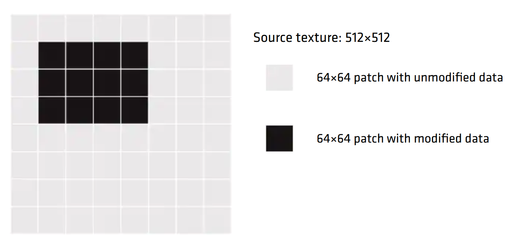

<!-- @page page_techniques_single-pass-downsampler FidelityFX Single Pass Downsampler 2.2 -->

<h1>FidelityFX Single Pass Downsampler 2.2</h1>

FidelityFX Single Pass Downsampler (or "FidelityFX SPD" for short) is a technique which produces downsampled versions of an image without requiring multiple intermediate steps.

<h2>Shading language requirements</h2>

`HLSL` `GLSL` `CS_6_0`

<h2>The technique</h2>

FidelityFX SPD downsamples the input texture with a user-defined 2x2 kernel using LDS for intermediate storage. Optionally, wave operations can be used to share data between threads as additional optimization.

A single thread group downsamples a 64x64 tile of the input texture to 1x1. Afterwards, a global atomic counter is incremented. The thread group will then check the global atomic - if it's equal to the number of tiles, it processes the last tile as before, computing the last 6 MIP levels of the input texture.

The last tile consists of the 1x1 output from all thread groups.

This way it is possible to reduce a 4096x4096 texture to 1x1 in a single dispatch call.


<h3>Inputs</h3>

This section describes the inputs to the FidelityFX SPD technique.

| Input name               | Type                               | Notes                                                                                                                   |
| -------------------------|------------------------------------|-------------------------------------------------------------------------------------------------------------------------|
| **Input texture**        | `2D Texture` or `2D Texture Array` | A resource whose MIP levels need to be generated. Support for both 2D Texture and 2D Texture Array available.          |
| **Constants**            | `Constant buffer`                  | A constant buffer with information about how many MIP levels to generate and which region of the input texture to downsample. |
| **Global Atomic Counter**| `[globallycoherent] RW buffer uint`                   | A global atomic counter per input texture slice. Initialized to 0.                                                      |



<h4>Input texture</h4>

The input texture is either a 2D texture or a cubemap texture mapped as a 2D array. In both cases, only a single pass is dispatched to generate all MIP levels.

The input texture can be accessed in the shader either via sampler or direct load. If the specified kernel computes the average value of a 2x2 quad, using a linear sampler is recommended instead of calculating the average manually. However, load is preferred over point sampling.

The input texture can be part of the output texture array when it is accessed as an unordered access view (UAV) texture. You can also separately bind the input texture, either as UAV or shader resource view (SRV).

<h4>Constants</h4>

If the user chooses to use the static library version of the effect, the constants are automatically generated and FidelityFX SPD will always generate the full MIP chain from scratch.

It is possible to only compute a specified number of MIP levels and to only downsample a subregion of the input texture, if it's known that some areas of the texture are unmodified from the previous frame.

`ffxSpdSetup` is a CPU-side helper function that helps in filling out the constant buffer based on submitted subregion (left, top, width, height) and number of mip levels (specify -1 for MAX).

The constant buffer needs to define the following parameters:

- `mips`: the number of mip levels to compute. Use -1 to let `ffxSpdSetup` calculate the maximum number of MIP levels based on the subregion width and height.

- `numWorkGroups`: the number of dispatched thread groups per slice. Each thread group downsamples a 64x64 tile. `ffxSpdSetup` computes the number of thread groups based on the specified subregion.

- `workGroupOffset`: The offset for the thread groups to process only tiles in a specified subregion. `ffxSpdSetup` helps to compute the correct workGroupOffset.

<h4>Global atomic counter</h4>

FidelityFX SPD expects one global atomic counter (uint) per slice. The counter needs to be initialized to 0. 

FidelityFX SPD will reset the counter's value to 0 at the end of the dispatch. If the memory of the global atomic counter is aliased, it's the application's responsibility to make sure that the counter is set to 0 at the start of the dispatch.

The global atomic counter needs to have the `[globallycoherent]` tag in the shader, because its value needs to be visible to all thread groups.

<h3>Outputs</h3>

This section details the outputs produced by the FidelityFX SPD technique.

| Output name                            | Type                                                                     |  Notes                                                  |
| ---------------------------------------|--------------------------------------------------------------------------|---------------------------------------------------------|
| **Output texture**                     | Array of 2D Textures or a 2D Texture Array                              | The computed MIP levels of the input texture.           |
| **Output texture MIP level 6**         | `[globallycoherent] 2D Texture` or `[globallycoherent] 2D Texture Array` | The 6th MIP level bound with the globally coherent tag. |

<h4>Output texture</h4>

The output texture is an array of 2D Textures or an array of 2D Texture Arrays in the case where FidelityFX SPD downsamples a cube map. 

MIP level 6 of each slice is bound twice - once as part of the array and once separately with the `[globallycoherent]` tag. The shader itself only accesses the separately bound MIP 6 resource. The `[globallycoherent]` tag is necessary, because its content needs to be visible by all thread groups.

<h2>Algorithm structure</h2>

FidelityFX SPD spawns a thread group for every 64x64 tile of the input texture. Each tile is downsampled separately to 1x1, contributing to MIP levels 1-6. MIP level 6 has every pixel computed from a different thread group.

The remaining MIPs are computed by the last active thread group. 

When each thread group has finished downsampling its tile, it increases a global counter and checks if the counter is equal to the number of tiles. If it is not, the thread group terminates. If it is equal, it knows it is the last active thread group and will do the remaining downsampling. This ensures that there is only one inter thread group synchronization in FidelityFX SPD, instead of having one after each MIP level. 

All other synchronizations are within a single thread group. A single thread group shares data between its threads by using LDS and optional wave operations.

<h3>Limitations</h3>

FidelityFX SPD currently only supports a 2x2 kernel and min, max, or mean operations at each MIP level.

In case of an odd dimension, the last row or column will be ommitted. E.g. a resolution of 7x4 produces MIP level of 3x2 with values from the 6x4 subregion. The 7th row is ignored.

This problem can be solved by padding the input texture to a dimension of power of two.
An alternative solution is to pad the input texture to a multiple of 64, and handle the odd resolution cases manually for the MIPs that are computed by the last remaining thread group. These MIPs are all computed after the global counter has been evaluated.

<h2>Integration guidelines</h2>

The user has some options to set, which can have an impact on performance.

<h3>Flags</h3>

`FfxSpdInitializationFlagBits` or via defines in the shader code for native integration.

<h4>Wave operations</h4>

By default, FidelityFX SPD will use wave operations and group shared memory (LDS) to share data between threads of a single thread group. If wave operations are not supported, set the `FFX_SPD_OPTION_WAVE_INTEROP_LDS` flag to tell SPD to only use LDS. This define can have an impact on performance.

<h4>Half types</h4>

FidelityFX SPD supports half types. If 16 bit is enough precision, it is recommend to set the `FFX_SPD_MATH_PACKED` flag.

<h4>Sampler</h4>

FidelityFX SPD supports accessing the input texture via a linear sampler or via texture loads. It is recommended to use loads, unless you can use the linear sampler. Set the `FFX_SPD_SAMPLER_LINEAR` flag to sample the input texture.

<h3>Group shared memory (LDS)</h3>

FidelityFX SPD uses group shared memory to share data between threads of a single thread group. The amount of needed shared group memory depends on whether half types are used or not.

Group shared memory can be defined with float4:

```HLSL
float4 spdIntermediate[16][16];
```

or separately with float:

```HLSL
float spdIntermediateR[16][16];
float spdIntermediateG[16][16];
float spdIntermediateB[16][16];
float spdIntermediateA[16][16];
```

For half types, use:

```HLSL
min16float4 spdIntermediate[16][16];
```

or

```HLSL
min16float2 spdIntermediateRG[16][16];
min16float2 spdIntermediateBA[16][16];
```

You also need to define a counter in group shared memory. This counter is used to store the return value of the atomic add, so that each thread can determine whether it needs to terminate or continue.

<h3>Callback functions</h3>

FidelityFX SPD requires the following callback functions defined ([H] versions if FidelityFX SPD should work with half types):

<h4>SpdLoadSourceImage[H]</h4>

Either samples or loads from the input texture for a given UV and slice.

<h4>SpdLoad[H]</h4>

Loads from separately bound MIP level 6 resource with the `[globallycoherent]` tag for a given UV and slice. This function is only used by the last active thread group.

<h4>SpdStore[H]</h4>

Stores the output to the MIP levels. If mip value is 5, the output needs to be stored to the separately bound MIP level 6 resource with the `[globallycoherent]` tag.

<h4>SpdIncreaseAtomicCounter</h4>

Increments the global atomic counter. We have one counter per slice. The atomic add returns the previous value, which needs to be stored to shared memory, since only thread 0 calls the atomic add. This way, the previous value is accessible by all threads in the thread group and can be used by each thread to determine whether they should terminate or continue.

<h4>SpdGetAtomicCounter</h4>

Reads the value of the global atomic counter that was stored in shared memory.

<h4>SpdResetAtomicCounter</h4>

Resets the global atomic counter for the given slice back to 0.

<h4>SpdReduce4[H]</h4>

The 2x2 -> 1 reduction kernel that is user specified. Common reduction functions are min, max or the average.

<h4>SpdLoadIntermediate[H]</h4>

Loads from the group shared buffer.

<h4>SpdStoreIntermediate[H]</h4>

Stores to the group shared buffer.

<h3>Main function</h3>

`SpdDownsample[H]` is called in the main function. The thread group size is
`[numthreads(256,1,1)]`.

Example CSMain

```HLSL
[numthreads(256, 1, 1)]
void main(
	  uint3 WorkGroupId      : SV_GroupID
	, uint  LocalThreadId    : SV_GroupIndex
)
{
#if FFX_HALF
    SpdDownsampleH(WorkGroupId.xy, LocalThreadId, Mips(), NumWorkGroups(), WorkGroupId.z, WorkGroupOffset());
#else
    SpdDownsample(WorkGroupId.xy, LocalThreadId, Mips(), NumWorkGroups(), WorkGroupId.z, WorkGroupOffset());
#endif // FFX_HALF
}
```

<h3>Example C++</h3>

Via static lib:
```C++
FfxSpdDispatchDescription dispatchParameters = {};
dispatchParameters.commandList = ffxGetCommandList(pCmdList);
dispatchParameters.resource    = ffxGetResource(m_pCubeTexture->GetResource(), L"SPD_Downsample_Resource", FFX_RESOURCE_STATE_PIXEL_COMPUTE_READ);

FfxErrorCode errorCode = ffxSpdContextDispatch(&m_SPDContext, &dispatchParameters);
FFX_ASSERT(errorCode == FFX_OK);
```

Native integration:
```C++
ffxSpdSetup(dispatchThreadGroupCountXY, workGroupOffset, numWorkGroupsAndMips, rectInfo);

// downsample
uint32_t dispatchX = dispatchThreadGroupCountXY[0];
uint32_t dispatchY = dispatchThreadGroupCountXY[1];
uint32_t dispatchZ = m_cubeTexture.GetArraySize();

SpdConstants constants;
constants.numWorkGroupsPerSlice = numWorkGroupsAndMips[0];
constants.mips = numWorkGroupsAndMips[1];
constants.workGroupOffset[0] = workGroupOffset[0];
constants.workGroupOffset[1] = workGroupOffset[1];

...

// Dispatch
//
pCommandList->Dispatch(dispatchX, dispatchY, dispatchZ);
```

<h2>See also</h2>

- [FidelityFX Single Pass Downsampler](../samples/single-pass-downsampler.md)
- [FidelityFX Naming guidelines](../getting-started/naming-guidelines.md)
