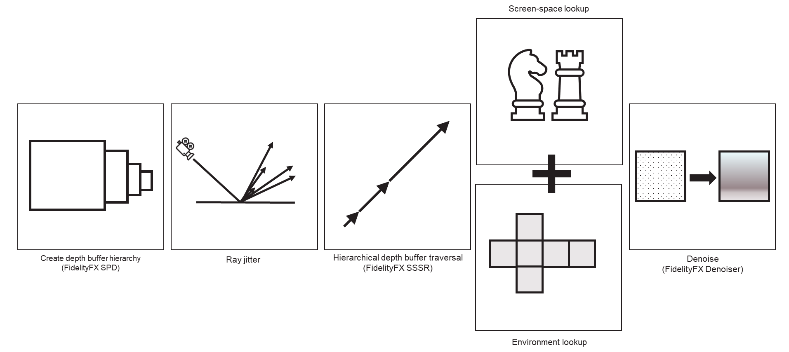
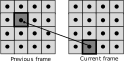

<!-- @page page_techniques_stochastic-screen-space-reflections FidelityFX Stochastic Screen-Space Reflections 1.5 -->

<h1>FidelityFX Stochastic Screen-Space Reflections 1.5</h1>


AMD FidelityFX Stochastic Screen Space Reflections (SSSR) is a highly optimized hierarchical screen space traversal kernel for reflections. To support glossy reflections, the ray directions are randomly jittered and the result is denoised to provide a temporally and spatially stable image

<h2>Table of contents</h2>

- [Introduction](#introduction)
	- [Supported platforms](#supported-platforms)
    - [Shading language requirements](#shading-language-requirements)
- [Quick start checklist](#quick-start-checklist)
- [Integration guidelines](#integration-guidelines)
    - [Input resources](#input-resources)
    - [Depth buffer configurations](#depth-buffer-configurations)
    - [Providing motion vectors](#providing-motion-vectors)
    - [Host API](#host-api)
- [The technique](#the-technique)
    - [Algorithm structure](#algorithm-structure)
    - [Hierarchical depth generation](#hierarchical-depth-generation)
    - [Tile Classification](#tile-classification)
    - [Blue noise texture generation](#blue-noise-texture-generation)
    - [Indirect arguments generation](#indirect-arguments-generation)
    - [Intersection](#intersection)
    - [Denoising pass](#denoising-pass)
- [Building the sample](#building-the-sample)
- [Version history](#version-history)
- [Further reading](#further-reading)


<h2>Introduction</h2>

**FidelityFX Stochastic Screen-Space Reflections** (or **SSSR** for short) is a technique which aims to produce high-quality screen-space reflections without the need to render additional reflection geometry passes and shading passes.

At its core, the algorithm uses a cutting-edge, hierarchical depth buffer traversal kernel that ray marches through a depth surface - originally rendered from the point of view of the main camera - and processes the results into a signal which can be composited as a reflection. SSSR accounts for the roughness of the surface, which contains the reflections. By analysing the roughness, SSSR can adjust the traversal rate from full-rate for mirror reflections, all the way down to quarter-rate for more glossy reflections.



<h2>Supported platforms</h2>

This release of FidelityFX Stochastic Screen-Space Reflections supports the following platforms:

- Windows 10+
  - DirectX® 12
  - Vulkan® 1.x

<h2>Shading language and API requirements</h2>

<h3>DirectX 12 + HLSL</h3>

- `HLSL`
  - `CS_6_2`
  - `CS_6_6†`

† `CS_6_6` is used on some hardware which supports 64-wide wavefronts.

<h3>Vulkan + GLSL</h3>

- Vulkan 1.x

- `GLSL 4.50` with the following extensions
  - `GL_EXT_samplerless_texture_functions`
  - `GL_KHR_shader_subgroup_basic` (controlled by `FFX_WAVE`)
  - `GL_KHR_shader_subgroup_ballot` (controlled by `FFX_WAVE`)
  - `GL_KHR_shader_subgroup_shuffle` (controlled by `FFX_WAVE`)


Note that the GLSL compiler must also support `GL_GOOGLE_include_directive` for `#include` handling used throughout the GLSL shader system.

<h2>Quick start checklist</h2>

To use SSSR you should follow the steps below:

1. Generate Visual Studio solution:

    ```bash
    > <installation path>\BuildSamplesSolution.bat
    ```
	
	The batch file will inquire if the solution should build the SDK as a DLL (builds as a statically linked library if no ('n') is provided) and which samples should be included. Please use '1' to build a solution with all samples included or '15' to only include the SSSR sample.
  
    This will generate a `build\` directory where you will find the solution for the SDK samples (`FidelityFX SDK Samples.sln`).

2. Go to the `build` directory, open the `FidelityFX SDK Samples.sln` solution and build the solution matching your API.

3. Copy the API libraries `ffx_sssr_x64.lib` and `ffx_denoiser_x64.lib` from `bin/ffx_sdk` into the folder containing a folder in your project which contains third-party libraries.

4. Copy the library matching the sdk backend you want to use, e.g.: `bin/ffx_sdk/ffx_backend_dx12_x64.lib` for DirectX 12.

5. Copy the following core API header files from [`sdk/include/FidelityFX/`](../../sdk/include/FidelityFX/) into your project: [`host/ffx_sssr.h`](../../sdk/include/FidelityFX/host/ffx_sssr.h), [`host/ffx_types.h`](../../sdk/include/FidelityFX/host/ffx_types.h), [`host/ffx_error.h`](../../sdk/include/FidelityFX/host/ffx_error.h), [`host/ffx_util.h`](../../sdk/include/FidelityFX/host/ffx_util.h), [`gpu/sssr/ffx_sssr_common.h`](../../sdk/include/FidelityFX/gpu/sssr/ffx_sssr_common.h) and [`gpu/sssr/ffx_sssr_resources.h`](../../sdk/include/FidelityFX/gpu/sssr/ffx_sssr_resources.h). Care should be taken to maintain the relative directory structure at the destination of the file copying.

6. Copy the header files for the API backend of your choice, e.g. for DirectX 12 you would copy [`host/backends/dx12/ffx_dx12.h`](../../sdk/include/FidelityFX/host/backends/dx12/ffx_dx12.h). Care should be taken to maintain the relative directory structure at the destination of the file copying.

7. Include the [`host/ffx_sssr.h`](../../sdk/include/FidelityFX/host/ffx_sssr.h) header file in your codebase where you wish to interact with SSSR.

8. Create a backend for your target API. E.g. for DirectX 12 you should call `ffxGetInterfaceDX12`. A scratch buffer should be allocated of the size returned by calling `ffxGetScratchMemorySizeDX12` and the pointer to that buffer passed to `ffxGetInterfaceDX12`.

9. Create a SSSR context by calling `ffxSssrContextCreate`. The parameters structure should be filled out matching the configuration of your application. See the API reference documentation for more details.

10. Each frame you should call `ffxSssrContextDispatch` to launch SSSR workloads. The parameters structure should be filled out matching the configuration of your application. See the API reference documentation for more details.

11. When your application is terminating (or you wish to destroy the context for another reason) you should call `ffxSssrContextDestroy`. The GPU should be idle before calling this function.

<h2>Integration guidelines</h2>

<h3>Input resources</h3>

The following table enumerates all external inputs required by either SSSR or the FidelityFX Denoiser.

All resources are from the current rendered frame, for DirectX 12 and Vulkan applications all input resources should be transitioned to [`D3D12_RESOURCE_STATE_NON_PIXEL_SHADER_RESOURCE`](https://docs.microsoft.com/en-us/windows/win32/api/d3d12/ne-d3d12-d3d12_resource_states) and [`VK_IMAGE_LAYOUT_SHADER_READ_ONLY_OPTIMAL`](https://www.khronos.org/registry/vulkan/specs/1.3-extensions/man/html/VkImageLayout.html) respectively before calling `ffxSssrContextDispatch`.


| Name            					|  Format                            | Type      		| Notes                                          |  
| --------------------------|------------------------------------|-----------		|------------------------------------------------|
| Color buffer    					| `APPLICATION SPECIFIED`            | Texture   		| The HDR render target of the current frame containing the scene lighted with direct lighting only. SSSR takes care of indirect lighting, including environment map / probe sampling fallback. |
| Depth buffer    					| `APPLICATION SPECIFIED (1x FLOAT)` | Texture   		| The depth buffer for the current frame provided by the application. The data should be provided as a single floating point value, the precision of which is under the application's control. The configuration of the depth should be communicated to SSSR via the `flags` field of the `FfxSssrContextDescription` structure when creating the `FfxSssrContext`. You should set the `FFX_SSSR_ENABLE_DEPTH_INVERTED` flag if your depth buffer is inverted (that is [1..0] range). |
| Normal buffer   					| `APPLICATION SPECIFIED (3x FLOAT)` | Texture   		| The normal buffer for the current frame provided by the application in the [-1, 1] range. If your application stores normal vectors with a different range, you may use the `normalUnPackMul` and `normalUnPackAdd` fields of the `FfxSssrDispatchDescription` structure to adjust them to match the expected range for SSSR. The following formula will be used to convert the gbuffer normal by SSSR `normal = gbufferNormal * normalUnPackMul + normalUnPackAdd;`.|
| Material parameters buffer| `APPLICATION SPECIFIED (1x FLOAT)` | Texture   		| The roughness buffer for the current frame provided by the application. By default, SSSR expects the roughness to be the perceptual / artist set roughness **squared**. If your Gbuffer stores the artist set roughness directly, please set the `isRoughnessPerceptual` field of the `FfxSssrDispatchDescription` structure to `true`. The user is also expected to provide a channel to sample from the material parameters buffer through the `roughnessChannel` field of the `FfxSssrDispatchDescription` structure. |
| Motion vectors  					| `APPLICATION SPECIFIED (2x FLOAT)` | Texture   		| The 2D motion vectors for the current frame provided by the application in the [-0.5, 0.5] range, +Y is top-down. If your application renders motion vectors with a different range, you may use the `motionVectorScale` field of the `FfxSssrDispatchDescription` structure to adjust them to match the expected range for SSSR. |
| Environment Map  					| `APPLICATION SPECIFIED (3x FLOAT)` | TextureCube 	| A texture cube used as a fallback when the surface to be shaded is rougher than a certain threshold or the screen space ray doesn't hit the Color Buffer. |
| BRDF LUT 			   					| `APPLICATION SPECIFIED (2x FLOAT)` | Texture   		| The BRDF look up table to be used in conjunction with the prefiltered environment map used as fallback. |
| Reflections Target        | `APPLICATION SPECIFIED (3x FLOAT)` | Texture      | The surface to write the output of the SSSR algorithm to; it has to be cleared prior to rendering. This reflections buffer can then be composited on top of any other surface by the application in a later pass. ( See the apply_reflections shader in the sample ) |


<h3>Depth buffer configurations</h3>

An application should inform the SSSR API of its depth buffer configuration by setting the appropriate flags during the creation of the `FfxSssrContext`. The table below contains the appropriate flags.

| SSSR flag                        | Note                                                                                       |
|----------------------------------|--------------------------------------------------------------------------------------------|
| `FFX_SSSR_ENABLE_DEPTH_INVERTED` | A bit indicating that the input depth buffer data provided is inverted, as in the [1..0] range.           |


<h3>Providing motion vectors</h3>

<h4>Space</h4>

The SSSR algorithm in itself doesn't require the use of motion vectors as it is not a temporal algorithm. However, in order to get temporally and spatially stable reflections, the FidelityFX Reflections Denoiser is used on the output of the SSSR algorithm.  A key part of a temporal algorithm is the provision of motion vectors. The FidelityFX Reflections Denoiser accepts motion vectors in 2D which encode the motion from a pixel in the current frame to the position of that same pixel in the previous frame. The algorithm expects that motion vectors are provided by the application in the [-0.5, 0.5] range, +Y is top-down.



If your application computes motion vectors in another space - for example normalized device coordinate space - then you may use the `motionVectorScale` field of the `FfxSssrDispatchDescription` structure to instruct SSSR to adjust them to match the expected range for the denoiser. The code examples below illustrate how motion vectors may be scaled to screen space. The example HLSL and C++ code below illustrates how NDC-space motion vectors can be scaled using the SSSR host API.

```HLSL
// GPU: Example of application NDC motion vector computation
float2 motionVector = (currentPosition.xy / currentPosition.w) - (previousPosition.xy / previousPosition.w);

// CPU: Matching SSSR motionVectorScale configuration
dispatchParameters.motionVectorScale.x =  0.5f; // Texture space is [0, 1] while NDC is [-1, 1]
dispatchParameters.motionVectorScale.y = -0.5f; // +Y is top down
```

<h3>Host API</h3>
While it is possible to generate the appropriate intermediate resources, compile the shader code, set the bindings, and submit the dispatches, it is much easier to use the SSSR host API which is provided.

To use to the API, you should link the SSSR libraries (more on which ones shortly) and include the following header files from `sdk/include/FidelityFX/host`:

```cpp
ffx_assert.h
ffx_error.h
ffx_sssr_.h
ffx_types.h
ffx_util.h
```

To use the SSSR API, you should link `ffx_sssr_x64.lib` and `ffx_denoiser_x64.lib` from the `sdk/bin/ffx_sdk` folder which will provide the symbols for the application-facing APIs. However, the SDK's API has a modular backend, which means that different graphics APIs and platforms may be targeted through the use of a matching backend. Therefore, you should further include the backend lib matching your requirements, referencing the table below.

| Target              | Library name            |
|---------------------|-------------------------|
| DirectX(R)12        | `ffx_backend_dx12_x64.lib` |
| Vulkan(R)           | `ffx_backend_vk_x64.lib`   | 

> Please note the modular architecture of the SDK API allows for custom backends to be implemented. See the [Modular backend](https://github.com/GPUOpen-Effects/FidelityFX-FSR2#modular-backend) section in the FSR2 documentation for more details.

To begin using the API, the application should first create a `FfxSssrContext` structure. This structure should be located somewhere with a lifetime approximately matching that of your backbuffer; somewhere on the application's heap is usually a good choice. By calling `ffxSssrContextCreate` the `FfxSssrContext` structure will be populated with the data it requires. Moreover, a number of calls will be made from `ffxSssrContextCreate` to the backend which is provided to `FfxSssrContext` as part of the `FfxSssrContextDescription` structure. These calls will perform such tasks as creating intermediate resources required by SSSR and setting up shaders and their associated pipeline state. The SSSR API does not perform any dynamic memory allocation.

`ffxSssrContextDispatch` should be called each frame. This function accepts the `FfxSssrContext` structure that was created earlier in the application's lifetime as well as a description of the inputs and parameters to be used to compute screen space reflections. This description is provided by the application filling out a `FfxSssrDispatchDescription` structure.

Destroying the context is performed by calling `ffxSssrContextDestroy`. Please note, that the GPU should be idle before attempting to call `ffxSssrContextDestroy`, and the function does not perform implicit synchronization to ensure that resources being accessed by SSSR are not currently in flight. The reason for this choice is to avoid SSSR introducing additional GPU flushes for applications who already perform adequate synchronization at the point where they might wish to destroy the `FfxSssrContext`, this allows an application to perform the most efficient possible creation and teardown of the SSSR API when required.


<h2>The technique</h2>

<h3>Algorithm structure</h3>

The SSSR algorithm is implemented in a series of stages, which are as follows:

1. Hierarchical depth generation
2. Tile classification
3. Blue noise texture generation
4. Indirect arguments generation
5. Intersection
6. Denoising

<h4>Hierarchical depth generation</h4>

The hierarchical depth generation pass makes use of the [FidelityFX Single Pass Downsampler](../techniques/single-pass-downsampler.md) (SPD) to generate a pyramid of mip maps from the scene depth provided by the application. This hierarchical depth buffer is used by SSSR to accelerate the raymarching when the algorithm detects that a coarser mip can be used. 

<h5>Resource inputs</h5>

The following table contains all resources consumed by the [Hierarchical depth generation](#hierarchical-depth-generation) stage.

| Name                      |  Format                            | Type         | Notes                                          | 
| --------------------------|------------------------------------|-----------   |------------------------------------------------| 
| Depth buffer              | `APPLICATION SPECIFIED (1x FLOAT)` | Texture      | The depth buffer for the current frame provided by the application. The data should be provided as a single floating point value, the precision of which is under the application's control. The configuration of the depth should be communicated to SSSR via the `flags` field of the `FfxSssrContextDescription` structure when creating the `FfxSssrContext`. You should set the `FFX_SSSR_ENABLE_DEPTH_INVERTED` flag if your depth buffer is inverted (that is [1..0] range). |


<h5>Resource outputs</h5>

The following table contains all resources produced or modified by the [Hierarchical depth generation](#hierarchical-depth-generation) stage.

| Name                      |  Format                            | Type         | Notes                                          | 
| --------------------------|------------------------------------|-----------   |------------------------------------------------| 
| Depth Hierarchy           | `FFX_SURFACE_FORMAT_R32_FLOAT`     | Texture      | A pyramid of 7 mip maps generated from the scene input depth. |

<h4>Tile classification</h4>

The tile classification pass scans the scene to detect which pixels require shooting rays and applying denoising. For the pixels that are too rough and don't require raymarching it will evaluate lighting using the fallback environment map provided. Finally, this pass also extracts the roughness from the material parameters texture to use in the next passes.

<h5>Resource inputs</h5>

The following table contains all resources consumed by the [Tile Classification](#tile-classification) stage.

| Name                      |  Format                            | Type         | Notes                                          |  
| --------------------------|------------------------------------|-----------   |------------------------------------------------|
| Normal buffer             | `APPLICATION SPECIFIED (3x FLOAT)` | Texture      | The normal buffer for the current frame provided by the application in the [-1, 1] range. If your application stores normal vectors with a different range, you may use the `normalUnPackMul` and `normalUnPackAdd` fields of the `FfxSssrDispatchDescription` structure to adjust them to match the expected range for SSSR. The following formula will be used to convert the gbuffer normal by SSSR `normal = gbufferNormal * normalUnPackMul + normalUnPackAdd;`.|
| Material parameters buffer| `APPLICATION SPECIFIED (1x FLOAT)` | Texture      | The roughness buffer for the current frame provided by the application. By default, SSSR expects the roughness to be the perceptual / artist set roughness **squared**. If your Gbuffer stores the artist set roughness directly, please set the `isRoughnessPerceptual` field of the `FfxSssrContextDescription` structure to `true`. The user is also expected to provide a channel to sample from the material parameters buffer through the `roughnessChannel` field of the `FfxSssrContextDescription` structure. |
| Environment Map           | `APPLICATION SPECIFIED (3x FLOAT)` | TextureCube  | A texture cube used as a fallback when the surface to be shaded is rougher than the `roughnessThreshold` field of the `FfxSssrDispatchDescription` structure. |
| Depth Hierarchy           | `FFX_SURFACE_FORMAT_R32_FLOAT`     | Texture      | A pyramid of 7 mip maps generated from the scene input depth. |
| Variance history buffer   | `FFX_SURFACE_FORMAT_R16_FLOAT`     | Texture      | The variance of the luminance buffer generated by the previous frame. The values sampled from this buffer are compared to the value of the `varianceThreshold` field of the `FfxSssrDispatchDescription` structure to determine whether we need to shoot a ray for the current pixel or not. |


<h5>Resource outputs</h5>

The following table contains all resources produced or modified by the [Tile Classification](#tile-classification) stage.

| Name                      |  Format                                   | Type         | Notes                                          | 
| --------------------------|-------------------------------------------|-----------   |------------------------------------------------| 
| Radiance Buffer           | `FFX_SURFACE_FORMAT_R16G16B16A16_FLOAT`   | Texture      | A texture containing the radiance from the fallback environment probe for pixels which roughness is greater than the `roughnessThreshold` field of the `FfxSssrDispatchDescription` structure. Pixels below that threshold will be initialized to 0. |
| Ray List                  | `FFX_SURFACE_FORMAT_R32_UINT`             | Buffer       | A buffer to store the list of rays to shoot in the intersection pass. The field `samplesPerQuad` of the `FfxSssrDispatchDescription` structure controls the minimum number of rays shot per quad and thus the number of rays stored in the ray list. If the field `temporalVarianceGuidedTracingEnabled` of the `FfxSssrDispatchDescription` structure is set to `true`, the number of rays shot per quad will be dynamically evaluated. If the variance of the previous frame's luminance exceeds the `varianceThreshold` field of the `FfxSssrDispatchDescription` structure, a ray will be stored in the buffer. |
| Denoiser Tile List        | `FFX_SURFACE_FORMAT_R32_UINT`             | Buffer       | A buffer containing the list of tiles to be passed to the denoiser. Each tile is 8x8 pixels and identified by its top-left corner thread id. `(group_thread_id.x == 0) && (group_thread_id.y == 0)` |
| Ray Counter               | `FFX_SURFACE_FORMAT_R8_UNORM`             | Buffer       | An atomic buffer used to store the number of rays to be shot in the [Intersection](#intersection) pass along with the number of tiles to be denoised by the denoiser. |
| Extracted Roughness       | `FFX_SURFACE_FORMAT_R8_UNORM`             | Texture      | A texture containing the roughness extracted from the material parameters buffer, see inputs |

<h5>Description</h5>

The [Tile Classification](#tile-classification) stage is implemented in a fullscreen compute pass. For each pixel, we decide whether a ray needs to be shot based on multiple parameters and store that ray in a buffer.

If the surface's roughness is greater than the `roughnessThreshold` parameter, the classifier will not store a ray for this pixel. Instead, it will simply evaluate the fallback environment map provided as input and store that value in the radiance buffer. By default, not every pixel in a quad will shoot a ray. The minimum number of rays shot per pixel is controlled by the `samplesPerQuad` parameter. If this parameter is set to lower than 4, we encode within the ray data which neighbor pixels should copy the result over. Setting the parameter `temporalVarianceGuidedTracingEnabled` to `true` lets the tile classifier dynamically increase the number of rays per quad up to 4 based on the luminance of the previous frame. If the variance of the luminance stored in the variance history buffer is greater than the `varianceThreshold` parameter, then a ray is stored for this pixel.

This pass also determines which pixels will require denoising and stores this information in tiles of 64 in the denoiser tile list. Every pixel will use denoising unless the surface is perfectly smooth (mirror-like). This is especially useful for the pixels that did not shoot a ray but instead were tagged to copy the result from a neighboring pixel. 

The ray counter buffer stores the number of rays to be shot by the [Intersection](#intersection) pass and the number of tiles to pass to the denoiser.

<h4>Blue noise texture generation</h4>

The blue noise texture generation stage generates a 128x128 blue noise texture every frame based on the frame index and some precomputed textures. 

<h5>Resource inputs</h5>

The following table contains all resources consumed by the [Blue noise texture generation](#blue-noise-texture-generation) stage.

| Name                      |  Format                            | Type         | Notes                                          |  
| --------------------------|------------------------------------|-----------   |------------------------------------------------|
| Sobol Buffer              | `FFX_SURFACE_FORMAT_R32_UINT`      | Texture      | A 256x256 precomputed texture used to generate the blue noise texture. |
| Scrambling Tile buffer    | `FFX_SURFACE_FORMAT_R32_UINT`      | Texture      | A 512 x 256 precomputed texture used to generate the blue noise texture. |


<h5>Resource outputs</h5>

The following table contains all resources produced or modified by the [Blue noise texture generation](#blue-noise-texture-generation) stage.

| Name                      |  Format                                   | Type       | Notes                                          | 
| --------------------------|-------------------------------------------|----------- |------------------------------------------------| 
| Blue noise texture        | `FFX_SURFACE_FORMAT_R8G8_UNORM`           | Texture    | A 128x128 blue noise texture used for ray generation in a later pass |

<h4>Indirect arguments generation</h4>

The indirect argument generation pass makes use of the ray counter buffer filled by the [Tile Classification](#tile-classification) stage to generate indirect dispatch arguments for the [Intersection Pass](intersection-pass) and the Denoising pass.

<h5>Resource inputs</h5>

The following table contains all resources consumed by the [Indirect arguments generation](#indirect-arguments-generation) stage.

| Name                      |  Format                            | Type         | Notes                                          |  
| --------------------------|------------------------------------|-----------   |------------------------------------------------|
| Ray Counter               | `FFX_SURFACE_FORMAT_R8_UNORM`      | Buffer      | An atomic buffer used to store the number of rays to be shot in the [Intersection](#intersection) pass along with the number of tiles to be denoised by the denoiser. |

<h5>Resource outputs</h5>

The following table contains all resources produced or modified by the [Indirect arguments generation](#indirect-arguments-generation) stage.

| Name                      |  Format                                   | Type      | Notes                                          | 
| --------------------------|-------------------------------------------|-----------|------------------------------------------------| 
| Indirect Arguments        | `FFX_SURFACE_FORMAT_R8_UNORM`             | Buffer    | A buffer containing the indirect dispatch arguments for the [Intersection](#intersection) pass and the denoiser passes. |

<h4>Intersection pass</h4>

The intersection pass does the actual depth buffer ray marching and radiance evaluation. This is the last pass of the algorithm pre-denoising and it outputs the reflections buffer to be composited on top of the direct lighting by the app.

<h5>Resource inputs</h5>

The following table contains all resources consumed by the [Intersection](#intersection) stage.

| Name                      |  Format                            | Type         | Notes                                          |  
| --------------------------|------------------------------------|--------------|------------------------------------------------|
| Color buffer              | `APPLICATION SPECIFIED`            | Texture      | The HDR render target of the current frame containing the scene lighted with direct lighting only. SSSR takes care of indirect lighting, including environment map / probe sampling fallback. |
| Normal buffer             | `APPLICATION SPECIFIED (3x FLOAT)` | Texture      | The normal buffer for the current frame provided by the application in the [-1, 1] range. If your application stores normal vectors with a different range, you may use the `normalUnPackMul` and `normalUnPackAdd` fields of the `FfxSssrDispatchDescription` structure to adjust them to match the expected range for SSSR. The following formula will be used to convert the gbuffer normal by SSSR `normal = gbufferNormal * normalUnPackMul + normalUnPackAdd;`.|
| Environment Map           | `APPLICATION SPECIFIED (3x FLOAT)` | TextureCube  | A texture cube used as a fallback when the intersection fails. |
| Depth Hierarchy           | `FFX_SURFACE_FORMAT_R32_FLOAT`     | Texture      | A pyramid of 7 mip maps generated from the scene input depth. |
| Extracted Roughness       | `FFX_SURFACE_FORMAT_R8_UNORM`      | Texture      | A texture containing the roughness extracted from the material parameters buffer. |
| Blue noise texture        | `FFX_SURFACE_FORMAT_R8G8_UNORM`    | Texture      | A 128x128 blue noise texture used to randomize ray generation. |

<h5>Resource outputs</h5>

The following table contains all resources produced or modified by the [Intersection](#intersection) stage.

| Name                      |  Format                                   | Type         | Notes                                          | 
| --------------------------|-------------------------------------------|-----------   |------------------------------------------------| 
| Radiance Buffer           | `FFX_SURFACE_FORMAT_R16G16B16A16_FLOAT`   | Texture      | A texture containing the result of the stochastic screen space reflection.  |
| Ray List                  | `FFX_SURFACE_FORMAT_R32_UINT`             | Buffer       | A buffer containing the list of rays to shoot filled by the [Tile Classification](#tile-classification) pass. |
| Ray Counter               | `FFX_SURFACE_FORMAT_R8_UNORM`             | Buffer       | A buffer containing the number of rays to be shot. |

<h5>Description</h5>

The [Intersection](#intersection) stage is implemented as an indirect dispatch call, spawning one thread per ray. Each thread recovers the coordinates of the pixel to shoot a ray from and whether the result of that query should be copied over to some neighbors. The actual ray is then generated by importance sampling the GGX normal distribution, using a random seed from blue noise texture generated in a previous pass.

Next step is the raymarching across the hierarchical depth buffer. We first sample the depth buffer at the current mip level and use that value to generate a safe region for which we can ray march without intersecting the geometry. If the xy boundary is hit, we can keep going using a coarser mip level. On the other hand, if the z boundary is crossed, we should move to a more detailed mip. Once the most detailed mip has been reached, the algorithm stops.

Finally, once a hit is found, it is evaluated and given a confidence level. This level is used to interpolate between the ray marching result and a sample from the environment map ensuring a smooth transition at the edges.

<h4>Denoising pass</h4>

See the [FidelityFX Reflections Denoiser](../techniques/denoiser.md) page. 

<h2>Building the sample</h2>

<h3>Prerequisites</h3>

To build the SSSR sample, please follow the following instructions:

1) Install the following tools:

  - [CMake 3.16](https://cmake.org/download/)
  - Install the "Desktop Development with C++" workload
  - [Visual Studio 2019](https://visualstudio.microsoft.com/downloads/)
  - [Windows 10 SDK 10.0.18362.0](https://developer.microsoft.com/en-us/windows/downloads/windows-10-sdk)
  - [Git 2.32.0](https://git-scm.com/downloads)
  - [Vulkan SDK](https://www.lunarg.com/vulkan-sdk/)

2) Generate Visual Studio solution:

    ```bash
    > <installation path>\BuildSamplesSolution.bat
    ```
	
	The batch file will inquire if the solution should build the SDK as a DLL (builds as a statically linked library if no ('n') is provided) and which samples should be included. Please use '1' to build a solution with all samples included or provide the list of samples to be included (using the corresponding number of the samples with spaces in between).
  
    This will generate a `build\` directory where you will find the solution for the SDK samples (`FidelityFX SDK Samples.sln`).

3) Open the solution from the `build` directory, compile and run.


<h2>Version history</h2>

| Version        | Date              | Notes                                | 
| ---------------|-------------------|--------------------------------------|
| **1.0**        | 2020-05-11        | Initial release of FidelityFX SSSR.  |
| **1.1.0**      | 2020-08-28        | Vulkan Support                       |
| **1.2.0**      | 2020-11-24        | Extracted Denoiser to its own library|
| **1.2.1**      | 2022-09-05        | Fixed issue with Vulkan              |
| **1.3.0**      | 2021-09-05        | Update to support hybrid tracing.    |
| **1.4.0**      | 2023-05-26        | FidelityFX SDK release of SSSR       |

<h2>Further reading</h2>

<h3>References</h3>

- Frostbite presentations on Stochastic Screen Space Reflections - https://www.ea.com/frostbite/news/stochastic-screen-space-reflections
- EA Seed presentation on Hybrid Real-Time Rendering - https://www.ea.com/seed/news/seed-dd18-presentation-slides-raytracing
- Eric Heitz' paper on VNDF - http://jcgt.org/published/0007/04/01/
- Eric Heitz' paper on Blue Noise sampling - https://eheitzresearch.wordpress.com/762-2/

<h3>See also</h3>

- [FidelityFX Stochastic Screen Space Reflections](../samples/stochastic-screen-space-reflections.md)
- [FidelityFX Single Pass Downsampler](../samples/single-pass-downsampler.md)
- [FidelityFX Reflections Denoiser](../techniques/denoiser.md)
- [FidelityFX Naming guidelines](../getting-started/naming-guidelines.md)
