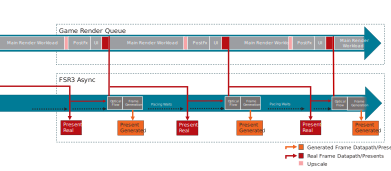
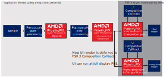
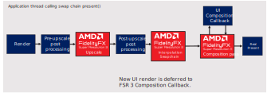
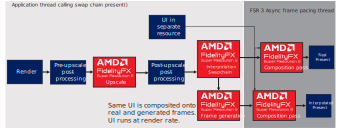
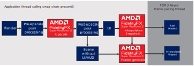

<!-- @page page_techniques_super-resolution-interpolation FidelityFX Super Resolution 3.1.3 -->

<h1>FidelityFX Super Resolution 3.1.3 (FSR3) - Upscaling and Frame Generation</h1>


<h2>Table of contents</h2>

- [FidelityFX Super Resolution 3.1.0 (FSR3)](#fidelityfx-super-resolution-303-fsr3)
  - [Table of contents](#table-of-contents)
  - [Introduction](#introduction)
  - [Integration guidelines](#integration-guidelines)
    - [Shading language and API requirements](#shading-language-and-api-requirements)
      - [DirectX 12 + HLSL](#directx-12--hlsl)
      - [Vulkan + GLSL](#vulkan--glsl)
    - [Quick start checklist](#quick-start-checklist)
    - [Walkthrough](#walkthrough)
      - [Add upscaling through FSR3 interface](#add-upscaling-through-fsr3-interface)
      - [Enable FSR3's proxy frame interpolation swapchain](#enable-fsr3-s-proxy-frame-interpolation-swapchain)
      - [Dispatch Upscaling](#dispatch-upscaling)
      - [Configure frame interpolation](#configure-frame-interpolation)
      - [UI composition](#ui-composition)
      - [Shutdown](#shutdown)
    - [Thread Safety](#thread-safety)
    - [Resource Lifetime](#resource-lifetime)
  - [The Technique](#the-technique)
  - [Memory Usage](#memory-usage)
  - [See also](#see-also)

<h2>Introduction</h2>

AMD FidelityFX Super Resolution 3 (FSR3) combines resolution upscaling with frame generation.

It uses new and improved temporal upscaling, along with a new optical flow implementation to reproject samples from 2 rendered frames to generate an additional frame in between. FSR3 also implements swapchain proxies, which are used to schedule interpolation workloads and handle frame pacing for DirectX 12 and Vulkan.


<h2>Integration guidelines</h2>

<h3>Shading language and API requirements</h3>

<h4>DirectX 12</h4>

- `CS_6_2`
- `CS_6_6†` is used on some hardware which supports 64-wide wavefronts.

<h4>Vulkan</h4>

- Vulkan 1.x

While this document is based on DX12, a Vulkan implementation is available through the Vulkan FidelityFX API.
A reference integration can be seen in the [FSR sample](/samples/fsrapi/fsrapirendermodule.cpp).

<h4>Quick start checklist</h4>

* Integrate using the new FidelityFX API using the single FidelityFX DLL, prebuilt and signed by AMD.
* It is recommended to first implement upscaling only, before frame generation
* Ensure a high-quality upscaling implementation:
  * Correct use of jittering pattern
  * Correct placement of post-process operations
  * Correct use of reactive mask
  * Correct use of transparency & composition mask
  * Correct setting of mip-bias for samplers
* For frame generation
  * Add two new contexts for frame generation and the pacing swapchain
  * Add frame generation prepare dispatch
  * Add frame generation configure call
  * Double buffer where required
  * Modify UI rendering - choose one of the following 3 options to handle the UI:
    * Render the UI inside a callback function
      * This function will get called once for every presented frame and needs to be able to render asynchronously while the next frame is being rendered 
      * Rendering the UI twice will have a performance cost, but the benefit is that the UI (including effects like film grain) can be updated at display frequency and with little latency
    * Render the UI to a separate texture which will then be composed on top of the final frames
      * This should still be pretty straight forward to integrate in most applications
      * Compared to the 3rd option, this will result in the UI appearing to be rendered at lower frequency than the main scene
    * Provide a HUD-less texture to frame interpolation for automatic detection and composition of the UI onto the interpolated frame
      * This is probably the easiest method to implement for most applications, but may result in minor artifacts in semi-transparent parts of the UI
  * Frame generation can run synchronously or asynchronously
    * An asynchronous implementation may run faster on some applications and hardware, but may require some additional effort

<h3>Walkthrough</h3>

FSR3 uses the [FidelityFX API](../getting-started/ffx-api.md). See the link for an introduction to its usage.

<h4>Add upscaling through FSR3 interface</h4>

Note: if an FSR2 or FSR 3.0 upscaling implementation is already present and working correctly, please refer to the [migration guide](../getting-started/migrating-to-fsr-3-1.md) for the new interface.

Include the [`ffx_upscale.h`](../../ffx-api/include/ffx_api/ffx_upscale.h) header (or for C++ helpers `ffx_upscale.hpp`):

```C++
#include <ffx_api/ffx_upscale.h>
```

Create the `ffxContext` for upscaling by filling out the `ffxCreateContextDescUpsale` structure with the required arguments.
Pass an instance of either `ffxCreateBackendDX12Desc` or `ffxCreateBackendVKDesc` for backend creation in the `pNext` field.

Example using the C++ helpers:

```C++
ffx::Context upscalingContext;
ffx::CreateBackendDX12Desc backendDesc{};
backendDesc.device = GetDevice()->DX12Device();

ffx::CreateContextDescUpscale createUpscaling;
createUpscaling.maxUpscaleSize = {DisplayWidth, DisplayHeight};
createUpscaling.maxRenderSize = {RenderWidth, RenderHeight};
createUpscaling.flags = FFX_UPSCALE_ENABLE_AUTO_EXPOSURE | FFX_UPSCALE_ENABLE_HIGH_DYNAMIC_RANGE;

ffx::ReturnCode retCode = ffx::CreateContext(upscalingContext, nullptr, createUpscaling, backendDesc);
```

<h5>Get resolution based on settings</h5>

To get the render resolution or upscaling ratio from a selected quality mode, call `ffxQuery` with `ffxQueryDescUpscaleGetUpscaleRatioFromQualityMode` or `ffxQueryDescUpscaleGetRenderResolutionFromQualityMode`. It is possible to call these queries before context creation by passing `NULL` in the first argument (if using the C++ helper, call `ffx::Query` with a single argument instead of two).

In that case, if using a version override, make sure to include the same version override for the query, otherwise the default version will be used for the query.

<h5>Apply camera jitter</h5>

To get camera jitter phase count and offset parameters, use `ffxQuery`. Make sure to always pass a valid context after it has been created.
The following examples show proper usage of the new API:

```C++
ffx::ReturnCode                     retCode;
int32_t                             jitterPhaseCount;
ffx::QueryDescUpscaleGetJitterPhaseCount getJitterPhaseDesc{};
getJitterPhaseDesc.displayWidth   = resInfo.DisplayWidth;
getJitterPhaseDesc.renderWidth    = resInfo.RenderWidth;
getJitterPhaseDesc.pOutPhaseCount = &jitterPhaseCount;

retCode = ffx::Query(m_UpscalingContext, getJitterPhaseDesc);
CauldronAssert(ASSERT_CRITICAL, retCode == ffx::ReturnCode::Ok, L"ffxQuery(FSR_GETJITTERPHASECOUNT) returned %d", retCode);

ffx::QueryDescUpscaleGetJitterOffset getJitterOffsetDesc{};
getJitterOffsetDesc.index                              = m_JitterIndex;
getJitterOffsetDesc.phaseCount                         = jitterPhaseCount;
getJitterOffsetDesc.pOutX                              = &m_JitterX;
getJitterOffsetDesc.pOutY                              = &m_JitterY;

retCode = ffx::Query(m_UpscalingContext, getJitterOffsetDesc);
```

See the [related section of the upscaler documentation](./super-resolution-upscaler.md#camera-jitter) for more information about the underlying implementation and how to apply the jitter during rendering.

<h5>Dispatch upscaling</h5>

To dispatch, call `ffxDispatch` with a description of type `ffxDispatchDescUpscale`.
The structure is declared as follows:

```C
#define FFX_API_DISPATCH_DESC_TYPE_UPSCALE 0x00010001u
struct ffxDispatchDescUpscale
{
    ffxDispatchDescHeader      header;
    void*                      commandList;                ///< Command list to record upscaling rendering commands into.
    struct FfxApiResource      color;                      ///< Color buffer for the current frame (at render resolution).
    struct FfxApiResource      depth;                      ///< 32bit depth values for the current frame (at render resolution).
    struct FfxApiResource      motionVectors;              ///< 2-dimensional motion vectors (at render resolution if <c><i>FFX_FSR_ENABLE_DISPLAY_RESOLUTION_MOTION_VECTORS</i></c> is not set).
    struct FfxApiResource      exposure;                   ///< Optional resource containing a 1x1 exposure value.
    struct FfxApiResource      reactive;                   ///< Optional resource containing alpha value of reactive objects in the scene.
    struct FfxApiResource      transparencyAndComposition; ///< Optional resource containing alpha value of special objects in the scene.
    struct FfxApiResource      output;                     ///< Output color buffer for the current frame (at presentation resolution).
    struct FfxApiFloatCoords2D jitterOffset;               ///< The subpixel jitter offset applied to the camera.
    struct FfxApiFloatCoords2D motionVectorScale;          ///< The scale factor to apply to motion vectors.
    struct FfxApiDimensions2D  renderSize;                 ///< The resolution that was used for rendering the input resources.
    struct FfxApiDimensions2D  upscaleSize;                ///< The resolution that the upscaler will upscale to (optional, assumed maxUpscaleSize otherwise).
    bool                       enableSharpening;           ///< Enable an additional sharpening pass.
    float                      sharpness;                  ///< The sharpness value between 0 and 1, where 0 is no additional sharpness and 1 is maximum additional sharpness.
    float                      frameTimeDelta;             ///< The time elapsed since the last frame (expressed in milliseconds).
    float                      preExposure;                ///< The pre exposure value (must be > 0.0f)
    bool                       reset;                      ///< A boolean value which when set to true, indicates the camera has moved discontinuously.
    float                      cameraNear;                 ///< The distance to the near plane of the camera.
    float                      cameraFar;                  ///< The distance to the far plane of the camera.
    float                      cameraFovAngleVertical;     ///< The camera angle field of view in the vertical direction (expressed in radians).
    float                      viewSpaceToMetersFactor;    ///< The scale factor to convert view space units to meters
    uint32_t                   flags;                      ///< Zero or a combination of values from FfxApiDispatchFsrUpscaleFlags.
};
```

Details about inputs, outputs and placement in the frame are described in relevant sections of the [upscaler documentation](./super-resolution-upscaler.md#integration-guidelines).

Shortened example from the FSR sample using C++ helpers:

```C++
ffx::DispatchDescUpscale dispatchUpscale{};

dispatchUpscale.commandList = pCmdList->GetImpl()->DX12CmdList();

dispatchUpscale.color                      = SDKWrapper::ffxGetResourceApi(m_pTempTexture->GetResource(), FFX_API_RESOURCE_STATE_PIXEL_COMPUTE_READ);
dispatchUpscale.depth                      = SDKWrapper::ffxGetResourceApi(m_pDepthTarget->GetResource(), FFX_API_RESOURCE_STATE_PIXEL_COMPUTE_READ);
dispatchUpscale.motionVectors              = SDKWrapper::ffxGetResourceApi(m_pMotionVectors->GetResource(), FFX_API_RESOURCE_STATE_PIXEL_COMPUTE_READ);
dispatchUpscale.output                     = SDKWrapper::ffxGetResourceApi(m_pColorTarget->GetResource(), FFX_API_RESOURCE_STATE_PIXEL_COMPUTE_READ);
dispatchUpscale.reactive                   = SDKWrapper::ffxGetResourceApi(m_pReactiveMask->GetResource(), FFX_API_RESOURCE_STATE_PIXEL_COMPUTE_READ);
dispatchUpscale.transparencyAndComposition = SDKWrapper::ffxGetResourceApi(m_pCompositionMask->GetResource(), FFX_API_RESOURCE_STATE_PIXEL_COMPUTE_READ);

// Jitter is calculated earlier in the frame using a callback from the camera update
dispatchUpscale.jitterOffset.x      = -m_JitterX;
dispatchUpscale.jitterOffset.y      = -m_JitterY;
dispatchUpscale.motionVectorScale.x = resInfo.fRenderWidth();
dispatchUpscale.motionVectorScale.y = resInfo.fRenderHeight();
dispatchUpscale.reset               = m_ResetUpscale;
dispatchUpscale.enableSharpening    = m_RCASSharpen;
dispatchUpscale.sharpness           = m_Sharpness;

// Cauldron keeps time in seconds, but FSR expects milliseconds
dispatchUpscale.frameTimeDelta = static_cast<float>(deltaTime * 1000.f);

dispatchUpscale.preExposure        = GetScene()->GetSceneExposure();
dispatchUpscale.renderSize.width   = resInfo.RenderWidth;
dispatchUpscale.renderSize.height  = resInfo.RenderHeight;
dispatchUpscale.upscaleSize.width  = resInfo.UpscaleWidth;
dispatchUpscale.upscaleSize.height = resInfo.UpscaleHeight;

// Setup camera params as required
dispatchUpscale.cameraFovAngleVertical = pCamera->GetFovY();

if (s_InvertedDepth)
{
    dispatchUpscale.cameraFar  = pCamera->GetNearPlane();
    dispatchUpscale.cameraNear = FLT_MAX;
}
else
{
    dispatchUpscale.cameraFar  = pCamera->GetFarPlane();
    dispatchUpscale.cameraNear = pCamera->GetNearPlane();
}

ffx::ReturnCode retCode = ffx::Dispatch(m_UpscalingContext, dispatchUpscale);
CauldronAssert(ASSERT_CRITICAL, !!retCode, L"Dispatching FSR upscaling failed: %d", (uint32_t)retCode);
```

The full code can be found in [`fsrapirendermodule.cpp`](../../samples/fsrapi/fsrapirendermodule.cpp#L909).

<h4>Enable FSR3's proxy frame generation swapchain</h4>

For ease of integration, FSR3 provides a frame generation swapchain, which provides an interface similar to `IDXGISwapChain` and `VkSwapchainKHR`. These classes can replace the "normal" swapchain and handle dispatching the frame generation and UI composition workloads, as well as modulating frame pacing to ensure frames are displayed at roughly even pacing.
They are handled as part of a context with its own lifecycle, separate from the frame generation context.

Using the frame generation swapchain has been optimized to ensure low latency, minimize tearing, and work well with variable refresh rate displays.

Since replacing the swapchain is not allowed while in full-screen mode, the frame generation swapchain supports a passthrough mode with minimal overhead so that frame generation can be easily disabled without the need to recreate the swapchain.

Snippet from the FSR sample for DirectX 12:

```C++
#include <ffx_api/dx12/ffx_api_dx12.hpp>

IDXGISwapChain4* dxgiSwapchain = GetSwapChain()->GetImpl()->DX12SwapChain();
dxgiSwapchain->AddRef();
// Unset the swapchain in the engine
cauldron::GetSwapChain()->GetImpl()->SetDXGISwapChain(nullptr);

// For illustration, uses most elaborate call.
// Alternative 1: without hwnd, use ffxCreateContextDescFrameGenerationSwapChainNewDX12
// Alternative 2: replace existing swapchain, use ffxCreateContextDescFrameGenerationSwapChainWrapDX12
ffx::CreateContextDescFrameGenerationSwapChainForHwndDX12 createSwapChainDesc{};
dxgiSwapchain->GetHwnd(&createSwapChainDesc.hwnd);
DXGI_SWAP_CHAIN_DESC1 desc1;
dxgiSwapchain->GetDesc1(&desc1);
createSwapChainDesc.desc = &desc1;
DXGI_SWAP_CHAIN_FULLSCREEN_DESC fullscreenDesc;
dxgiSwapchain->GetFullscreenDesc(&fullscreenDesc);
createSwapChainDesc.fullscreenDesc = &fullscreenDesc;
dxgiSwapchain->GetParent(IID_PPV_ARGS(&createSwapChainDesc.dxgiFactory));
createSwapChainDesc.gameQueue = GetDevice()->GetImpl()->DX12CmdQueue(cauldron::CommandQueue::Graphics);

dxgiSwapchain->Release();
dxgiSwapchain = nullptr;
createSwapChainDesc.swapchain = &dxgiSwapchain;

ffx::ReturnCode retCode = ffx::CreateContext(m_SwapChainContext, nullptr, createSwapChainDesc);
CauldronAssert(ASSERT_CRITICAL, retCode == ffx::ReturnCode::Ok, L"Couldn't create the ffxapi fg swapchain (dx12): %d", (uint32_t)retCode);
createSwapChainDesc.dxgiFactory->Release();

// Set new swapchain in engine
cauldron::GetSwapChain()->GetImpl()->SetDXGISwapChain(dxgiSwapchain);

// In case the app is handling Alt-Enter manually we need to update the window association after creating a different swapchain
IDXGIFactory7* factory = nullptr;
if (SUCCEEDED(dxgiSwapchain->GetParent(IID_PPV_ARGS(&factory))))
{
    factory->MakeWindowAssociation(cauldron::GetFramework()->GetImpl()->GetHWND(), DXGI_MWA_NO_WINDOW_CHANGES);
    factory->Release();
}

dxgiSwapchain->Release();

// Call SetHDRMetaData and SetColorSpace1 if needed
cauldron::GetSwapChain()->SetHDRMetadataAndColorspace();
```

Snippet from the FSR sample for Vulkan:

```C++
cauldron::SwapChain* pSwapchain       = GetSwapChain();
VkSwapchainKHR       currentSwapchain = pSwapchain->GetImpl()->VKSwapChain();

ffx::CreateContextDescFrameGenerationSwapChainVK createSwapChainDesc{};
createSwapChainDesc.physicalDevice                = cauldron::GetDevice()->GetImpl()->VKPhysicalDevice();
createSwapChainDesc.device                        = cauldron::GetDevice()->GetImpl()->VKDevice();
// Pass swapchain to be replaced. Can also be null to only create new swapchain.
createSwapChainDesc.swapchain                     = &currentSwapchain;
createSwapChainDesc.createInfo                    = *cauldron::GetFramework()->GetSwapChain()->GetImpl()->GetCreateInfo();
createSwapChainDesc.allocator                     = nullptr;
// Set queues
createSwapChainDesc.gameQueue.queue               = cauldron::GetDevice()->GetImpl()->VKCmdQueue(cauldron::CommandQueue::Graphics);
createSwapChainDesc.gameQueue.familyIndex         = cauldron::GetDevice()->GetImpl()->GetQueueFamilies().familyIndices[cauldron::RequestedQueue::Graphics];
createSwapChainDesc.gameQueue.submitFunc          = nullptr;  // this queue is only used in vkQueuePresentKHR, hence doesn't need a callback
createSwapChainDesc.asyncComputeQueue.queue       = cauldron::GetDevice()->GetImpl()->GetFIAsyncComputeQueue()->queue;
createSwapChainDesc.asyncComputeQueue.familyIndex = cauldron::GetDevice()->GetImpl()->GetQueueFamilies().familyIndices[cauldron::RequestedQueue::FIAsyncCompute];
createSwapChainDesc.asyncComputeQueue.submitFunc  = nullptr;
createSwapChainDesc.presentQueue.queue            = cauldron::GetDevice()->GetImpl()->GetFIPresentQueue()->queue;
createSwapChainDesc.presentQueue.familyIndex      = cauldron::GetDevice()->GetImpl()->GetQueueFamilies().familyIndices[cauldron::RequestedQueue::FIPresent];
createSwapChainDesc.presentQueue.submitFunc       = nullptr;
createSwapChainDesc.imageAcquireQueue.queue       = cauldron::GetDevice()->GetImpl()->GetFIImageAcquireQueue()->queue;
createSwapChainDesc.imageAcquireQueue.familyIndex = cauldron::GetDevice()->GetImpl()->GetQueueFamilies().familyIndices[cauldron::RequestedQueue::FIImageAcquire];
createSwapChainDesc.imageAcquireQueue.submitFunc  = nullptr;

// make sure swapchain is not holding a ref to real swapchain
cauldron::GetFramework()->GetSwapChain()->GetImpl()->SetVKSwapChain(VK_NULL_HANDLE);

auto convertQueueInfo = [](VkQueueInfoFFXAPI queueInfo) {
    VkQueueInfoFFX info;
    info.queue       = queueInfo.queue;
    info.familyIndex = queueInfo.familyIndex;
    info.submitFunc  = queueInfo.submitFunc;
    return info;
};

VkFrameInterpolationInfoFFX frameInterpolationInfo = {};
frameInterpolationInfo.device                      = createSwapChainDesc.device;
frameInterpolationInfo.physicalDevice              = createSwapChainDesc.physicalDevice;
frameInterpolationInfo.pAllocator                  = createSwapChainDesc.allocator;
frameInterpolationInfo.gameQueue                   = convertQueueInfo(createSwapChainDesc.gameQueue);
frameInterpolationInfo.asyncComputeQueue           = convertQueueInfo(createSwapChainDesc.asyncComputeQueue);
frameInterpolationInfo.presentQueue                = convertQueueInfo(createSwapChainDesc.presentQueue);
frameInterpolationInfo.imageAcquireQueue           = convertQueueInfo(createSwapChainDesc.imageAcquireQueue);

ffx::ReturnCode retCode = ffx::CreateContext(m_SwapChainContext, nullptr, createSwapChainDesc);

// Get replacement function pointers
ffx::QueryDescSwapchainReplacementFunctionsVK replacementFunctions{};
ffx::Query(m_SwapChainContext, replacementFunctions);
cauldron::GetDevice()->GetImpl()->SetSwapchainMethodsAndContext(nullptr, nullptr, replacementFunctions.pOutGetSwapchainImagesKHR, replacementFunctions.pOutAcquireNextImageKHR, replacementFunctions.pOutQueuePresentKHR, replacementFunctions.pOutSetHdrMetadataEXT, replacementFunctions.pOutCreateSwapchainFFXAPI, replacementFunctions.pOutDestroySwapchainFFXAPI, nullptr,  replacementFunctions.pOutGetLastPresentCountFFXAPI, m_SwapChainContext, &frameInterpolationInfo);

// Set frameinterpolation swapchain to engine
cauldron::GetFramework()->GetSwapChain()->GetImpl()->SetVKSwapChain(currentSwapchain, true);
```

After this, the application should run the same as before. Frame generation is not yet enabled.

<h4>Create frame generation context</h4>

Similar to context creation for upscaling, call `ffxCreateContext` with a description for frame generation and a backend description.

Example using the C++ helpers:

```C++
ffx::Context frameGenContext;
ffx::CreateBackendDX12Desc backendDesc{};
backendDesc.device = GetDevice()->DX12Device();

ffx::CreateContextDescFrameGeneration createFg{};
createFg.displaySize = {resInfo.DisplayWidth, resInfo.DisplayHeight};
createFg.maxRenderSize = {resInfo.DisplayWidth, resInfo.DisplayHeight};
createFg.flags = FFX_FRAMEGENERATION_ENABLE_HIGH_DYNAMIC_RANGE;

if (m_EnableAsyncCompute)
    createFg.flags |= FFX_FRAMEGENERATION_ENABLE_ASYNC_WORKLOAD_SUPPORT;

createFg.backBufferFormat = SDKWrapper::GetFfxSurfaceFormat(GetFramework()->GetSwapChain()->GetSwapChainFormat());
ffx::ReturnCode retCode = ffx::CreateContext(frameGenContext, nullptr, createFg, backendDesc);
```

<h4>Configure frame generation</h4>

Configure frame generation by filling out the `ffxConfigureDescFrameGeneration` structure with the required arguments and calling `ffxConfigure`.

This must be called once per frame. The frame ID must increment by exactly 1 each frame. Any other difference between consecutive frames will reset frame generation logic.

```C++
// Update frame generation config
FfxApiResource hudLessResource = SDKWrapper::ffxGetResourceApi(m_pHudLessTexture[m_curUiTextureIndex]->GetResource(), FFX_API_RESOURCE_STATE_COMPUTE_READ);

m_FrameGenerationConfig.frameGenerationEnabled = m_FrameInterpolation;
m_FrameGenerationConfig.flags                  = 0;
m_FrameGenerationConfig.flags |= m_DrawFrameGenerationDebugTearLines ? FFX_FRAMEGENERATION_FLAG_DRAW_DEBUG_TEAR_LINES : 0;
m_FrameGenerationConfig.flags |= m_DrawFrameGenerationDebugResetIndicators ? FFX_FRAMEGENERATION_FLAG_DRAW_DEBUG_RESET_INDICATORS : 0;
m_FrameGenerationConfig.flags |= m_DrawFrameGenerationDebugView ? FFX_FRAMEGENERATION_FLAG_DRAW_DEBUG_VIEW : 0;
m_FrameGenerationConfig.HUDLessColor = (s_uiRenderMode == 3) ? hudLessResource : FfxApiResource({});
m_FrameGenerationConfig.allowAsyncWorkloads = m_AllowAsyncCompute && m_EnableAsyncCompute;
// assume symmetric letterbox
m_FrameGenerationConfig.generationRect.left   = (resInfo.DisplayWidth - resInfo.UpscaleWidth) / 2;
m_FrameGenerationConfig.generationRect.top    = (resInfo.DisplayHeight - resInfo.UpscaleHeight) / 2;
m_FrameGenerationConfig.generationRect.width  = resInfo.UpscaleWidth;
m_FrameGenerationConfig.generationRect.height = resInfo.UpscaleHeight;
// For sample purposes only. Most applications will use one or the other.
if (m_UseCallback)
{
    m_FrameGenerationConfig.frameGenerationCallback = [](ffxDispatchDescFrameGeneration* params, void* pUserCtx) -> ffxReturnCode_t
    {
        return ffxDispatch(reinterpret_cast<ffxContext*>(pUserCtx), &params->header);
    };
    m_FrameGenerationConfig.frameGenerationCallbackUserContext = &m_FrameGenContext;
}
else
{
    m_FrameGenerationConfig.frameGenerationCallback = nullptr;
    m_FrameGenerationConfig.frameGenerationCallbackUserContext = nullptr;
}
m_FrameGenerationConfig.onlyPresentGenerated = m_PresentInterpolatedOnly;
m_FrameGenerationConfig.frameID = m_FrameID;

m_FrameGenerationConfig.swapChain = GetSwapChain()->GetImpl()->DX12SwapChain();

ffx::ReturnCode retCode = ffx::Configure(m_FrameGenContext, m_FrameGenerationConfig);
CauldronAssert(ASSERT_CRITICAL, !!retCode, L"Configuring FSR FG failed: %d", (uint32_t)retCode);
```

If using the frame generation callback, the swapchain will call the callback with appropriate parameters.
Otherwise, the application is responsible for calling the frame generation dispatch and setting parameters itself.
In that case, the frame ID must be equal to the frame ID used in configuration. The command list and output texture can be queried from the frame generation context using `ffxQuery`. See the [sample code](/samples/fsrapi/fsrapirendermodule.cpp#L1083) for an example.

The user context pointers will only be passed into the respective callback functions. FSR code will not attempt to dereference them.

When `allowAsyncWorkloads` is set to `false` the main graphics queue will be used to execute the Optical Flow and Frame Generation workloads. It is strongly advised to profile, if significant performance benefits can be gained from asynchronous compute usage. Not using asynchronous compute will result in a lower memory overhead.

Note that UI composition and presents will always get executed on an async queue, so they can be paced and injected into the middle of the workloads generating the next frame.


When `allowAsyncWorkloads` is set to `true`, the Optical Flow and Frame Generation workloads will run on an asynchronous compute queue and overlap with workloads of the next frame on the main game graphics queue. This can improve performance depending on the GPU and workloads.



<h4>UI Composition</h4>

For frame interpolation the user interface will require some special treatment, otherwise very noticeable artifacts will be generated which can impact readability of the interface. 

To prohibit those artifacts FSR3 supports various options to handle the UI:

The preferred method is to use the `presentCallback`. The function provided in this parameter will get called once for every frame presented and allows the application to schedule the GPU workload required to render the UI. By using this function the application can reduce UI input latency and render effects that do not work well with frame generation (e.g. film grain).

The UI composition callback function will be called for every frame (real or generated) to allow rendering the UI separately for each presented frame, so the UI can get rendered at presentation rate to achieve smooth UI animations.

```C++
ffxReturnCode_t FSR3RenderModule::UiCompositionCallback(ffxCallbackDescFrameGenerationPresent* params, void* userCtx)
{
    ID3D12GraphicsCommandList2* pDxCmdList  = reinterpret_cast<ID3D12GraphicsCommandList2*>(params->commandList);
    ID3D12Resource*             pRtResource = reinterpret_cast<ID3D12Resource*>(params->outputSwapChainBuffer.resource);
    ID3D12Resource*             pBbResource = reinterpret_cast<ID3D12Resource*>(params->currentBackBuffer.resource);

    // Use pDxCmdList to copy pBbResource and render UI into the outputSwapChainBuffer.
    // The backbuffer is provided as SRV so postprocessing (e.g. adding a blur effect behind the UI) can easily be applied

    return FFX_API_RETURN_OK;
}
```



If frame generation is disabled `presentCallback` will still get called on present.


The second option to handle the UI is to render the UI into a dedicated surface that will be blended onto the interpolated and real backbuffer before present. Composition of this surface can be done automatically composed by the proxy swapchain or manually in the `presentCallback`. This method allows to present an UI unaffected by frame interpolation, however the UI will only be rendered at render rate. For applications with a largely static UI this might be a good solution without the additional overhead of rendering the UI at presentation rate.



If frame generation is disabled and the UI Texture is provided, UI composition will still get executed by the frame interpolation swapchain.


In that case the surface needs to be registered to the swap chain by calling `ffxConfigure` with a `ffxConfigureDescFrameGenerationSwapChainRegisterUiResourceDX12` structure:

```C++
FfxResource uiColor = ffxGetResource(m_pUiTexture[m_curUiTextureIndex]->GetResource(), L"FSR3_UiTexture", FFX_RESOURCE_STATE_PIXEL_COMPUTE_READ);
ffx::ConfigureDescFrameGenerationSwapChainRegisterUiResourceDX12 uiConfig{};
uiConfig.uiResource = uiColor;
uiConfig.flags      = m_DoublebufferInSwapchain ? FFX_FRAMEGENERATION_UI_COMPOSITION_FLAG_ENABLE_INTERNAL_UI_DOUBLE_BUFFERING : 0;
ffx::Configure(m_SwapChainContext, uiConfig);
```
The final method to handle the UI is to provide a `HUDLessColor` surface in the `FfxFrameGenerationConfig`. This surface will get used during frame interpolation to detect the UI and avoid distortion on UI elements. This method has been added for compatibility with engines that can not apply either of the other two options for UI rendering.



<h4>Dispatch frame generation preparation</h4>

Since version 3.1.0, frame generation runs independently of FSR upscaling. To replace the resources previously shared with the upscaler, a new frame generation prepare pass is required.

After the call to `ffxConfigure`, fill out the `ffxDispatchDescFrameGenerationPrepare` structure and call `ffxDispatch` using the frame generation context and it.

For fields also found in `ffxDispatchDescUpscale`, the same input requirements and recommendations apply here.

Set the frameID to the same value as in the configure description.

<h4>Shutdown</h4>

During shutdown, disable UI handling and frame generation in the proxy swapchain and destroy the contexts:

```C++
// disable frame generation before destroying context
// also unset present callback, HUDLessColor and UiTexture to have the swapchain only present the backbuffer
m_FrameGenerationConfig.frameGenerationEnabled = false;
m_FrameGenerationConfig.swapChain              = GetSwapChain()->GetImpl()->DX12SwapChain();
m_FrameGenerationConfig.presentCallback        = nullptr;
m_FrameGenerationConfig.HUDLessColor           = FfxApiResource({});
ffx::Configure(m_FrameGenContext, m_FrameGenerationConfig);

ffx::ConfigureDescFrameGenerationSwapChainRegisterUiResourceDX12 uiConfig{};
uiConfig.uiResource = {};
uiConfig.flags = 0;
ffx::Configure(m_SwapChainContext, uiConfig);

// Destroy the contexts
ffx::DestroyContext(m_UpscalingContext);
ffx::DestroyContext(m_FrameGenContext);
```

Finally, destroy the proxy swap chain by releasing the handle, destroying the context  with `ffxDestroyContext` and re-create the normal DX12 swap chain.

<h3>Thread safety</h3>

  The ffx-api context is not guarranted to be thread safe. In this technique, `FrameGenContext` and `SwapChainContext` are not thread safe. Race condition symptom includes `access violation error` crash, interpolation visual artifact, and infinite wait in Dx12CommandPool destructor when releasing swapchain. It's not obvious but `FrameInterpolationSwapchainDX12::Present()` actually access `SwapChainContext` and `FrameGenContext` (for dispatching Optical Flow and Frame Generation). A race condition occurs if app threads can simutaneously call `FrameInterpolationSwapchainDX12::Present()` and `Dispatch(m_FrameGenContext, DispatchDescFrameGenerationPrepare)`. Another race condition occurance is if app threads can simutaneously call `FrameInterpolationSwapchainDX12::Present()` and `DestroyContext(SwapChainContext)`. App could acquire mutex lock before calling ffx functions that access `FrameGenContext` or `SwapChainContext` to guarantee at any time there is at most 1 thread that can access the context.

<h3>Resource Lifetime</h3>

<h4>When UiTexture composition mode is used</h4> 

<h5>If FFX_FRAMEGENERATION_UI_COMPOSITION_FLAG_ENABLE_INTERNAL_UI_DOUBLE_BUFFERING is set:</h5>

The `UiTexture` gets copied to an internal resource on the game queue
The `UiTexture` may be reused on the GFX queue immediately in the next frame

<h5> If FFX_FRAMEGENERATION_UI_COMPOSITION_FLAG_ENABLE_INTERNAL_UI_DOUBLE_BUFFERING is not set:</h5>

The application is responsible to ensure `UiTexture` persists until composition of the real frame is finished
This is typically in the middle of the next frame, so the `UiTexture` should not be used during the next frame. The application must ensure double buffering of the UITexture

<h4>When HUDLess composition mode is used:</h4>

The HUDLess texture will be used during FrameInterpolation
The application is responsible to ensure it persists until FrameInterpolation is complete
If `FfxFrameGenerationConfig::allowAsyncWorkloads` is true:
Frameinterpolation happens on an async compute queue so the HUDLess texture needs to be double buffered by the application
If `FfxFrameGenerationConfig:: allowAsyncWorkloads` is false:
Frameinterpolation happens on the game GFX queue, so app can safely modify HUDLess texture in the next frame

<h4>When distortionField texture is registered to FrameInterpolation:</h4>

The application is responsible to ensure `distortionField` texture persists until FrameInterpolation is complete
If `FfxFrameGenerationConfig::allowAsyncWorkloads` is true:
Frameinterpolation happens on an async compute queue so the `distortionField` texture needs to be double buffered by the application
If `FfxFrameGenerationConfig:: allowAsyncWorkloads` is false:
Frameinterpolation happens on the game GFX queue, so app can safely modify `distortionField` texture in the next frame

<h2>The Technique</h2>

FSR3 is a container effect consisting of four components. For details on each component, please refer to the dedicated documentation page:

1. [FfxFsr3Upscaler](super-resolution-upscaler.md)
2. [FfxOpticalFlow](optical-flow.md)
3. [FfxFrameinterpolation](frame-interpolation.md)
4. [Frame generation swapchain](frame-interpolation-swap-chain.md)

<h2>Memory Usage</h2>

Figures are given to the nearest MB, taken on Radeon RX 7900 XTX using DirectX 12, and are subject to change. Does not include frame generation swapchain overheads.

| Output resolution | Quality     | Memory usage (upscaler) | Memory usage (frame generation) | Total memory usage |
|-------------------|-------------|-------------------------|---------------------------------|--------------------|
| 3840x2160         | native AA   | 498.88                  | 473                             | 971.88             |
| 3840x2160         | quality     | 306                     | 268                             | 574                |
| 3840x2160         | balanced    | 268.98                  | 222.91                          | 491.89             |
| 3840x2160         | performance | 237.26                  | 189.88                          | 427.14             |
| 2560x1440         | native AA   | 227.82                  | 221.74                          | 449.56             |
| 2560x1440         | quality     | 140.27                  | 1496.42                         | 265.54             |
| 2560x1440         | balanced    | 123.75                  | 104.3                           | 228.05             |
| 2560x1440         | performance | 106.98                  | 86.21                           | 193.19             |
| 1920x1080         | native AA   | 130.83                  | 129.33                          | 260.16             |
| 1920x1080         | quality     | 78.93                   | 71.92                           | 150.85             |
| 1920x1080         | balanced    | 70.28                   | 63.01                           | 133.29             |
| 1920x1080         | performance | 63.72                   | 56.72                           | 120.44             |

<h2>See also</h2>

- [FidelityFX Super Resolution Sample](../samples/super-resolution.md)
- [FidelityFX Naming guidelines](../getting-started/naming-guidelines.md)
