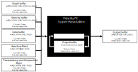
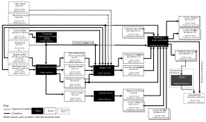
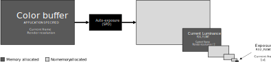
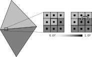
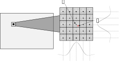
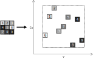
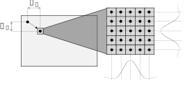
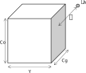

<!-- @page page_techniques_super-resolution-temporal FidelityFX Super Resolution 2.3.2 -->

<h1>FidelityFX Super Resolution 2.3.2 (FSR2)</h1>


AMD FidelityFX Super Resolution 2 (FSR2) is an open source, high-quality solution for producing high resolution frames from lower resolution inputs.

<h2>Table of contents</h2>

- [Introduction](#introduction)
    - [Shading language requirements](#shading-language-requirements)
- [Quick start checklist](#quick-start-checklist)
- [Integration guidelines](#integration-guidelines)
    - [Scaling modes](#scaling-modes)
    - [Performance](#performance)
    - [Memory requirements](#memory-requirements)
    - [Input resources](#input-resources)
    - [Depth buffer configurations](#depth-buffer-configurations)
    - [Providing motion vectors](#providing-motion-vectors)
    - [Reactive mask](#reactive-mask)
    - [Automatically generating reactivity](#automatically-generating-reactivity)
    - [Transparency and composition mask](#transparency-and-composition-mask)
    - [Automatically generating transparency and composition mask](#automatically-generating-transparency-and-composition-mask)
    - [Placement in the frame](#placement-in-the-frame)
    - [Host API](#host-api)
	- [Modular backend](#modular-backend)
    - [Memory management](#memory-management)
    - [Temporal antialiasing](#temporal-antialiasing)
    - [Camera jitter](#camera-jitter)
	- [Camera jump cuts](#camera-jump-cuts)
    - [Mipmap biasing](#mipmap-biasing)
    - [Frame Time Delta Input](#frame-time-delta-input)
    - [HDR support](#hdr-support)
    - [Falling back to 32-bit floating point](#falling-back-to-32-bit-floating-point)
    - [64-wide wavefronts](#64-wide-wavefronts)
    - [API Debug Checker](#debug-checker)
- [The technique](#the-technique)
    - [Algorithm structure](#algorithm-structure)
    - [Compute luminance pyramid](#compute-luminance-pyramid)
    - [Reconstruct & dilate](#reconstruct-and-dilate)
    - [Depth clip](#depth-clip)
    - [Create locks](#create-locks)
    - [Reproject & accumulate](#reproject-accumulate)
    - [Robust Contrast Adaptive Sharpening (RCAS)](#robust-contrast-adaptive-sharpening-rcas)
- [Building the sample](#building-the-sample)
- [Limitations](#limitations)
- [Version history](#version-history)
- [References](#references)
- [See also](#see-also)

<h2>Introduction</h2>

**FidelityFX Super Resolution 2** (or **FSR2** for short) is a cutting-edge upscaling technique developed from the ground up to produce high resolution frames from lower resolution inputs.



FSR2 uses temporal feedback to reconstruct high-resolution images while maintaining and even improving image quality compared to native rendering.

FSR2 can enable "practical performance" for costly render operations, such as hardware ray tracing.

<h2>Shading language requirements</h2>

- `HLSL`
  - `CS_6_2`
  - `CS_6_6†`

† `CS_6_6` is used on some hardware which supports 64-wide wavefronts.

<h2>Quick start checklist</h2>

To use FSR2 you should follow the steps below:

1. Generate Visual Studio solution:

    ```bash
    > <installation path>\BuildSamplesSolution.bat
    ```
	
	The batch file will inquire if the solution should build the SDK as a DLL (builds as a statically linked library if no ('n') is provided) and which samples should be included. Please use '1' to build a solution with all samples included or '8' to only include the FSR sample.
  
    This will generate a `build\` directory where you will find the solution for the SDK samples (`FidelityFX SDK Samples.sln`).

2. Open the solution and build it.

3. Copy the API library `ffx_fsr2_x64.lib` from `bin/ffx_sdk` into the folder containing a folder in your project which contains third-party libraries.

4. Copy the library matching the FFX backend you want to use, e.g.: `bin/ffx_sdk/ffx_backend_dx12_x64.lib` for DirectX 12.

5. Copy the following core API header files from `src/ffx-fsr2-api` into your project: `ffx_fsr2.h`, `ffx_types.h`, `ffx_error.h`, `ffx_interface.h`, `ffx_util.h`, `shaders/ffx_fsr2_common.h`, and `shaders/ffx_fsr2_resources.h`. Care should be taken to maintain the relative directory structure at the destination of the file copying.

6. Copy the header files for the API backend of your choice, e.g. for DirectX 12 you would copy `dx12/ffx_fsr2_dx12.h` and `dx12/shaders/ffx_fsr2_shaders_dx12.h`. Care should be taken to maintain the relative directory structure at the destination of the file copying.

7. Include the `ffx_fsr2.h` header file in your codebase where you wish to interact with FSR2.

8. Create a backend for your target API. E.g. for DirectX 12 you should call [`ffxGetInterfaceDX12`](../../sdk/include/FidelityFX/host/backends/dx12/ffx_dx12.h#L72). A scratch buffer should be allocated of the size returned by calling [`ffxGetScratchMemorySizeDX12`](../../sdk/include/FidelityFX/host/backends/dx12/ffx_dx12.h#L45) and the pointer to that buffer passed to [`ffxGetInterfaceDX12`](../../sdk/include/FidelityFX/host/backends/dx12/ffx_dx12.h#L72).

9. Create a FSR2 context by calling [`ffxFsr2ContextCreate`](../../sdk/include/FidelityFX/host/ffx_fsr2.h#L283). The parameters structure should be filled out matching the configuration of your application. See the API reference documentation for more details.

10. Each frame you should call [`ffxFsr2ContextDispatch`](../../sdk/include/FidelityFX/host/ffx_fsr2.h#L324) to launch FSR2 workloads. The parameters structure should be filled out matching the configuration of your application. See the API reference documentation for more details, and ensure the [`frameTimeDelta` field is provided in milliseconds](#frame-time-delta-input).

11. When your application is terminating (or you wish to destroy the context for another reason) you should call [`ffxFsr2ContextDestroy`](../../sdk/include/FidelityFX/host/ffx_fsr2.h#L347). The GPU should be idle before calling this function.

12. Sub-pixel jittering should be applied to your application's projection matrix. This should be done when performing the main rendering of your application. You should use the [`ffxFsr2GetJitterOffset`](../../sdk/include/FidelityFX/host/ffx_fsr2.h#L492) function to compute the precise jitter offsets. See [Camera jitter](#camera-jitter) section for more details.

13. For the best upscaling quality it is strongly advised that you populate the [Reactive mask](#reactive-mask) and [Transparency & composition mask](#transparency-and-composition-mask) according to our guidelines. You can also use [`ffxFsr2ContextGenerateReactiveMask`](../../sdk/include/FidelityFX/host/ffx_fsr2.h#L335) as a starting point.

14. Applications should expose [scaling modes](#scaling-modes), in their user interface in the following order: Quality, Balanced, Performance, and (optionally) Ultra Performance.

15. Applications should also expose a sharpening slider to allow end users to achieve additional quality.

<h2>Integration guidelines</h2>

<h3>Scaling modes</h3>
For the convenience of end users, the FSR2 API provides a number of preset scaling ratios which are named.

| Quality           | Per-dimension scaling factor |    
|-------------------|------------------------------|
| Quality           | 1.5x                         |
| Balanced          | 1.7x                         |
| Performance       | 2.0x                         |
| Ultra performance | 3.0x                         |

We strongly recommend that applications adopt consistent naming and scaling ratios in their user interface. This is to ensure that user experience is consistent for your application's users which may have experience of other applications using FSR2. 

<h3>Performance</h3>
Depending on your target hardware and operating configuration FSR2 will operate at different performance levels.

The table below summarizes the measured performance of FSR2 on a variety of hardware in DX12.

| Target resolution | Quality          | RX 7900 XTX| RX 6950 XT | RX 6900 XT | RX 6800 XT | RX 6800 | RX 6700 XT | RX 6650 XT | RX 5700 XT | RX Vega 56 | RX 590 |
|-------------------|------------------|------------|------------|------------|------------|---------|------------|------------|------------|------------|--------|
| 3840x2160         | Quality (1.5x)   | 0.7ms      | 1.1ms      | 1.2ms      | 1.2ms      | 1.4ms   | 2.0ms      | 2.8ms      | 2.4ms      | 4.9ms      | 5.4ms  |
|                   | Balanced (1.7x)  | 0.6ms      | 1.0ms      | 1.0ms      | 1.1ms      | 1.4ms   | 1.8ms      | 2.6ms      | 2.2ms      | 4.1ms      | 4.9ms  |
|                   | Performance (2x) | 0.6ms      | 0.9ms      | 1.0ms      | 1.0ms      | 1.3ms   | 1.7ms      | 2.3ms      | 2.0ms      | 3.6ms      | 4.4ms  |
|                   | Ultra perf. (3x) | 0.5ms      | 0.8ms      | 0.8ms      | 0.9ms      | 1.1ms   | 1.5ms      | 1.8ms      | 1.7ms      | 2.9ms      | 3.7ms  |
| 2560x1440         | Quality (1.5x)   | 0.3ms      | 0.5ms      | 0.5ms      | 0.5ms      | 0.7ms   | 0.9ms      | 1.2ms      | 1.1ms      | 1.9ms      | 2.3ms  |
|                   | Balanced (1.7x)  | 0.3ms      | 0.5ms      | 0.5ms      | 0.5ms      | 0.6ms   | 0.8ms      | 1.1ms      | 1.0ms      | 1.7ms      | 2.1ms  |
|                   | Performance (2x) | 0.3ms      | 0.4ms      | 0.4ms      | 0.4ms      | 0.6ms   | 0.8ms      | 0.9ms      | 0.9ms      | 1.5ms      | 1.9ms  |
|                   | Ultra perf. (3x) | 0.2ms      | 0.4ms      | 0.4ms      | 0.4ms      | 0.5ms   | 0.7ms      | 0.8ms      | 0.8ms      | 1.2ms      | 1.7ms  |
| 1920x1080         | Quality (1.5x)   | 0.2ms      | 0.3ms      | 0.3ms      | 0.3ms      | 0.4ms   | 0.5ms      | 0.6ms      | 0.6ms      | 1.0ms      | 1.3ms  |
|                   | Balanced (1.7x)  | 0.2ms      | 0.3ms      | 0.3ms      | 0.3ms      | 0.4ms   | 0.5ms      | 0.6ms      | 0.6ms      | 0.9ms      | 1.2ms  |
|                   | Performance (2x) | 0.2ms      | 0.2ms      | 0.2ms      | 0.3ms      | 0.3ms   | 0.5ms      | 0.5ms      | 0.5ms      | 0.8ms      | 1.1ms  |
|                   | Ultra perf. (3x) | 0.1ms      | 0.2ms      | 0.2ms      | 0.2ms      | 0.3ms   | 0.4ms      | 0.4ms      | 0.4ms      | 0.7ms      | 0.9ms  |

Figures are rounded to the nearest 0.1ms and are without additional [`sharpness`](../../sdk/include/FidelityFX/host/ffx_fsr2.h#L132) and are subject to change.

<h3>Memory requirements</h3>
Using FSR2 requires some additional GPU local memory to be allocated for consumption by the GPU. When using the FSR2 API, this memory is allocated when the FSR2 context is created, and is done so via the series of callbacks which comprise the backend interface. This memory is used to store intermediate surfaces which are computed by the FSR2 algorithm as well as surfaces which are persistent across many frames of the application. The table below includes the amount of memory used by FSR2 under various operating conditions. The "Working set" column indicates the total amount of memory used by FSR2 as the algorithm is executing on the GPU; this is the amount of memory FSR2 will require to run. The "Persistent memory" column indicates how much of the "Working set" column is required to be left intact for subsequent frames of the application; this memory stores the temporal data consumed by FSR2. The "Aliasable memory" column indicates how much of the "Working set" column may be aliased by surfaces or other resources used by the application outside of the operating boundaries of FSR2.

You can take control of resource creation in FSR2 by overriding the resource creation and destruction parts of the FSR2 backend interface, and forwarding the aliasing flags. This means that for a perfect integration of FSR2, additional memory which is equal to the "Persistent memory" column of the table below is required depending on your operating conditions.

| Resolution | Quality                | Working set (MB) | Persistent memory (MB) | Aliasable memory (MB)   |  
| -----------|------------------------|------------------|------------------------|-------------------------|
| 3840x2160  | Quality (1.5x)         | 448MB      |  354MB      |  93MB         |
|            | Balanced (1.7x)        | 407MB      |  330MB      |  77MB         |
|            | Performance (2x)       | 376MB      |  312MB      |  63MB         |
|            | Ultra performance (3x) | 323MB      |  281MB      |  42MB         |
| 2560x1440  | Quality (1.5x)         | 207MB      |  164MB      |  43MB         |
|            | Balanced (1.7x)        | 189MB      |  153MB      |  36MB         |
|            | Performance (2x)       | 172MB      |  143MB      |  29MB         |
|            | Ultra performance (3x) | 149MB      |  130MB      |  19MB         |
| 1920x1080  | Quality (1.5x)         | 115MB      |  90MB      |  24MB         |
|            | Balanced (1.7x)        | 105MB      |  85MB      |  20MB         |
|            | Performance (2x)       | 101MB      |  83MB      |  18MB         |
|            | Ultra performance (3x) | 84MB      |  72MB      |  11MB         |

Figures are approximations, rounded up to nearest MB using an RX 6700XT GPU in DX12, and are subject to change.

For details on how to manage FSR2's memory requirements please refer to the section of this document dealing with [Memory management](#memory-management).

<h3>Input resources</h3>
FSR2 is a temporal algorithm, and therefore requires access to data from both the current and previous frame. The following table enumerates all external inputs required by FSR2.

The resolution column indicates if the data should be at 'rendered' resolution or 'presentation' resolution. 'Rendered' resolution indicates that the resource should match the resolution at which the application is performing its rendering. Conversely, 'presentation' indicates that the resolution of the target should match that which is to be presented to the user. All resources are from the current rendered frame, for DirectX(R)12 and Vulkan(R) applications all input resources should be transitioned to [`D3D12_RESOURCE_STATE_NON_PIXEL_SHADER_RESOURCE`](https://docs.microsoft.com/en-us/windows/win32/api/d3d12/ne-d3d12-d3d12_resource_states) and [`VK_ACCESS_SHADER_READ_BIT`](https://www.khronos.org/registry/vulkan/specs/1.3-extensions/man/html/VkAccessFlagBits.html) respectively before calling [`ffxFsr2ContextDispatch`](../../sdk/include/FidelityFX/host/ffx_fsr2.h#L324).

| Name            | Resolution                   |  Format                            | Type      | Notes                                          |  
| ----------------|------------------------------|------------------------------------|-----------|------------------------------------------------|
| Color buffer    | Render                       | `APPLICATION SPECIFIED`            | Texture   | The render resolution color buffer for the current frame provided by the application. If the contents of the color buffer are in high dynamic range (HDR), then the [`FFX_FSR2_ENABLE_HIGH_DYNAMIC_RANGE`](../../sdk/include/FidelityFX/host/ffx_fsr2.h#L131) flag should be set in  the [`flags`](../../sdk/include/FidelityFX/host/ffx_fsr2.h#L161) field of the [`FfxFsr2ContextDescription`](../../sdk/include/FidelityFX/host/ffx_fsr2.h#L159) structure. |
| Depth buffer    | Render                       | `APPLICATION SPECIFIED (1x FLOAT)` | Texture   | The render resolution depth buffer for the current frame provided by the application. The data should be provided as a single floating point value, the precision of which is under the application's control. The configuration of the depth should be communicated to FSR2 via the [`flags`](../../sdk/include/FidelityFX/host/ffx_fsr2.h#L161) field of the [`FfxFsr2ContextDescription`](../../sdk/include/FidelityFX/host/ffx_fsr2.h#L159) structure when creating the [`FfxFsr2Context`](../../sdk/include/FidelityFX/host/ffx_fsr2.h#L233). You should set the [`FFX_FSR2_ENABLE_DEPTH_INVERTED`](../../sdk/include/FidelityFX/host/ffx_fsr2.h#L134) flag if your depth buffer is inverted (that is [1..0] range), and you should set the [`FFX_FSR2_ENABLE_DEPTH_INFINITE`](../../sdk/include/FidelityFX/host/ffx_fsr2.h#L135) flag if your depth buffer has an infinite far plane. If the application provides the depth buffer in `D32S8` format, then FSR2 will ignore the stencil component of the buffer, and create an `R32_FLOAT` resource to address the depth buffer. On GCN and RDNA hardware, depth buffers are stored separately from stencil buffers. |
| Motion vectors  | Render or presentation       | `APPLICATION SPECIFIED (2x FLOAT)` | Texture   | The 2D motion vectors for the current frame provided by the application in **[<-width, -height> ... <width, height>]** range. If your application renders motion vectors with a different range, you may use the [`motionVectorScale`](../../sdk/include/FidelityFX/host/ffx_fsr2.h#L183) field of the [`FfxFsr2DispatchDescription`](../../sdk/include/FidelityFX/host/ffx_fsr2.h#L172) structure to adjust them to match the expected range for FSR2. Internally, FSR2 uses 16-bit quantities to represent motion vectors in many cases, which means that while motion vectors with greater precision can be provided, FSR2 will not benefit from the increased precision. The resolution of the motion vector buffer should be equal to the render resolution, unless the [`FFX_FSR2_ENABLE_DISPLAY_RESOLUTION_MOTION_VECTORS`](../../sdk/include/FidelityFX/host/ffx_fsr2.h#L132) flag is set in the [`flags`](../../sdk/include/FidelityFX/host/ffx_fsr2.h#L161) field of the [`FfxFsr2ContextDescription`](../../sdk/include/FidelityFX/host/ffx_fsr2.h#L159) structure when creating the [`FfxFsr2Context`](../../sdk/include/FidelityFX/host/ffx_fsr2.h#L233), in which case it should be equal to the presentation resolution. |
| Reactive mask   | Render                       | `R8_UNORM`                         | Texture   | As some areas of a rendered image do not leave a footprint in the depth buffer or include motion vectors, FSR2 provides support for a reactive mask texture which can be used to indicate to FSR2 where such areas are. Good examples of these are particles, or alpha-blended objects which do not write depth or motion vectors. If this resource is not set, then FSR2's shading change detection logic will handle these cases as best it can, but for optimal results, this resource should be set. For more information on the reactive mask please refer to the [Reactive mask](#reactive-mask) section.  |
| Exposure        | 1x1                          | `R32_FLOAT`                        | Texture   | A 1x1 texture containing the exposure value computed for the current frame. This resource is optional, and may be omitted if the [`FFX_FSR2_ENABLE_AUTO_EXPOSURE`](../../sdk/include/FidelityFX/host/ffx_fsr2.h#L136) flag is set in the [`flags`](../../sdk/include/FidelityFX/host/ffx_fsr2.h#L161) field of the [`FfxFsr2ContextDescription`](../../sdk/include/FidelityFX/host/ffx_fsr2.h#L159) structure when creating the [`FfxFsr2Context`](../../sdk/include/FidelityFX/host/ffx_fsr2.h#L233).  |

All inputs that are provided at Render Resolution, except for motion vectors, should be rendered with jitter. Motion vectors should not have jitter applied, unless the `FFX_FSR2_ENABLE_MOTION_VECTORS_JITTER_CANCELLATION` flag is present.

<h3>Depth buffer configurations</h3>
It is strongly recommended that an inverted, infinite depth buffer is used with FSR2. However, alternative depth buffer configurations are supported. An application should inform the FSR2 API of its depth buffer configuration by setting the appropriate flags during the creation of the [`FfxFsr2Context`](../../sdk/include/FidelityFX/host/ffx_fsr2.h#L233). The table below contains the appropriate flags.

| FSR2 flag                        | Note                                                                                       |
|----------------------------------|--------------------------------------------------------------------------------------------|
| [`FFX_FSR2_ENABLE_DEPTH_INVERTED`](../../sdk/include/FidelityFX/host/ffx_fsr2.h#L134) | A bit indicating that the input depth buffer data provided is inverted [max..0].           |
| [`FFX_FSR2_ENABLE_DEPTH_INFINITE`](../../sdk/include/FidelityFX/host/ffx_fsr2.h#L135) | A bit indicating that the input depth buffer data provided is using an infinite far plane. |


<h3>Providing motion vectors</h3>

<h4>Space</h4>
A key part of a temporal algorithm (be it antialiasing or upscaling) is the provision of motion vectors. FSR2 accepts motion vectors in 2D which encode the motion from a pixel in the current frame to the position of that same pixel in the previous frame. FSR2 expects that motion vectors are provided by the application in [**<-width, -height>**..**<width, height>**] range; this matches screenspace. For example, a motion vector for a pixel in the upper-left corner of the screen with a value of <width, height> would represent a motion that traversed the full width and height of the input surfaces, originating from the bottom-right corner.


If your application computes motion vectors in another space - for example normalized device coordinate space - then you may use the [`motionVectorScale`](../../sdk/include/FidelityFX/host/ffx_fsr2.h#L183) field of the [`FfxFsr2DispatchDescription`](../../sdk/include/FidelityFX/host/ffx_fsr2.h#L172) structure to instruct FSR2 to adjust them to match the expected range for FSR2. The code examples below illustrate how motion vectors may be scaled to screen space. The example HLSL and C++ code below illustrates how NDC-space motion vectors can be scaled using the FSR2 host API.

```HLSL
// GPU: Example of application NDC motion vector computation
float2 motionVector = (previousPosition.xy / previousPosition.w) - (currentPosition.xy / currentPosition.w);

// CPU: Matching FSR 2.0 motionVectorScale configuration
dispatchParameters.motionVectorScale.x = (float)renderWidth;
dispatchParameters.motionVectorScale.y = (float)renderHeight;
```

<h4>Precision & resolution</h4>
Internally, FSR2 uses 16bit quantities to represent motion vectors in many cases, which means that while motion vectors with greater precision can be provided, FSR2 will not currently benefit from the increased precision. The resolution of the motion vector buffer should be equal to the render resolution, unless the [`FFX_FSR2_ENABLE_DISPLAY_RESOLUTION_MOTION_VECTORS`](../../sdk/include/FidelityFX/host/ffx_fsr2.h#L132) flag is set in the [`flags`](../../sdk/include/FidelityFX/host/ffx_fsr2.h#L161) field of the [`FfxFsr2ContextDescription`](../../sdk/include/FidelityFX/host/ffx_fsr2.h#L159) structure when creating the [`FfxFsr2Context`](../../sdk/include/FidelityFX/host/ffx_fsr2.h#L233), in which case it should be equal to the presentation resolution.

<h4>Coverage</h4>
FSR2 will perform better quality upscaling when more objects provide their motion vectors. It is therefore advised that all opaque, alpha-tested and alpha-blended objects should write their motion vectors for all covered pixels. If vertex shader effects are applied - such as scrolling UVs - these calculations should also be factored into the calculation of motion for the best results. For alpha-blended objects it is also strongly advised that the alpha value of each covered pixel is stored to the corresponding pixel in the [reactive mask](#reactive-mask). This will allow FSR2 to perform better handling of alpha-blended objects during upscaling. The reactive mask is especially important for alpha-blended objects where writing motion vectors might be prohibitive, such as particles.

<h3>Reactive mask</h3>
In the context of FSR2, the term "reactivity" means how much influence the samples rendered for the current frame have over the production of the final upscaled image. Typically, samples rendered for the current frame contribute a relatively modest amount to the result computed by FSR2; however, there are exceptions. To produce the best results for fast moving, alpha-blended objects, FSR2 requires the [Reproject & accumulate](#reproject-accumulate) stage to become more reactive for such pixels. As there is no good way to determine from either color, depth or motion vectors which pixels have been rendered using alpha blending, FSR2 performs best when applications explicitly mark such areas.

Therefore, it is strongly encouraged that applications provide a reactive mask to FSR2. The reactive mask guides FSR2 on where it should reduce its reliance on historical information when compositing the current pixel, and instead allow the current frame's samples to contribute more to the final result. The reactive mask allows the application to provide a value from [0.0..1.0] where 0.0 indicates that the pixel is not at all reactive (and should use the default FSR2 composition strategy), and a value of 1.0 indicates the pixel should be fully reactive. This is a floating point range and can be tailored to different situations.

While there are other applications for the reactive mask, the primary application for the reactive mask is producing better results of upscaling images which include alpha-blended objects. A good proxy for reactiveness is actually the alpha value used when compositing an alpha-blended object into the scene, therefore, applications should write `alpha` to the reactive mask. It should be noted that it is unlikely that a reactive value of close to 1 will ever produce good results. Therefore, we recommend clamping the maximum reactive value to around 0.9.

If a [Reactive mask](#reactive-mask) is not provided to FSR2 (by setting the [`reactive`](../../sdk/include/FidelityFX/host/ffx_fsr2.h#L179) field of [`FfxFsr2DispatchDescription`](../../sdk/include/FidelityFX/host/ffx_fsr2.h#L172) to `NULL`) then an internally generated 1x1 texture with a cleared reactive value will be used.

<h3>Automatically generating reactivity</h3>
To help applications generate the [Reactive mask](#reactive-mask) and the [Transparency & composition mask](#transparency-and-composition-mask), FSR2 provides an optional helper API. Under the hood, the API launches a compute shader which computes these values for each pixel using a luminance-based heuristic.

Applications wishing to do this can call the [`ffxFsr2ContextGenerateReactiveMask`](../../sdk/include/FidelityFX/host/ffx_fsr2.h#L335) function and should pass two versions of the color buffer, one containing opaque only geometry, and the other containing both opaque and alpha-blended objects.

<h3>Transparency and composition mask</h3>
In addition to the [Reactive mask](#reactive-mask), FSR2 provides for the application to denote areas of other specialist rendering which should be accounted for during the upscaling process. Examples of such special rendering include areas of raytraced reflections or animated textures.

While the [Reactive mask](#reactive-mask) adjusts the accumulation balance, the [Transparency & composition mask](#transparency-and-composition-mask) adjusts the pixel history protection mechanisms. The mask also removes the effect of the luminance instability factor. A pixel with a value of 0 in the [Transparency & composition mask](#ttransparency-and-composition-mask) does not perform any additional modification to the lock for that pixel. Conversely, a value of 1 denotes that the lock for that pixel should be completely removed.

If a [Transparency & composition mask](#transparency-and-composition-mask) is not provided to FSR2 (by setting the [`transparencyAndComposition`](#sdk/include/FidelityFX/host/ffx_fsr2.h#L180) field of [`FfxFsr2DispatchDescription`](../../sdk/include/FidelityFX/host/ffx_fsr2.h#L172) to `NULL`) then an internally generated 1x1 texture with a cleared transparency and composition value will be used.

<h3>Automatically generating Transparency and composition mask</h3>
FSR2.2 includes an experimental feature to generate [Reactive mask](#reactive-mask) and [Transparency & composition mask](#transparency-and-composition-mask) automatically. To enable this, the [`enableAutoReactive`](#sdk/include/FidelityFX/host/ffx_fsr2.h#L196) field of [`FfxFsr2DispatchDescription`](../../sdk/include/FidelityFX/host/ffx_fsr2.h#L172) needs to be set to 'TRUE' and a copy of the opaque only portions of the backbuffer needs to be provided in ['colorOpaqueOnly'](../../sdk/include/FidelityFX/host/ffx_fsr2.h#L197). FSR2 will then automatically generate and use [Reactive mask](#reactive-mask) and [Transparency & composition mask](#transparency-and-composition-mask) internally. The masks are generated in a compute pass by analyzing the difference of the color buffer with and without transparent geometry, as well as compare it to the previous frame. Based on the result of those computations each pixel gets assigned [Reactive mask](#reactive-mask) and [Transparency & composition mask](#transparency-and-composition-mask) values.
To use autogeneration of the masks the following 4 values to scale and limit the intensity of the masks are required to be provided as well (Note the mentioned default values are suggested starting values but should be tuned per title):

- ['autoTcThreshold'](#sdk/include/FidelityFX/host/ffx_fsr2.h#L198): Setting this value too small will cause visual instability. Larger values can cause ghosting. Recommended default value is 0.05f.
- ['autoTcScale'](#sdk/include/FidelityFX/host/ffx_fsr2.h#L199): Smaller values will increase stability at hard edges of translucent objects. Recommended default value is 1.0f.
- ['autoReactiveScale'](#sdk/include/FidelityFX/host/ffx_fsr2.h#L200): Larger values result in more reactive pixels. Recommended default value is 5.00f
- ['autoReactiveMax'](#sdk/include/FidelityFX/host/ffx_fsr2.h#L201): Maximum value reactivity can reach. Recommended default value is 0.90f.

This feature is intended to help with integrating FSR2.2 into a new engine or title. However, for best quality we still recommend to render the [Reactive mask](#reactive-mask) and [Transparency & composition mask](#transparency-and-composition-mask) yourself, as generating those values based on material is expected to be more reliable than autogenerating them from the final image.

Please note that this feature is still in experimental stage and may change significantly in the future. 

<h3>Exposure</h3>
FSR2 provides two values which control the exposure used when performing upscaling. They are as follows:

1. **Pre-exposure** a value by which we divide the input signal to get back to the original signal produced by the game before any packing into lower precision render targets.
2. **Exposure** a value which is multiplied against the result of the pre-exposed color value.

The exposure value should match that which the application uses during any subsequent tonemapping passes performed by the application. This means FSR2 will operate consistently with what is likely to be visible in the final tonemapped image. 

> In various stages of the FSR2 algorithm described in this document, FSR2 will compute its own exposure value for internal use. It is worth noting that all outputs from FSR2 will have this internal tonemapping reversed before the final output is written. Meaning that FSR2 returns results in the same domain as the original input signal.

Poorly selected exposure values can have a drastic impact on the final quality of FSR2's upscaling. Therefore, it is recommended that [`FFX_FSR2_ENABLE_AUTO_EXPOSURE`](../../sdk/include/FidelityFX/host/ffx_fsr2.h#L136) is used by the application, unless there is a particular reason not to. When [`FFX_FSR2_ENABLE_AUTO_EXPOSURE`](../../sdk/include/FidelityFX/host/ffx_fsr2.h#L136) is set in the [`flags`](../../sdk/include/FidelityFX/host/ffx_fsr2.h#L161) field of the [`FfxFsr2ContextDescription`](../../sdk/include/FidelityFX/host/ffx_fsr2.h#L159) structure, the exposure calculation shown in the HLSL code below is used to compute the exposure value, which matches the exposure response of ISO 100 film stock.

```HLSL
float ComputeAutoExposureFromAverageLog(float averageLogLuminance)
{
	const float averageLuminance = exp(averageLogLuminance);
	const float S = 100.0f; // ISO arithmetic speed
	const float K = 12.5f;
	const float exposureIso100 = log2((averageLuminance * S) / K);
	const float q = 0.65f;
	const float luminanceMax = (78.0f / (q * S)) * pow(2.0f, exposureIso100);
	return 1 / luminanceMax;
}
```

<h3>Placement in the frame</h3>

The primary goal of FSR2 is to improve application rendering performance by using a temporal upscaling algorithm relying on a number of inputs. Therefore, its placement in the pipeline is key to ensuring the right balance between the highest quality visual quality and great performance.


With any image upscaling approach is it important to understand how to place other image-space algorithms with respect to the upscaling algorithm. Placing these other image-space effects before the upscaling has the advantage that they run at a lower resolution, which of course confers a performance advantage onto the application. However, it may not be appropriate for some classes of image-space techniques. For example, many applications may introduce noise or grain into the final image, perhaps to simulate a physical camera. Doing so before an upscaler might cause the upscaler to amplify the noise, causing undesirable artifacts in the resulting upscaled image. The following table divides common real-time image-space techniques into two columns. 'Post processing A' contains all the techniques which typically would run before FSR2's upscaling, meaning they would all run at render resolution. Conversely, the 'Post processing B' column contains all the techniques which are recommend to run after FSR2, meaning they would run at the larger, presentation resolution.

| Post processing A              | Post processing B    |
|--------------------------------|----------------------|
| Screenspace reflections        | Film grain           |
| Screenspace ambient occlusion  | Chromatic aberration |
| Denoisers (shadow, reflections)| Vignette             |
| Exposure (optional)            | Tonemapping          |
|                                | Bloom                |
|                                | Depth of field       |
|                                | Motion blur          |

Please note that the recommendations here are for guidance purposes only and depend on the precise characteristics of your application's implementation.

<h3>Host API</h3>
While it is possible to generate the appropriate intermediate resources, compile the shader code, set the bindings, and submit the dispatches, it is much easier to use the FSR2 host API which is provided.

To use to the API, you should link the FSR2 libraries (more on which ones shortly) and include the `ffx_fsr2.h` header file, which in turn has the following header dependencies:

```
ffx_assert.h
ffx_error.h
ffx_fsr2_interface.h
ffx_types.h
ffx_util.h
```

To use the FSR2 API, you should link `ffx_fsr2_api_x64.lib` which will provide the symbols for the application-facing APIs. However, FSR2's API has a modular backend, which means that different graphics APIs and platforms may be targeted through the use of a matching backend. Therefore, you should further include the backend lib matching your requirements, referencing the table below.

| Target              | Library name            |
|---------------------|-------------------------|
| DirectX(R)12        | `ffx_fsr2_dx12_x64.lib` |
| Vulkan(R)           | `ffx_fsr2_vk_x64.lib`   | 

> Please note the modular architecture of the FSR2 API allows for custom backends to be implemented. See the [Modular backend](#modular-backend) section for more details.

To begin using the API, the application should first create a [`FfxFsr2Context`](../../sdk/include/FidelityFX/host/ffx_fsr2.h#L233) structure. This structure should be located somewhere with a lifetime approximately matching that of your backbuffer; somewhere on the application's heap is usually a good choice. By calling [`ffxFsr2ContextCreate`](../../sdk/include/FidelityFX/host/ffx_fsr2.h#L228) the [`FfxFsr2Context`](../../sdk/include/FidelityFX/host/ffx_fsr2.h#L233) structure will be populated with the data it requires. Moreover, a number of calls will be made from [`ffxFsr2ContextCreate`](../../sdk/include/FidelityFX/host/ffx_fsr2.h#L228) to the backend which is provided to [`FfxFsr2Context`](../../sdk/include/FidelityFX/host/ffx_fsr2.h#L233) as part of the [`FfxFsr2ContextDescription`](../../sdk/include/FidelityFX/host/ffx_fsr2.h#L159) structure. These calls will perform such tasks as creating intermediate resources required by FSR2 and setting up shaders and their associated pipeline state. The FSR2 API does not perform any dynamic memory allocation.

Each frame of your application where upscaling is required, you should call [`ffxFsr2ContextDispatch`](../../sdk/include/FidelityFX/host/ffx_fsr2.h#L324). This function accepts the [`FfxFsr2Context`](../../sdk/include/FidelityFX/host/ffx_fsr2.h#L233) structure that was created earlier in the application's lifetime as well as a description of precisely how upscaling should be performed and on which data. This description is provided by the application filling out a [`FfxFsr2DispatchDescription`](../../sdk/include/FidelityFX/host/ffx_fsr2.h#L172) structure.

Destroying the context is performed by calling [`ffxFsr2ContextDestroy`](../../sdk/include/FidelityFX/host/ffx_fsr2.h#L292). Please note, that the GPU should be idle before attempting to call [`ffxFsr2ContextDestroy`](../../sdk/include/FidelityFX/host/ffx_fsr2.h#L292), and the function does not perform implicit synchronization to ensure that resources being accessed by FSR2 are not currently in flight. The reason for this choice is to avoid FSR2 introducing additional GPU flushes for applications who already perform adequate synchronization at the point where they might wish to destroy the [`FfxFsr2Context`](../../sdk/include/FidelityFX/host/ffx_fsr2.h#L233), this allows an application to perform the most efficient possible creation and teardown of the FSR2 API when required.

There are additional helper functions which are provided as part of the FSR2 API. These helper functions perform tasks like the computation of sub-pixel jittering offsets, as well as the calculation of rendering resolutions based on dispatch resolutions and the default [scaling modes](#scaling-modes) provided by FSR2.

For more exhaustive documentation of the FSR2 API, you can refer to the API reference documentation provided.

<h3>Modular backend</h3>
The design of the FSR2 API means that the core implementation of the FSR2 algorithm is unaware upon which rendering API it sits. Instead, FSR2 calls functions provided to it through an interface, allowing different backends to be used with FSR2. This design also allows for applications integrating FSR2 to provide their own backend implementation, meaning that platforms which FSR2 does not currently support may be targeted by implementing a handful of functions. Moreover, applications which have their own rendering abstractions can also implement their own backend, taking control of all aspects of FSR2's underlying function, including memory management, resource creation, shader compilation, shader resource bindings, and the submission of FSR2 workloads to the graphics device.


Out of the box, the FSR2 API will compile into multiple libraries following the separation already outlined between the core API and the backends. This means if you wish to use the backends provided with FSR2 you should link both the core FSR2 API lib as well the backend matching your requirements.

> The public release of FSR2 comes with DirectX(R)12 and Vulkan(R) backends, but other backends are available upon request. Talk with your AMD Developer Technology representative for more information.

<h3>Memory management</h3>
If the FSR2 API is used with one of the supplied backends (e.g: DirectX(R)12 or Vulkan(R)) then all the resources required by FSR2 are created as committed resources directly using the graphics device provided by the host application. However, by overriding the create and destroy family of functions present in the backend interface it is possible for an application to more precisely control the memory management of FSR2.

To do this, you can either provide a full custom backend to FSR2 via the [`FfxFsr2ContextDescription`](../../sdk/include/FidelityFX/host/ffx_fsr2.h#L159) structure passed to [`ffxFsr2ContextCreate`](../../sdk/include/FidelityFX/host/ffx_fsr2.h#L228) function, or you can retrieve the backend for your desired API and override the resource creation and destruction functions to handle them yourself. To do this, simply overwrite the [`fpCreateResource`](../../sdk/include/FidelityFX/host/ffx_interface.h#L379) and [`fpDestroyResource`](../../sdk/include/FidelityFX/host/ffx_interface.h#L383) function pointers.

``` CPP
// Setup DX12 interface.
const size_t scratchBufferSize = ffxGetScratchMemorySizeDX12();
void* scratchBuffer = malloc(scratchBufferSize);
FfxErrorCode errorCode = ffxGetInterfaceDX12(&contextDescription.callbacks, m_pDevice->GetDevice(), scratchBuffer, scratchBufferSize);
FFX_ASSERT(errorCode == FFX_OK);

// Override the resource creation and destruction.
contextDescription.callbacks.createResource = myCreateResource;
contextDescription.callbacks.destroyResource = myDestroyResource;

// Set up the context description.
contextDescription.device = ffxGetDeviceDX12(m_pDevice->GetDevice());
contextDescription.maxRenderSize.width = renderWidth;
contextDescription.maxRenderSize.height = renderHeight;
contextDescription.displaySize.width = displayWidth;
contextDescription.displaySize.height = displayHeight;
contextDescription.flags = FFX_FSR2_ENABLE_HIGH_DYNAMIC_RANGE
                         | FFX_FSR2_ENABLE_DEPTH_INVERTED
                         | FFX_FSR2_ENABLE_AUTO_EXPOSURE;

// Create the FSR2 context.
errorCode = ffxFsr2ContextCreate(&context, &contextDescription);
FFX_ASSERT(errorCode == FFX_OK);
```

One interesting advantage to an application taking control of the memory management required for FSR2 is that resource aliasing maybe performed, which can yield a memory saving. The table present in [Memory requirements](#memory-requirements) demonstrates the savings available through using this technique. In order to realise the savings shown in this table, an appropriate area of memory - the contents of which are not required to survive across a call to the FSR2 dispatches - should be found to share with the aliasable resources required for FSR2. Each [`FfxCreateResourceFunc`](../../sdk/include/FidelityFX/host/ffx_interface.h#L203) call made by FSR2's core API through the FSR2 backend interface will contains a set of flags as part of the [`FfxCreateResourceDescription`](../../sdk/include/FidelityFX/host/ffx_types.h#L266) structure. If the [`FFX_RESOURCE_FLAGS_ALIASABLE`](../../sdk/include/FidelityFX/host/ffx_types.h#L308) is set in the [`flags`](../../sdk/include/FidelityFX/host/ffx_types.h#L522) field this indicates that the resource may be safely aliased with other resources in the rendering frame.

<h3>Temporal Antialiasing</h3>
Temporal antialiasing (TAA) is a technique which uses the output of previous frames to construct a higher quality output from the current frame. As FSR2 has a similar goal - albeit with the additional goal of also increasing the resolution of the rendered image - there is no longer any need to include a separate TAA pass in your application.

<h3>Camera jitter</h3>
FSR2 relies on the application to apply sub-pixel jittering while rendering - this is typically included in the projection matrix of the camera. To make the application of camera jitter simple, the FSR2 API provides a small set of utility function which computes the sub-pixel jitter offset for a particular frame within a sequence of separate jitter offsets.

``` CPP
int32_t ffxFsr2GetJitterPhaseCount(int32_t renderWidth, int32_t displayWidth);
FfxErrorCode ffxFsr2GetJitterOffset(float* outX, float* outY, int32_t jitterPhase, int32_t sequenceLength);
```

Internally, these function implement a Halton[2,3] sequence [[Halton](#references)]. The goal of the Halton sequence is to provide spatially separated points, which cover the available space.


It is important to understand that the values returned from the [`ffxFsr2GetJitterOffset`](../../sdk/include/FidelityFX/host/ffx_fsr2.h#L492) are in unit pixel space, and in order to composite this correctly into a projection matrix we must convert them into projection offsets. The diagram above shows a single pixel in unit pixel space, and in projection space. The code listing below shows how to correctly composite the sub-pixel jitter offset value into a projection matrix.

Depending on the transformation concatenation convention (in other words, the order of matrix multiplication) used in the game engine, there are two ways to calculate ``jitteredProjectionMatrix``:

* Pre-multiplication order (DirectXMath style math).

``` CPP
const int32_t jitterPhaseCount = ffxFsr2GetJitterPhaseCount(renderWidth, displayWidth);

float jitterX = 0;
float jitterY = 0;
ffxFsr2GetJitterOffset(&jitterX, &jitterY, index, jitterPhaseCount);

// Calculate the jittered projection matrix.
const float jitterX = 2.0f * jitterX / (float)renderWidth;
const float jitterY = -2.0f * jitterY / (float)renderHeight;
const Matrix4 jitterTranslationMatrix = translateMatrix(Matrix3::identity, Vector3(jitterX, jitterY, 0));
const Matrix4 jitteredProjectionMatrix = jitterTranslationMatrix * projectionMatrix;
```

* Post-multiplication order (OpenGL® style math).

``` CPP
const int32_t jitterPhaseCount = ffxFsr2GetJitterPhaseCount(renderWidth, displayWidth);

float jitterX = 0;
float jitterY = 0;
ffxFsr2GetJitterOffset(&jitterX, &jitterY, index, jitterPhaseCount);

// Calculate the jittered projection matrix.
const float jitterX = 2.0f * jitterX / (float)renderWidth;
const float jitterY = -2.0f * jitterY / (float)renderHeight;
const Matrix4 jitterTranslationMatrix = translateMatrix(Matrix3::identity, Vector3(jitterX, jitterY, 0));
const Matrix4 jitteredProjectionMatrix = projectionMatrix * jitterTranslationMatrix;
```

For more information on this topic, see [Matrix Compendium](https://gpuopen.com/learn/matrix-compendium/matrix-compendium-intro/), where you can find the final form of ``jitteredProjectionMatrix`` for all possible convection used in Computer Graphics.

Jitter should be applied to *all* rendering. This includes opaque, alpha transparent, and raytraced objects. For rasterized objects, the sub-pixel jittering values calculated by the [`ffxFsr2GetJitterOffset`](../../sdk/include/FidelityFX/host/ffx_fsr2.h#L492) function can be applied to the camera projection matrix which is ultimately used to perform transformations during vertex shading. For raytraced rendering, the sub-pixel jitter should be applied to the ray's origin - often the camera's position.

Whether you elect to use the recommended [`ffxFsr2GetJitterOffset`](../../sdk/include/FidelityFX/host/ffx_fsr2.h#L492) function or your own sequence generator, you must set the [`jitterOffset`](../../sdk/include/FidelityFX/host/ffx_fsr2.h#L182) field of the [`FfxFsr2DispatchDescription`](../../sdk/include/FidelityFX/host/ffx_fsr2.h#L172) structure to inform FSR2 of the jitter offset that has been applied in order to render each frame. Moreover, if not using the recommended [`ffxFsr2GetJitterOffset`](../../sdk/include/FidelityFX/host/ffx_fsr2.h#L492) function, care should be taken that your jitter sequence never generates a null vector; that is value of 0 in both the X and Y dimensions.

The table below shows the jitter sequence length for each of the default quality modes.

 | Quality mode      | Scaling factor          | Sequence length |
 |-------------------|-------------------------|-----------------|
 | Quality           | 1.5x (per dimension)    | 18              |
 | Balanced          | 1.7x (per dimension)    | 23              |
 | Performance       | 2.0x (per dimension)    | 32              |
 | Ultra performance | 3.0x (per dimension)    | 72              |
 | Custom            | [1..n]x (per dimension) | `ceil(8 * n^2)` |

<h3>Camera jump cuts</h3>

Most applications with real-time rendering have a large degree of temporal consistency between any two consecutive frames. However, there are cases where a change to a camera's transformation might cause an abrupt change in what is rendered. In such cases, FSR2 is unlikely to be able to reuse any data it has accumulated from previous frames, and should clear this data such to exclude it from consideration in the compositing process. In order to indicate to FSR2 that a jump cut has occurred with the camera you should set the [`reset`](../../sdk/include/FidelityFX/host/ffx_fsr2.h#L189) field of the [`FfxFsr2DispatchDescription`](../../sdk/include/FidelityFX/host/ffx_fsr2.h#L172) structure to `true` for the first frame of the discontinuous camera transformation.

Rendering performance may be slightly less than typical frame-to-frame operation when using the reset flag, as FSR2 will clear some additional internal resources.

<h3>Mipmap biasing</h3>

Applying a negative mipmap biasing will typically generate an upscaled image with better texture detail. We recommend applying the following formula to your Mipmap bias:  

``` CPP
mipBias = log2(renderResolution/displayResolution) - 1.0;
```

It is suggested that applications adjust the MIP bias for specific high-frequency texture content which is susceptible to showing temporal aliasing issues.

The following table illustrates the mipmap biasing factor which results from evaluating the above pseudocode for the scaling ratios matching the suggested quality modes that applications should expose to end users.
 
 | Quality mode      | Scaling factor        | Mipmap bias |
 |-------------------|-----------------------|-------------|
 | Quality           | 1.5X (per dimension)  | -1.58       |
 | Balanced          | 1.7X (per dimension)  | -1.76       |
 | Performance       | 2.0X (per dimension)  | -2.0        |
 | Ultra performance | 3.0X (per dimension)  | -2.58       |

<h3>Frame Time Delta Input</h3>

The FSR2 API requires [`frameTimeDelta`](../../sdk/include/FidelityFX/host/ffx_fsr2.h#L187) be provided by the application through the [`FfxFsr2DispatchDescription`](../../sdk/include/FidelityFX/host/ffx_fsr2.h#L172) structure. This value is in __milliseconds__: if running at 60fps, the value passed should be around __16.6f__.

The value is used within the temporal component of the FSR 2 auto-exposure feature. This allows for tuning of the history accumulation for quality purposes.

<h3>HDR support</h3>

High dynamic range images are supported in FSR2. To enable this, you should set the [`FFX_FSR2_ENABLE_HIGH_DYNAMIC_RANGE`](../../sdk/include/FidelityFX/host/ffx_fsr2.h#L131) bit in the [`flags`](../../sdk/include/FidelityFX/host/ffx_fsr2.h#L161) field of the [`FfxFsr2ContextDescription`](../../sdk/include/FidelityFX/host/ffx_fsr2.h#L159) structure. Images should be provided to FSR2 in linear color space.

> Support for additional color spaces might be provided in a future revision of FSR2.

<h3>Falling back to 32-bit floating point</h3>

FSR2 was designed to take advantage of half precision (FP16) hardware acceleration to achieve the highest possible performance. However, to provide the maximum level of compatibility and flexibility for applications, FSR2 also includes the ability to compile the shaders using full precision (FP32) operations.

It is recommended to use the FP16 version of FSR2 on all hardware which supports it. You can query your graphics card's level of support for FP16 by querying the [`D3D12_FEATURE_DATA_SHADER_MIN_PRECISION_SUPPORT`](https://docs.microsoft.com/en-us/windows/win32/api/d3d12/ne-d3d12-d3d12_shader_min_precision_support) capability in DirectX(R)12 - you should check that the `D3D[11/12]_SHADER_MIN_PRECISION_16_BIT` is set, and if it is not, fallback to the FP32 version of FSR2. For Vulkan, if [`VkPhysicalDeviceFloat16Int8FeaturesKHR::shaderFloat16`](https://khronos.org/registry/vulkan/specs/1.3-extensions/man/html/VkPhysicalDeviceShaderFloat16Int8FeaturesKHR.html) is not set, then you should fallback to the FP32 version of FSR2. Similarly, if [`VkPhysicalDevice16BitStorageFeatures::storageBuffer16BitAccess`](https://www.khronos.org/registry/vulkan/specs/1.3-extensions/man/html/VkPhysicalDevice16BitStorageFeatures.html) is not set, you should also fallback to the FP32 version of FSR2.

To enable the FP32 path in the FSR2 shader source code, you should define `FFX_HALF` to be `0`. In order to share the majority of the algorithm's source code between both FP16 and FP32 (ensuring a high level of code sharing to support ongoing maintenance), you will notice that the FSR2 shader source code uses a set of type macros which facilitate easy switching between 16-bit and 32-bit base types in the shader source.

| FidelityFX type | FP32        | FP16            |
|-----------------|-------------|-----------------|
| `FFX_MIN16_F`   | `float`     | `min16float`    |
| `FFX_MIN16_F2`  | `float2`    | `min16float2`   |
| `FFX_MIN16_F3`  | `float3`    | `min16float3`   |
| `FFX_MIN16_F4`  | `float4`    | `min16float4`   |

The table above enumerates the mappings between the abstract FidelityFX SDK types, and the underlaying intrinsic type which will be substituted depending on the configuration of the shader source during compilation.

<h3>64-wide wavefronts</h3>

Modern GPUs execute collections of threads - called wavefronts - together in a SIMT fashion. The precise number of threads which constitute a single wavefront is a hardware-specific quantity. Some hardware, such as AMD's GCN and RDNA-based GPUs support collecting 64 threads together into a single wavefront. Depending on the precise characteristics of an algorithm's execution, it may be more or less advantageous to prefer a specific wavefront width. With the introduction of Shader Model 6.6, Microsoft added the ability to specific the width of a wavefront via HLSL. For hardware, such as RDNA which supports both 32 and 64 wide wavefront widths, this is a very useful tool for optimization purposes, as it provides a clean and portable way to ask the driver software stack to execute a wavefront with a specific width.

For DirectX(R)12 based applications which are running on RDNA and RDNA2-based GPUs and using the Microsoft Agility SDK, the FSR2 host API will select a 64-wide wavefront width.

<h3>Debug Checker</h3>

The context description structure can be provided with a callback function for passing textual warnings from the FSR 2 runtime to the underlying application. The `fpMessage` member of the description is of type `FfxFsr2Message` which is a function pointer for passing string messages of various types. Assigning this variable to a suitable function, and passing the [`FFX_FSR2_ENABLE_DEBUG_CHECKING`](../../sdk/include/FidelityFX/host/ffx_fsr2.h#L139) flag within the flags member of [`FfxFsr2ContextDescription`](../../sdk/include/FidelityFX/host/ffx_fsr2.h#L159) will enable the feature. It is recommended this is enabled only in debug development builds.

An example of the kind of output that can occur when the checker observes possible issues is below:

```
FSR2_API_DEBUG_WARNING: FFX_FSR2_ENABLE_DEPTH_INFINITE and FFX_FSR2_ENABLE_DEPTH_INVERTED present, cameraFar value is very low which may result in depth separation artefacting
FSR2_API_DEBUG_WARNING: frameTimeDelta is less than 1.0f - this value should be milliseconds (~16.6f for 60fps)
```

<h2>The technique</h2>

<h3>Algorithm structure</h3>
The FSR2 algorithm is implemented in a series of stages, which are as follows:

1. Compute luminance pyramid
2. Reconstruct & dilate
3. Depth clip
4. Create locks
5. Reproject & accumulate
6. Robust Contrast Adaptive Sharpening (RCAS)

Each pass stage of the algorithm is laid out in the sections following this one, but the data flow for the complete FSR2 algorithm is shown in the diagram below.





<h3>Compute luminance pyramid</h3>

The compute luminance pyramid stage has two responsibilities:

1. To produce a lower resolution version of the input color's luminance. This is used by shading change detection in the accumulation pass.
2. To produce a 1x1 exposure texture which is optionally used to apply tonemapping, and the [Reproject & Accumulate](#project-and-accumulate) stage for reversing local tonemapping ahead of producing an output from FSR2.


<h4>Resource inputs</h4>
The following table contains all resources consumed by the [Compute luminance pyramid](#compute-luminance-pyramid) stage.

> The temporal layer indicates which frame the data should be sourced from. 'Current frame' means that the data should be sourced from resources created for the frame that is to be presented next. 'Previous frame' indicates that the data should be sourced from resources which were created for the frame that has just presented. The resolution column indicates if the data should be at 'rendered' resolution or 'presentation' resolution. 'Rendered' resolution indicates that the resource should match the resolution at which the application is performing its rendering. Conversely, 'presentation' indicates that the resolution of the target should match that which is to be presented to the user.

| Name            | Temporal layer  | Resolution   |  Format                 | Type      | Notes                                        |  
| ----------------|-----------------|--------------|-------------------------|-----------|----------------------------------------------|
| Color buffer    | Current frame   | Render       | `APPLICATION SPECIFIED` | Texture   | The render resolution color buffer for the current frame provided by the application. If the contents of the color buffer are in high dynamic range (HDR), then the [`FFX_FSR2_ENABLE_HIGH_DYNAMIC_RANGE`](../../sdk/include/FidelityFX/host/ffx_fsr2.h#L131) flag should be set in  the [`flags`](../../sdk/include/FidelityFX/host/ffx_fsr2.h#L161) field of the [`FfxFsr2ContextDescription`](../../sdk/include/FidelityFX/host/ffx_fsr2.h#L159) structure. |

<h4>Resource outputs</h4>
The following table contains all resources produced or modified by the [Compute luminance pyramid](#compute-luminance-pyramid) stage.

> The temporal layer indicates which frame the data should be sourced from. 'Current frame' means that the data should be sourced from resources created for the frame that is to be presented next. 'Previous frame' indicates that the data should be sourced from resources which were created for the frame that has just presented. The resolution column indicates if the data should be at 'rendered' resolution or 'presentation' resolution. 'Rendered' resolution indicates that the resource should match the resolution at which the application is performing its rendering. Conversely, 'presentation' indicates that the resolution of the target should match that which is to be presented to the user.

| Name                        | Temporal layer  | Resolution       |  Format                 | Type      | Notes                                        |  
| ----------------------------|-----------------|------------------|-------------------------|-----------|----------------------------------------------|
| Exposure                    | Current frame   | 1x1              | `R32_FLOAT`             | Texture   | A 1x1 texture containing the exposure value computed for the current frame. This resource is optional, and may be omitted unless the [`FFX_FSR2_ENABLE_AUTO_EXPOSURE`](../../sdk/include/FidelityFX/host/ffx_fsr2.h#L136) flag is set in the [`flags`](../../sdk/include/FidelityFX/host/ffx_fsr2.h#L161) field of the [`FfxFsr2ContextDescription`](../../sdk/include/FidelityFX/host/ffx_fsr2.h#L159) structure when creating the [`FfxFsr2Context`](../../sdk/include/FidelityFX/host/ffx_fsr2.h#L233).  |
| Current luminance           | Current frame   | `Render * 0.5` + MipChain  | `R16_FLOAT`             | Texture   | A texture at 50% of render resolution texture which contains the luminance of the current frame. A full mip chain is allocated. |

<h4>Description</h4>
The [Compute luminance pyramid](#compute-luminance-pyramid) stage is implemented using FidelityFX [Single Pass Downsampler](https://github.com/GPUOpen-Effects/FidelityFX-SPD), an optimized technique for producing mipmap chains using a single compute shader dispatch. Instead of the conventional (full) pyramidal approach, SPD provides a mechanism to produce a specific set of mipmap levels for an arbitrary input texture, as well as performing arbitrary calculations on that data as we store it to the target location in memory. In FSR2, we are interested in producing in upto two intermediate resources depending on the configuration of the [`FfxFsr2Context`](../../sdk/include/FidelityFX/host/ffx_fsr2.h#L166). The first resource is a low-resolution representation of the current luminance, this is used later in FSR2 to attempt to detect shading changes. The second is the exposure value, and while it is always computed, it is only used by subsequent stages if the [`FFX_FSR2_ENABLE_AUTO_EXPOSURE`](../../sdk/include/FidelityFX/host/ffx_fsr2.h#L136) flag is set in the [`flags`](../../sdk/include/FidelityFX/host/ffx_fsr2.h#L161) field of the [`FfxFsr2ContextDescription`](../../sdk/include/FidelityFX/host/ffx_fsr2.h#L159) structure upon context creation. The exposure value - either from the application, or the [Compute luminance pyramid](#compute-luminance-pyramid) stage - is used in the [Adjust input color](#adjust-input-color) stage of FSR2, as well as by the [Reproject & Accumulate](#project-and-accumulate) stage.




As used by FSR2, SPD is configured to write only to the 2nd (half resolution) and last (1x1) mipmap level. Moreover, different calculations are applied at each of these levels to calculate the quantities required by subsequent stages of the FSR2 algorithm. This means the rest of the mipmap chain is not required to be backed by GPU local memory (or indeed any type of memory).

The 2nd mipmap level contains current luminance, the value of which is computed during the downsampling of the color buffer using the following HLSL:

``` HLSL
float3 rgb = LoadInputColor(tex);
float3 rgb2y = float3(0.2126, 0.7152, 0.0722);
float logLuma = log(max(FSR2_EPSILON, dot(rgb2y, rgb)));
```

The last mipmap level is computed using the following HLSL:

``` HLSL
float ComputeAutoExposureFromAverageLog(float averageLogLuminance)
{
	const float averageLuminance = exp(averageLogLuminance);
	const float S = 100.0f; // ISO arithmetic speed
	const float K = 12.5f;
	const float exposureIso100 = log2((averageLuminance * S) / K);
	const float q = 0.65f;
	const float luminanceMax = (78.0f / (q * S)) * pow(2.0f, exposureIso100);
	return 1 / luminanceMax;
}
```

<h3>Reconstruct and dilate</h3>
The reconstruct & dilate stage consumes the applications depth buffer and motion vectors, and produces a reconstructed and dilated depth buffer for the previous frame, together with a dilated set of motion vectors in UV space. The stage runs at render resolution.




<h4>Resource inputs</h4>
The following table contains all of the resources which are required by the reconstruct & dilate stage.

> The temporal layer indicates which frame the data should be sourced from. 'Current frame' means that the data should be sourced from resources created for the frame that is to be presented next. 'Previous frame' indicates that the data should be sourced from resources which were created for the frame that has just presented. The resolution column indicates if the data should be at 'rendered' resolution or 'presentation' resolution. 'Rendered' resolution indicates that the resource should match the resolution at which the application is performing its rendering. Conversely, 'presentation' indicates that the resolution of the target should match that which is to be presented to the user. 

| Name                        |  Temporal layer | Resolution |  Format                            | Type      | Notes                                          |  
| ----------------------------|-----------------|------------|------------------------------------|-----------|------------------------------------------------|
| Color buffer                | Current frame   | Render       | `APPLICATION SPECIFIED`   | Texture   | The render resolution color buffer for the current frame provided by the application. If the contents of the color buffer are in high dynamic range (HDR), then the [`FFX_FSR2_ENABLE_HIGH_DYNAMIC_RANGE`](../../sdk/include/FidelityFX/host/ffx_fsr2.h#L131) flag should be set in  the [`flags`](../../sdk/include/FidelityFX/host/ffx_fsr2.h#L161) field of the [`FfxFsr2ContextDescription`](../../sdk/include/FidelityFX/host/ffx_fsr2.h#L159) structure. |
| Exposure                    | Current frame   | 1x1          | ``R32_FLOAT``             | Texture   | A 1x1 texture containing the exposure value computed for the current frame. This resource can be supplied by the application, or computed by the [Compute luminance pyramid](#compute-luminance-pyramid) stage of FSR2 if the [`FFX_FSR2_ENABLE_AUTO_EXPOSURE`](../../sdk/include/FidelityFX/host/ffx_fsr2.h#L136) flag is set in the [`flags`](../../sdk/include/FidelityFX/host/ffx_fsr2.h#L161) field of the [`FfxFsr2ContextDescription`](../../sdk/include/FidelityFX/host/ffx_fsr2.h#L159) structure.  |
| Depth buffer                | Current frame   | Render     | `APPLICATION SPECIFIED (1x FLOAT)` | Texture   | The render resolution depth buffer for the current frame provided by the application. The data should be provided as a single floating point value, the precision of which is under the application's control. The configuration of the depth should be communicated to FSR2 via the [`flags`](../../sdk/include/FidelityFX/host/ffx_fsr2.h#L161) field of the [`FfxFsr2ContextDescription`](../../sdk/include/FidelityFX/host/ffx_fsr2.h#L159) structure when creating the [`FfxFsr2Context`](../../sdk/include/FidelityFX/host/ffx_fsr2.h#L233). You should set the [`FFX_FSR2_ENABLE_DEPTH_INVERTED`](../../sdk/include/FidelityFX/host/ffx_fsr2.h#L134) flag if your depth buffer is inverted (that is [1..0] range), and you should set the  flag if your depth buffer has as infinite far plane. If the application provides the depth buffer in `D32S8` format, then FSR2 will ignore the stencil component of the buffer, and create an `R32_FLOAT` resource to address the depth buffer. On GCN and RDNA hardware, depth buffers are stored separately from stencil buffers. |
| Motion vectors              | Current fraame  | Render or presentation       | `APPLICATION SPECIFIED (2x FLOAT)` | Texture   | The 2D motion vectors for the current frame provided by the application in [*(<-width, -height>*..*<width, height>*] range. If your application renders motion vectors with a different range, you may use the [`motionVectorScale`](../../sdk/include/FidelityFX/host/ffx_fsr2.h#L183) field of the [`FfxFsr2DispatchDescription`](../../sdk/include/FidelityFX/host/ffx_fsr2.h#L172) structure to adjust them to match the expected range for FSR2. Internally, FSR2 uses 16bit quantities to represent motion vectors in many cases, which means that while motion vectors with greater precision can be provided, FSR2 will not benefit from the increased precision. The resolution of the motion vector buffer should be equal to the render resolution, unless the [`FFX_FSR2_ENABLE_DISPLAY_RESOLUTION_MOTION_VECTORS`](../../sdk/include/FidelityFX/host/ffx_fsr2.h#L132) flag is set in the [`flags`](../../sdk/include/FidelityFX/host/ffx_fsr2.h#L161) field of the [`FfxFsr2ContextDescription`](../../sdk/include/FidelityFX/host/ffx_fsr2.h#L159) structure when creating the [`FfxFsr2Context`](../../sdk/include/FidelityFX/host/ffx_fsr2.h#L233), in which case it should be equal to the presentation resolution. |

<h4>Resource outputs</h4>
The following table contains all of the resources which are produced by the reconstruct & dilate stage.

> The temporal layer indicates which frame the data should be sourced from. 'Current frame' means that the data should be sourced from resources created for the frame that is to be presented next. 'Previous frame' indicates that the data should be sourced from resources which were created for the frame that has just presented. The resolution column indicates if the data should be at 'rendered' resolution or 'presentation' resolution. 'Rendered' resolution indicates that the resource should match the resolution at which the application is performing its rendering. Conversely, 'presentation' indicates that the resolution of the target should match that which is to be presented to the user. 

| Name                                | Temporal layer  | Resolution |  Format                | Type      | Notes                                  |  
| ------------------------------------|-----------------|------------|------------------------|-----------|------------------------------------------------|
| Est.Previous depth buffer           | Current frame   | Render     | `R32_UNORM`            | Texture   | A texture containing the reconstructed previous frame depth values. This surface should first be cleared, see the [Adjust input color](#adjust-input-color) stage for details. Please note: When viewing this texture in a capture tool (such as [RenderDoc](https://renderdoc.org)) it may not display correctly. This is because the format of this texture is ``R32_UNORM`` and contains IEEE754 floating point values, which have been written after performing a bitcast using the ``asuint`` intrinsic function. See the note in [Reproject & accumulate](#reproject-accumulate) for more details on the specifics of how this works. |
| Dilated depth                       | Current frame   | Render     | `R16_UINT`             | Texture    | A texture containing dilated depth values computed from the application's depth buffer. |
| Dilated motion vectors              | Current frame   | Render     | `R16G16_FLOAT`         | Texture    | A texture containing dilated 2D motion vectors computed from the application's 2D motion vector buffer. The red and green channel contains the two-dimensional motion vectors in NDC space. |
| Previous depth buffer               | Current frame   | Render       | `R32_UNORM`            | Texture   | A texture containing a reconstructed and dilated depth values. This surface is cleared by the [Adjust input color](#adjust-input-color) stage. Please note: When viewing this texture in a capture tool (such as [RenderDoc](https://renderdoc.org)) it may not display correctly. This is because the format of this texture is ``R32_UNORM`` and contains IEEE754 floating point values, which have been written after performing a bitcast using the [`asuint`](https://docs.microsoft.com/en-us/windows/win32/direct3dhlsl/dx-graphics-hlsl-asuint) intrinsic function. See the note in [Adjust input color](#adjust-input-color) for more details on the specifics of how this works. |
| Lock input luma                     | Current frame   | Render       | `R16_FLOAT`   | Texture   | A texture containing luma data to be consumed by the lock stage. |

<h4>Description</h4>

The first step of the [Reconstruct & dilate](#reconstruct-and-dilate) stage is to compute the dilated depth values and motion vectors from the application's depth values and motion vectors for the current frame. Dilated depth values and motion vectors emphasise the edges of geometry which has been rendered into the depth buffer. This is because the edges of geometry will often introduce discontinuities into a contiguous series of depth values, meaning that as depth values and motion vectors are dilated, they will naturally follow the contours of the geometric edges present in the depth buffer. In order to compute the dilated depth values and motion vectors, FSR2 looks at the depth values for a 3x3 neighbourhood for each pixel and then selects the depth values and motion vectors in that neighbourhood where the depth value is nearest to the camera. In the diagram below, you can see how the central pixel of the 3x3 kernel is updated with the depth value and motion vectors from the pixel with the largest depth value - the pixel on the central, right hand side.

As this stage is the first time that motion vectors are consumed by FSR2, this is where motion vector scaling is applied if using the FSR2 host API. Motion vector scaling factors provided via the [`motionVectorScale`](../../sdk/include/FidelityFX/host/ffx_fsr2.h#L183) field of the [`FfxFsr2DispatchDescription`](../../sdk/include/FidelityFX/host/ffx_fsr2.h#L172) structure and allows you to transform non-screenspace motion vectors into screenspace motion vectors which FSR2 expects.

``` CPP
// An example of how to manipulate motion vector scaling factors using the FSR2 host API. 
FfxFsr2DispatchParameters dispatchParams = { 0 };
dispatchParams.motionVectorScale.x = renderWidth;
dispatchParams.motionVectorScale.y = renderHeight;
```

With the dilated motion vectors, we can now move to the second part of the [Reconstruct & dilate](#reconstruct-and-dilate) stage, which is to estimate the position of each pixel in the current frame's depth buffer in the previous frame. This is done by applying the dilated motion vector computed for a pixel, to its depth buffer value. As it is possible for many pixels to reproject into the same pixel in the previous depth buffer, atomic operations are used in order to resolve the value of the nearest depth value for each pixel. This is done using the [`InterlockedMax`](https://docs.microsoft.com/en-us/windows/win32/direct3dhlsl/interlockedmax) or [`InterlockedMin`](https://docs.microsoft.com/en-us/windows/win32/direct3dhlsl/interlockedmin) operation (the choice depending on if the application's depth buffer is inverted or not). The use of cumulative operations to resolve the contents of the previous depth buffer implies that the reconstructed depth buffer resource must always be cleared to a known value, which is performed in the [Reproject & accumulate](#reproject-accumulate) stage. This is performed on frame N for frame N + 1.


When using the FSR2 API, the application's depth buffer and the application's velocity buffer must be specified as separate resources as per the [Resource inputs](#resource-inputs) table above. However, if you are undertaking a bespoke integration into your application, this constraint may be relaxed. Take care that the performance characteristics of this pass do not change if moving to a format for the motion vector texture which is more sparse, e.g.: as part of a packed g-buffer in a deferred renderer.

<h3>Depth clip</h3>

The goal of the [Depth clip](#depth-clip) stage is to produce a mask which indicates disoccluded areas of the current frame. 

This stage runs at render resolution.

<h4>Resource inputs</h4>

The following table contains all the resources which are consumed by the [Depth clip](#depth-clip) stage.

> The temporal layer indicates which frame the data should be sourced from. 'Current frame' means that the data should be sourced from resources created for the frame that is to be presented next. 'Previous frame' indicates that the data should be sourced from resources which were created for the frame that has just presented. The resolution column indicates if the data should be at 'rendered' resolution or 'presentation' resolution. 'Rendered' resolution indicates that the resource should match the resolution at which the application is performing its rendering. Conversely, 'presentation' indicates that the resolution of the target should match that which is to be presented to the user. 

| Name                                | Temporal layer  | Resolution |  Format                | Type      | Notes                                  |  
| ------------------------------------|-----------------|------------|------------------------|-----------|------------------------------------------------|
| Est.Previous depth buffer               | Current frame   | Render     | `R32_UNORM`            | Texture   | A texture containing the reconstructed previous frame depth values. This surface should first be cleared, see the [Reproject & accumulate](#reproject-accumulate) stage for details. Please note: When viewing this texture in a capture tool (such as [RenderDoc](https://renderdoc.org)) it may not display correctly. This is because the format of this texture is ``R32_UINT`` and contains IEEE754 floating point values, which have been written after performing a bitcast using the ``asuint`` intrinsic function. See the note in [Reproject & accumulate](#reproject-accumulate) for more details on the specifics of how this works. |
| Dilated depth                       | Current frame   | Render     | `R32_FLOAT`             | Texture    | A texture containing dilated depth values computed from the application's depth buffer. |
| Dilated motion vectors              | Current  & Previous frame  | Render     | `R16G16_FLOAT`         | Texture    | A texture containing dilated 2D motion vectors computed from the application's 2D motion vector buffer. The red and green channel contains the two-dimensional motion vectors in NDC space, and the alpha channel contains the depth value used by the [Depth clip](#depth-clip) stage. |
| Reactive masks                       | Current frame   | Render       | `R8_UNORM`             | Texture   | As some areas of a rendered image do not leave a footprint in the depth buffer or include motion vectors, FSR2 provides support for a reactive mask texture which can be used to indicate to FSR2 where such areas are. Good examples of these are particles, or alpha-blended objects which do not write depth or motion vectors. If this resource is not set, then FSR2's shading change detection logic will handle these cases as best it can, but for optimal results, this resource should be set. For more information on the reactive mask please refer to the [Reactive mask](#reactive-mask) section.  |
| Color buffer                | Current frame   | Render       | `APPLICATION SPECIFIED`   | Texture   | The render resolution color buffer for the current frame provided by the application. If the contents of the color buffer are in high dynamic range (HDR), then the [`FFX_FSR2_ENABLE_HIGH_DYNAMIC_RANGE`](../../sdk/include/FidelityFX/host/ffx_fsr2.h#L131) flag should be set in  the [`flags`](../../sdk/include/FidelityFX/host/ffx_fsr2.h#L161) field of the [`FfxFsr2ContextDescription`](../../sdk/include/FidelityFX/host/ffx_fsr2.h#L159) structure. |
| Exposure                    | Current frame   | 1x1          | ``R32_FLOAT``             | Texture   | A 1x1 texture containing the exposure value computed for the current frame. This resource can be supplied by the application, or computed by the [Compute luminance pyramid](#compute-luminance-pyramid) stage of FSR2 if the [`FFX_FSR2_ENABLE_AUTO_EXPOSURE`](../../sdk/include/FidelityFX/host/ffx_fsr2.h#L136) flag is set in the [`flags`](../../sdk/include/FidelityFX/host/ffx_fsr2.h#L161) field of the [`FfxFsr2ContextDescription`](../../sdk/include/FidelityFX/host/ffx_fsr2.h#L159) structure.  |
| Depth buffer                | Current frame   | Render     | `APPLICATION SPECIFIED (1x FLOAT)` | Texture   | The render resolution depth buffer for the current frame provided by the application. The data should be provided as a single floating point value, the precision of which is under the application's control. The configuration of the depth should be communicated to FSR2 via the [`flags`](../../sdk/include/FidelityFX/host/ffx_fsr2.h#L161) field of the [`FfxFsr2ContextDescription`](../../sdk/include/FidelityFX/host/ffx_fsr2.h#L159) structure when creating the [`FfxFsr2Context`](../../sdk/include/FidelityFX/host/ffx_fsr2.h#L233). You should set the [`FFX_FSR2_ENABLE_DEPTH_INVERTED`](../../sdk/include/FidelityFX/host/ffx_fsr2.h#L134) flag if your depth buffer is inverted (that is [1..0] range), and you should set the  flag if your depth buffer has as infinite far plane. If the application provides the depth buffer in `D32S8` format, then FSR2 will ignore the stencil component of the buffer, and create an `R32_FLOAT` resource to address the depth buffer. On GCN and RDNA hardware, depth buffers are stored separately from stencil buffers. |
| Motion vectors              | Current fraame  | Render or presentation       | `APPLICATION SPECIFIED (2x FLOAT)` | Texture   | The 2D motion vectors for the current frame provided by the application in [*(<-width, -height>*..*<width, height>*] range. If your application renders motion vectors with a different range, you may use the [`motionVectorScale`](../../sdk/include/FidelityFX/host/ffx_fsr2.h#L183) field of the [`FfxFsr2DispatchDescription`](../../sdk/include/FidelityFX/host/ffx_fsr2.h#L172) structure to adjust them to match the expected range for FSR2. Internally, FSR2 uses 16-bit quantities to represent motion vectors in many cases, which means that while motion vectors with greater precision can be provided, FSR2 will not benefit from the increased precision. The resolution of the motion vector buffer should be equal to the render resolution, unless the [`FFX_FSR2_ENABLE_DISPLAY_RESOLUTION_MOTION_VECTORS`](../../sdk/include/FidelityFX/host/ffx_fsr2.h#L132) flag is set in the [`flags`](../../sdk/include/FidelityFX/host/ffx_fsr2.h#L161) field of the [`FfxFsr2ContextDescription`](../../sdk/include/FidelityFX/host/ffx_fsr2.h#L159) structure when creating the [`FfxFsr2Context`](../../sdk/include/FidelityFX/host/ffx_fsr2.h#L233), in which case it should be equal to the presentation resolution. |

<h4>Resource outputs</h4>
The following table contains all the resources which are produced by the [Depth clip](#depth-clip) stage.

> The temporal layer indicates which frame the data should be sourced from. 'Current frame' means that the data should be sourced from resources created for the frame that is to be presented next. 'Previous frame' indicates that the data should be sourced from resources which were created for the frame that has just presented. The resolution column indicates if the data should be at 'rendered' resolution or 'presentation' resolution. 'Rendered' resolution indicates that the resource should match the resolution at which the application is performing its rendering. Conversely, 'presentation' indicates that the resolution of the target should match that which is to be presented to the user. 

| Name                                | Temporal layer  | Resolution |  Format                | Type      | Notes                                  |  
| ------------------------------------|-----------------|------------|------------------------|-----------|----------------------------------------|
| Adjusted color buffer                | Current frame   | Render       | `R16G16B16A16_FLOAT`    | Texture   | A texture containing the adjusted version of the application's color buffer. The tonemapping operator may not be the same as any tonemapping operator included in the application, and is instead a local, reversible operator used throughout FSR2. This buffer is stored in YCoCg format. Alpha channel contains disocclusion mask.|
| Dilated reactive mask                       | Current frame   | Render       | `R8G8_UNORM`             | Texture   | Dilated reactive masks.  |

<h2>Description</h2>

To generate the disocclusion mask, the depth value must be computed for each pixel from the previous camera's position and the new camera's position.  In the diagram below, you can see a camera moving from an initial position (labelled P0) to a new position (labelled P1). As it does so, the shaded area behind the sphere becomes disoccluded - that is it becomes visible from the camera at P1 and was previously occluded from the point of view of P0.


With both values depth values, we can compare the delta between them against the Akeley separation value [[Akeley-06](#references)]. Intuitively, the Akeley separation constant provides a minimum distance between two objects represented in a floating point depth buffer which allow you to say - with a high degree of certainty - that the objects were originally distinct from one another. In the diagram below you can see that the mid-grey and dark-grey objects have a delta which is larger than the `kSep` value which has been computed for the application's depth buffer configuration. However, the distance from the light-gray object to the mid-grey object does not exceed the computed `kSep` value, and therefore we are unable to conclude if this object is distinct.


The value stored in the disocclusion mask is in the range [0..1], where 1 maps to a value greater than or equal to the Akeley separation value.

<h3>Create locks</h3>

This stage is responsible for creating new locks on pixels which are consumed in the [Reproject & Accumulate](#reproject-accumulate) stage. This stage runs at render resolution.

<h4>Resource inputs</h4>

The following table contains all resources consumed by the [Create locks](#create-locks) stage.

> The temporal layer indicates which frame the data should be sourced from. 'Current frame' means that the data should be sourced from resources created for the frame that is to be presented next. 'Previous frame' indicates that the data should be sourced from resources which were created for the frame that has just presented. The resolution column indicates if the data should be at 'rendered' resolution or 'presentation' resolution. 'Rendered' resolution indicates that the resource should match the resolution at which the application is performing its rendering. Conversely, 'presentation' indicates that the resolution of the target should match that which is to be presented to the user.

| Name                        | Temporal layer  | Resolution   |  Format                 | Type      | Notes                                        |  
| ----------------------------|-----------------|--------------|-------------------------|-----------|----------------------------------------------|
| Lock input luma                     | Current frame   | Render       | `R16_FLOAT`   | Texture   | A texture containing luminance data to be consumed by the lock stage. |

<h4>Resource outputs</h4>

The following table contains all resources produced or modified by the [Create locks](#create-locks) stage.

> The temporal layer indicates which frame the data should be sourced from. 'Current frame' means that the data should be sourced from resources created for the frame that is to be presented next. 'Previous frame' indicates that the data should be sourced from resources which were created for the frame that has just presented. The resolution column indicates if the data should be at 'rendered' resolution or 'presentation' resolution. 'Rendered' resolution indicates that the resource should match the resolution at which the application is performing its rendering. Conversely, 'presentation' indicates that the resolution of the target should match that which is to be presented to the user.

| Name                        | Temporal layer  | Resolution   |  Format                 | Type      | Notes                                        |  
| ----------------------------|-----------------|--------------|-------------------------|-----------|----------------------------------------------|
| New lock mask               | Current frame   | Presentation | `R8_UNORM`          | Texture   | A mask which indicates whether or not to perform color rectification on a pixel, can be thought of as a lock on the pixel to stop rectification from removing the detail. Please note: This texture is part of an array of two textures along with the Lock status texture which is used as an input to this stage. The selection of which texture in the array is used for input and output is swapped each frame. The red channel contains the time remaining on the pixel lock, and the Y channel contains the luminance of the pixel at the time when the lock was created. The [Create locks](#create-locks) stage updates only a subset of this resource. |
| Est.Previous depth buffer   | Next frame   | Render     | `R32_UNORM`            | Texture   | This is only written here to clear it. |

<h4>Description</h4>

Intuitively, a pixel lock is a mechanism to stop color rectification from being applied to a pixel. The net effect of this locking is that more of the previous frame's color data is used when computing the final, super resolution pixel color in the [Reproject & accumulate](#reproject-accumulate) stage. The lock status texture contains two values which together compose a pixel lock. The red channel of the lock status texture contains the remaining lifetime of a pixel lock. This value is decremented by the initial lock length divided by the total length of the jitter sequence. When a lock reaches zero, it is considered to be expired. The green channel of the lock status texture contains the luminance of the pixel at the time the lock was created, but it is only populated during the reprojection stage of [Reproject & accumulate](#reproject-accumulate) stage. The luminance value is ultimately used in the [Reproject & Accumulate](#reproject-accumulate) stage as part of the shading change detection, this allows FSR2 to unlock a pixel if there is discontinuous change to the pixel's appearance (e.g.: an abrupt change to the shading of the pixel).

When creating locks, the 3x3 neighbourhood of luminance values is compared against a threshold. The result of this comparison determines if a new lock should be created. The use of the neighbourhood allows us to detect thin features in the input image which should be locked in order to preserve details in the final super resolution image; such as wires, or chain linked fences.

Additionally, this stage also has the responsibility for clearing the reprojected depth buffer to a known value, ready for the [Reconstruct & dilate](#reconstruct-and-dilate) stage on the next frame of the application. The buffer must be cleared, as [Reconstruct & dilate](#reconstruct-and-dilate) will populate it using atomic operations. Depending on the configuration of the depth buffer, an appropriate clearing value is selected.

The format of the previous depth buffer is `R32_UINT` which allows the use of [`InterlockedMax`](https://docs.microsoft.com/en-us/windows/win32/direct3dhlsl/interlockedmax) and [`InterlockedMin`](https://docs.microsoft.com/en-us/windows/win32/direct3dhlsl/interlockedmin) operations to be performed from the [Reconstruct & dilate](#reconstruct-and-dilate) stage of FSR2. This is done with the resulting integer values returned by converting depth values using the [`asint`](https://docs.microsoft.com/en-us/windows/win32/direct3dhlsl/dx-graphics-hlsl-asint) functions. This works because depth values are always greater than 0, meaning that the monotonicity of IEEE754 floating point values when interpreted as integers is guaranteed.


<h3>Reproject & accumulate</h3>

This stage undertakes the following steps:

1. The current frame's color buffer is upsampled using Lanczos filtering.
2. The previous frame's output color and lock status buffers are reprojected, as if they were viewed from the current camera's perspective. 
3. Various cleanup steps to the historical color data.
4. Luma instability is computed.
5. The historical color data, and the upscaled color data from the current frame are accumulated.

This stage runs at presentation resolution.

<h4>Resource inputs</h4>

The following table contain all resources required by the [Reproject & accumulate](#reproject-accumulate) stage.

> The temporal layer indicates which frame the data should be sourced from. 'Current frame' means that the data should be sourced from resources created for the frame that is to be presented next. 'Previous frame' indicates that the data should be sourced from resources which were created for the frame that has just presented. The resolution column indicates if the data should be at 'rendered' resolution or 'presentation' resolution. 'Rendered' resolution indicates that the resource should match the resolution at which the application is performing its rendering. Conversely, 'presentation' indicates that the resolution of the target should match that which is to be presented to the user. If display resolution motion vectors are provided, the reprojection step will use the full precision of the vectors, as we read the resource directly.

| Name                                | Temporal layer  | Resolution   |  Format                | Type      | Notes                                  |  
| ------------------------------------|-----------------|--------------|------------------------|-----------|----------------------------------------|
| Exposure                    | Current frame   | 1x1              | `R32_FLOAT`             | Texture   | A 1x1 texture containing the exposure value computed for the current frame. This resource is optional, and may be omitted if the [`FFX_FSR2_ENABLE_AUTO_EXPOSURE`](../../sdk/include/FidelityFX/host/ffx_fsr2.h#L135) flag is set in the [`flags`](../../sdk/include/FidelityFX/host/ffx_fsr2.h#L161) field of the [`FfxFsr2ContextDescription`](../../sdk/include/FidelityFX/host/ffx_fsr2.h#L159) structure when creating the [`FfxFsr2Context`](../../sdk/include/FidelityFX/host/ffx_fsr2.h#L233).  |
| Dilated motion vectors      | Current frame   | Render       | `R16G16_FLOAT`         | Texture   | A texture containing dilated motion vectors computed from the application's velocity buffer. The red and green channel contains the two-dimensional motion vectors in UV space. |
| Dilated reactive mask       | Current frame   | Render       | `R8G8_UNORM`             | Texture   | Dilated reactive masks.  |
| Upscaled buffer             | Previous frame  | Presentation | ``R16G16B16A16_FLOAT``  | Texture   | The output buffer produced by the FSR2 algorithm running in the previous frame. Please note: This buffer is used internally by FSR2, and is distinct from the presentation buffer which is derived from the output buffer, and has [RCAS](#robust-contrast-adpative-sharpening-rcas) applied. Please note: This texture is part of an array of two textures along with the Output buffer texture which is produced by the [Reproject & accumulate](#reproject-accumulate) stage. The selection of which texture in the array is used for input and output is swapped each frame. |
| Current luminance           | Current frame   | `Render * 0.5`   | `R16_FLOAT`             | Texture   | A texture at 50% of render resolution texture which contains the luminance of the current frame. |
| Luminance history           | Many frames     | Presentation | `R8G8B8A8_UNORM`        | Texture   | A texture containing three frames of luminance history, as well as a stability factor encoded in the alpha channel. |
| Adjusted color buffer       | Current frame   | Render       | `R16G16B16A16_FLOAT`    | Texture   | A texture containing the adjusted version of the application's color buffer. The tonemapping operator may not be the same as any tonemapping operator included in the application, and is instead a local, reversible operator used throughout FSR2. This buffer is stored in YCoCg format. Alpha channel contains disocclusion mask.|
| Lock status                 | Previous frame  | Presentation | `R16G16_FLOAT`         | Texture   | A mask which indicates not to perform color clipping on a pixel, can be thought of as a lock on the pixel to stop clipping removing the detail.  For a more detailed description of the pixel locking mechanism please refer to the [Create locks](#create-locks) stage. Please note: This texture is part of an array of two textures along with the Lock status texture which is used as an output from this stage. The selection of which texture in the array is used for input and output is swapped each frame. |
| New lock mask               | Current frame   | Presentation | `R8_UNORM`          | Texture   | A mask which indicates whether or not to perform color rectification on a pixel, can be thought of as a lock on the pixel to stop rectification from removing the detail. Please note: This texture is part of an array of two textures along with the Lock status texture which is used as an input to this stage. The selection of which texture in the array is used for input and output is swapped each frame. The red channel contains the time remaining on the pixel lock, and the Y channel contains the luminance of the pixel at the time when the lock was created. The [Create locks](#create-locks) stage updates only a subset of this resource. |


<h4>Resource outputs</h4>

This table contains the resources produced by the [Reproject & accumulate](#reproject-accumulate) stage.

> The temporal layer indicates which frame the data should be sourced from. 'Current frame' means that the data should be sourced from resources created for the frame that is to be presented next. 'Previous frame' indicates that the data should be sourced from resources which were created for the frame that has just presented. The resolution column indicates if the data should be at 'rendered' resolution or 'presentation' resolution. 'Rendered' resolution indicates that the resource should match the resolution at which the application is performing its rendering. Conversely, 'presentation' indicates that the resolution of the target should match that which is to be presented to the user. 

| Name                        | Temporal layer  | Resolution   |  Format                 | Type      | Notes                                        |  
| ----------------------------|-----------------|--------------|-------------------------|-----------|----------------------------------------------|
| Upscaled buffer             | Current frame   | Presentation | `R16G16B16A16_FLOAT`    | Texture   | The output buffer produced by the [Reproject & accumulate](#reproject-accumulate) stage for the current frame. Please note: This buffer is used internally by FSR2, and is distinct from the presentation buffer which is produced as an output from this stage after applying RCAS. Please note: This texture is part of an array of two textures along with the Output buffer texture which is consumed by the [Reproject & accumulate](#reproject-accumulate) stage. The selection of which texture in the array is used for input and output is swapped each frame. |
| Reprojected locks           | Current frame   | Presentation | `R16G16_FLOAT`          | Texture   | The reprojected lock status texture. |
| Luminance history           | Many frames     | Presentation | `R8G8B8A8_UNORM`        | Texture   | A texture containing three frames of luminance history, as well as a stability factor encoded in the alpha channel. |
| New lock mask               | Next frame      | Presentation | `R8_UNORM`              | Texture   | This is cleared for next frame. |

<h4>Description</h4>

The reproject & accumulate stage of FSR2 is the most complicated and expensive stage in the algorithm. It brings together the results from many of the previous algorithmic steps and accumulates the reprojected color data from the previous frame together with the upsampled color data from the current frame. Please note the description in this documentation is designed to give you an intuition for the steps involved in this stage and does not necessarily match the implementation precisely.

The first step of the [Reproject & accumulate](#reproject-accumulate) stage is to assess each pixel for changes in its shading. If we are in a locked area, the luminance at the time the lock was created is compared to FSR2's shading change threshold. In a non-locked area, both the current frame and historical luminance values are used to make this determination. Shading change determination is a key part of FSR2's [Reproject & accumulate](#reproject-accumulate) stage, and feeds into many of the other parts of this stage.




Next we must upsample the adjusted color. To perform upsampling, the adjusted color's pixel position serves as the center of a 5x5 Lanczos resampling kernel [[Lanczos]](#references). In the diagram above, you can see that the Lanczos functions are centered around the display resolution sample `S`. The point in each pixel - labelled `P` - denotes the render resolution jittered sample position for which we calculate the Lanczos weights. Looking above and to the right of the 5x5 pixel neighbourhood, you can see the `Lanczos(x, 2)` resampling kernel being applied to the render resolution samples in the 5x5 grid of pixels surrounding the pixel position. It is worth noting that while conceptually the neighbourhood is 5x5, in the implementation only a 4x4 is actually sampled, due to the zero weighted contributions of those pixels on the periphery of the neighbourhood. The implementation of the Lanczos kernel may vary by GPU product. On RDNA2-based products, we use a look-up-table (LUT) to encode the `sinc(x)` function. This helps to produce a more harmonious balance between ALU and memory in the [Reproject & accumulate](#reproject-accumulate) stage. As the upsample step has access to the 5x5 neighbourhood of pixels, it makes sense from an efficiency point of view to also calculate the YCoCg bounding box - which is used during color rectification - at this point. The diagram below shows a 2D YCo bounding box being constructed from a 3x3 neighbourhood around the current pixel, in reality the bounding box also has a third dimension for Cg.




Reprojection is another key part of the [Reproject & accumulate](#reproject-accumulate) stage. To perform reprojection, the dilated motion vectors produced by the [Reconstruct & dilate](#reconstruct-and-dilate) stage are sampled and then applied to the output buffer from the previous frame's execution of FSR2. The left of the diagram below shows two-dimensional motion vector **M** being applied to the current pixel position. On the right, you can see the `Lanczos(x, 2)` resampling kernel being applied to the 5x5 grid of pixels surrounding the translated pixel position. As with the upsampling step, the implementation of the Lanczos kernel may vary by GPU product. The result of the reprojection is a presentation resolution image which contains all the data from the previous frame that could be mapped into the current frame. However, it is not just the previous frame's output color that is reprojected. As FSR2 relies on a mechanism whereby each pixel may be locked to enhance its temporal stability, the locks must also be reprojected from the previous frame into the current frame. This is done in much the same way as the reprojection of the color data, but also combines the results of the shading change detection step we performed on the various luminance values, both current and historical. 





It is now time to update our locks. The first task for update locks is to look for locks which were created during this frame's [Create locks](#create-locks) stage that are not reprojected, and instead have the luminance value of the current frame written to the green channel of the reprojected locks texture. All that remains then is to discern which locks are trustworthy for the current frame and pass those on to the color rectification step. The truthworthiness determination is done by comparing the luminance values within a neighbourhood of pixels in the current luminance texture. If the luminance separation between these values is large, then we should not trust the lock.

With our lock updates applied and their trustworthiness determined, we can move on to color rectification which is the next crucial step of FSR2's [Reproject & accumulate](#reproject-accumulate) stage. During this stage, a final color is determined from the pixel's historical data which will then be blended with the current frame's upsampled color in order to form the final accumulated super-resolution color. The determination of the final historical color and its contribution is chiefly controlled by two things:

1. Reducing the influence of the historical samples for areas which are disoccluded. This is undertaken by modulating the color value by the disocclusion mask.
2. Reducing the influence of the historical samples (marked $S_h$ in the diagram below) are far from the current frame color's bounding box (computed during the upsampling phase of the [Reproject & accumulate](#reproject-accumulate) stage).





The final step of the [Reproject & accumulate](#reproject-accumulate) stage is to accumulate the current frame's upsampled color with the rectified historical color data. By default, FSR2 will typically blend the current frame with a relatively low linear interpolation factor - that is relatively little of the current frame will be included in the final output. However, this can be altered based on the contents of the application provided reactivity mask. See the [reactive mask](#reactive-mask) section for further details.

<h3>Robust Contrast Adaptive Sharpening (RCAS)</h3>

Robust Contrast Adaptive Sharpening (RCAS) was originally introduced in FidelityFX Super Resolution 1.0 as an additional sharpening pass to help generate additional clarity and sharpeness in the final upscaled image. RCAS is a derivative of the popular Contrast Adaptive Sharpening (CAS) algorithm, but with some key differences which make it more suitable for upscaling. Whereas CAS uses a simplified mechanism to convert local contrast into a variable amount of sharpness, conversely RCAS uses a more exact mechanism, solving for the maximum local sharpness possible before clipping. Additionally, RCAS also has a built-in process to limit the sharpening of what it detects as possible noise. Support for some scaling (which was included in CAS) is not included in RCAS, therefore it should run at presentation resolution.

<h4>Resource inputs</h4>

This table contains the resources consumed by the [Robust Contrast Adaptive Sharpening (RCAS)](#robust-contrast-adaptive-sharpening-rcas) stage.

> The temporal layer indicates which frame the data should be sourced from. 'Current frame' means that the data should be sourced from resources created for the frame that is to be presented next. 'Previous frame' indicates that the data should be sourced from resources which were created for the frame that has just presented. The resolution column indicates if the data should be at 'rendered' resolution or 'presentation' resolution. 'Rendered' resolution indicates that the resource should match the resolution at which the application is performing its rendering. Conversely, 'presentation' indicates that the resolution of the target should match that which is to be presented to the user. 

| Name                        | Temporal layer  | Resolution   |  Format                 | Type      | Notes                                        |  
| ----------------------------|-----------------|--------------|-------------------------|-----------|----------------------------------------------|
| Upscaled buffer               | Current frame  | Presentation | `R16G16B16A16_FLOAT`    | Texture   | The output buffer produced by the [Reproject & Accumulate](#reproject-accumulate) stage for the current frame. Please note: This buffer is used internally by FSR2, and is distinct from the presentation buffer which is produced as an output from this stage after applying RCAS. Please note: This texture is part of an array of two textures along with the Output buffer texture which is consumed by the [Reproject & Accumulate](#reproject-accumulate) stage. The selection of which texture in the array is used for input and output is swapped each frame. |

<h4>Resource outputs</h4>

> The temporal layer indicates which frame the data should be sourced from. 'Current frame' means that the data should be sourced from resources created for the frame that is to be presented next. 'Previous frame' indicates that the data should be sourced from resources which were created for the frame that has just presented. The resolution column indicates if the data should be at 'rendered' resolution or 'presentation' resolution. 'Rendered' resolution indicates that the resource should match the resolution at which the application is performing its rendering. Conversely, 'presentation' indicates that the resolution of the target should match that which is to be presented to the user. 

| Name                         | Temporal layer  | Resolution   |  Format                 | Type      | Notes                                       |  
| -----------------------------|-----------------|--------------|-------------------------|-----------|----------------------------------------------|
| Presentation buffer          | Current frame  | Presentation | Application specific    | Texture   | The presentation buffer produced by the completed FSR2 algorithm for the current frame. |


<h4>Description</h4>

RCAS operates on data sampled using a 5-tap filter configured in a cross pattern. See the diagram below.


With the samples retreived, RCAS then chooses the 'w' which results in no clipping, limits 'w', and multiplies by the 'sharp' amount. The solution above has issues with MSAA input as the steps along the gradient cause edge detection issues. To help stabilize the results of RCAS, it uses 4x the maximum and 4x the minimum (depending on equation) in place of the individual taps, as well as switching from 'm' to either the minimum or maximum (depending on side), to help in energy conservation.

<h2>Building the sample</h2>

To build the FSR2 sample, please follow the following instructions:

1) Install the following tools:

- [CMake 3.16](https://cmake.org/download/)
- Install the "Desktop Development with C++" workload
- [Visual Studio 2019](https://visualstudio.microsoft.com/downloads/)
- [Windows 10 SDK 10.0.18362.0](https://developer.microsoft.com/en-us/windows/downloads/windows-10-sdk)
- [Git 2.32.0](https://git-scm.com/downloads)

2) Generate Visual Studio solution:

    ```bash
    > <installation path>\BuildSamplesSolution.bat
    ```
	
	The batch file will inquire if the solution should build the SDK as a DLL (builds as a statically linked library if no ('n') is provided) and which samples should be included. Please use '1' to build a solution with all samples included or provide the list of samples to be included (using the corresponding number of the samples with spaces in between).
  
    This will generate a `build\` directory where you will find the solution for the SDK samples (`FidelityFX SDK Samples.sln`).

3) Open the solution, compile and run.

<h2>Limitations</h2>

FSR2 requires a GPU with typed UAV load and R16G16B16A16_UNORM support.

<h2>Version history</h2>

| Version        | Date              |
| ---------------|-------------------|
| **2.2.1**      | 2023-05-12        |
| **2.2.0**      | 2023-02-16        |
| **2.1.2**      | 2022-10-19        |
| **2.1.1**      | 2022-09-15        |
| **2.1.0**      | 2022-09-08        |
| **2.0.1**      | 2022-06-22        |

Refer to changelog for more detail on versions.


<h2>References</h2>

[**Akeley-06**] Kurt Akeley and Jonathan Su, **"Minimum Triangle Separation for Correct Z-Buffer Occlusion"**, 
[http://www.cs.cmu.edu/afs/cs/academic/class/15869-f11/www/readings/akeley06_triseparation.pdf](https://www.cs.cmu.edu/afs/cs/academic/class/15869-f11/www/readings/akeley06_triseparation.pdf)

[**Lanczos**] Lanczos resampling, **"Lanczos resampling"**, [https://en.wikipedia.org/wiki/Lanczos_resampling](https://en.wikipedia.org/wiki/Lanczos_resampling)

[**Halton**] Halton sequence, **"Halton sequence"**, [https://en.wikipedia.org/wiki/Halton_sequence](https://en.wikipedia.org/wiki/Halton_sequence)

[**YCoCg**] YCoCg Color Space, [https://en.wikipedia.org/wiki/YCoCg](https://en.wikipedia.org/wiki/YCoCg)

<h2>See also</h2>

- [FidelityFX Super Resolution](../samples/super-resolution.md)
- [FidelityFX Single Pass Downsampler](../samples/single-pass-downsampler.md)
- [FidelityFX Naming guidelines](../getting-started/naming-guidelines.md)
