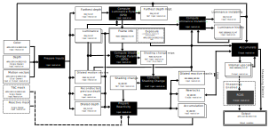

<!-- @page page_techniques_super-resolution-upscaler FidelityFX Super Resolution 3.1.3 Upscaler -->

<h1>FidelityFX Super Resolution 3.1.3 (FSR3) - Upscaler</h1>


AMD FidelityFX Super Resolution Upscaler is an open source, high-quality solution for producing high resolution frames from lower resolution inputs.

<h2>Table of contents</h2>

- [Introduction](#introduction)
- [Shading language requirements](#shading-language-requirements)
- [Integration guidelines](#integration-guidelines)
    - [Scaling modes](#scaling-modes)
    - [Performance](#performance)
    - [Memory requirements](#memory-requirements)
    - [Input resources](#input-resources)
    - [Depth buffer configurations](#depth-buffer-configurations)
    - [Providing motion vectors](#providing-motion-vectors)
    - [Reactive mask](#reactive-mask)
    - [Automatically generating reactivity](#automatically-generating-reactivity)
    - [Transparency and composition mask](#transparency-and-composition-mask)
    - [Exposure](#exposure)
    - [Placement in the frame](#placement-in-the-frame)
    - [Temporal Antialiasing](#temporal-antialiasing)
    - [Camera jitter](#camera-jitter)
    - [Camera jump cuts](#camera-jump-cuts)
    - [Mipmap biasing](#mipmap-biasing)
    - [Frame Time Delta Input](#frame-time-delta-input)
    - [HDR support](#hdr-support)
    - [Falling back to 32-bit floating point](#falling-back-to-32-bit-floating-point)
    - [64-wide wavefronts](#64-wide-wavefronts)
    - [Debug Checker](#debug-checker)
- [The technique](#the-technique)
    - [Algorithm structure](#algorithm-structure)
    - [Prepare Inputs](#prepare-inputs)
    - [Compute luminance pyramid](#compute-luminance-pyramid)
    - [Compute Shading Change Pyramid](#compute-shading-change-pyramid)
    - [Compute Shading Change](#compute-shading-change)
    - [Prepare Reactivity](#prepare-reactivity)
    - [Compute Luminance Instability](#compute-luminance-instability)
    - [Accumulate](#accumulate)
    - [Robust Contrast Adaptive Sharpening (RCAS)](#robust-contrast-adaptive-sharpening-rcas)
    - [Debug view](#debug-view)
- [Building the sample](#building-the-sample)
- [Limitations](#limitations)
- [Version history](#version-history)
- [References](#references)
- [See also](#see-also)

<h2>Introduction</h2>

**FidelityFX Super Resolution Upscaler** (or **FSR** for short) is a cutting-edge upscaling technique developed from the ground up to produce high resolution frames from lower resolution inputs.


FSR uses temporal feedback to reconstruct high-resolution images while maintaining and even improving image quality compared to native rendering.

FSR can enable "practical performance" for costly render operations, such as hardware ray tracing.

<h2>Shading language requirements</h2>

- `HLSL`
  - `CS_6_2`
  - `CS_6_6†`

† `CS_6_6` is used on some hardware which supports 64-wide wavefronts.

- Vulkan 1.x
- `GLSL 4.50` with the following extensions:
  - `GL_EXT_samplerless_texture_functions`
  - `GL_EXT_shader_image_load_formatted`

Note that the GLSL compiler must also support `GL_GOOGLE_include_directive` for `#include` handling used throughout the GLSL shader system.

<h2>Integration guidelines</h2>

FidelityFX Super Resolution Upscaler should be integrated using the [FidelityFX API](../getting-started/ffx-api.md) as described in the [combined FSR integration document](super-resolution-interpolation.md).#

The code samples and references in the rest of this section describe integration for platforms not supported by FidelityFX API.

<h3>Scaling modes</h3>
For the convenience of end users, the FSR API provides a number of preset scaling ratios which are named.

| Quality           | Per-dimension scaling factor |
|-------------------|------------------------------|
| NativeAA          | 1.0x                         |
| Quality           | 1.5x                         |
| Balanced          | 1.7x                         |
| Performance       | 2.0x                         |
| Ultra performance | 3.0x                         |

We strongly recommend that applications adopt consistent naming and scaling ratios in their user interface. This is to ensure that user experience is consistent for your application's users which may have experience of other applications using FSR.

<h3>Performance</h3>
Depending on your target hardware and operating configuration FSR will operate at different performance levels. FSR3.1 performance is slightly lower than FSR3.0 upscaler, in exchange for higher upscaling quality.


<h3>Memory requirements</h3>
Using FSR requires some additional GPU local memory to be allocated for consumption by the GPU. When using the FSR API, this memory is allocated when the FSR context is created, and is done so via the series of callbacks which comprise the backend interface. This memory is used to store intermediate surfaces which are computed by the FSR algorithm as well as surfaces which are persistent across many frames of the application. The table below includes the amount of memory used by FSR under various operating conditions. The "Working set" column indicates the total amount of memory used by FSR as the algorithm is executing on the GPU; this is the amount of memory FSR will require to run. The "Persistent memory" column indicates how much of the "Working set" column is required to be left intact for subsequent frames of the application; this memory stores the temporal data consumed by FSR. The "Aliasable memory" column indicates how much of the "Working set" column may be aliased by surfaces or other resources used by the application outside of the operating boundaries of FSR.

You can take control of resource creation in FSR by overriding the resource creation and destruction parts of the FSR backend interface, and forwarding the aliasing flags. This means that for a perfect integration of FSR, additional memory which is equal to the "Persistent memory" column of the table below is required depending on your operating conditions.

| Resolution | Quality                | Working set (MB) | Persistent memory (MB) | Aliasable memory (MB)   |
| -----------|------------------------|------------------|------------------------|-------------------------|
| 3840x2160  | Quality (1.5x)         | 218MB            |  183MB                 |  35MB                   |
|            | Balanced (1.7x)        | 174MB            |  145MB                 |  29MB                   |
|            | Performance (2x)       | 133MB            |  111MB                 |  22MB                   |
|            | Ultra performance (3x) |  58MB            |   48MB                 |  10MB                   |
| 2560x1440  | Quality (1.5x)         | 106MB            |   89MB                 |  17MB                   |
|            | Balanced (1.7x)        |  84MB            |   70MB                 |  14MB                   |
|            | Performance (2x)       |  61MB            |   51MB                 |  10MB                   |
|            | Ultra performance (3x) |  30MB            |   25MB                 |   5MB                   |
| 1920x1080  | Quality (1.5x)         |  61MB            |   51MB                 |  10MB                   |
|            | Balanced (1.7x)        |  47MB            |   39MB                 |   8MB                   |
|            | Performance (2x)       |  40MB            |   33MB                 |   7MB                   |
|            | Ultra performance (3x) |  17MB            |   14MB                 |   3MB                   |

Figures are approximations, rounded to nearest MB using an RX 6700XT GPU in DX12, and are subject to change.

<h3>Input resources</h3>
FSR is a temporal algorithm, and therefore requires access to data from both the current and previous frame. The following table enumerates all external inputs required by FSR.

The resolution column indicates if the data should be at 'rendered' resolution or 'presentation' resolution. 'Rendered' resolution indicates that the resource should match the resolution at which the application is performing its rendering. Conversely, 'presentation' indicates that the resolution of the target should match that which is to be presented to the user. All resources are from the current rendered frame, for DirectX(R)12 and Vulkan(R) applications all input resources should be transitioned to [`D3D12_RESOURCE_STATE_NON_PIXEL_SHADER_RESOURCE`](https://docs.microsoft.com/en-us/windows/win32/api/d3d12/ne-d3d12-d3d12_resource_states) and [`VK_ACCESS_SHADER_READ_BIT`](https://www.khronos.org/registry/vulkan/specs/1.3-extensions/man/html/VkAccessFlagBits.html) respectively before calling [`ffxFsr3UpscalerContextDispatch`](../../sdk/include/FidelityFX/host/ffx_fsr3upscaler.h#L348).

| Name            | Resolution                   |  Format                            | Type      | Notes                                          |
| ----------------|------------------------------|------------------------------------|-----------|------------------------------------------------|
| Color buffer    | Render                       | `APPLICATION SPECIFIED`            | Texture   | The render resolution color buffer for the current frame provided by the application. If the contents of the color buffer are in high dynamic range (HDR), then the [`FFX_FSR3UPSCALER_ENABLE_HIGH_DYNAMIC_RANGE`](../../sdk/include/FidelityFX/host/ffx_fsr3upscaler.h#L133) flag should be set in  the [`flags`](../../sdk/include/FidelityFX/host/ffx_fsr3upscaler.h#L163) field of the [`FfxFsr3UpscalerContextDescription`](../../sdk/include/FidelityFX/host/ffx_fsr3upscaler.h#L161) structure. |
| Depth buffer    | Render                       | `APPLICATION SPECIFIED (1x FLOAT)` | Texture   | The render resolution depth buffer for the current frame provided by the application. The data should be provided as a single floating point value, the precision of which is under the application's control. The configuration of the depth should be communicated to FSR via the [`flags`](../../sdk/include/FidelityFX/host/ffx_fsr3upscaler.h#L163) field of the [`FfxFsr3UpscalerContextDescription`](../../sdk/include/FidelityFX/host/ffx_fsr3upscaler.h#L161) structure when creating the [`FfxFsr3UpscalerContext`](../../sdk/include/FidelityFX/host/ffx_fsr3upscaler.h#L237). You should set the [`FFX_FSR3UPSCALER_ENABLE_DEPTH_INVERTED`](../../sdk/include/FidelityFX/host/ffx_fsr3upscaler.h#L136) flag if your depth buffer is inverted (that is [1..0] range), and you should set the [`FFX_FSR3UPSCALER_ENABLE_DEPTH_INFINITE`](../../sdk/include/FidelityFX/host/ffx_fsr3upscaler.h#L137) flag if your depth buffer has an infinite far plane. If the application provides the depth buffer in `D32S8` format, then FSR will ignore the stencil component of the buffer, and create an `R32_FLOAT` resource to address the depth buffer. On GCN and RDNA hardware, depth buffers are stored separately from stencil buffers. |
| Motion vectors  | Render or presentation       | `APPLICATION SPECIFIED (2x FLOAT)` | Texture   | The 2D motion vectors for the current frame provided by the application in **[<-width, -height> ... <width, height>]** range. If your application renders motion vectors with a different range, you may use the [`motionVectorScale`](../../sdk/include/FidelityFX/host/ffx_fsr3upscaler.h#L191) field of the [`FfxFsr3UpscalerDispatchDescription`](../../sdk/include/FidelityFX/host/ffx_fsr3upscaler.h#L180) structure to adjust them to match the expected range for FSR. Internally, FSR uses 16-bit quantities to represent motion vectors in many cases, which means that while motion vectors with greater precision can be provided, FSR will not benefit from the increased precision. The resolution of the motion vector buffer should be equal to the render resolution, unless the [`FFX_FSR3UPSCALER_ENABLE_DISPLAY_RESOLUTION_MOTION_VECTORS`](../../sdk/include/FidelityFX/host/ffx_fsr3upscaler.h#L134) flag is set in the [`flags`](../../sdk/include/FidelityFX/host/ffx_fsr3upscaler.h#L163) field of the [`FfxFsr3UpscalerContextDescription`](../../sdk/include/FidelityFX/host/ffx_fsr3upscaler.h#L161) structure when creating the [`FfxFsr3UpscalerContext`](../../sdk/include/FidelityFX/host/ffx_fsr3upscaler.h#L237), in which case it should be equal to the presentation resolution. |
| T&C mask        | Render                       | `R8_UNORM`                         | Texture   | Some areas if the rendered image may not have motion vectors matching the change in shading, especially for highly reflective surfaces, or objects with texture animation. In those cases using the T&C mask is a softer alternative compared to the reactive mask, as it only affects locks and color clamping, while the reactive mask reduces the influence of the history. |
| Reactive mask   | Render                       | `R8_UNORM`                         | Texture   | As some areas of a rendered image do not leave a footprint in the depth buffer or include motion vectors, FSR provides support for a reactive mask texture which can be used to indicate to FSR where such areas are. Good examples of these are particles, or alpha-blended objects which do not write depth or motion vectors. If this resource is not set, then FSR's shading change detection logic will handle these cases as best it can, but for optimal results, this resource should be set. For more information on the reactive mask please refer to the [Reactive mask](#reactive-mask) section.  |
| Exposure        | 1x1                          | `R32_FLOAT`                        | Texture   | A 1x1 texture containing the exposure value computed for the current frame. This resource is optional, and may be omitted if the [`FFX_FSR3UPSCALER_ENABLE_AUTO_EXPOSURE`](../../sdk/include/FidelityFX/host/ffx_fsr3upscaler.h#L138) flag is set in the [`flags`](../../sdk/include/FidelityFX/host/ffx_fsr3upscaler.h#L163) field of the [`FfxFsr3UpscalerContextDescription`](../../sdk/include/FidelityFX/host/ffx_fsr3upscaler.h#L161) structure when creating the [`FfxFsr3UpscalerContext`](../../sdk/include/FidelityFX/host/ffx_fsr3upscaler.h#L237).  |

All inputs that are provided at Render Resolution, except for motion vectors, should be rendered with jitter. Motion vectors should not have jitter applied, unless the `FFX_FSR_ENABLE_MOTION_VECTORS_JITTER_CANCELLATION` flag is present.

<h3>Depth buffer configurations</h3>

It is strongly recommended that an inverted, infinite depth buffer is used with FSR. However, alternative depth buffer configurations are supported. An application should inform the FSR API of its depth buffer configuration by setting the appropriate flags during the creation of the [`FfxFsr3UpscalerContext`](../../sdk/include/FidelityFX/host/ffx_fsr3upscaler.h#L237). The table below contains the appropriate flags.

| FSR flag                         | Note                                                                                       |
|----------------------------------|--------------------------------------------------------------------------------------------|
| [`FFX_FSR3UPSCALER_ENABLE_DEPTH_INVERTED`](../../sdk/include/FidelityFX/host/ffx_fsr3upscaler.h#L136) | A bit indicating that the input depth buffer data provided is inverted [max..0].           |
| [`FFX_FSR3UPSCALER_ENABLE_DEPTH_INFINITE`](../../sdk/include/FidelityFX/host/ffx_fsr3upscaler.h#L137) | A bit indicating that the input depth buffer data provided is using an infinite far plane. |


<h3>Providing motion vectors</h3>

<h4>Space</h4>

A key part of a temporal algorithm (be it antialiasing or upscaling) is the provision of motion vectors. FSR accepts motion vectors in 2D which encode the motion from a pixel in the current frame to the position of that same pixel in the previous frame. FSR expects that motion vectors are provided by the application in [**<-width, -height>**..**<width, height>**] range; this matches screenspace. For example, a motion vector for a pixel in the upper-left corner of the screen with a value of **<width, height>** would represent a motion that traversed the full width and height of the input surfaces, originating from the bottom-right corner.


If your application computes motion vectors in another space - for example normalized device coordinate space - then you may use the [`motionVectorScale`](../../sdk/include/FidelityFX/host/ffx_fsr3upscaler.h#L191) field of the [`FfxFsr3UpscalerDispatchDescription`](../../sdk/include/FidelityFX/host/ffx_fsr3upscaler.h#L180) structure to instruct FSR to adjust them to match the expected range for FSR. The code examples below illustrate how motion vectors may be scaled to screen space. The example HLSL and C++ code below illustrates how NDC-space motion vectors can be scaled using the FSR host API.

```HLSL
// GPU: Example of application NDC motion vector computation
float2 motionVector = (previousPosition.xy / previousPosition.w) - (currentPosition.xy / currentPosition.w);

// CPU: Matching FSR 2.0 motionVectorScale configuration
dispatchParameters.motionVectorScale.x = (float)renderWidth;
dispatchParameters.motionVectorScale.y = (float)renderHeight;
```

<h4>Precision & resolution </h4>

Internally, FSR uses 16-bit quantities to represent motion vectors in many cases, which means that while motion vectors with greater precision can be provided, FSR will not currently benefit from the increased precision. The resolution of the motion vector buffer should be equal to the render resolution, unless the [`FFX_FSR3UPSCALER_ENABLE_DISPLAY_RESOLUTION_MOTION_VECTORS`](../../sdk/include/FidelityFX/host/ffx_fsr3upscaler.h#L134) flag is set in the [`flags`](../../sdk/include/FidelityFX/host/ffx_fsr3upscaler.h#L163) field of the [`FfxFsr3UpscalerContextDescription`](../../sdk/include/FidelityFX/host/ffx_fsr3upscaler.h#L161) structure when creating the [`FfxFsr3UpscalerContext`](../../sdk/include/FidelityFX/host/ffx_fsr3upscaler.h#L237), in which case it should be equal to the presentation resolution.

<h4>Coverage</h4>

FSR will perform better quality upscaling when more objects provide their motion vectors. It is therefore advised that all opaque, alpha-tested and alpha-blended objects should write their motion vectors for all covered pixels. If vertex shader effects are applied - such as scrolling UVs - these calculations should also be factored into the calculation of motion for the best results. For alpha-blended objects it is also strongly advised that the alpha value of each covered pixel is stored to the corresponding pixel in the [reactive mask](#reactive-mask). This will allow FSR to perform better handling of alpha-blended objects during upscaling. The reactive mask is especially important for alpha-blended objects where writing motion vectors might be prohibitive, such as particles.

<h3>Reactive mask</h3>

In the context of FSR, the term "reactivity" means how much influence the samples rendered for the current frame have over the production of the final upscaled image. Typically, samples rendered for the current frame contribute a relatively modest amount to the result computed by FSR; however, there are exceptions. To produce the best results for fast moving, alpha-blended objects, FSR requires the [Reproject & accumulate](#accumulate) stage to become more reactive for such pixels. As there is no good way to determine from either color, depth or motion vectors which pixels have been rendered using alpha blending, FSR performs best when applications explicitly mark such areas.

Therefore, it is strongly encouraged that applications provide a reactive mask to FSR. The reactive mask guides FSR on where it should reduce its reliance on historical information when compositing the current pixel, and instead allow the current frame's samples to contribute more to the final result. The reactive mask allows the application to provide a value from [0.0..1.0] where 0.0 indicates that the pixel is not at all reactive (and should use the default FSR composition strategy), and a value of 1.0 indicates the pixel should be fully reactive. This is a floating point range and can be tailored to different situations.

While there are other applications for the reactive mask, the primary application for the reactive mask is producing better results of upscaling images which include alpha-blended objects. A good proxy for reactiveness is actually the alpha value used when compositing an alpha-blended object into the scene, therefore, applications should write `alpha` to the reactive mask. It should be noted that it is unlikely that a reactive value of close to 1 will ever produce good results. Therefore, we recommend clamping the maximum reactive value to around 0.9.

If a [Reactive mask](#reactive-mask) is not provided to FSR (by setting the [`reactive`](../../sdk/include/FidelityFX/host/ffx_fsr3upscaler.h#L187) field of [`FfxFsr3UpscalerDispatchDescription`](../../sdk/include/FidelityFX/host/ffx_fsr3upscaler.h#L180) to `NULL`) then an internally generated 1x1 texture with a cleared reactive value will be used.

<h3>Automatically generating reactivity</h3>

To help applications generate the [Reactive mask](#reactive-mask) and the [Transparency & composition mask](#transparency-and-composition-mask), FSR provides an optional helper API. Under the hood, the API launches a compute shader which computes these values for each pixel using a luminance-based heuristic.

Applications wishing to do this can call the [`FfxFsr3UpscalerContextGenerateReactiveMask`](../../sdk/include/FidelityFX/host/ffx_fsr3upscaler.h#L0) function and should pass two versions of the color buffer, one containing opaque only geometry, and the other containing both opaque and alpha-blended objects.

<h3>Transparency and composition mask</h3>

In addition to the [Reactive mask](#reactive-mask), FSR provides for the application to denote areas of other specialist rendering which should be accounted for during the upscaling process. Examples of such special rendering include areas of raytraced reflections or animated textures.

While the [Reactive mask](#reactive-mask) adjusts the accumulation balance, the [Transparency & composition mask](#transparency-and-composition-mask) adjusts the pixel history protection mechanisms. The mask also removes the effect of the luminance instability factor. A pixel with a value of 0 in the [Transparency & composition mask](#transparency-and-composition-mask) does not perform any additional modification to the lock for that pixel. Conversely, a value of 1 denotes that the lock for that pixel should be completely removed.

If a [Transparency & composition mask](#transparency-and-composition-mask) is not provided to FSR (by setting the [`transparencyAndComposition`](../../sdk/include/FidelityFX/host/ffx_fsr3upscaler.h#L188) field of [`FfxFsr3UpscalerDispatchDescription`](../../sdk/include/FidelityFX/host/ffx_fsr3upscaler.h#L180) to `NULL`) then an internally generated 1x1 texture with a cleared transparency and composition value will be used.

<h3>Exposure</h3>

FSR provides two values which control the exposure used when performing upscaling. They are as follows:

1. **Pre-exposure** a value by which we divide the input signal to get back to the original signal produced by the game before any packing into lower precision render targets.
2. **Exposure** a value which is multiplied against the result of the pre-exposed color value.

The exposure value should match that which the application uses during any subsequent tonemapping passes performed by the application. This means FSR will operate consistently with what is likely to be visible in the final tonemapped image.

> In various stages of the FSR algorithm described in this document, FSR will compute its own exposure value for internal use. It is worth noting that all outputs from FSR will have this internal tonemapping reversed before the final output is written. Meaning that FSR returns results in the same domain as the original input signal.

Poorly selected exposure values can have a drastic impact on the final quality of FSR's upscaling. Therefore, it is recommended that [`FFX_FSR3UPSCALER_ENABLE_AUTO_EXPOSURE`](../../sdk/include/FidelityFX/host/ffx_fsr3upscaler.h#L138) is used by the application, unless there is a particular reason not to. When [`FFX_FSR3UPSCALER_ENABLE_AUTO_EXPOSURE`](../../sdk/include/FidelityFX/host/ffx_fsr3upscaler.h#L138) is set in the [`flags`](../../sdk/include/FidelityFX/host/ffx_fsr3upscaler.h#L163) field of the [`FfxFsr3UpscalerContextDescription`](../../sdk/include/FidelityFX/host/ffx_fsr3upscaler.h#L161) structure, the exposure calculation shown in the HLSL code below is used to compute the exposure value, which matches the exposure response of ISO 100 film stock.

```HLSL
float ComputeAutoExposureFromAverageLog(float averageLogLuminance)
{
	const float averageLuminance = exp(averageLogLuminance);
	const float S = 100.0f; // ISO arithmetic speed
	const float K = 12.5f;
	const float exposureIso100 = log2((averageLuminance * S) / K);
	const float q = 0.65f;
	const float luminanceMax = (78.0f / (q * S)) * pow(2.0f, exposureIso100);
	return 1 / luminanceMax;
}
```

<h3>Placement in the frame</h3>

The primary goal of FSR is to improve application rendering performance by using a temporal upscaling algorithm relying on a number of inputs. Therefore, its placement in the pipeline is key to ensuring the right balance between the highest quality visual quality and great performance.


With any image upscaling approach is it important to understand how to place other image-space algorithms with respect to the upscaling algorithm. Placing these other image-space effects before the upscaling has the advantage that they run at a lower resolution, which of course confers a performance advantage onto the application. However, it may not be appropriate for some classes of image-space techniques. For example, many applications may introduce noise or grain into the final image, perhaps to simulate a physical camera. Doing so before an upscaler might cause the upscaler to amplify the noise, causing undesirable artifacts in the resulting upscaled image. The following table divides common real-time image-space techniques into two columns. 'Post processing A' contains all the techniques which typically would run before FSR's upscaling, meaning they would all run at render resolution. Conversely, the 'Post processing B' column contains all the techniques which are recommend to run after FSR, meaning they would run at the larger, presentation resolution.

| Post processing A              | Post processing B    |
|--------------------------------|----------------------|
| Screenspace reflections        | Film grain           |
| Screenspace ambient occlusion  | Chromatic aberration |
| Denoisers (shadow, reflections)| Vignette             |
| Exposure (optional)            | Tonemapping          |
|                                | Bloom                |
|                                | Depth of field       |
|                                | Motion blur          |

Please note that the recommendations here are for guidance purposes only and depend on the precise characteristics of your application's implementation.

<h3>Temporal Antialiasing</h3>

Temporal antialiasing (TAA) is a technique which uses the output of previous frames to construct a higher quality output from the current frame. As FSR has a similar goal - albeit with the additional goal of also increasing the resolution of the rendered image - there is no longer any need to include a separate TAA pass in your application.

<h3>Camera jitter</h3>

FSR relies on the application to apply sub-pixel jittering while rendering - this is typically included in the projection matrix of the camera. To make the application of camera jitter simple, the FSR API provides a small set of utility function which computes the sub-pixel jitter offset for a particular frame within a sequence of separate jitter offsets.

``` CPP
int32_t ffxFsr3UpscalerGetJitterPhaseCount(int32_t renderWidth, int32_t displayWidth);
FfxErrorCode ffxFsr3UpscalerGetJitterOffset(float* outX, float* outY, int32_t jitterPhase, int32_t sequenceLength);
```

Internally, these function implement a Halton[2,3] sequence [[Halton](#references)]. The goal of the Halton sequence is to provide spatially separated points, which cover the available space.


It is important to understand that the values returned from the [`ffxFsr3UpscalerGetJitterOffset`](../../sdk/include/FidelityFX/host/ffx_fsr3upscaler.h#L516) are in unit pixel space, and in order to composite this correctly into a projection matrix we must convert them into projection offsets. The diagram above shows a single pixel in unit pixel space, and in projection space. The code listing below shows how to correctly composite the sub-pixel jitter offset value into a projection matrix.

``` CPP
const int32_t jitterPhaseCount = ffxFsr3UpscalerGetJitterPhaseCount(renderWidth, displayWidth);

float jitterX = 0;
float jitterY = 0;
ffxFsr3UpscalerGetJitterOffset(&jitterX, &jitterY, index, jitterPhaseCount);

// Calculate the jittered projection matrix.
const float jitterX = 2.0f * jitterX / (float)renderWidth;
const float jitterY = -2.0f * jitterY / (float)renderHeight;
const Matrix4 jitterTranslationMatrix = translateMatrix(Matrix3::identity, Vector3(jitterX, jitterY, 0));
const Matrix4 jitteredProjectionMatrix = jitterTranslationMatrix * projectionMatrix;
```

Jitter should be applied to *all* rendering. This includes opaque, alpha transparent, and raytraced objects. For rasterized objects, the sub-pixel jittering values calculated by the [`ffxFsr3UpscalerGetJitterOffset`](../../sdk/include/FidelityFX/host/ffx_fsr3upscaler.h#L516) function can be applied to the camera projection matrix which is ultimately used to perform transformations during vertex shading. For raytraced rendering, the sub-pixel jitter should be applied to the ray's origin - often the camera's position.

Whether you elect to use the recommended [`ffxFsr3UpscalerGetJitterOffset`](../../sdk/include/FidelityFX/host/ffx_fsr3upscaler.h#L516) function or your own sequence generator, you must set the [`jitterOffset`](../../sdk/include/FidelityFX/host/ffx_fsr3upscaler.h#L190) field of the [`FfxFsr3UpscalerDispatchDescription`](../../sdk/include/FidelityFX/host/ffx_fsr3upscaler.h#L180) structure to inform FSR of the jitter offset that has been applied in order to render each frame. Moreover, if not using the recommended [`ffxFsr3UpscalerGetJitterOffset`](../../sdk/include/FidelityFX/host/ffx_fsr3upscaler.h#L516) function, care should be taken that your jitter sequence never generates a null vector; that is value of 0 in both the X and Y dimensions.

The table below shows the jitter sequence length for each of the default quality modes.

 | Quality mode      | Scaling factor          | Sequence length |
 |-------------------|-------------------------|-----------------|
 | Quality           | 1.5x (per dimension)    | 18              |
 | Balanced          | 1.7x (per dimension)    | 23              |
 | Performance       | 2.0x (per dimension)    | 32              |
 | Ultra performance | 3.0x (per dimension)    | 72              |
 | Custom            | [1..n]x (per dimension) | `ceil(8 * n^2)` |

<h3>Camera jump cuts</h3>

Most applications with real-time rendering have a large degree of temporal consistency between any two consecutive frames. However, there are cases where a change to a camera's transformation might cause an abrupt change in what is rendered. In such cases, FSR is unlikely to be able to reuse any data it has accumulated from previous frames, and should clear this data such to exclude it from consideration in the compositing process. In order to indicate to FSR that a jump cut has occurred with the camera you should set the [`reset`](../../sdk/include/FidelityFX/host/ffx_fsr3upscaler.h#L198) field of the [`FfxFsr3UpscalerDispatchDescription`](../../sdk/include/FidelityFX/host/ffx_fsr3upscaler.h#L180) structure to `true` for the first frame of the discontinuous camera transformation.

Rendering performance may be slightly less than typical frame-to-frame operation when using the reset flag, as FSR will clear some additional internal resources.

<h3>Mipmap biasing</h3>

Applying a negative mipmap biasing will typically generate an upscaled image with better texture detail. We recommend applying the following formula to your Mipmap bias:

``` CPP
mipBias = log2(renderResolution/displayResolution) - 1.0;
```

It is suggested that applications adjust the MIP bias for specific high-frequency texture content which is susceptible to showing temporal aliasing issues.

The following table illustrates the mipmap biasing factor which results from evaluating the above pseudocode for the scaling ratios matching the suggested quality modes that applications should expose to end users.

 | Quality mode      | Scaling factor        | Mipmap bias |
 |-------------------|-----------------------|-------------|
 | Quality           | 1.5X (per dimension)  | -1.58       |
 | Balanced          | 1.7X (per dimension)  | -1.76       |
 | Performance       | 2.0X (per dimension)  | -2.0        |
 | Ultra performance | 3.0X (per dimension)  | -2.58       |

<h3>Frame Time Delta Input</h3>

The FSR API requires [`frameTimeDelta`](../../sdk/include/FidelityFX/host/ffx_fsr3upscaler.h#L196) be provided by the application through the [`FfxFsr3UpscalerDispatchDescription`](../../sdk/include/FidelityFX/host/ffx_fsr3upscaler.h#L180) structure. This value is in __milliseconds__: if running at 60fps, the value passed should be around __16.6f__.

The value is used within the temporal component of the FSR 2 auto-exposure feature. This allows for tuning of the history accumulation for quality purposes.

<h3>HDR support</h3>

High dynamic range images are supported in FSR. To enable this, you should set the [`FFX_FSR3UPSCALER_ENABLE_HIGH_DYNAMIC_RANGE`](../../sdk/include/FidelityFX/host/ffx_fsr3upscaler.h#L133) bit in the [`flags`](../../sdk/include/FidelityFX/host/ffx_fsr3upscaler.h#L163) field of the [`FfxFsr3UpscalerContextDescription`](../../sdk/include/FidelityFX/host/ffx_fsr3upscaler.h#L161) structure. Images should be provided to FSR in linear color space.

> Support for additional color spaces might be provided in a future revision of FSR.

<h3>Falling back to 32-bit floating point</h3>

FSR was designed to take advantage of half precision (FP16) hardware acceleration to achieve the highest possible performance. However, to provide the maximum level of compatibility and flexibility for applications, FSR also includes the ability to compile the shaders using full precision (FP32) operations.

It is recommended to use the FP16 version of FSR on all hardware which supports it. You can query your graphics card's level of support for FP16 by querying the [`D3D12_FEATURE_DATA_SHADER_MIN_PRECISION_SUPPORT`](https://docs.microsoft.com/en-us/windows/win32/api/d3d12/ne-d3d12-d3d12_shader_min_precision_support) capability in DirectX(R)12 - you should check that the `D3D[11/12]_SHADER_MIN_PRECISION_16_BIT` is set, and if it is not, fallback to the FP32 version of FSR. For Vulkan, if [`VkPhysicalDeviceFloat16Int8FeaturesKHR::shaderFloat16`](https://khronos.org/registry/vulkan/specs/1.3-extensions/man/html/VkPhysicalDeviceShaderFloat16Int8FeaturesKHR.html) is not set, then you should fallback to the FP32 version of FSR. Similarly, if [`VkPhysicalDevice16BitStorageFeatures::storageBuffer16BitAccess`](https://www.khronos.org/registry/vulkan/specs/1.3-extensions/man/html/VkPhysicalDevice16BitStorageFeatures.html) is not set, you should also fallback to the FP32 version of FSR.

To enable the FP32 path in the FSR shader source code, you should define `FFX_HALF` to be `1`. In order to share the majority of the algorithm's source code between both FP16 and FP32 (ensuring a high level of code sharing to support ongoing maintenance), you will notice that the FSR shader source code uses a set of type macros which facilitate easy switching between 16-bit and 32-bit base types in the shader source.

| FidelityFX type | FP32        | FP16            |
|-----------------|-------------|-----------------|
| `FFX_MIN16_F`   | `float`     | `min16float`    |
| `FFX_MIN16_F2`  | `float2`    | `min16float2`   |
| `FFX_MIN16_F3`  | `float3`    | `min16float3`   |
| `FFX_MIN16_F4`  | `float4`    | `min16float4`   |

The table above enumerates the mappings between the abstract FidelityFX SDK types, and the underlaying intrinsic type which will be substituted depending on the configuration of the shader source during compilation.

<h3>64-wide wavefronts</h3>

Modern GPUs execute collections of threads - called wavefronts - together in a SIMT fashion. The precise number of threads which constitute a single wavefront is a hardware-specific quantity. Some hardware, such as AMD's GCN and RDNA-based GPUs support collecting 64 threads together into a single wavefront. Depending on the precise characteristics of an algorithm's execution, it may be more or less advantageous to prefer a specific wavefront width. With the introduction of Shader Model 6.6, Microsoft added the ability to specific the width of a wavefront via HLSL. For hardware, such as RDNA which supports both 32 and 64 wide wavefront widths, this is a very useful tool for optimization purposes, as it provides a clean and portable way to ask the driver software stack to execute a wavefront with a specific width.

For DirectX(R)12 based applications which are running on RDNA and RDNA2-based GPUs and using the Microsoft Agility SDK, the FSR host API will select a 64-wide wavefront width.

<h3>Debug Checker</h3>

The context description structure can be provided with a callback function for passing textual warnings from the FSR 2 runtime to the underlying application. The `fpMessage` member of the description is of type `FfxFsr3UpscalerMessage` which is a function pointer for passing string messages of various types. Assigning this variable to a suitable function, and passing the [`FFX_FSR3UPSCALER_ENABLE_DEBUG_CHECKING`](../../sdk/include/FidelityFX/host/ffx_fsr3upscaler.h#L141) flag within the flags member of [`FfxFsr3UpscalerContextDescription`](../../sdk/include/FidelityFX/host/ffx_fsr3upscaler.h#L161) will enable the feature. It is recommended this is enabled only in debug development builds.

An example of the kind of output that can occur when the checker observes possible issues is below:

```
FSR_API_DEBUG_WARNING: FFX_FSR_ENABLE_DEPTH_INFINITE and FFX_FSR_ENABLE_DEPTH_INVERTED present, cameraFar value is very low which may result in depth separation artefacting
FSR_API_DEBUG_WARNING: frameTimeDelta is less than 1.0f - this value should be milliseconds (~16.6f for 60fps)
```

<h2>The technique</h2>

<h3>Algorithm structure</h3>
The FSR algorithm is implemented in a series of stages, which are as follows:

1. [Prepare Inputs](#prepare-inputs)
2. [Compute luminance pyramid](#compute-luminance-pyramid)
3. [Compute Shading Change Pyramid](#compute-shading-change-pyramid)
4. [Compute Shading Change](#compute-shading-change)
5. [Prepare Reactivity](#prepare-reactivity)
6. [Compute Luma Instability](#compute-luma-instability)
7. [Accumulate](#accumulate)
8. [(Optional) Robust Contrast Adaptive Sharpening (RCAS)](#robust-contrast-adaptive-sharpening-rcas)

Each pass stage of the algorithm is laid out in the sections following this one, but the data flow for the complete FSR algorithm is shown in the diagram below.



<h3>Prepare Inputs</h3>

The [prepare inputs](#prepare-inputs) stage consumes the applications color, depth buffer and motion vectors, and produces a reconstructed and dilated depth buffer for the previous frame, together with a dilated set of motion vectors in UV space. It also produces farthest and nearest dilated depth buffers and computes luminance for the current color buffer. The stage runs at render resolution.


<h4>Resource inputs</h4>

The following table contains all of the resources which are required by the prepared inputs stage.

> The temporal layer indicates which frame the data should be sourced from. 'Current frame' means that the data should be sourced from resources created for the frame that is to be presented next. 'Previous frame' indicates that the data should be sourced from resources which were created for the frame that has just presented. The resolution column indicates if the data should be at 'rendered' resolution or 'presentation' resolution. 'Rendered' resolution indicates that the resource should match the resolution at which the application is performing its rendering. Conversely, 'presentation' indicates that the resolution of the target should match that which is to be presented to the user.

| Name                        |  Temporal layer | Resolution |  Format                            | Type      | Notes                                          |
| ----------------------------|-----------------|------------|------------------------------------|-----------|------------------------------------------------|
| Color buffer                | Current frame   | Render       | `APPLICATION SPECIFIED`   | Texture   | The render resolution color buffer for the current frame provided by the application. If the contents of the color buffer are in high dynamic range (HDR), then the [`FFX_FSR3UPSCALER_ENABLE_HIGH_DYNAMIC_RANGE`](../../sdk/include/FidelityFX/host/ffx_fsr3upscaler.h#L133) flag should be set in  the [`flags`](../../sdk/include/FidelityFX/host/ffx_fsr3upscaler.h#L163) field of the [`FfxFsr3UpscalerContextDescription`](../../sdk/include/FidelityFX/host/ffx_fsr3upscaler.h#L161) structure. |
| Depth buffer                | Current frame   | Render     | `APPLICATION SPECIFIED (1x FLOAT)` | Texture   | The render resolution depth buffer for the current frame provided by the application. The data should be provided as a single floating point value, the precision of which is under the application's control. The configuration of the depth should be communicated to FSR via the [`flags`](../../sdk/include/FidelityFX/host/ffx_fsr3upscaler.h#L163) field of the [`FfxFsr3UpscalerContextDescription`](../../sdk/include/FidelityFX/host/ffx_fsr3upscaler.h#L161) structure when creating the [`FfxFsr3UpscalerContext`](../../sdk/include/FidelityFX/host/ffx_fsr3upscaler.h#L237). You should set the [`FFX_FSR3UPSCALER_ENABLE_DEPTH_INVERTED`](../../sdk/include/FidelityFX/host/ffx_fsr3upscaler.h#L136) flag if your depth buffer is inverted (that is [1..0] range), and you should set the  flag if your depth buffer has as infinite far plane. If the application provides the depth buffer in `D32S8` format, then FSR will ignore the stencil component of the buffer, and create an `R32_FLOAT` resource to address the depth buffer. On GCN and RDNA hardware, depth buffers are stored separately from stencil buffers. |
| Motion vectors              | Current frame  | Render or presentation       | `APPLICATION SPECIFIED (2x FLOAT)` | Texture   | The 2D motion vectors for the current frame provided by the application in [*<-width, -height>*..*<width, height>*] range. If your application renders motion vectors with a different range, you may use the [`motionVectorScale`](../../sdk/include/FidelityFX/host/ffx_fsr3upscaler.h#L191) field of the [`FfxFsr3UpscalerDispatchDescription`](../../sdk/include/FidelityFX/host/ffx_fsr3upscaler.h#L180) structure to adjust them to match the expected range for FSR. Internally, FSR uses 16bit quantities to represent motion vectors in many cases, which means that while motion vectors with greater precision can be provided, FSR will not benefit from the increased precision. The resolution of the motion vector buffer should be equal to the render resolution, unless the [`FFX_FSR3UPSCALER_ENABLE_DISPLAY_RESOLUTION_MOTION_VECTORS`](../../sdk/include/FidelityFX/host/ffx_fsr3upscaler.h#L134) flag is set in the [`flags`](../../sdk/include/FidelityFX/host/ffx_fsr3upscaler.h#L163) field of the [`FfxFsr3UpscalerContextDescription`](../../sdk/include/FidelityFX/host/ffx_fsr3upscaler.h#L161) structure when creating the [`FfxFsr3UpscalerContext`](../../sdk/include/FidelityFX/host/ffx_fsr3upscaler.h#L244), in which case it should be equal to the presentation resolution. |

<h4>Resource outputs</h4>

The following table contains all of the resources which are produced by the prepare inputs stage.

> The temporal layer indicates which frame the data should be sourced from. 'Current frame' means that the data should be sourced from resources created for the frame that is to be presented next. 'Previous frame' indicates that the data should be sourced from resources which were created for the frame that has just presented. The resolution column indicates if the data should be at 'rendered' resolution or 'presentation' resolution. 'Rendered' resolution indicates that the resource should match the resolution at which the application is performing its rendering. Conversely, 'presentation' indicates that the resolution of the target should match that which is to be presented to the user.

| Name                                | Temporal layer  | Resolution |  Format                | Type      | Notes                                  |
| ------------------------------------|-----------------|------------|------------------------|-----------|------------------------------------------------|
| Reconstructed previous depth buffer | Current frame   | Render     | `R32_UINT`             | Texture   | A texture containing the reconstructed previous frame depth values. This surface should first be cleared, see the Adjust input color stage for details.  |
| Dilated depth                       | Current frame   | Render     | `R32_FLOAT`            | Texture   | A texture containing dilated closest depth values computed from the application's depth buffer. |
| Farthest depth                      | Current frame   | Render     | `R16_FLOAT`            | Texture   | A texture containing depth values computed from the application's depth buffer. |
| Dilated motion vectors              | Current frame   | Render     | `R16G16_FLOAT`         | Texture   | A texture containing dilated 2D motion vectors computed from the application's 2D motion vector buffer. The red and green channel contains the two-dimensional motion vectors in NDC space. |
| Luminance                           | Current frame   | Render     | `R16_FLOAT`            | Texture   | A texture containing the luminance of the input color image. |

<h4>Description</h4>

The first step of the [Prepare Inputs](#prepare-inputs) stage is to compute the dilated depth values and motion vectors from the application's depth values and motion vectors for the current frame. Dilated depth values and motion vectors emphasise the edges of geometry which has been rendered into the depth buffer. This is because the edges of geometry will often introduce discontinuities into a contiguous series of depth values, meaning that as depth values and motion vectors are dilated, they will naturally follow the contours of the geometric edges present in the depth buffer. In order to compute the dilated depth values and motion vectors, FSR looks at the depth values for a 3x3 neighbourhood for each pixel and then selects the depth values and motion vectors in that neighbourhood where the depth value is nearest to the camera. In the diagram below, you can see how the central pixel of the 3x3 kernel is updated with the depth value and motion vectors from the pixel with the largest depth value - the pixel on the central, right hand side.

As this stage is the first time that motion vectors are consumed by FSR, this is where motion vector scaling is applied if using the FSR host API. Motion vector scaling factors provided via the [`motionVectorScale`](../../sdk/include/FidelityFX/host/ffx_fsr3upscaler.h#L191) field of the [`FfxFsr3UpscalerDispatchDescription`](../../sdk/include/FidelityFX/host/ffx_fsr3upscaler.h#L180) structure and allows you to transform non-screenspace motion vectors into screenspace motion vectors which FSR expects.

``` CPP
// An example of how to manipulate motion vector scaling factors using the FSR host API.
FfxFSRDispatchParameters dispatchParams = { 0 };
dispatchParams.motionVectorScale.x = renderWidth;
dispatchParams.motionVectorScale.y = renderHeight;
```

With the dilated motion vectors, we can now approximately reproject each pixel in the current frame's depth buffer to the location the corresponding geometry was in the previous frame. This is done by applying the dilated motion vector to the UV coordinate to get the previous frames UV coordinate. Then the current depth value gets written into the 4 pixels in the Reconstructed previous depth buffer, which the previous frames UV lies in between. As it is possible for many pixels to reproject into the same pixel in the previous depth buffer, atomic operations are used in order to resolve the value of the nearest depth value for each pixel. This is done using the [`InterlockedMax`](https://docs.microsoft.com/en-us/windows/win32/direct3dhlsl/interlockedmax) or [`InterlockedMin`](https://docs.microsoft.com/en-us/windows/win32/direct3dhlsl/interlockedmin) operation (the choice depending on if the application's depth buffer is inverted or not). Note, that this operation does not result in a depth buffer matching the previous frame, since motion along the z-axis is not taken into account, but it is still sufficiently good to compute occlusion/disocclusion.


When using the FSR API, the application's depth buffer and the application's velocity buffer must be specified as separate resources as per the [Resource inputs](#resource-inputs) table above. However, if you are undertaking a bespoke integration into your application, this constraint may be relaxed. Take care that the performance characteristics of this pass do not change if moving to a format for the motion vector texture which is more sparse, e.g.: as part of a packed g-buffer in a deferred renderer.

The final task of the [prepare inputs](#prepare-inputs) stage is to read the jittered input color, compute the luminance value and stores it in the Luminance texture.

<h3>Compute luminance pyramid</h3>

The [Compute luminance pyramid](#compute-luminance-pyramid) stage has two responsibilities:

1. To compute the input color's exposure, log(luminance) and scene average luminance values, which get stored in FrameInfo. This is used by prepare reactivity, compute luminance instability and accumulation passes.
2. To compute a half resolution version of the farthest depth map, which will be used in accumulation stage.

<h4>Resource inputs</h4>

The following table contains all resources consumed by the [Compute luminance pyramid](#compute-luminance-pyramid) stage.

> The temporal layer indicates which frame the data should be sourced from. 'Current frame' means that the data should be sourced from resources created for the frame that is to be presented next. 'Previous frame' indicates that the data should be sourced from resources which were created for the frame that has just presented. The resolution column indicates if the data should be at 'rendered' resolution or 'presentation' resolution. 'Rendered' resolution indicates that the resource should match the resolution at which the application is performing its rendering. Conversely, 'presentation' indicates that the resolution of the target should match that which is to be presented to the user.

| Name            | Temporal layer  | Resolution   |  Format     | Type      | Notes                                        |
| ----------------|-----------------|--------------|-------------|-----------|----------------------------------------------|
| Farthest depth  | Current frame   | Render       | `R16_FLOAT` | Texture   | A texture containing a dilated, reduced resolution veraion of the applications depth buffer. |
| Luminance       | Current frame   | Render       | `R16_FLOAT` | Texture   | A texture containing the luminance of the input color image. Please note: this texture is part of an array of two textures. The selection of which texture in the array is used for input and output is swapped each frame. |

<h4>Resource outputs</h4>

The following table contains all resources produced or modified by the [Compute luminance pyramid](#compute-luminance-pyramid) stage.

> The temporal layer indicates which frame the data should be sourced from. 'Current frame' means that the data should be sourced from resources created for the frame that is to be presented next. 'Previous frame' indicates that the data should be sourced from resources which were created for the frame that has just presented. The resolution column indicates if the data should be at 'rendered' resolution or 'presentation' resolution. 'Rendered' resolution indicates that the resource should match the resolution at which the application is performing its rendering. Conversely, 'presentation' indicates that the resolution of the target should match that which is to be presented to the user.

| Name                        | Temporal layer  | Resolution       |  Format                 | Type      | Notes                                        |
| ----------------------------|-----------------|------------------|-------------------------|-----------|----------------------------------------------|
| FrameInfo                   | Current frame   | 1x1              | `R32G32B32A32_FLOAT`    | Texture   | A 1x1 texture containing the exposure value as well as the log(luminance) and scene average luminance computed for the current frame. The automatic exposure value is optional, and may be omitted if the [`FFX_FSR_ENABLE_AUTO_EXPOSURE`](../../sdk/include/FidelityFX/host/ffx_fsr3upscaler.h#L0) flag is not set in the [`flags`](../../sdk/include/FidelityFX/host/ffx_fsr3upscaler.h#L163) field of the [`FfxFsr3UpscalerContextDescription`](../../sdk/include/FidelityFX/host/ffx_fsr3upscaler.h#L161) structure when creating the [`FfxFsr3UpscalerContext`](../../sdk/include/FidelityFX/host/ffx_fsr3upscaler.h#L237).  |
| Farthest Depth Mip1         | Current frame   | Half-Render   | `R16_FLOAT`             | Texture   | A texture at 50% of render resolution texture which contains averaged farthest depth. |

<h4>Description</h4>

The [Compute luminance pyramid](#compute-luminance-pyramid) stage is implemented using FidelityFX [Single Pass Downsampler](https://github.com/GPUOpen-Effects/FidelityFX-SPD), an optimized technique for producing mipmap chains using a single compute shader dispatch. Instead of the conventional (full) pyramidal approach, SPD provides a mechanism to produce a specific set of mipmap levels for an arbitrary input texture, as well as performing arbitrary calculations on that data as we store it to the target location in memory. In FSR, we are interested in producing in upto two intermediate resources depending on the configuration of the [`FfxFsr3UpscalerContext`](../../sdk/include/FidelityFX/host/ffx_fsr3upscaler.h#L237). The first resource is a low-resolution representation of the current luminance, this is used later in FSR to attempt to detect shading changes. The second is the exposure value, and while it is always computed, it is only used by subsequent stages if the [`FFX_FSR3UPSCALER_ENABLE_AUTO_EXPOSURE`](../../sdk/include/FidelityFX/host/ffx_fsr3upscaler.h#L138) flag is set in the [`flags`](../../sdk/include/FidelityFX/host/ffx_fsr3upscaler.h#L163) field of the [`FfxFsr3UpscalerContextDescription`](../../sdk/include/FidelityFX/host/ffx_fsr3upscaler.h#L161) structure upon context creation. The exposure value - either from the application, or the [Compute luminance pyramid](#compute-luminance-pyramid) stage - is used in the Adjust input color stage of FSR, as well as by the [Reproject & Accumulate](#accumulate) stage. The 3rd value is the farthest depth computed by dilating the depth buffer in [Prepare Inputs](#prepare-inputs) stage.
After the first reduction stage, which averages the 3 values, FarthestDepthMip1 gets written. The remaining passes downscale luminance until the autoexposure value can be written in the 1x1 output texture.


As used by FSR, SPD is configured to write only to the 2nd (half resolution) mipmap level of the farthest depth map and the last (1x1) mipmap level of luminance/exposure. Additionaly the algorithm requires the 6th mipmap level to be written to synchronize all threadgroups, and switch to computing the tail of the mip-chain in a single worgroup. For more details, please refer to the documentation of SPD.
Moreover, different calculations are applied at each of these levels to calculate the quantities required by subsequent stages of the FSR algorithm. This means the rest of the mipmap chain is not required to be backed by GPU local memory (or indeed any type of memory).

<h3>Compute Shading Change Pyramid</h3>

The [Compute shading change pyramid](#compute-shading-change-pyramid) stage consumes the dilated motion vectors as well as current and previous luminance, and produces a full mipmap chain containing luminance change since revious frame. The stage runs at half render resolution.

<h4>Resource inputs</h4>

The following table contains all of the resources which are required by the [compute shading change pyramid](#compute-shading-change-pyramid) stage.

> The temporal layer indicates which frame the data should be sourced from. 'Current frame' means that the data should be sourced from resources created for the frame that is to be presented next. 'Previous frame' indicates that the data should be sourced from resources which were created for the frame that has just presented. The resolution column indicates if the data should be at 'rendered' resolution or 'presentation' resolution. 'Rendered' resolution indicates that the resource should match the resolution at which the application is performing its rendering. Conversely, 'presentation' indicates that the resolution of the target should match that which is to be presented to the user.

| Name                        |  Temporal layer | Resolution |  Format        | Type      | Notes                                          |
| ----------------------------|-----------------|------------|----------------|-----------|------------------------------------------------|
| Luminance                   | Current frame   | Render     | `R16_FLOAT`    | Texture   | The render resolution luminance buffer for the current frame. This texture gets computed in the prepare input pass. |
| Luminance                   | Previous frame  | Render     | `R16_FLOAT`    | Texture   | The render resolution luminance buffer for the previous frame. This texture was computed in the prepare input pass of the previous frame. |
| Dilated motion vectors      | Current frame  | Render     | `R16G16_FLOAT` | Texture   | The dilated 2D motion vectors for the current frame computed from the motion vectors provided by the application in prepare inputs. |

<h4>Resource outputs</h4>

The following table contains all of the resources which are produced by the compute shading change pyramid stage.

> The temporal layer indicates which frame the data should be sourced from. 'Current frame' means that the data should be sourced from resources created for the frame that is to be presented next. 'Previous frame' indicates that the data should be sourced from resources which were created for the frame that has just presented. The resolution column indicates if the data should be at 'rendered' resolution or 'presentation' resolution. 'Rendered' resolution indicates that the resource should match the resolution at which the application is performing its rendering. Conversely, 'presentation' indicates that the resolution of the target should match that which is to be presented to the user.

| Name                | Temporal layer  | Resolution  |  Format        | Type    | Notes     |
| --------------------|-----------------|-------------|----------------|---------|-----------|
| Shading change mips | Current frame   | Half-Render | `R16G16_FLOAT` | Texture | A texture containing the shading change since last frame, including a full mip chain. The first channel contains the minimum difference in luminance, the second channel contains the averaged sign of the luminance difference, so it represents the direction of local luminance changes. For example a value of 1.0 in the second channel means all pixels had got brighter, -1.0 means all pixels got darker. A value of 0.0 could still mean all pixels had major changes, but not in the same direction. |

<h4>Description</h4>

The [Compute shading change pyramid](#compute-shading-change-pyramid) stage is implemented using FidelityFX [Single Pass Downsampler](https://github.com/GPUOpen-Effects/FidelityFX-SPD), an optimized technique for producing mipmap chains using a single compute shader dispatch. Instead of the conventional (full) pyramidal approach, SPD provides a mechanism to produce a specific set of mipmap levels for an arbitrary input texture, as well as performing arbitrary calculations on that data as we store it to the target location in memory. In FSR, we are interested in producing in upto two intermediate resources depending on the configuration of the [`FfxFsr3UpscalerContext`](../../sdk/include/FidelityFX/host/ffx_fsr3upscaler.h#L237). On loading the resources this pass loads the current and previous frames luminance values (using the dilated motion vectors to load the previous frames data) and computes the minimum relative difference of the luminance inside the quad. It also computes the sign of the minimum difference.
The subsequent passes compute the next mip map from the previous by simple averaging. This results in an average shading change and a value proportional to how many pixels contained shading changes.

<h3>Compute Shading Change</h3>

The [Compute Shading Change](#compute-shading-change) stage computes the averaged shading change by combining the layers of the shading change mip chain into a single layer.

This stage runs at half render resolution.

<h4>Resource inputs</h4>

The following table contains all the resources which are consumed by the [Compute Shading Change](#compute-shading-change) stage.

> The temporal layer indicates which frame the data should be sourced from. 'Current frame' means that the data should be sourced from resources created for the frame that is to be presented next. 'Previous frame' indicates that the data should be sourced from resources which were created for the frame that has just presented. The resolution column indicates if the data should be at 'rendered' resolution or 'presentation' resolution. 'Rendered' resolution indicates that the resource should match the resolution at which the application is performing its rendering. Conversely, 'presentation' indicates that the resolution of the target should match that which is to be presented to the user.

| Name                                | Temporal layer  | Resolution  |  Format        | Type    | Notes                                 |
| ------------------------------------|-----------------|-------------|----------------|---------|------------------------------------------------|
| Shading change mips                 | Current frame   | Half-Render | `R16G16_FLOAT` | Texture | A texture containing a full mip chain of values describing how much shading changed and how consistent the change was throughout the area covered by a pixel. |

<h4>Resource outputs</h4>

The following table contains all the resources which are produced by the [Compute Shading Change](#compute-shading-change) stage.

> The temporal layer indicates which frame the data should be sourced from. 'Current frame' means that the data should be sourced from resources created for the frame that is to be presented next. 'Previous frame' indicates that the data should be sourced from resources which were created for the frame that has just presented. The resolution column indicates if the data should be at 'rendered' resolution or 'presentation' resolution. 'Rendered' resolution indicates that the resource should match the resolution at which the application is performing its rendering. Conversely, 'presentation' indicates that the resolution of the target should match that which is to be presented to the user.

| Name           | Temporal layer | Resolution |  Format    | Type    | Notes                                 |
| ---------------|----------------|------------|------------|---------|---------------------------------------|
| Shading Change | Current frame  | Render     | `R8_UNORM` | Texture | A texture containing information how much shading changed in the vicinity of each pixel.|

<h4>Description</h4>

To to generate the shading change rate this pass computes the absolute shading change and multiplies it with the consistency. The maximum of this value over all mip levels is then stored as the shading change value.

<h3>Prepare Reactivity</h3>

This [Prepare Reactivity](#prepare-reactivity) stage is responsible for computing the reactivity, i.e. a value that defines how the previous frames color and the current samples should get blended together to compute the final output values. For this purpose it computes the final reactive mask by computing the shading change value computed in the [Compute Shading Change](#compute-shading-change) stage with the optional T&C and Reactive masks. It also computes the disocclusion mask, computes new locks and updates the accumulation value.

This stage runs at render resolution.

<h4>Resource inputs</h4>

The following table contains all resources consumed by the [Prepare Reactivity](#prepare-reactivity) stage.

> The temporal layer indicates which frame the data should be sourced from. 'Current frame' means that the data should be sourced from resources created for the frame that is to be presented next. 'Previous frame' indicates that the data should be sourced from resources which were created for the frame that has just presented. The resolution column indicates if the data should be at 'rendered' resolution or 'presentation' resolution. 'Rendered' resolution indicates that the resource should match the resolution at which the application is performing its rendering. Conversely, 'presentation' indicates that the resolution of the target should match that which is to be presented to the user.

| Name                         | Temporal layer  | Resolution        |  Format              | Type    | Notes |
| -----------------------------|-----------------|-------------------|----------------------|---------|-------|
| Luminance                    | Current frame   | Render            | `R16_FLOAT`          | Texture | A texture containing luminance data to be consumed by the lock stage. |
| FrameInfo                    | Current frame   | 1x1               | `R32G32B32A32_FLOAT` | Texture   | A 1x1 texture containing the exposure value as well as the log(luminance) and scene average luminance computed for the current frame. The automatic exposure value is optional, and may be omitted if the [`FFX_FSR3UPSCALER_ENABLE_AUTO_EXPOSURE`](../../sdk/include/FidelityFX/host/ffx_fsr3upscaler.h#L138) flag is not set in the [`flags`](../../sdk/include/FidelityFX/host/ffx_fsr3upscaler.h#L163) field of the [`FfxFsr3UpscalerContextDescription`](../../sdk/include/FidelityFX/host/ffx_fsr3upscaler.h#L161) structure when creating the [`FfxFsr3UpscalerContext`](../../sdk/include/FidelityFX/host/ffx_fsr3upscaler.h#L237).  |
| Dilated Motion Vectors       | Current frame   | Render            | `R16G16_FLOAT`       | Texture | A texture containing dilated game motion vectors. |
| Reconstructed Previous Depth | Current frame   | Render            | `R32_UINT`           | Texture | A texture containing the estimated depth of the previous frame, computed from currend depth buffer and game motion vectors. |
| Dilated Depth                | Current frame   | Render            | `R32_FLOAT`          | Texture | A texture containing dilated depth values. |
| Shading Change               | Current frame   | Half-Render       | `R8_UNORM`           | Texture | A texture containing the current shading change factor computed from luminance change from previous to current frame. |
| Accumulation                 | Previous frame  | Render            | `R8_UNORM`           | Texture | A texture containing an accumulation value mainly based on disocclusion, shading change and reactive mask. Please note: this texture is part of an array of two textures. The selection of which texture in the array is used for input and output is swapped each frame. |
| T&C mask (optional)          | Current frame   | Render            | `Single Channel`     | Texture | An optional, game provided texture containing the T&C mask. |
| Reactive mask (optional)     | Current frame   | Render            | `Single Channel`     | Texture | An optional, game provided texture containing the Reactive mask. |


<h4>Resource outputs</h4>

The following table contains all resources produced or modified by the [Prepare Reactivity](#prepare reactivity) stage.

> The temporal layer indicates which frame the data should be sourced from. 'Current frame' means that the data should be sourced from resources created for the frame that is to be presented next. 'Previous frame' indicates that the data should be sourced from resources which were created for the frame that has just presented. The resolution column indicates if the data should be at 'rendered' resolution or 'presentation' resolution. 'Rendered' resolution indicates that the resource should match the resolution at which the application is performing its rendering. Conversely, 'presentation' indicates that the resolution of the target should match that which is to be presented to the user.

| Name                   | Temporal layer  | Resolution   |  Format          | Type    | Notes                                        |
| -----------------------|-----------------|--------------|------------------|---------|----------------------------------------------|
| Dilated Reactive Mask  | Current frame   | Render       | `R8G8B8A8_UNORM` | Texture | A set of masks indicating reactivity. |
| New lock mask          | Current frame   | Presentation | `R8_UNORM`       | Texture | A mask which indicates whether or not to perform color rectification on a pixel, can be thought of as a lock on the pixel to stop rectification from removing the detail. The selection of which texture in the array is used for input and output is swapped each frame. The [Prepare Reactivity](#prepare reactivity) stage stage updates only a subset of this resource. |
| Accumulation           | Current frame   | Render       | `R8_UNORM`       | Texture   | A texture contining accumulation values based on disocclusion, shading change and reactive mask. Please note: this texture is part of an array of two textures. The selection of which texture in the array is used for input and output is swapped each frame. |

<h4>Description</h4>

The [Prepare Reactivity](#prepare-reactivity) stage serves two purposes:
- It computes the dilated reactive mask, which contains final reactiveness, disocclusion mask, shading change factor and accumulation value in one surface. This information gets used to compute the final luminance instability and in accumulation passes to limit the influence of the history to the final output.
- It computes new locks, which limit color rectification from being applied to a pixel. The new locks texture is ouput resolution to save ALU instructions in the accumulation pass and avoid precision issues.

Final reactiveness is the maximum of the dilated T&C mask and the motion divergence.
Disocclusions get computed from comparing 2x2 samples in the estimated previous depth buffer to the current depth buffer and computing a value representing the probability the current sample has been occluded in the previous frame.
The accumulation factor gets computed from the previous frames accumulation factor, increasing over time. The accumulation increases the weight of the current sample for the first few frames after disocclusion to speed up convergence.
Final shading change is the maximum of the dilated reactive mask and the shading change mask.

Intuitively, a pixel lock is a mechanism to stop color rectification from being applied to a pixel. The net effect of this locking is that more of the previous frame's color data is used when computing the final, super resolution pixel color in the [Accumulate](#accumulate) stage. The new locks texture contains the confidence a certain pixels context should be locked. Locks need to be applied every frame to persist, which is one of the major changes in FSR 3.1 compared to previous versions. Locks no longer persisting over multiple frames reduces the ghosting that could be caused by locks remaining active for too long.

<h3>Compute Luminance Instability</h3>

The [Compute Luminance Instability](#compute-luminance-instability) stage computes the luminance instability. Luminance instability is a measure if the brightness of an input pixel would be perceived as flickering. If this is the case, color clamping will be reduced in the accumulation pass, since otherwise the history would always be clamped to the current luminance, which then would lead to more flickering in the final output image.

This stage runs at render resolution.

<h4>Resource inputs</h4>

The following table contains all the resources which are consumed by the [Compute Luminance Instability](#compute-luminance instability) stage.

> The temporal layer indicates which frame the data should be sourced from. 'Current frame' means that the data should be sourced from resources created for the frame that is to be presented next. 'Previous frame' indicates that the data should be sourced from resources which were created for the frame that has just presented. The resolution column indicates if the data should be at 'rendered' resolution or 'presentation' resolution. 'Rendered' resolution indicates that the resource should match the resolution at which the application is performing its rendering. Conversely, 'presentation' indicates that the resolution of the target should match that which is to be presented to the user.

| Name                                | Temporal layer  | Resolution  |  Format              | Type    | Notes                                 |
| ------------------------------------|-----------------|-------------|----------------------|---------|------------------------------------------------|
| Input exposure (frameinfo)          | Current frame   | 1x1         | `R32_FLOAT`          | Texture | A texture containing the exposure value. This can be the auto-exposure value computed in Compute Luminance Pyramid pass or an application provided exposure value. |
| Dilated reactive mask               | Current frame   | Render      | `R8G8B8A8_UNORM`     | Texture | A texture containing dilated reactive, disocclusion mask, shading change and accumulation value. |
| Dilated velocity mask               | Current frame   | Render      | `R16G16_UNORM`       | Texture | A texture containing dilated motion vectors. |
| Luminance History mask              | Previous frame  | Render      | `R16G16B16A16_FLOAT` | Texture | A texture containing the luminance of the last 4 frames. Please note: this texture is part of an array of two textures. The selection of which texture in the array is used for input and output is swapped each frame. |
| Luminance                           | Current frame   | Render      | `R16_FLOAT`          | Texture | A texture containing the luminance of the current frame. |

<h4>Resource outputs</h4>

The following table contains all the resources which are produced by the [Compute Luminance Instability](#compute-luminance-instability) stage.

> The temporal layer indicates which frame the data should be sourced from. 'Current frame' means that the data should be sourced from resources created for the frame that is to be presented next. 'Previous frame' indicates that the data should be sourced from resources which were created for the frame that has just presented. The resolution column indicates if the data should be at 'rendered' resolution or 'presentation' resolution. 'Rendered' resolution indicates that the resource should match the resolution at which the application is performing its rendering. Conversely, 'presentation' indicates that the resolution of the target should match that which is to be presented to the user.

| Name                  | Temporal layer | Resolution |  Format              | Type    | Notes              |
| ----------------------|----------------|------------|----------------------|---------|--------------------|
| Luminance History     | Current frame  | Render     | `R16G16B16A16_FLOAT` | Texture | A texture containing the luminance of the last 4 frames. Please note: this texture is part of an array of two textures. The selection of which texture in the array is used for input and output is swapped each frame.|
| Luminance instability | Current frame  | Render     | `R16_FLOAT`          | Texture | A texture containing information if the luminance 2-4 frames ago was more similar to the current luminance than the last frames luminance.|

<h4>Description</h4>

The [Compute Luminance Instability](#compute-luminance-instability) stage computes the Luminance instability factor, by comparing the current luminance to the luminance history of the last 4 frames. It also reprojects the luminance history of the last 3 frames and applies the current exposure value. This stage also considers cases of high velocity, disocclusion, strong reactive mask or strong shading change ignore luminance instability, as in those cases the history is not considered trustworthy and as a result should not affect color clamp.

<h3>Accumulate</h3>

This [Accumulate](#accumulate) stage undertakes the following steps:

1. The current frame's color buffer is upsampled using Lanczos filtering.
2. The previous frame's output color and lock status buffers are reprojected, as if they were viewed from the current camera's perspective.
3. Various cleanup steps to the historical color data.
4. The historical color data, and the upscaled color data from the current frame are accumulated.

This stage runs at presentation resolution.

<h4>Resource inputs</h4>

The following table contain all resources required by the [Accumulate](#accumulate) stage.

> The temporal layer indicates which frame the data should be sourced from. 'Current frame' means that the data should be sourced from resources created for the frame that is to be presented next. 'Previous frame' indicates that the data should be sourced from resources which were created for the frame that has just presented. The resolution column indicates if the data should be at 'rendered' resolution or 'presentation' resolution. 'Rendered' resolution indicates that the resource should match the resolution at which the application is performing its rendering. Conversely, 'presentation' indicates that the resolution of the target should match that which is to be presented to the user. If display resolution motion vectors are provided, the reprojection step will use the full precision of the vectors, as we read the resource directly.

| Name                                | Temporal layer  | Resolution    |  Format                 | Type      | Notes                                  |
| ------------------------------------|-----------------|---------------|-------------------------|-----------|----------------------------------------|
| Exposure                            | Current frame   | 1x1           | `R32_FLOAT`             | Texture   | A 1x1 texture containing the exposure value computed for the current frame. This resource either containing an application provided exposure value or the autoexposure value computed in [Compute Luminance Pyramid](#compute-luminance-pyramid) stage
| Dilated motion vectors              | Current frame   | Render        | `R16G16_FLOAT`          | Texture   | A texture containing dilated motion vectors computed from the application's velocity buffer. The red and green channel contains the two-dimensional motion vectors in UV space. |
| Dilated reactive mask               | Current frame   | Render        | `R8G8B8A8_UNORM`        | Texture   | Dilated reactive masks.  |
| Internal Upscaled buffer            | Previous frame  | Presentation  | ``R16G16B16A16_FLOAT``  | Texture   | The output buffer produced by the FSR algorithm running in the previous frame. Please note: This buffer is used internally by FSR, and is distinct from the presentation buffer which is derived from the output buffer, and has [RCAS](#robust-contrast-adpative-sharpening-rcas) applied. Please note: This texture is part of an array of two textures along with the Output buffer texture which is produced by the [Accumulate](#accumulate) stage. The selection of which texture in the array is used for input and output is swapped each frame. |
| Farthest depth mip1                | Current frame   | Half-Render    | `R16_FLOAT`             | Texture   | A conservative half resolution version of the current frames depth information. |
| Luminance instability              | Current frame   | Render         | `R16_FLOAT`             | Texture   | A texture which contains the luminance instability over the past 4 frames. |
| Color buffer                       | Current frame   | Render         | `APPLICATION SPECIFIED` | Texture   | A texture containing the application's color buffer. |
| New locks mask                     | Current frame   | Presentation   | `R8_UNORM`              | Texture   | A mask at output resolution, which indicates whether or not to perform color rectification on a pixel, can be thought of as a lock on the pixel to stop rectification from removing the detail. Please note: This texture is bound as a UAV, since this pass will clear the contents of the texture once it has been read by the accumulation pass. |

<h4>Resource outputs</h4>

This table contains the resources produced by the [Accumulate](#accumulate) stage.

> The temporal layer indicates which frame the data should be sourced from. 'Current frame' means that the data should be sourced from resources created for the frame that is to be presented next. 'Previous frame' indicates that the data should be sourced from resources which were created for the frame that has just presented. The resolution column indicates if the data should be at 'rendered' resolution or 'presentation' resolution. 'Rendered' resolution indicates that the resource should match the resolution at which the application is performing its rendering. Conversely, 'presentation' indicates that the resolution of the target should match that which is to be presented to the user.

| Name                         | Temporal layer  | Resolution   |  Format              | Type      | Notes                                        |
| -----------------------------|-----------------|--------------|----------------------|-----------|----------------------------------------------|
| Internal Upscaled buffer     | Current frame   | Presentation | `R16G16B16A16_FLOAT` | Texture   | An internal version of the upscaled buffer to be used as history in the next frame. It contains the output color in RGB as well as current locks in the alpha channel. Please note: This buffer is used internally by FSR, and is distinct from the presentation buffer which is produced as an output from this stage after applying RCAS. Also, this texture is part of an array of two textures along with the Output buffer texture which is consumed by the [Accumulate](#accumulate) stage. The selection of which texture in the array is used for input and output is swapped each frame. |
| New lock mask                | Next frame      | Presentation | `R8_UNORM`           | Texture   | Cleared for next frame. |
| Upscaled buffer              | Current frame   | Presentation | `R16G16B16A16_FLOAT` | Texture   | The output buffer produced by the [Accumulate](#accumulate) stage for the current frame. It only gets written by the [Accumulate](#accumulate) stage if [RCAS](#robust-contrast-adpative-sharpening-rcas) is not enabled. |

<h4>Description</h4>

The [Accumulate](#accumulate) stage of FSR is the most complicated and expensive stage in the algorithm. It brings together the results from the previous algorithmic steps and accumulates the reprojected color data from the previous frame together with the upsampled color data from the current frame.

The first step of the [Accumulate](#accumulate) stage is to assess each pixel for changes in its shading. If we are in a locked area, the luminance at the time the lock was created is compared to FSR's shading change threshold. In a non-locked area, both the current frame and historical luminance values are used to make this determination. Shading change determination is a key part of FSR's [Accumulate](#accumulate) stage, and feeds into many of the other parts of this stage.


Next we must upsample the adjusted color. To perform upsampling, the adjusted color's pixel position serves as the center of a 5x5 Lanczos resampling kernel [[Lanczos]](#references). In the diagram above, you can see that the Lanczos functions are centered around the display resolution sample `S`. The point in each pixel - labelled `P` - denotes the render resolution jittered sample position for which we calculate the Lanczos weights. Looking above and to the right of the 5x5 pixel neighbourhood, you can see the `Lanczos(x, 2)` resampling kernel being applied to the render resolution samples in the 5x5 grid of pixels surrounding the pixel position. It is worth noting that while conceptually the neighbourhood is 5x5, in the implementation only a 4x4 is actually sampled, due to the zero weighted contributions of those pixels on the periphery of the neighbourhood. The implementation of the Lanczos kernel may vary by GPU product. On RDNA2-based products, we use a look-up-table (LUT) to encode the `sinc(x)` function. This helps to produce a more harmonious balance between ALU and memory in the [Accumulate](#accumulate) stage. As the upsample step has access to the 5x5 neighbourhood of pixels, it makes sense from an efficiency point of view to also calculate the YCoCg bounding box - which is used during color rectification - at this point. The diagram below shows a 2D YCo bounding box being constructed from a 3x3 neighbourhood around the current pixel, in reality the bounding box also has a third dimension for Cg.


Reprojection is another key part of the [Accumulate](#accumulate) stage. To perform reprojection, the dilated motion vectors produced by the [Accumulate](#accumulate) stage are sampled and then applied to the output buffer from the previous frame's execution of FSR. The left of the diagram below shows two-dimensional motion vector **M** being applied to the current pixel position. On the right, you can see the `Lanczos(x, 2)` resampling kernel being applied to the 5x5 grid of pixels surrounding the translated pixel position. As with the upsampling step, the implementation of the Lanczos kernel may vary by GPU product. The result of the reprojection is a presentation resolution image which contains all the data from the previous frame that could be mapped into the current frame. However, it is not just the previous frame's output color that is reprojected. As FSR relies on a mechanism whereby each pixel may be locked to enhance its temporal stability, the locks must also be reprojected from the previous frame into the current frame. This is done in much the same way as the reprojection of the color data, but also combines the results of the shading change detection step we performed on the various luminance values, both current and historical.


With our lock updates applied and their trustworthiness determined, we can move on to color rectification which is the next crucial step of FSR's [Accumulate](#accumulate) stage. During this stage, a final color is determined from the pixel's historical data which will then be blended with the current frame's upsampled color in order to form the final accumulated super-resolution color. The determination of the final historical color and its contribution is chiefly controlled by two things:

1. Reducing the influence of the historical samples for areas which are disoccluded. This is undertaken by modulating the color value by the disocclusion mask.
2. Reducing the influence of the historical samples (marked S<sub>h</sub> in the diagram below) are far from the current frame color's bounding box (computed during the upsampling phase of the [Accumulate](#accumulate) stage).


The final step of the [Accumulate](#accumulate) stage is to accumulate the current frame's upsampled color with the rectified historical color data. By default, FSR will typically blend the current frame with a relatively low linear interpolation factor - that is relatively little of the current frame will be included in the final output. However, this can be altered based on the contents of the application provided reactivity mask. See the [reactive mask](#reactive-mask) section for further details.

<h3>Robust Contrast Adaptive Sharpening (RCAS)</h3>

Robust Contrast Adaptive Sharpening (RCAS) was originally introduced in FidelityFX Super Resolution 1.0 as an additional sharpening pass to help generate additional clarity and sharpeness in the final upscaled image. RCAS is a derivative of the popular Contrast Adaptive Sharpening (CAS) algorithm, but with some key differences which make it more suitable for upscaling. Whereas CAS uses a simplified mechanism to convert local contrast into a variable amount of sharpness, conversely RCAS uses a more exact mechanism, solving for the maximum local sharpness possible before clipping. Additionally, RCAS also has a built-in process to limit the sharpening of what it detects as possible noise. Support for some scaling (which was included in CAS) is not included in RCAS, therefore it should run at presentation resolution.

<h4>Resource inputs</h4>

This table contains the resources consumed by the [Robust Contrast Adaptive Sharpening (RCAS)](#robust-contrast-adaptive-sharpening-rcas) stage.

> The temporal layer indicates which frame the data should be sourced from. 'Current frame' means that the data should be sourced from resources created for the frame that is to be presented next. 'Previous frame' indicates that the data should be sourced from resources which were created for the frame that has just presented. The resolution column indicates if the data should be at 'rendered' resolution or 'presentation' resolution. 'Rendered' resolution indicates that the resource should match the resolution at which the application is performing its rendering. Conversely, 'presentation' indicates that the resolution of the target should match that which is to be presented to the user.

| Name                        | Temporal layer  | Resolution   |  Format                 | Type      | Notes                                        |
| ----------------------------|-----------------|--------------|-------------------------|-----------|----------------------------------------------|
| Internal Upscaled buffer    | Current frame  | Presentation | `R16G16B16A16_FLOAT`    | Texture   | The output buffer produced by the [Accumulate](#accumulate) stage for the current frame. Please note: This buffer is used internally by FSR, and is distinct from the presentation buffer which is produced as an output from this stage after applying RCAS. Please note: This texture is part of an array of two textures along with the Output buffer texture which is consumed by the [Accumulate](#accumulate) stage. The selection of which texture in the array is used for input and output is swapped each frame. |

<h4>Resource outputs</h4>

> The temporal layer indicates which frame the data should be sourced from. 'Current frame' means that the data should be sourced from resources created for the frame that is to be presented next. 'Previous frame' indicates that the data should be sourced from resources which were created for the frame that has just presented. The resolution column indicates if the data should be at 'rendered' resolution or 'presentation' resolution. 'Rendered' resolution indicates that the resource should match the resolution at which the application is performing its rendering. Conversely, 'presentation' indicates that the resolution of the target should match that which is to be presented to the user.

| Name                         | Temporal layer  | Resolution   |  Format                 | Type      | Notes                                       |
| -----------------------------|-----------------|--------------|-------------------------|-----------|----------------------------------------------|
| Presentation buffer          | Current frame  | Presentation | Application specific    | Texture   | The presentation buffer produced by the completed FSR algorithm for the current frame. |


<h4>Description</h4>

RCAS operates on data sampled using a 5-tap filter configured in a cross pattern. See the diagram below.


With the samples retreived, RCAS then chooses the 'w' which results in no clipping, limits 'w', and multiplies by the 'sharp' amount. The solution above has issues with MSAA input as the steps along the gradient cause edge detection issues. To help stabilize the results of RCAS, it uses 4x the maximum and 4x the minimum (depending on equation) in place of the individual taps, as well as switching from 'm' to either the minimum or maximum (depending on side), to help in energy conservation.

<h3>Debug view</h3>

When `FFX_FSR3UPSCALER_DISPATCH_DRAW_DEBUG_VIEW` is set in the flags attribute of `FfxFsr3UpscalerDispatchDescription`, an additional debug output pass will be executed to render debug data from internal surfaces onto the upscaled frame, to allow you to debug.


<h2>Building the sample</h2>

To build the FSR sample, please follow the following instructions:

1. Install the following tools:
   - [CMake 3.16](https://cmake.org/download/)
   - Install the "Desktop Development with C++" workload
   - [Visual Studio 2019](https://visualstudio.microsoft.com/downloads/)
   - [Windows 10 SDK 10.0.18362.0](https://developer.microsoft.com/en-us/windows/downloads/windows-10-sdk)
   - [Git 2.32.0](https://git-scm.com/downloads)

2. Generate Visual Studio solution:

    ```bash
    > <installation path>\BuildSamplesSolution.bat
    ```
	
	The batch file will inquire if the solution should build the SDK as a DLL (builds as a statically linked library if no ('n') is provided) and which samples should be included. Please use '1' to build a solution with all samples included or provide the list of samples to be included (using the corresponding number of the samples with spaces in between).

    This will generate a `build\` directory where you will find the solution for the SDK samples (`FidelityFX SDK Samples.sln`).

3. Open the solution, compile and run.

<h2>Limitations</h2>

FSR requires a GPU with typed UAV load and R16G16B16A16_UNORM support.

<h2>Version history</h2>

| Version        | Date              |
| ---------------|-------------------|
| **3.0.1**      | 2023-11-28        |
| **3.1.0**      | 2024-06-05        |


Refer to changelog for more detail on versions.


<h2>References</h2>

[**Akeley-06**] Kurt Akeley and Jonathan Su, <strong>"Minimum Triangle Separation for Correct Z-Buffer Occlusion"</strong>,
[http://www.cs.cmu.edu/afs/cs/academic/class/15869-f11/www/readings/akeley06_triseparation.pdf](https://www.cs.cmu.edu/afs/cs/academic/class/15869-f11/www/readings/akeley06_triseparation.pdf)

[**Lanczos**] Lanczos resampling, <strong>"Lanczos resampling"</strong>, [https://en.wikipedia.org/wiki/Lanczos_resampling](https://en.wikipedia.org/wiki/Lanczos_resampling)

[**Halton**] Halton sequence, <strong>"Halton sequence"</strong>, [https://en.wikipedia.org/wiki/Halton_sequence](https://en.wikipedia.org/wiki/Halton_sequence)

[**YCoCg**] YCoCg Color Space, [https://en.wikipedia.org/wiki/YCoCg](https://en.wikipedia.org/wiki/YCoCg)

<h2>See also</h2>

- [FidelityFX Super Resolution](../samples/super-resolution.md)
- [FidelityFX Single Pass Downsampler](../samples/single-pass-downsampler.md)
- [FidelityFX Naming guidelines](../getting-started/naming-guidelines.md)
