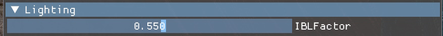
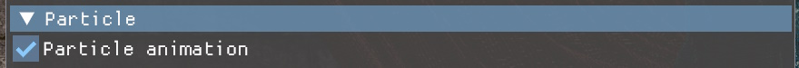
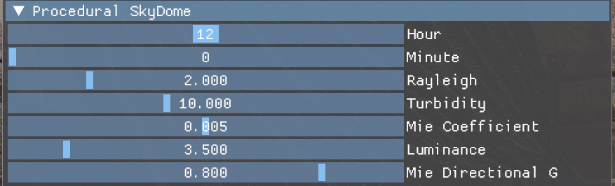

<!-- @page page_running-samples_index Running Samples -->

<h1>Running the FidelityFX SDK Samples</h1>

<h2>Content download</h2>

The SDK samples are configured to load scenes from pre-downloaded content. Please see the [media delivery tool](../tools/media-delivery.md)

<h2>Configuration files</h2>

The SDK samples (and FidelityFX Cauldron Framework in general) operate via runtime setup driven by various JSON configuration files.

There is a hierarchy to how the configuration files are loaded:

  1. The `cauldronconfig.json` file is loaded first to setup default framework values.
  2. The sample's config file is then parsed and relevant default config values are overriden.
  3. When parsing the render modules to initialize, each render module can also provide its own configuration file for needed defaults (such as needed resource creation, specific render module options, etc.)
  4. The render module defaults may also be overriden from the sample config file
  
  Configuration flow can best be summed up by the following image:
  
  
  
<h3>Configuration options</h3>

The following is a list of configuration groups and options that can be overloaded for any sample through a sample's configuration file.

  **Validation**
  
  Takes booleans to enable of disable CPU/GPU-based validation layers. GPU validation has serious performance implications, so use judiciously. All values default to false.

  ```yaml
  "Validation": {
	"CpuValidationLayerEnabled": false,
    "GpuValidationLayerEnabled": false
  }
  ```
  
  **FeatureSupport**
  
  Feature toggles take a boolean value to enforce the need of certain feature sets, and a string of the form "SMx_y" is used to delineate the required minimum shader model support required. Setting an unsupported feature entry to true, or setting the "ShaderModel" entry to an unsupported value on your current device, with both assert in the sample and execution will halt. Defaults shown below.
  
  ```yaml
  "FeatureSupport": {
            "VRSTier1": false,
            "VRSTier2": false,
            "RT1.0": false,
            "RT1.1": false,
            "FP16": false,
            "ShaderModel": "SM6_0"
        }
  ```

  **Presentation**
  
  Presentation covers default configuration for the swapchain and related constructs. Here you can set the number of backbuffers desired, enable features like Vsync and fullscreen rendering, specify the width and height of the application swapchain, as well as the display mode to use when setting up the adapter.
  
  Valid "Mode" entries are:
  - DISPLAYMODE_LDR,
  - DISPLAYMODE_HDR10_2084**,		
  - DISPLAYMODE_HDR10_SCRGB**,
  - DISPLAYMODE_FSHDR_2084***,		
  - DISPLAYMODE_FSHDR_SCRGB***
  
  ** (Requires HDR capable monitor)
  
  *** (Requires Freesync Premium Pro monitor)

  Note: All modes besides DISPLAYMODE_LDR also require the user to enable the HDR display setting in Windows System -> Display settings menu to function properly. 
  
  ```yaml
  "Presentation": {
	"BackBufferCount": 3,
	"Vsync": false,
	"Fullscreen": false,
	"Width": 2560,
	"Height": 1440,
	"Mode": "DISPLAYMODE_LDR"
  }
  ```  

  **Allocations**
  
  Allocations configuration group sets the sample defaults for various allocation pools used by the graphics framework. All size values represent bytes, all count values represent maximum entry count.
  
  ```yaml
  "Allocations": {
	"UploadHeapSize": 419430400,
	"DynamicBufferPoolSize": 15728640,
	"GPUSamplerViewCount": 300,
	"GPUResourceViewCount": 50000,
	"CPUResourceViewCount": 50000,
	"CPURenderViewCount": 100,
	"CPUDepthViewCount": 100
  }
  ```

  **DebugOptions**
  
  Debug options are designed to be used by AMD engineers during the development of FidelityFX features, but can also be useful when investigating how the sample runs or when experimenting.
  
  `DevelopmentMode` will automatically enable debug shaders, CPU validation, and DirectX memory leak detection (when in DX12 configurations).
  
  The RenderDoc and PIX capture options will also enabled an in-application UI for taking captures.
  
  ```yaml
  "DebugOptions": {
	"DevelopmentMode": false,
	"DebugShaders": false,
	"EnableRenderDocCapture": false,
	"EnablePixCapture": false
  }
  ```

  **RenderResources**

  Render resources is a list of resources to be created, or resource aliases to be created at framework initialization time. They are typically defined by render modules that have implicit resource needs.  They are defined by providing the resource name as an object which contains a Format, and other optional flags (e.g. `"RenderResolution": true` will create the resource at render resolution instead of display resolution if upscaling is present).
  
  Resource aliases add additional names that can be used to query resources from the [`DynamicResourcePool`](../../framework/cauldron/framework/src/render/dynamicresourcepool.cpp) at run time.
  
  Example:

  ```yaml
  "RenderResources": {
	"MotionVectorTarget": {
	  "Format": "RG16_FLOAT",
	  "RenderResolution": true
	},
	
	"GBufferMotionVectorRT": "MotionVectorTarget"
  }
  ```
  
  **RenderModuleOptions**
  
  These are special case objects used in render module configuration files to dictate initialization data for the render module creation. This data can be overridden in a sample configuration file using the `RenderModuleOptions` special object.
  
  Example:  
  ```yaml
  "RenderModuleOptions": {
	"ZPrepass": false,
	"VariableShading":  false
  }
  ```
  
  **RenderModuleOverrides**
  
  Used to override data for render module initialization. Define an entry for each render module you wish to override. Example: Overiding [`SkyDomeRenderModule`](../../framework/rendermodules/skydome/skydomerendermodule.h)'s procedural generation setting:
  
  ```yaml
  "RenderModuleOverrides": {
	"SkyDomeRenderModule": {
	  "Procedural": true
	}
  }
  ```
  
  **Content**
  
  Content blocks are used in sample configuration files to dictate the scene, camera, particles, etc. that should be loaded at runtime when running the sample. These values can be overridden from the command line interface (see below).
  
  `ParticleSpawners`: This is a list of particle spawners to queue for loading at runtime. For an overview of how particles work in FidelityFX Cauldron Framework, please see the reference documentation on GPUOpen.
  
  `Scenes`: This is a list of glTF files to queue for loading at runtime. Can contain one or more file paths.
  
  `Camera`: This is the name of the default camera entity to set as active camera. If the camera can not be found, a default camera is supplied.
  
  `SceneExposure`: This is the value to use for exposure (fixed) when running the sample.
  
  `DiffuseIBL`:	Path to an environment map to use for diffuse image-based lighting.
  
  `SpecularIBL`:	Path to an environment map to use for specular image-based lighting generation.
  
  `SkyMap`: Path to an environment map to use when rendering the non-procedural skydome.
  
  Example:
  ```yaml
  "Content": {
	"ParticleSpawners": [
	  {
		"Name": "FSRSpawner",
		"AtlasPath": "media/particles/atlas.dds",
		"Position": [ 0.0, 0.0, 0.0 ],
		"Sort": true,
		"Emitters": [
			{
			  "Name": "Smoke",
			  "SpawnOffset": [ 0.0, 0.0, 1.4 ],
			  "SpawnOffsetVariance": [ 0.1, 0.0, 0.1 ],
			  "SpawnVelocity": [ 0.0, 0.2, 0.0 ],
			  "SpawnVelocityVariance": 1.0,
			  "ParticlesPerSecond": 10,
			  "Lifespan": 50.0,
			  "SpawnSize": 0.4,
			  "KillSize": 1.0,
			  "Mass": 0.0003,
			  "AtlasIndex": 0,
			  "Flags": {
			  	"Reactive": true,
			  	"Streaks": false
			  }
			},
		  ]
	  }
	],
	"Scenes": [
	  "../media/Chess/scene.gltf"
	],
	"Camera": "Camera_1",
    "DiffuseIBL": "../media/IBL/mud_road_puresky_Diffuse.dds",
    "SpecularIBL": "../media/IBL/mud_road_puresky_Specular.dds",
	"SkyMap": "../media/IBL/mud_road_puresky_Specular.dds",
    "SceneExposure": 1.355
  }
  ```
  
  **Miscellaneous Options**
  
  There are a number of options that are not affiliated to a group.</br></br>
	`FontSize`: Integer point value to render fonts at. Takes DPI scaling at the OS level into account.</br></br>
	`AGSEnabled`: Enables/disables use of [AGS](https://gpuopen.com/amd-gpu-services-ags-library/) on AMD GPUs.</br></br>
	`StablePowerState`: Setting this to true will attempt to set a stable power state on the device (requires Windows Developer Mode to be enabled). Note that the stable power state selected is not necessarily the highest stable performance state possible and could deviate from that significantly.</br></br>
	`InvertedDepth`: Enables/disables the use of inverted infinite depth. Defaults to true.</br></br>
	`MotionVectorGeneration`: Name of the render module responsible for generation of motion vector information. A value of "" means no motion vector generation.</br></br>
	`OverrideSceneSamplers`: When true, will override glTF specified texture samplers (point/linear) with anisotropic samplers. Defaults to true.</br></br>
	`BuildRayTracingAccelerationStructure`: When true, will enable the building and update of ray tracing bounding volume hierarchies (BVHs) when loading/updating geometry. Defaults to false.</br></br>
  
  ```yaml
  "FontSize": 13,
  "AGSEnabled": false,
  "StablePowerState": false,
  "InvertedDepth": true,
  "MotionVectorGeneration": "",
  "OverrideSceneSamplers": true,
  "BuildRayTracingAccelerationStructure": false,
  ```

<h2>Command line options</h2>

By default, each sample is configured to try to load a preconfigured scene and set of options for a sample.

However, to allow end users to quickly test their own scenes and other experiments, the SDK supports a number of convenient command line options that can be used to override various default behaviors.

All command line options take the form:

  **-option** \<optional\> or \[required\] parameter
  
The following are the currently supported command line overrides:

  **-devmode**
  
  Launches the sample with CPU validation enabled, memory leak checks, and building FidelityFX Cauldron Framework shaders with debug information. 

  **-cpulimiter** \[TARGETFRAMERATE\]
  
  Forces CPU frame rate limitation through the system sleep cycle. Parameter is expected to be an integer value. This can be useful to gather more acurate timings of sample effects by forcing the GPU into a constant workload configuration.
  
  **-gpulimiter** \[TARGETFRAMERATE\]
  
  Forces GPU frame rate limitation through GPU workload tasks. Parameter is expected to be an integer value. This can be useful to gathering more accurate timings of sample effects by forcing the GPU into a constant workload configuration.
  
  **-inverteddepth** \[1 or 0\]
  
  Tells the framework to use infinite inverted depth (the default) or regular depth distribution layouts.
  
  **-fullscreen**
  
  Runs the sample in borderless full-screen mode.
  
  **-resolution** \[WIDTH\] \[HEIGHT\]
  
  Tells the framework to override the default startup resolution with that passed in. Width and height parameters are expected to be integer values.
  
  **-loadcontent** \[SCENE PATH\] \<OPTIONAL SCENE PATH\>
  
  Overrides the scene to load at startup. By default, each sample will be configured to load a pre-configured scene. This option overrides the scene to load to permit end users to test their own content against the effects. Simply export your content in any glTF 2.0 compliant exporter and pass in on run.
  
  Users can load as many scenes as they desire (with a minimum of 1)
  
  **-diffuseibl** \[PATH\]
  
  Overrides the default diffuse image-based lighting source to that specified by the passed in texture path.
  
  **-specularibl** \[PATH\]
  
  Overrides the default specular image-based lighting source to that specified by the passed in texture path.
  
  **-skymap** \[PATH\]
  
  Overrides the default skydome texture source (non-procedural only) to that specified by the passed in texture path.
  
  **-camera** \["CAMERA NAME"\]
  
  When loading content, will attempt to set the default camera to that provided with the camera name parameter. If no entity with that name is found, a default camera will be used.
  
  **-exposure** \[EXPOSURE VALUE\]
  
  Overrides the scene's static exposure value with the one provided. Will override any exposure value loaded from config.
  
  **-renderdoc**
  
  Enables the UI and options to take RenderDoc captures from the sample runtime.
  
  **-pix**
  
  Enables the UI and options to take PIX captures from the sample runtime.
  
  **-screenshot**
  
  Will take a screenshot of the very last frame rendered prior to quitting the sample.
  
  **-benchmark** \[duration=X\] \<path=PATH\> \<append\> \<json\> 
  
  Enables benchmarking of the sample. Benchmarking sets up a special run of a sample that will initialize all its content, then run for a select amount of time prior to shutting down and dumping the results to file. Benchmarking is controlled via a number of parameters:
  
    \[duration=X\]
  
    How many frames to benchmark. X is expected to be an integer value.
	
    \<path=PATH\>
	
	  Optional path in which to dump the benchmark file. Defaults to binary path.
	
	\<append\>
	
	  Optional append argument which will append results to existing benchmark data file rather than creating a new one.
	  
	\<json\>
	
	  Optional parameter to force benchmark data to write out in JSON format. The default is for data to be written to CSV file.
	  
  **-displaymode** \[DISPLAYMODE\]
  
    Overides the default display mode to use. Accepted display modes are:
    - "DISPLAYMODE_LDR"			    Low dynamic range
	  - "DISPLAYMODE_2084_HDR10"	(PQ) HDR10
	  - "DISPLAYMODE_SCRGB_HDR10"	High-precision HDR10
	  - "DISPLAYMODE_2084_FSHDR"	(PQ) Freesync HDR
	  - "DISPLAYMODE_SCRGB_FSHDR"	High-precision Freesync HDR

<h2>User interface and controls</h2>

<h3>User interface</h3>

FidelityFX Cauldron Framework offers a dynamic UI system built for the sample being run, defined by which render modules are present. Each render module is responsible for its own UI. For individual sample-specific UI elements, please see the corresponding sample documentation for the effect in question.

Depending on which of Cauldron's render modules are active in a sample, the following UI elements may be present

  **Lighting**
  
  
  
  - IBLFactor: Tweaks the amount of image-based lighting to apply to surfaces when lighting.
  
  **Limiter**
  
  
  
  - Enable FPS Limiter:	Enables CPU-side frame rate limits (done via CPU sleeps)<br>
  - GPU Limiter:			  Enables GPU-side frame rate limits (done via GPU compute job occupancy)
  
  Limiting the frame rate can yield more accurate rendering stats by keeping the GPU running at a more representative frequency and power state.
  
  **Magnifier**
  
  
  
  - Show Magnifier:		Enables the magnifying glass inspector tool.
  - Lock Position:		Locks the magnifying glass at its current location.
  - Screen Size:			Grows and shrinks the size of the magnifying glass.
  - Magnification:		Increases and decreases the magnification applied in the magnification area.
  
  **Particle**
  
  
  
  - Particle animation: Enables/sisables GPU particle animation.
  
  **Post Processing**
  
  
  
  - Tone Mapper: Pick from a number of available tone mappers.
  - Exposure: Sets the exposure for the scene.
  
  **Raster Shadows**
  
  
  
  - Cascades Number: Number of cascades to use when doing directional shadows.
  - Cascade Split Points 0: Scene percentage point at which to end the first cascade.
  - Cascade Split Points 1: Scene percentage point at which to end the second cascade.  
  - Cascade Split Points 2: Scene percentage point at which to end the third cascade.  
  - Camera Pixel Align: Snap the camera to a pixel boundary (prevents jitter).
  
  **Procedural Skydome**
  
  
  
  - Hour: Time of day component used when calculating procedural sky.
  - Minute: Time of day component used when calculating procedural sky.
  - Rayleigh: Rayleigh constant component used when calculating procedural sky.
  - Turbidity: Turbidity component used when calculating procedural sky.
  - Mie Coefficient: Mie component used when calculating procedural sky.
  - Luminance: Luminance component used when calculating procedural sky.
  - Mie Directional G: Ground direction used when doing Mie component calculation in procedural sky.
  
  **TAA**
  
  
  
  - Enable TAA: Enables or disables temporal anti-aliasing.
  
<h3>User controls</h3>

Cauldron defines the following set of controls when navigating a sample.

| Key               | Action                                                                                                                                                                            |
| ------------------|------------------------------------------------------------------------------------------------------------------------------------------------------------------------------------|
| **Mouse right button**| Toggles between arc-ball mode and WASD mode. Default is arc-ball mode.  
| **Mouse movement**| In arc-ball mode, the mouse moves the camera around the target point. When in WASD camera mode, the mouse rotates the camera direction.                                          |
| **Mouse wheel**   | Moves the camera along its view vector.                                                                                                 |
| **A**             | When in WASD camera mode, strafe the camera to the left.                                                                                                                           |
| **W**             | When in WASD camera mode, move the camera forward.                                                                                                                                 |
| **S**             | When in WASD camera mode, strafe the camera to the right.                                                                                                                          |
| **D**             | When in WASD camera mode, move the camera backward.                                                                                                                                |
| **Q**             | When in WASD camera mode, move the camera upwards.                                                                                                                                |
| **E**             | When in WASD camera mode, move the camera downwards.                                                                                                                                |
| **F1**             | Toggles the main UI on/off.                                                                                                                                |
| **F2**             | Toggles the performance UI on/off.                                                                                                                                |
| **F3**             | Toggles the message log UI on/off. (Defaults to on in debug and off in release)                                                                                                                                |
| **M**             | Toggles magnifying glass.                                                                                                                                |
| **L**             | Toggles magnifying glass lock when enabled.                                                                                                                                |
| **ESC**             | Shutsdown and quits sample.                                                                                                                                |
| **Alt-Enter**       | Toggles fullscreen mode.                                                                                                                                |
