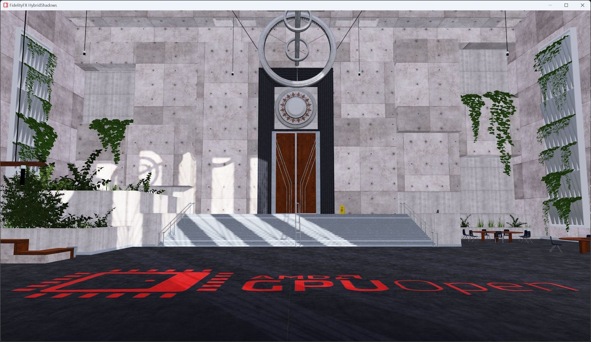

<!-- @page page_samples_hybrid-shadows FidelityFX Hybrid Shadows -->

<h1>FidelityFX Hybrid Shadows</h1>



This sample demonstrates the use of the FidelityFX Classifier and FidelityFX Denoiser techniques.

For details on the techniques that underpins the FidelityFX Hybrid Reflections effect you can refer to the respective [FidelityFX Classifier documentation](../techniques/classifier.md) and [FidelityFX Denoiser documentation](../techniques/denoiser.md). 

Slides which review the main steps of FidelityFX Hybrid Shadows sample can be found [here](../presentations/GPUOpen_Hybrid_Shadows.pdf).

<h2>Requirements</h2>

 - Windows
 - DirectX(R)12
 - Vulkan(R)

<h2>UI elements</h2>

The sample contains various UI elements to help you explore the techniques it demonstrates. The table below summarises the UI elements and what they control within the sample.

<h2>Controls</h2>

| Element name | Value | Description |
| -------------|-------|-------------|
| **Run Hybrid Shadow** | `Checked/Unchecked` | Enable/Disable the hybrid shadows. |
| **Use Denoiser** | `Checked/Unchecked` | Enable/Disable the shadow denoiser. |
| **Sun Solid Angle** | `0.0 - 1.0` | Controls the size of the sun light. |
| **Debug Mode** | `Disabled, Show RayTraced Tiles, Show Ray minT, Show Ray maxT, Show Ray length, Show RayTracing Texture` | Used to select the debug output view. |
| **TileCutOff** | `0 - 32` | Used to discard a tile where not enough rays need to be traced in the FidelityFX Classifier. |
| **PCF Offset** | `Checked/Unchecked` |  Used to offset the blocker depth value in the FidelityFX Classifier. |
| **Reject Lit Pixels for Ray Tracing** | `Checked/Unchecked` | Used to discard pixels for ray tracing that are in lit areas in the FidelityFX Classifier. |
| **Use Shadow Maps to determine RayT** | `Checked/Unchecked` |  Enable/Disable the use of shadow maps to determine ray properties. |

<h2>Setting up FidelityFX Hybrid Shadows</h2>

The FidelityFX Hybrid Shadows sample uses [FidelityFX Classifier](../techniques/classifier.md) to generate a list of tiles on the screen from which a ray tracing kernel can be launched. Then, the [FidelityFX Denoiser](../techniques/denoiser.md) can be enabled to remove noise from the raw, 1 sample per pixel ray tracing output.

<h2>Setting up classifier</h2>

Include the interface for the backend of the FidelityFX Classifier API.

```C++
#include <FidelityFX/host/ffx_classifier.h>
```

Create FidelityFX Classifier context

```C++
m_ClassifierCtxDesc.flags = FFX_CLASSIFIER_SHADOW;
m_ClassifierCtxDesc.flags |= FFX_CLASSIFIER_CLASSIFY_BY_CASCADES;
m_ClassifierCtxDesc.resolution.width = resInfo.RenderWidth;
m_ClassifierCtxDesc.resolution.height = resInfo.RenderHeight;
m_ClassifierCtxDesc.flags |= GetConfig()->InvertedDepth ? FFX_CLASSIFIER_ENABLE_DEPTH_INVERTED : 0;
m_ClassifierCtxDesc.backendInterface = backendInterface;
FFX_ASSERT(ffxClassifierContextCreate(&m_ClassifierContext, &m_ClassifierCtxDesc) == FFX_OK);
```

Set up the dispatch parameters and dispatch

```C++
FfxClassifierShadowDispatchDescription shadowClassifierDispatchParams = {};
shadowClassifierDispatchParams.commandList = ffxGetCommandList(pCmdList);
...
FFX_ASSERT(FFX_OK == ffxClassifierContextShadowDispatch(&m_ClassifierContext, &shadowClassifierDispatchParams));
```

<h2>Setting up the FidelityFX Denoiser</h2>

Include the interface for the backend of the FidelityFX Denoiser API.

C++:
```C++
#include <FidelityFX/host/ffx_denoiser.h>
```

Create FidelityFX Denoiser context

```C++
m_DenoiserCtxDesc.flags = FFX_DENOISER_SHADOWS;
m_DenoiserCtxDesc.windowSize.width = resInfo.RenderWidth;
m_DenoiserCtxDesc.windowSize.height = resInfo.RenderHeight;
m_DenoiserCtxDesc.flags |= GetConfig()->InvertedDepth ? FFX_CLASSIFIER_ENABLE_DEPTH_INVERTED : 0;
m_DenoiserCtxDesc.backendInterface = backendInterface;
FFX_ASSERT(ffxDenoiserContextCreate(&m_DenoiserContext, &m_DenoiserCtxDesc) == FFX_OK);
```

Set up the dispatch parameters and dispatch

```C++
FfxDenoiserShadowsDispatchDescription denoiserDispatchDescription = {};
denoiserDispatchDescription.commandList = ffxGetCommandList(pCmdList);
...
FFX_ASSERT(FFX_OK == ffxDenoiserContextDispatchShadows(&m_DenoiserContext, &denoiserDispatchDescription));
```

<h2>Sample controls and configurations</h2>

For sample controls, configuration, and FidelityFX Cauldron Framework UI element details, see [Running the samples](../getting-started/running-samples.md).

<h2>See also</h2>

- [FidelityFX Classifier](../techniques/classifier.md)
- [FidelityFX Denoiser](../techniques/denoiser.md)
- [FidelityFX Naming guidelines](../getting-started/naming-guidelines.md)
