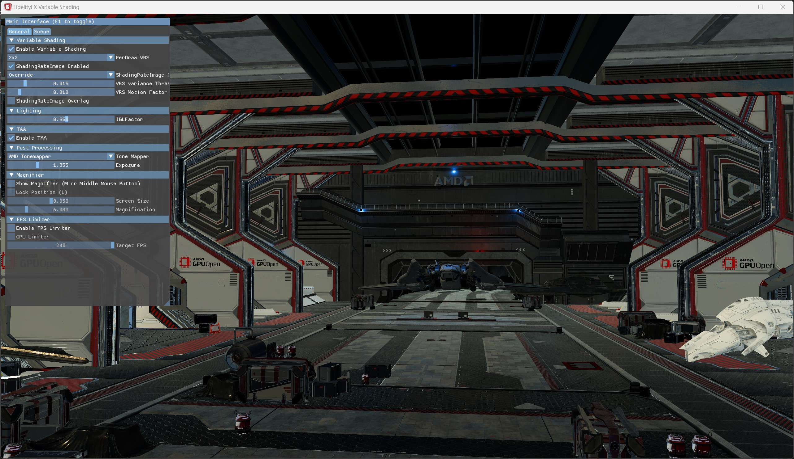

<!-- @page page_samples_variable-shading FidelityFX Variable Shading -->

<h1>FidelityFX Variable Shading</h1>



This sample demonstrates the use of the FidelityFX Variable Shading (VRS) compute algorithm.

For details on the techniques that underpins the Variable Shading effect you can refer to the respective [technique documentation](../techniques/variable-shading.md).

<h2>Requirements</h2>

 - Windows
 - DirectX(R)12
 - Vulkan(R)
                                                                                       
<h2>UI elements</h2>

The sample contains various UI elements to help you explore the techniques it demonstrates. The table below summarises the UI elements and what they control within the sample.

| Element name | Value | Description |
| -------------|-------|-------------|
| **Enable Variable Shading** | `Checked/Unchecked` | Enable/Disable Variable Shading. |
| **PerDraw VRS** | `1x1, 1x2, 2x1, 2x2` | Shading rate value. Additional shading rates are 2x4, 4x2, 4x4. |
| **ShadingRateImage Enabled** | `Checked/Unchecked` | Enable/Disable Tier 2 VRS control image. |
| **ShadingRateImage Combiner** | `Checked/Unchecked` | The options for each combiner are: passthrough the previous state (i.e. disable the current stage), override (ignore previous stages), min, max and sum. |
| **VRS variance Threshold** | `0.0 - 1.0` | Defines a value against which luminance variance gets compared in the compute shader generating the VRS image. |
| **VRS Motion Factor** | `0.0 - 1.0` |  Sets a factor by which the motion of the pixel since the last frame gets scaled to modify the shading rate. |
| **ShadingRateImage Overlay** | `Checked/Unchecked` | Enable/Disable ShadingRateImage overlay, a debug image over the rendered scene. |

<h2>Setting up Variable Shading</h2>

The Variable Shading compute shader takes as input the linear color buffer produced by the geometry rendering passes, and motion vectors buffer produced before geometry rendering passes. Final VRS control image is written to output buffer passed from setup. 

Include the interface for the backend of the VRS API.

C++:

```C++
#include <FidelityFX/host/ffx_vrs.h>
```
Create VRS context:

```C++
    if (m_AllowAdditionalShadingRates)
        m_InitializationParameters.flags |= FFX_VRS_ALLOW_ADDITIONAL_SHADING_RATES;

    m_InitializationParameters.shadingRateImageTileSize = m_FeatureInfoVRS.MaxTileSize[0];
    ffxVrsContextCreate(&m_VRSContext, &m_InitializationParameters);
```

Set up dispatch parameters and dispatch:

```C++
    FfxVrsDispatchDescription dispatchParameters = {};
    dispatchParameters.commandList               = ffxGetCommandList(pCmdList);
    ...
    FfxErrorCode errorCode = ffxVrsContextDispatch(&m_VRSContext, &dispatchParameters);
```

<h2>Sample controls and configurations</h2>

For sample controls, configuration, and FidelityFX Cauldron Framework UI element details, see [Running the samples](../getting-started/running-samples.md).

<h2>See also</h2>

- [FidelityFX Variable Shading](../techniques/variable-shading.md)
- [FidelityFX Naming guidelines](../getting-started/naming-guidelines.md)
