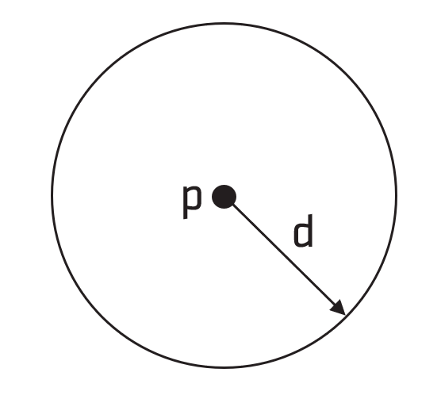
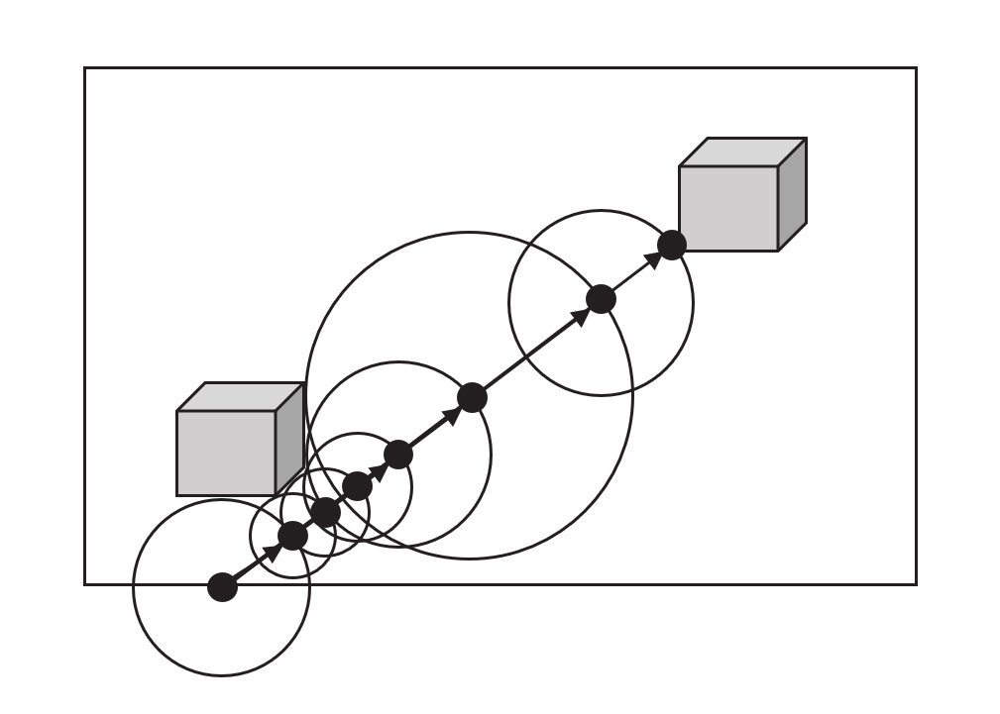
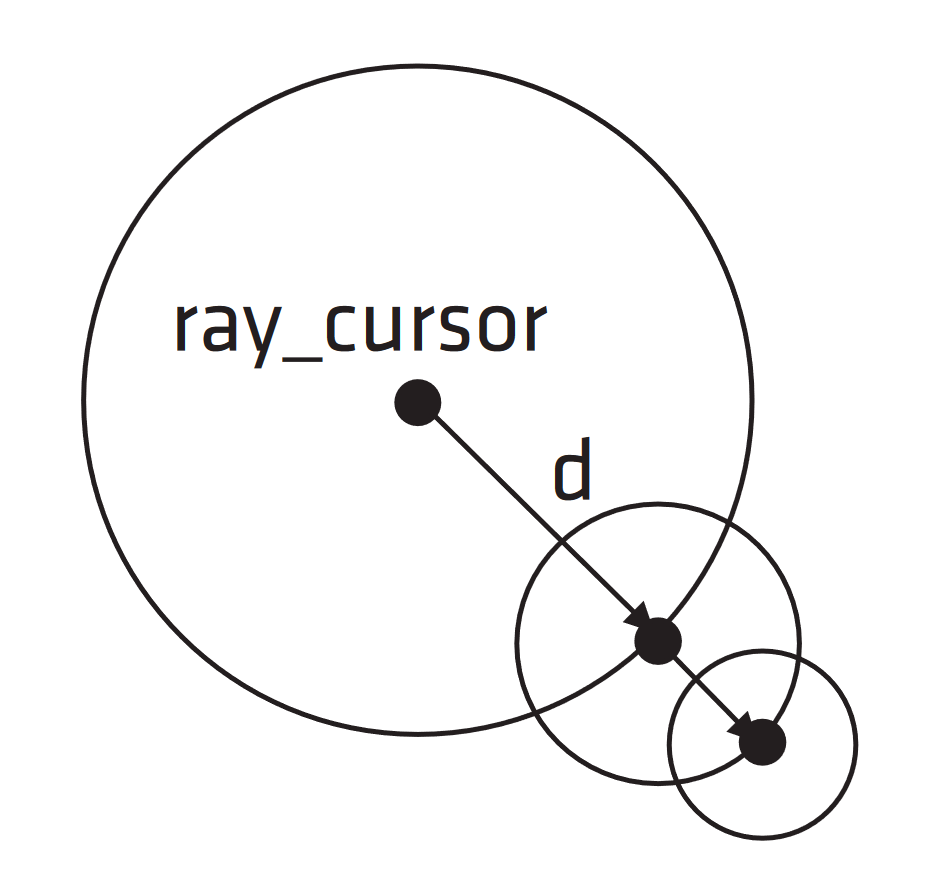
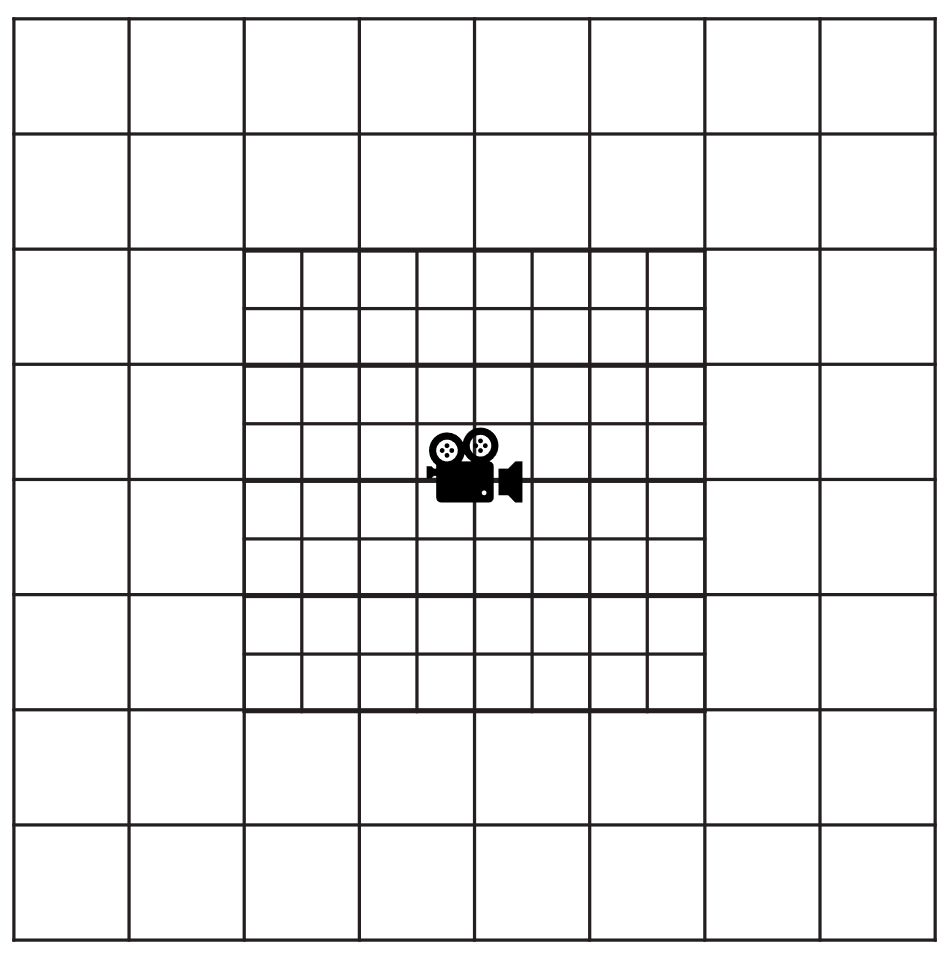

<!-- @page page_techniques_brixelizer FidelityFX Brixelizer 1.0 -->

<h1>FidelityFX Brixelizer 1.0</h1>

**FidelityFX Brixelizer** is a compute-based, highly-optimized sparse distance fields technique implemented in HLSL.

<h2>Table of Contents</h2>

- [Requirements](#requirements)
- [Integration Guidelines](#integration-guidelines)
- [Tuning Parameters](#tuning-parameters)
- [The Technique](#the-technique)
- [Algorithm Overview](#algorithm-overview)
- [Implementation](#implementation)

<h2>Requirements</h2>

- `HLSL` `CS_6_6`

<h2>Integration Guidelines</h2>

**FidelityFX Brixelizer** provides two levels of its API for different integration requirements. The main API is provided for quick integration using a default behaviour. A more flexible low level API, called the "raw" API, is provided for integrations requiring finer control. An integration of Brixelizer is split into two parts. First, an acceleration structure for the SDF must be created and populated with geometry data, and second the acceleration structure must be bound to a user written shader for use with the Brixelizer ray marching functions.

For computing the acceleration structure, the main API provides an implementation of the default approach that should be suitable for most integration use cases. In the main API the parameters of the acceleration structure are specified at context creation time, and then instances are submitted to the context, the context then handles this data internally when frame updates are called to generate. By contrast, the raw API allows for more fine grained control of Brixelizer in more specific use cases, for use in integrations with more specialized requirements. In this instance, the user gains fine grained control of how and when to compute the Brixelizer acceleration structure, but the subsequent usage in ray marching queries remains the same.

<h3>Resource Creation for Brixelizer</h3>

In order to allow easy integration into existing engines, Brixelizer leaves the creation of the GPU resources used to store acceleration structures to the user and requests these as parameters when writing to command lists. The following resources are created by the user:

| Name | Per Cascade | Type | Format/Stride | Dimensions/Size in bytes |
|------|-------------|------|---------------|------|
| SDF Atlas | no     | `Texture3D` | `R8_UNORM` | `FFX_BRIXELIZER_STATIC_CONFIG_SDF_ATLAS_SIZE` x `FFX_BRIXELIZER_STATIC_CONFIG_SDF_ATLAS_SIZE` x `FFX_BRIXELIZER_STATIC_CONFIG_SDF_ATLAS_SIZE`  |
| Brick AABBs | no | `StructuredBuffer` | `UINT32` (`FFX_BRIXELIZER_BRICK_AABBS_STRIDE`) | `FFX_BRIXELIZER_BRICK_AABBS_SIZE` |
| Cascade AABB Tree | yes | `StructuredBuffer` | `UINT32` (`FFX_BRIXELIZER_CASCADE_AABB_TREE_STRIDE`) | `FFX_BRIXELIZER_CASCADE_AABB_TREE_SIZE` |
| Cascade Brick Map | yes | `StructuredBuffer` | `UINT32` (`FFX_BRIXELIZER_CASCADE_BRICK_MAP_STRIDE`) | `FFX_BRIXELIZER_CASCADE_BRICK_MAP_SIZE` |

<h3>Main API</h3>

The main API can be accessed via including the `FidelityFX/host/ffx_brixelizer.h` header. The main API is implemented using the raw API, and the implementation of the main API can be found in the file `src/components/ffx_brixelizer.cpp`.

```cpp
// =============================================================================
// Initialize/destroy the FFX Brixelizer backend
// =============================================================================

FfxBrixelizerContextDescription desc = {};

desc.sdfCenter   = ...;                        // The point in world space around which to center the cascades.
desc.numCascades = ...;                        // The number of cascades managed by the Brixelizer simple context.
desc.flags       = ...;                        // Flags for context creation. See <c><i>FfxBrixelizerContextFlags</i></c>.

uint32_t numCascadeResources = 0;
for (uint32_t i = 0; i < desc.numCascades; ++i) {
	FfxBrixelizerCascadeDescription *cascadeDesc = &cascadeDescs[i];
	cascadeDesc->flags     = ...;                              // Flags for cascade creation. See <c><i>FfxBrixelizerCascadeFlag</i></c>.
	cascadeDesc->voxelSize = ...;                              // The edge size of voxels in world space for the cascade.
	switch (cascadeDesc->flags & (FFX_BRIXELIZER_CASCADE_STATIC | FFX_BRIXELIZER_CASCADE_DYNAMIC)) {
	case FFX_BRIXELIZER_CASCADE_STATIC:
	case FFX_BRIXELIZER_CASCADE_DYNAMIC:
		++numCascadeResources;
		break;
	case (FFX_BRIXELIZER_CASCADE_STATIC | FFX_BRIXELIZER_CASCADE_DYNAMIC):
		numCascadeResources += 3;
		break;
	default:
		assert(false);
	}
}

desc.backendInterface = ffxGetInterface(...); // An implementation of the FidelityFX backend for use with Brixelizer.

FfxBrixelizerContext context = {};
FfxErrorCode error = ffxBrixelizerContextCreate(&desc, &context);
assert(error == FFX_OK);

// ...

FfxErrorCode error = ffxBrixelizerContextDestroy(context);
assert(error == FFX_OK);

// =============================================================================
// Submit an instance to the brixelizer context
// =============================================================================

FfxBrixelizerInstanceDescription instanceDesc = {};
FfxBrixelizerInstanceID instanceID = FFX_BRIXELIZER_INVALID_ID;

instanceDesc.maxCascade = ...;            // The index of the highest cascade this instance will be submitted to. This helps avoid submitting many small objects to least detailed cascades.
instanceDesc.aabb = ...;                  // An axis-aligned bounding box in world space surrounding the instance
instanceDesc.transform = ...;             // A 3x4 matrix in row major order representing a transform to be applied to the vertices

instanceDesc.indexFormat = ...;           // Either FFX_INDEX_TYPE_UINT16 or FFX_INDEX_TYPE_UINT32
instanceDesc.indexBuffer = ...;           // The index of the index buffer set in ffxBrixelizerSetBuffer
instanceDesc.indexBufferOffset = ...;     // An offset into the index buffer.
instanceDesc.triangleCount = ...;         // The count of triangles in the index buffer.

instanceDesc.vertexBuffer = ...;          // The index of the vertex buffer set in ffxBrixelizerSetBuffer
instanceDesc.vertexStride = ...;          // The stride of the vertex buffer in bytes.
instanceDesc.vertexBufferOffset = ...;    // An offset into the vertex buffer.
instanceDesc.vertexCount = ...;           // The count of vertices in the vertex buffer.
instanceDesc.vertexFormat = ...;          // Either FFX_SURFACE_FORMAT_R16G16B16A16_FLOAT or FFX_SURFACE_FORMAT_R32G32B32A32_FLOAT

instanceDesc.flags = ...;                 // A combination of one or more FfxBrixelizerInstanceFlags. Currently used to specify whether an instance is static or dynamic.
instanceDesc.outInstanceID = &instanceID; // An optional pointer to an FfxBrixelizerInstanceID for writing the ID of the created instance. This is required for static instances and unused for dynamic instances.


// Create instances for a given context with the ffxBrixelizerCreateInstance function.
// Static instances are persistent across frames. Dynamic instances are discarded after a single frame.
FfxErrorCode error = ffxBrixelizerCreateInstance(&context, &instanceDesc);
assert(error == FFX_OK);

// ...

// Later if the static geometry changes instances may be deleted as follows
error = ffxBrixelizerDeleteInstance(&context, instanceID);
assert(error == FFX_OK);

// =============================================================================
// Brixelizer buffer registration
// =============================================================================

// Register vertex/index buffers to Brixelizer.
FfxBrixelizerBufferDescription *bufferDescs = (FfxBrixelizerBufferDescription*)malloc(numVertexAndIndexBuffers * sizeof(*bufferDescs));
uint32_t *bufferIndices = (uint32_t*)malloc(numVertexAndIndexBuffers * sizeof(*bufferIndices));

for (uint32_t i = 0; i < numVertexAndIndexBuffers; ++i) {
	bufferDescs[i].buffer = ffxGetResource(...);
	bufferDescs[i].outIndex = &bufferIndices[i];
}
FfxErrorCode error = ffxBrixelizerRegisterBuffers(&context, bufferDescs, numVertexAndIndexBuffers);
assert(error == FFX_OK);

free(bufferDescs);

// ...

// Unregister buffers from Brixelizer.
error = ffxBrixelizerUnregisterBuffers(&context, bufferIndices, numVertexAndIndexBuffers);
assert(error == FFX_OK);

free(bufferIndices);

// =============================================================================
// Brixelizer frame update
// =============================================================================

FfxBrixelizerStats stats = {};
size_t scratchSize = 0;

FfxBrixelizerUpdateDescription desc = {};
desc.frameIndex = ...;              // The index of the current frame.
desc.sdfCenter[3] = ...;            // The center of the cascades.
desc.populateDebugAABBsFlags = ...; // Flags determining which AABBs to draw in a debug visualization. See FfxBrixelizerPopulateDebugAABBsFlag.
desc.debugVisualizationDesc = ...;  // An optional debug visualization description. If this parameter is set to NULL no debug visualization is drawn.
desc.maxReferences = ...;           // The maximum number of triangle voxel references to be stored in the update.
desc.triangleSwapSize = ...;        // The size of the swap space available to be used for storing triangles in the update.
desc.maxBricksPerBake = ...;        // The maximum number of bricks to be updated.

desc.resources.sdfAtlas    = ffxGetResource(...);        // A resource for storing the SDF atlas.
desc.resources.brickAABBs  = ffxGetResource(...);        // A resource for storing the AABBs for the bricks.
for (uint32_t i = 0; i < numCascadeResources; ++i) {
	desc.resources.cascadeResources[i].aabbTree = ffxGetResource(...);        // A resource for storing the AABB tree for the cascade.
	desc.resources.cascadeResources[i].brickMap = ffxGetResource(...);        // A resource for storing the brick map for the cascade.
}

desc.outScratchBufferSize = &scratchSize; // An optional pointer to a size_t to receive the amount of GPU scratch space required for the update.
desc.outStats = &stats;                   // An optional pointer to an FfxBrixelizerStats struct receiving stats from the pass.

FfxBrixelizerBakedUpdateDescription bakedUpdateDesc = {};
FfxErrorCode error = ffxBrixelizerBakeUpdate(&context, &desc, &bakedUpdateDesc);
assert(error == FFX_OK);

// Create a GPU buffer with at least as much storage as scratchSize for use as scratch space
FfxResource scratchBuffer = ffxGetResource(...);

// call frame update
FfxErrorCode error = ffxBrixelizerUpdate(&context, &bakedUpdateDesc, scratchBuffer, commandList);
assert(error == FFX_OK);

// =============================================================================
// Using Brixelizer in a shader
// =============================================================================

FfxBrixelizerContextInfo contextInfo = {};
FfxErrorCode error = ffxBrixelizerGetContextInfo(&context, &contextInfo);
assert(error == FFX_OK);

// copy the contents of contextInfo to a constant buffer for use by the shader
// and bind the resources passed in to context creation for the:
//   * SDF atlas
//   * Brick AABB map
//   * Cascade brick map (for each cascade)
//   * Cascade AABB tree (for each cascade)
// to the shader.
```

<h3>Raw API</h3>

The raw API can be accessed via including the `FidelityFX/host/ffx_brixelizer.h` header. The implementation of the raw API can be found in the files `src/components/brixelizer/ffx_brixelizer_raw_private.h` and `src/components/brixelizer/ffx_brixelizer_raw.cpp`.

```cpp
// =============================================================================
// Create/destroy a Brixelizer context
// =============================================================================

FfxBrixelizerRawContextDescription desc = {};
desc.maxDebugAABBs    = ...;                  // Maximum number of debug AABBs to be stored for use in debug visualization
desc.flags            = ...;                  // Flags for context creation. See <c><i>FfxBrixelizerContextFlags</i></c>.
desc.backendInterface = ...;                  // FFX backend interface

FfxBrixelizerContext context = {};
FfxErrorCode error = ffxBrixelizerRawContextCreate(&context, &desc);
assert(error == FFX_OK);

// ...

error = ffxBrixelizerRawContextDestroy(&context);
assert(error == FFX_OK);

// =============================================================================
// Create/destroy a cascade
// =============================================================================

uint32_t cascadeIndex = ...; // Index of the cascade to create, between 0 and FFX_BRIXELIZER_MAX_CASCADES - 1

FfxBrixelizerRawCascadeDescription cascadeDesc = {};
cascadeDesc.brickSize     = ...;                  // Edge length in world space units of a single brick
cascadeDesc.cascadeMin[3] = ...;                  // Corner in world space of the first brick
cascadeDesc.index         = cascadeIndex;         // Cascade index

error = ffxBrixelizerRawContextCreateCascade(&context, &cascadeDesc);
assert(error == FFX_OK);

// ...

// Destroy the cascade. Unregisters the cascade resources from the Brixelizer context.
error = ffxBrixelizerRawContextDestroyCascade(&context, cascadeIndex);
assert(error == FFX_OK);

// =============================================================================
// Create/destroy instances
// =============================================================================

FfxBrixelizerRawInstanceDescription *instanceDescs = (FfxBrixelizerRawInstanceDescription*)malloc(numInstances * sizeof(*instanceDescs));
FfxBrixelizerInstanceID *instanceIDs = (FfxBrixelizerInstanceID*)malloc(numInstances * sizeof(*instanceIDs));

for (uint32_t i = 0; i < numInstances; ++i) {
	FfxBrixelizerRawInstanceDescription *instanceDesc = &instanceDescs[i];

	instanceDesc->aabbMin            = ...;             // The minimum coordinates of an AABB surrounding the instance.
	instanceDesc->aabbMax            = ...;             // The maximum coordinates of an AABB surrounding the instance.
	instanceDesc->transform          = ...;             // A tranform of the instance into world space. The transform is in row major order.

	instanceDesc->indexFormat        = ...;             // The format of the index buffer. Accepted formats are FFX_INDEX_UINT16 or FFX_INDEX_UINT32.
	instanceDesc->indexBuffer        = ...;             // The index of the index buffer set with ffxBrixelizerContextSetBuffer.
	instanceDesc->indexBufferOffset  = ...;             // An offset into the index buffer.
	instanceDesc->triangleCount      = ...;             // The count of triangles in the index buffer.

	instanceDesc->vertexBuffer       = ...;             // The index of the vertex buffer set with ffxBrixelizerContextSetBuffer.
	instanceDesc->vertexStride       = ...;             // The stride of the vertex buffer in bytes.
	instanceDesc->vertexBufferOffset = ...;             // An offset into the vertex buffer.
	instanceDesc->vertexCount        = ...;             // The count of vertices in the vertex buffer.
	instanceDesc->vertexFormat       = ...;             // The format of vertices in the vertex buffer. Accepted values are FFX_SURFACE_FORMAT_R16G16B16A16_FLOAT and FFX_SURFACE_FORMAT_R32G32B32A32_FLOAT.

	instanceDesc->flags              = ...;             // Flags for the instance. See FfxBrixelizerInstanceFlags.
	instanceDesc->outInstanceID      = &instanceIDs[i]; // Pointer to an FfxBrixelizerInstanceID to receive the ID of the created instance.
}

FfxBrixelizerInstanceID instanceID = FFX_BRIXELIZER_INVALID_ID;
error = ffxBrixelizerContextCreateInstances(&context, instanceDescs, numInstances);
assert(error == FFX_OK);

free(instanceDescs)

// ...

error = ffxBrixelizerContextDestroyInstances(&context, instanceIDs, numInstances);
assert(error == FFX_OK);

free(instanceIDs);

// =============================================================================
// Register/unregister vertex and index buffers
// =============================================================================

// Register vertex/index buffers to Brixelizer.
FfxBrixelizerBufferDescription *bufferDescs = (FfxBrixelizerBufferDescription*)malloc(numVertexAndIndexBuffers * sizeof(*bufferDescs));
uint32_t *bufferIndices = (uint32_t*)malloc(numVertexAndIndexBuffers * sizeof(*bufferIndices));

for (uint32_t i = 0; i < numVertexAndIndexBuffers; ++i) {
	bufferDescs[i].buffer = ffxGetResource(...);
	bufferDescs[i].outIndex = &bufferIndices[i];
}
FfxErrorCode error = ffxBrixelizerRawContextRegisterBuffers(&context, bufferDescs, numVertexAndIndexBuffers);
assert(error == FFX_OK);

free(bufferDescs);

// ...

// Unregister buffers from Brixelizer.
error = ffxBrixelizerRawContextUnregisterBuffers(&context, bufferIndices, numVertexAndIndexBuffers);
assert(error == FFX_OK);

free(bufferIndices);

// =============================================================================
// Calculate a frame of brixelizer
// =============================================================================

FfxCommandList commandList = ffxGetCommandList(...);
error = ffxBrixelizerRawContextFlushInstances(&context, commandList);
assert(error == FFX_OK);

FfxBrixelizerResources resources = {};
resources.sdfAtlas         = ffxGetResource(...);  // SDF atlas resource
resources.brickAABBs       = ffxGetResource(...);  // Brick AABBs resource
for (uint32_t i = 0; i < numCascadeResources; ++i) {
	resources.cascadeResources[i].aabbTree = ffxGetResource(...);        // A resource for storing the AABB tree for the cascade.
	resources.cascadeResources[i].brickMap = ffxGetResource(...);        // A resource for storing the brick map for the cascade.
}

error = ffxBrixelizerRawContextBegin(&context, &resources);
assert(error == FFX_OK);

// Reset/clear a cascade. Frees all bricks from the cascade allowing geometry to be built to the cascade from scratch.

error = ffxBrixelizerRawContextResetCascade(&context, cascadeIndex);
assert(error == FFX_OK);


// Create jobs

FfxBrixelizerRawJobDescription jobs[NUM_JOBS] = {};

for (uint32_t i = 0; i < NUM_JOBS; ++i) {
	FfxBrixelizerRawJobDescription *job = &jobs[i];
	job->aabbMin     = ...;   // The mimimum corner of the AABB of the job.
	job->aabbMax     = ...;   // The maximum corner of the AABB of the job.
	job->flags       = ...;   // Flags for the job (to be set from FfxBrixelizerJobFlags).
	job->instanceIdx = ...;   // The ID for an instance for the job.
}

// Update cascades

FfxBrixelizerRawCascadeUpdateDescription updateDescs[NUM_CASCADES_TO_UPDATE] = {};
size_t scratchSpaceSize = 0;

for (uint32_t i = 0; i < NUM_CASCADES_TO_UPDATE; ++i) {
	FfxBrixelizerRawCascadeUpdateDescription *desc = &updateDescs[i];
	desc->maxReferences    = ...;          // Storage for triangle->voxel references
	desc->triangleSwapSize = ...;          // Scratch storage for triangles
	desc->maxBricksPerBake = ...;          // Max SDF brick baked per update
	desc->cascadeIndex     = ...;          // Target Cascade
	desc->jobs             = jobs;         // A pointer to an array of jobs.
	desc->numJobs          = NUM_JOBS;     // The number of jobs in the array pointed to by jobs.
	desc->cascadeMin       = ...;          // Lower corner of the first brick in world space.
	desc->clipmapOffset    = ...;          // Changing that invalidates portion of the cascade. it's an offset in the voxel->brick table.
	desc->flags            = ...;          // See FfxBrixelizerCascadeUpdateFlags.

	size_t thisScratchSpaceSize = 0;
	error = ffxBrixelizerRawContextGetScratchMemorySize(&context, desc, &thisScratchSpaceSize);
	assert(error == FFX_OK);
	scratchSpaceSize = max(scratchSpaceSize, thisScratchSpaceSize);
}

FfxResource scratchBuffer = ffxGetResource(...); // A resource of size at least scratchSpaceSize to be used as the scratch space for brixelizer

for (uint32_t i = 0; i < NUM_CASCADES_TO_UPDATE; ++i) {
	FfxBrixelizerCascadeUpdateDescription *desc = &updateDescs[i];
	error = ffxBrixelizerRawContextUpdateCascade(&context, desc, scratchBuffer);
	assert(error == FFX_OK);
}

// Merge cascades

for (uint32_t i = 0; i < NUM_CASCADES_TO_MERGE; ++i) {
	uint32_t sourceCascadeIndex1 = ...; // index of first source cascade
	uint32_t sourceCascadeIndex2 = ...; // index of second source cascade
	uint32_t destCascadeIndex    = ...; // index of destination cascade
	error = ffxBrixelizerRawContextMergeCascades(&context, sourceCascadeIndex1, sourceCascadeIndex2, destCascadeIndex);
	assert(error == FFX_OK);
}

// Build cascade AABB trees

for (uint32_t i = 0; i < NUM_AABB_TREES_TO_BUILD; ++i) {
	uint32_t cascadeIndex = ...; // index of cascade to build an AABB tree for
	ffxBrixelizerRawContextBuildAABBTree(&context, cascadeIndex);
	assert(error == FFX_OK);
}

// Optionally do debug visualization

if (doDebugVisualization) {
	FfxBrixelizerDebugVisualizationDescription desc = {};
	desc.inverseViewMatrix       = ...;           // Inverse view matrix for the scene in row major order.
	desc.inverseProjectionMatrix = ...;           // Inverse projection matrix for the scene in row major order.
	desc.debugState              = ...;           // An FfxBrixelizerTraceDebugModes determining what kind of debug output to draw.
	desc.startCascadeIndex       = ...;           // The index of the most detailed cascade in the cascade chain.
	desc.endCascadeIndex         = ...;           // The index of the least detailed cascade in the cascade chain.
	desc.sdfSolveEps             = ...;           // The epsilon value used in SDF ray marching.
	desc.tMin                    = ...;           // The tMin value for minimum ray intersection.
	desc.tMax                    = ...;           // The tMax value for maximum ray intersection.
	desc.renderWidth             = ...;           // The width of the output resource.
	desc.renderHeight            = ...;           // The height of the output resource.
	desc.output                  = ...;           // An FfxResource to draw the debug visualization to.

	desc.commandList             = ...;           // An FfxCommandList to write the draw commands to.
	desc.numDebugAABBInstanceIDs = ...;           // The number of FfxBrixelizerInstanceIDs in the debugAABBInstanceIDs array.
	desc.debugAABBInstanceIDs    = ...;           // An array of FfxBrixelizerInstanceIDs for instances to draw the bounding boxes of.

	for (uint32_t i = 0; i < numCascades; ++i) {
		desc.cascadeDebugAABB[i] = ...;       // An array of flags showing what AABB debug output to draw for each cascade.
	}

	error = ffxBrixelizerRawContextDebugVisualization(&context, &desc);
	assert(error == FFX_OK);
}

error = ffxBrixelizerRawContextEnd(&context);
assert(error == FFX_OK);

error = ffxBrixelizerRawContextSubmit(&context, commandList);
assert(error == FFX_OK);

// =============================================================================
// Using Brixelizer in a shader
// =============================================================================

FfxBrixelizerContextInfo contextInfo = {};
FfxErrorCode error = ffxBrixelizerRawContextGetInfo(&context, &contextInfo);
assert(error == FFX_OK);

// copy the contents of contextInfo to a constant buffer for use by the shader
// and bind the resources passed in to context creation for the:
//   * SDF atlas
//   * Brick AABB map
//   * Cascade brick map (for each cascade)
//   * Cascade AABB tree (for each cascade)
// to the shader.

// =============================================================================
// Misc
// =============================================================================

// Read back counters from brixelizer for understanding performance

FfxBrixelizerDebugCounters debugCounters = {};
error = ffxBrixelizerRawContextGetDebugCounters(&context, &debugCounters);
assert(error == FFX_OK);

FfxBrixelizerScratchCounters scratchCounters = {};
uint32_t cascadeIndex = ...; // Index of cascade to query
error = ffxBrixelizerRawContextGetCascadeCounters(&context, cascadeIndex, &scratchCounters);
assert(error == FFX_OK);
```

<h3>HLSL API</h3>

The HLSL API can be accessed via including the `FidelityFX/gpu/brixelizer/ffx_brixelizer_trace_ops.h` header in an HLSL source file.  Prior to including the `FidelityFX/gpu/brixelizer/ffx_brixelizer_trace_ops.h` header, the `FFX_BRIXELIZER_TRAVERSAL_EPS` macro must be defined giving the epsilon value used in SDF marching. The following resource accessor functions must be defined in order to use the ray marcher:

```hlsl
FfxBrixelizerCascadeInfo GetCascadeInfo(FfxUInt32 cascadeID);
FfxFloat32x3 LoadCascadeAABBTreesFloat3(FfxUInt32 cascadeID, FfxUInt32 elementIndex);
FfxUInt32 LoadCascadeAABBTreesUInt(FfxUInt32 cascadeID, FfxUInt32 elementIndex);
FfxUInt32 LoadBricksAABB(FfxUInt32 elementIndex);
FfxFloat32 SampleSDFAtlas(FfxFloat32x3 uvw);
FfxUInt32 LoadCascadeBrickMapArrayUniform(FfxUInt32 cascadeID, FfxUInt32 elementIndex);
```

These accessor functions must access the following resources from Brixelizer:

* `FfxBrixelizerCascadeInfo GetCascadeInfo(FfxUInt32 cascadeID)` reads the member `cascades[cascadeID]` from the `FfxBrixelizerContextInfo` struct. This should be a constant buffer updated to the value returned by either `ffxBrixelizerContextGetInfo` or `ffxBrixelizerGetContextInfo`.
* `FfxFloat32x3 LoadCascadeAABBTreesFloat3(FfxUInt32 cascadeID, FfxUInt32 elementIndex)` should read the elements `elementIndex + 0` to `elementIndex + 2` of the resource passed to Brixelizer as `cascadeAABBTree[cascadeID]` in the simple API or as the `aabbTree` for cascade with index `cascadeID` in the raw API.
* `FfxUInt32 LoadCascadeAABBTreesUInt(FfxUInt32 cascadeID, FfxUInt32 elementIndex)` should read the element at `elementIndex` in the resource passed to Brixelizer as `cascadeAABBTree[cascadeID]` in the simple API or as the `aabbTree` for cascade with index `cascadeID` in the raw API.
* `FfxUInt32 LoadBricksAABB(FfxUInt32 elementIndex)` should read the element at index `elementIndex` in the resource passed to Brixelizer as `brickAABBs` at context creation.
* `FfxFloat32 SampleSDFAtlas(FfxFloat32x3 uvw)` should sample at coordinate `uvw` from the texture passed in as `sdfAtlas` at context creation.
* `FfxUInt32 LoadCascadeBrickMapArrayUniform(FfxUInt32 cascadeID, FfxUInt32 elementIndex)` should read the element at index `elementIndex` of the resource passed to Brixelizer as `cascadeBrickMaps[cascadeID]` in the simple API or as the `brickMap` for cascade with index `cascadeID` in the raw API.

When the resources are bound, Brixelizer can be used from HLSL code using the following structs and functions.

```hlsl
struct FfxBrixelizerRayDesc {
    FfxUInt32    start_cascade_id; // The index of the most detailed cascade for ray traversal.
    FfxUInt32    end_cascade_id;   // The index of the least detailed cascade for ray traversal.
    FfxFloat32   t_min;            // The minimum distance at which to accept a hit.
    FfxFloat32   t_max;            // The maximum distance at which to accept a hit.
    FfxFloat32x3 origin;           // The origin of the ray.
    FfxFloat32x3 direction;        // The direction of the ray. This input should be normalized.
};

struct FfxBrixelizerHitRaw {
    FfxFloat32   t;             // The distance from the ray origin to the hit.
    FfxUInt32    brick_id;      // The ID of a hit brick.
    FfxUInt32    uvwc;          // Packed UVW coordinates of the hit location. UVW coordinates are in brick space.
    FfxUInt32    iter_count;    // The count of iterations to find the intersection.
};

// This function is used for running a ray query against the Brixelizer SDF acceleration structure.
// The "raw" version returns the data immediately accessible from the SDF structure generated by a hit.
FfxBoolean FfxBrixelizerTraverseRaw(in FfxBrixelizerRayDesc ray_desc, out FfxBrixelizerHitRaw hit);

struct FfxBrixelizerHit {
    FfxFloat32 t;             // The distance from the ray origin to the hit.
};

// This function is used for running a ray query against the Brixelizer SDF acceleration structure.
// This version simply returns the distance to a hit if a hit is encountered.
FfxBoolean FfxBrixelizerTraverse(FfxBrixelizerRayDesc ray_desc, out FfxBrixelizerHit hit);

struct FfxBrixelizerHitWithNormal {
    FfxFloat32   t;          // The distance from the ray origin to the hit.
    FfxFloat32x3 normal;     // The normal of the SDF surface at the hit location.
};

// This function is used for running a ray query against the Brixelizer SDF acceleration structure.
// This version returns the distance to a hit and a normal to the SDF geometry at a hit location when a hit
// is encountered.
FfxBoolean FfxBrixelizerTraverseWithNormal(FfxBrixelizerRayDesc ray_desc, out FfxBrixelizerHitWithNormal hit);
```

<h2>Tuning Parameters</h2>

When integrating Brixelizer, one of the tasks that needs to be undertaken is tuning the parameters to appropriate values to ensure the best use of available memory. In particular, Brixelizer has three parameters which are used to determine the size of the GPU scratch buffer needed by Brixelizer. These parameters are the maximum number of bricks per cascade update; the maximum number of references per cascade update; and the maximum number of triangles per cascade update. In the sample of Brixelizer provided, these are simply set to large values and a sufficiently large scratch buffer on the GPU is provided for use by Brixelizer. In a more sophisticated scenario where there is limited space available for use as a scratch buffer, these parameters should be tuned in accordance with the scene. To do this, Brixelizer provides the following function calls:

```cpp
// =============================================================================
// Main API
// =============================================================================

/// A structure containing the statistics for a Brixelizer context readable after an update of the Brixelizer API.
///
/// @ingroup Brixelizer
typedef struct FfxBrixelizerContextStats {
    uint32_t brickAllocationsAttempted;      ///< Total number of brick allocations attempted this frame.
    uint32_t brickAllocationsSucceeded;      ///< Total number of brick allocations succeeded this frame.
    uint32_t bricksCleared;                  ///< Total number of bricks cleared in SDF atlas at the beginning of this frame.
    uint32_t bricksMerged;                   ///< Total number of bricks merged this frame.
    uint32_t freeBricks;                     ///< The number of free bricks in the Brixelizer context.
} FfxBrixelizerContextStats;

/// A structure containing the statistics for a Brixelizer cascade readable after an update of the Brixelizer API.
///
/// @ingroup Brixelizer
typedef struct FfxBrixelizerCascadeStats {
    uint32_t trianglesAllocated;       ///< The number of triangle allocations that were attempted to the cascade in a given frame.
    uint32_t referencesAllocated;      ///< The number of reference allocations that were attempted to the cascade in a given frame.
    uint32_t bricksAllocated;          ///< The number of brick allocations that were attempted to the cascade in a given frame.
} FfxBrixelizerCascadeStats;

/// A structure containing the statistics readable after an update of the Brixelizer API.
///
/// @ingroup Brixelizer
typedef struct FfxBrixelizerStats {
    uint32_t                  cascadeIndex;         ///< The index of the cascade that the statisticss have been collected for.
    FfxBrixelizerCascadeStats staticCascadeStats;   ///< The statistics for the static cascade.
    FfxBrixelizerCascadeStats dynamicCascadeStats;  ///< The statistics for the dynamic cascade.
    FfxBrixelizerContextStats contextStats;         ///< The statistics for the Brixelizer context.
} FfxBrixelizerStats;

typedef struct FfxBrixelizerUpdateDescription {
    // ...
    FfxBrixelizerStats *outStats;
} FfxBrixelizerUpdateDescription;


FfxErrorCode ffxBrixelizerBakeUpdate(FfxBrixelizerContext* context, const FfxBrixelizerUpdateDescription* desc, FfxBrixelizerBakedUpdateDescription* outDesc);

// =============================================================================
// Raw API
// =============================================================================

typedef struct FfxBrixelizerDebugCounters {
    uint32_t brickCount;
    uint32_t dirtyBricks;
    uint32_t freeBricks;
    uint32_t clearBricks;
    uint32_t mergeBricks;
    uint32_t numDebugAABBs;
} FfxBrixelizerDebugCounters;

typedef struct FfxBrixelizerScratchCounters {
    uint32_t triangles;
    uint32_t maxTriangles;
    uint32_t references;
    uint32_t maxReferences;
    uint32_t groupIndex;
    uint32_t compressionBricks;
    uint32_t storageOffset;
    uint32_t storageSize;
    uint32_t numBricksAllocated;
    uint32_t clearBricks;
} FfxBrixelizerScratchCounters;


FfxErrorCode ffxBrixelizerContextGetDebugCounters(FfxBrixelizerContext* context, FfxBrixelizerDebugCounters* debugCounters);
FfxErrorCode ffxBrixelizerContextGetCascadeCounters(FfxBrixelizerContext* context, uint32_t cascadeIndex, FfxBrixelizerScratchCounters* counters);
```

In the main API, the values of `trianglesAllocated`, `referencesAllocated`, and `bricksAllocated` from the `FfxBrixelizerCascadeStats` struct can be used to tune the values of `triangleSwapSize`, `maxReferences` and `maxBricksPerUpdate` in the `FfxBrixelizerUpdateDescription` struct.

In the raw API, for tuning the parameters `maxBricksPerBake`, `triangleSwapSize` and `maxReferences` of `FfxBrixelizerRawCascadeUpdateDescription`, the values of `triangles`, `references` and `numBricksAllocated` should be queried using `ffxBrixelizerContextGetCascadeCounters` after updating a cascade.

Note that the counters are read back from the GPU, and hence will be read back with a delay. Therefore repeated calls to `ffxBrixelizerContextGetCascadeCounters` must be made and values must be stored for later analysis.

<h2>The Technique</h2>

<h3>Distance Fields</h3>

A distance field is a mechanism by which we can query the distance to the nearest geometry from an arbitrary point in space. The distance can either be signed in which case negative values indicated a point in space which is inside geometry, or unsigned in which case the distance is the distance to the nearest edge. In Brixelizer, the distance fields we use are unsigned distance fields (in the context of Brixelizer SDF stands for *sparse* distance field, not to be confused with signed distance field).




When we have an efficient function for evaluating the distance to the nearest geometry to an arbitrary point in space, we can use this as the basis of an efficient ray traversal algorithm. To calculate an intersection for a given ray, we first set a `ray_cursor` to be the ray origin, and a `ray_direction` to the direction of the ray. We then repeatedly calculate the SDF function at the `ray_cursor`. If the distance to the nearest geometry is below a target `ray_traversal_epsilon` value, we terminate and output a hit. Otherwise, we update the value of the ray cursor to `ray_cursor = ray_cursor + ray_direction * sdf(ray_cursor)`.




For certain simple scenes, we can create an SDF function either by using a simple to calculate primitive function or a combination of primitive functions. However, as scenes become more complex this approach becomes infeasible, and instead pre-calculating distances to nearest geometry into 3D textures for texture lookup is the most obvious way to represent an SDF. However, the fundamental reason that ray traversal through an SDF is efficient is that geometry tends to be sparse, and most ray marches can advance by long distances. Therefore we want to find an efficient representation of our SDF in which we only store SDF values for areas near to geometry and skip over areas of empty space.


In Brixelizer the representation used for sparse SDF data is to create a series of small, local SDFs called *bricks* which store SDF values in a 3D texture for texture lookup, and then to organise bricks into an *AABB tree* in which nodes containing no geometry may be marked as empty, allowing for quick traversal over empty space.


As well as representing geometry via a sparse representation using bricks and AABB trees, Brixelizer represents geometry in multiple levels of detail by arranging geometry into *cascades*. Each cascade contains an AABB tree containing bricks. Each brick within a cascade corresponds to a fixed real world size.



With this acceleration structure, Brixelizer then performs a ray traversal by considering each cascade in turn from most detailed to least detailed; walking the AABB tree of the cascade; and performing a ray march when the ray passes through a brick.

<h2>Algorithm Overview</h2>

Brixelizer is split into two parts. In the first part an acceleration structure is built from input geometry. In the second part, the acceleration structure is used in a ray marching pass to determine ray geometry intersections.

<h3>Acceleration Structure Construction</h3>

<h4>High Level</h4>

The acceleration structure constructed by Brixelizer is a series of *cascades* of varying levels of detail. Each cascade is a cube with a fixed number of *bricks* along each edge. The level of detail of each cascade is varied by changing the world space brick size of the cascade. In the acceleration structure, more detailed cascades are nested within less detailed cascades.


Each cascade contains a sparse array of *bricks* and an AABB tree for ray traversal. Each brick is an 8x8x8 cube of values in the range 0 to 1 representing the distance to the nearest geometry as described in the [Distance Fields](#distance-fields) section. The AABB tree for each cascade is split into three layers, with a single root node in the first layer, and each node containing a 4x4x4 collection of subnodes contained within its AABB.


Cascades are built up by processing geometry made up of triangular meshes. The triangular meshes are processed and used to create the bricks representation of distance to nearest geometry. When first creating a cascade, it is necessary to process all of the geometry to create the bricks. In subsequent passes, only geometry which has changed needs to be processed to calculate the acceleration structure. To achieve this, geometry submitted to be built into cascades may be marked as having changed, and thus requiring being rebuilt, or as not having changed, and thus not causing a rebuild if it corresponds to an already built part of the cascade. Movement of the center of a cascade does not provoke a rebuild of the cascade, but rather changes an offset into the cascade representing the center and provoking a rebuild only of the areas corresponding to geometry not contained within the cascade with its previous center. As well as these methods for avoiding rebuilding of static geometry, Brixelizer also supports separating geometry into separate cascades for meshes which are static and meshes which are dynamic and then merging those two cascades to maximise reuse of pre-built static geometry.

Typical use of Brixelizer will involve rebuilding one of the cascades used in ray marching per frame. In the case that this cascade is created by merging one cascade containing the static geometry and another cascade containing the dynamic geometry, this will mean building updates to those two cascades, merging them into a single merged cascade, and finally calculating the AABB tree for that cascade. An implementation of the typical expected usage of Brixelizer can be found in `ffx_brixelizer_simple.h` and `ffx_brixelizer_simple.cpp`, which is appropriate to be integrated directly in most use cases.

Input for cascade updates are described in terms of *jobs*. A job can be used to either invalidate part of a cascade or be used for submitting an instance to a cascade. All instances in a cascade must be re-submitted to the cascade as jobs each frame. Brixelizer does not maintain an internal state of which instances are in which cascades, and does not assume that all instances are in all cascades. In static cascades, if geometry changes in one part of the cascade an invalidation job must be submitted to Brixelizer to queue rebuilding of the area within the cascade. For example, if an instance is removed from a static cascade, it is not sufficient to simply no longer submit that instance as part of the geometry of the cascade, but the area where the instance used to be must be invalidated in order to force rebuilding. By contrast, in dynamic cascades the cascade is rebuilt from scratch every frame, and it is not required to submit any invalidation jobs. Instead all that is required is to submit all instances which make up the cascade.

To summarise, Brixelizer provides three functions for building the acceleration structure:

* Update cascade (`ffxBrixelizerContextUpdateCascade`) - optionally resets the cascade for dynamic cascades; updates the position of the cascade center; rebuilds invalidated areas of the cascade from a list of jobs.
* Merge cascades (`ffxBrixelizerContextMergeCascades`) - combines two cascades to create a single cascade containing the geometry from both cascades.
* Build AABB tree (`ffxBrixelizerContextBuildAABBTree`) - for a cascade that has been built either by a cascade update or a cascade merge, scan over the bricks and create the AABB tree for use by the ray traversal code.

Typical usage of these operations can be found in the implementation of the `ffx_brixelizer_simple.h` API in `ffx_brixelizer_simple.cpp`.

<h4>Low Level - Updating a Cascade From Mesh Geometry</h4>

To update a cascade from a list of jobs, first we identify and mark all voxels of the cascade which will require processing. These are any new voxels introduced to the cascade by updating the cascade center, and any voxels marked as invalid by invalidation jobs. After that the list of jobs to process is culled down to only those which both contain geometry and intersect with a voxel which requires processing. This is implemented in the `FFX_BRIXELIZER_PASS_CASCADE_SCROLL_CASCADE`, `FFX_BRIXELIZER_PASS_CASCADE_INVALIDATE_JOB_AREAS` and `FFX_BRIXELIZER_PASS_CASCADE_COARSE_CULLING` passes.

Next we create a [scan buffer](#misc) for use in work distribution where we wish to launch one thread per triangle per job post culling. This is computed in the `FFX_BRIXELIZER_PASS_CASCADE_SCAN_JOBS` pass.

Once this is done, we do voxelization. In voxelization we go over each triangle for each job, load the triangle from external mesh data, classify it as small or large, and store it into the scratch buffer. We then calculate an AABB for the triangle, and for each voxel which intersects with that AABB we store a reference to the triangle. Triangle references are created for distinct voxel ID triangle ID pairs, and each reference is assigned a reference reference ID so that if there are `n` references to the same voxel ID each is assigned a distinct reference ID from `0` to `n - 1`. This is implemented in the `FFX_BRIXELIZER_PASS_CASCADE_VOXELIZE` pass.

Next we scan over all voxels, and for each voxel which contains at least one reference to a triangle we assign a brick. Voxels which were identified as requiring processing but do not correspond to triangle references are marked as empty here. Two scan buffers are made at this stage, one to allow a thread to be executed per reference batch per voxel, and another to allow us to launch one thread per reference per voxel. This is implemented in the `FFX_BRIXELIZER_CASCADE_PASS_SCAN_REFERENCES` pass.

Next all triangle references are read and stored into a flat array of triangle IDs ordered by voxel ID and reference ID. This is implemented in the `FFX_BRIXELIZER_CASCADE_PASS_COMPACT_REFERENCES` pass.

Next we launch one wave per reference batch per voxel. Each thread loads a single triangle reference. For a small triangle we calculate the nearest brixel and stores the distance to that brixel. For a large triangle we loop over the AABB and calculate the distance to the nearest point on the triangle for each brixel in the AABB. This is implemented in the `FFX_BRIXELIZER_CACADE_PASS_EMIT_SDF` pass.

Next we calculate the AABB of each of the bricks we have processed and store the calculated brixel values into the SDF atlas. This is implemented in the `FFX_BRIXELIZER_CASCADE_PASS_COMPRESS_BRICK` pass.

Finally we fill in the uninitialized values of the bricks using the eikonal pass. This occurs once at the end of the frame and calculates the unininitialized values for all bricks created across all cascades this frame. This is implemented in the `FFX_BRIXELIZER_PASS_CONTEXT_EIKONAL` pass.

Once the cascade has been updated as described above, it can either be used as a source for merging cascades or it can have its AABB tree directly calculated in order to be used in ray marching.

<h4>Misc</h4>

Scan Buffer - in order to distribute workloads evenly amongst threads Brixelizer makes frequent use of *scan buffers*. For example, if we are given as input a list of jobs and the number of subvoxels for each job, and we wish to launch a single thread for each subvoxel for each job, we can achieve this in the following way: first we create an array `a[n]` of integers with one integer per job. In this array, we store in the `n`th element the total number of subvoxels for all jobs up to job `n`. Then we launch one thread per subvoxel per job, where the `i`th thread finds n such that `a[n] <= i` and `i < a[n + 1]`. Then the ith thread corresponds to the subvoxel `j = i - a[n]` of job `n`. This provides us a mapping from thread IDs to job ID subvoxel ID paris. This can be implemented in pseudocode as follows:

```
// pseudocode of launching one thread per subvoxel of job

uint32_t numSubvoxelsForJob[NUM_JOBS] = ...; // Input array showing number of subvoxels for each job
uint32_t scanBuffer[NUM_JOBS + 1] = {}; // Scan buffer we create, initialised to zero

uint32_t total = 0;
for (uint32_t i = 0; i < NUM_JOBS + 1; ++i) {
	scanBuffer[i] = total;
	total += numSubvoxelsForJob[i];
}

void launchThread(uint32_t threadIndex)
{
	// Use scan buffer to calculate jobID subvoxelID for thread with index threadIndex
	uint32_t jobID = 0;
	uint32_t subvoxelID = 0;
	while (scanBuffer[jobID + 1] < threadIndex) {
		++jobID;
	}
	subvoxelID = threadIndex - scanBuffer[jobID];

	// run code for job jobID and subvoxel subvoxelID
	// ...
}

launchThreads(launchThread, total); // launch one thread per job subvoxel
```

<h3>Ray Marching</h3>

In Brixelizer, rays are marched through the acceleration structure by first considering each cascade in turn from most detailed to least detailed; then for each cascade that the ray intersects the AABB tree is traversed; and for any brick which the ray hits a ray march is performed on the brick. Of note in particular is that a ray will only be tested for hits with geometry in the cascade it is spawned in or less detailed cascades. Also, the ray position is advanced as it is tested for intersection with each cascade, meaning it is assumed the geometry is coherent between cascades. The ray is considered to have hit geometry when in the brick ray march step an SDF value less than `FFX_BRIXELIZER_TRAVERSAL_EPS` is encountered.

<h2>Implementation</h2>

<h3>Data types</h3>

| Name | Description |
|------|-------------|
| `FfxBrixelizerBrickID`          | A `uint32_t` in the range 0 to 2^18 - 1. It is an index directly into a number of array structures providing info about bricks. This can also be interpreted as, from most signifcant to least significant, a 6-bit z coordinate, 6-bit y coordinate and 6-bit x coordinate index into the `Brixelizer_SDFAtlas`. Additionally the value `0xFFFFFF` can be used to represent an invalid brick ID. |
| `FfxBrixelizerVoxelID`          | A `uint32_t` whose most significant 8-bits are a cascade ID and whose least significant 24-bits are a voxel index. |
| `FfxBrixelizerVoxelIndex`       | A `uint32_t` in the range 0 to 2^24 - 1. |
| `FfxBrixelizerStampID`          | A `uint32_t` in the range 0 to 7, it is the index of a 2D slice of a brick (i.e. a brick is an 8x8x8 set of distance values from 0 to 1, and a stamp is a single 8x8 slice from a brick). |
| `FfxBrixelizerJobID`            | A `uint32_t` index into the jobs buffer. |
| `FfxBrixelizerBrixelizationJob` | A struct containing an AABB, instanceIndex and a job flag indicating whether the job is to invalidate an area or to submit geometry. |
| `FfxBrixelizerInstanceInfo`     | |
| `FfxBrixelizerInstanceID`       | A `uint32_t` index into the `Brixelizer_InstanceInfo` buffer. |
| `FfxBrixelizerTriangleID`       | A `uint32_t` offset into the triangle scratch space for a triangle. Additionally the LSB is set to 1 to indicate a small triangle (12 bytes of storage) and 0 to indicate a large triangle (24 bits of storage). |

<h3>Resources</h3>

<h4>User Created Resources</h4>

| Name | Per Cascade | Type | Format/Stride | Dimensions/Size in bytes |
|------|-------------|------|---------------|--------------------------|
| SDF Atlas | no     | `Texture3D` | `R8_UNORM` | `FFX_BRIXELIZER_STATIC_CONFIG_SDF_ATLAS_SIZE` x `FFX_BRIXELIZER_STATIC_CONFIG_SDF_ATLAS_SIZE` x `FFX_BRIXELIZER_STATIC_CONFIG_SDF_ATLAS_SIZE`  |
| Brick AABBs | no | `StructuredBuffer` | `UINT32` (`FFX_BRIXELIZER_BRICK_AABBS_STRIDE`) | `FFX_BRIXELIZER_BRICK_AABBS_SIZE` |
| Cascade AABB Tree | yes | `StructuredBuffer` | `UINT32` (`FFX_BRIXELIZER_CASCADE_AABB_TREE_STRIDE`) | `FFX_BRIXELIZER_CASCADE_AABB_TREE_SIZE` |
| Cascade Brick Map | yes | `StructuredBuffer` | `UINT32` (`FFX_BRIXELIZER_CASCADE_BRICK_MAP_STRIDE`) | `FFX_BRIXELIZER_CASCADE_BRICK_MAP_SIZE` |
| Debug Output | no | `Texture2D` | A user defined `RGB` format | User defined |


<h4>Internal Frame Persistent Resources</h4>

The following is a table of all structured buffers managed internally by the Brixelizer context.

<div class="scrollable-table"></div>

| Name | Format/Stride | Length | Description |
|------|---------------|--------|-------------|
| `Brixelizer_Counters`      | `UINT32` | `sizeof(FfxBrixelizerContextCounters)` | Structure contains counts of allocated bricks, dirty bricks, free bricks, bricks to clear, bricks to merge and the number of debug AABBs. |
| `Brixelizer_BrickVoxelMap` | `UINT32` | `FFX_BRIXELIZER_MAX_BRICKS` | A flat array indexed by `brick_id` of `voxel_id` values. A voxel ID is a 32-bit unsigned integer, the most significant 8-bits are the cascade ID of the voxel, and the least significant 24-bits are the voxel index. A pattern of `0xFFFFFF` for the voxel index is considered invalid. |
| `Brixelizer_BrickEikonalList`     | `UINT32` | `FFX_BRIXELIZER_MAX_BRICKS` | |
| `Brixelizer_BrickEikonalCounters` | `UINT32` | `FFX_BRIXELIZER_MAX_BRICKS` | A flat array indexed by `brick_id` of `eikonal_counter` values. An `eikonal_counter` is ... |
| `Brixelizer_BrickFreeList`        | `UINT32` | `FFX_BRIXELIZER_MAX_BRICKS` | An array of `brick_id` values which have been marked to be freed. The length of the array is stored in the `freeBricks` counter. After the bricks have been freed |
| `Brixelizer_BricksClearList`      | `UINT32` | `FFX_BRIXELIZER_MAX_BRICKS` | An array of `brick_id` values which have been marked to be cleared. The length of the array is stored in the `clearBricks` counter. |
| `Brixelizer_IndirectArgs1`        | `UINT32` | `FFX_BRIXELIZER_NUM_INDIRECT_OFFSETS * 16` | A buffer containing values for indirect dispatch arguments. |
| `Brixelizer_InstanceBuffer`       | `FfxBrixelizerInstanceInfo` | | A flat array indexed by `FfxBrixelizerInstanceID`. |
| `Brixelizer_TransformBuffer`      | `FfxFloat32x3x4`     | | A flat array indexed by `FfxBrixelizerInstanceID` where the `i`th element gives the world space transform for instance `i`. |
| `Brixelizer_UploadJobBuffer`      | `FfxBrixelizerBrixelizationJob` |   | A flat array indexed by `FfxBrixelizerJobID` containing `FfxBrixelizerBrixelizationJob` structs describing the jobs to be performed.
| `Brixelizer_UploadJobIndexBuffer` | `UINT32` | | A flat array indexed by `FfxBrixelizerJobID`. A [scan buffer](#misc) used to spread workloads where 1 thread is launched for each voxel for each job. |
| `Brixelizer_BrickMergeList`       | `UINT32` | `2 * FFX_BRIXELIZER_MAX_BRICKS` | An array of pairs of brick IDs to be merged. The array contains `2 * mergeBricks` brick IDs indicating that the brick with ID in position `2*n` should be merged into the brick with ID in position `2*n + 1` |
| `Brixelizer_UploadDebugAABBInstanceIDBuffer` | `FfxBrixelizerInstanceID`   | |                                                                                     |
| `Brixelizer_UploadInstanceBuffer`            | `FfxBrixelizerInstanceInfo` | | The upload buffer used for uploading instance data to `Brixelizer_InstanceBuffer`   |
| `Brixelizer_UploadTransformBuffer`           | `FfxFloat32x3x4`     | | The upload buffer used for uploading transform data to `Brixelizer_TransformBuffer` |

The following is a list of the different constant buffers managed by the Brixelizer context.

| Name                           | Format                     | Description                                            |
|--------------------------------|----------------------------|--------------------------------------------------------|
| `Brixelizer_ContextInfoBuffer` | `FfxBrixelizerContextInfo` | Parameters describing the Brixelizer context.          |
| `Brixelizer_CascadeInfoBuffer` | `FfxBrixelizerCascadeInfo` | Parameters describing a single cascade.                |
| `Brixelizer_BuildInfoBuffer`   | `FfxBrixelizerBuildInfo`   | Parameters describing build options.                   |
| `Brixelizer_DebugInfoBuffer`   | `FfxBrixelizerDebugInfo`   | Parameters describing options for debug visualization. |

<h4>Scratch resources</h4>

| Name | Description |
|------|-------------|
| `g_scratch_counters`                      | contains counters for use with scratch space data structures.                                         |
| `g_scratch_index_swap`                    | swap space used for storing triangle data.                                                            |
| `g_scratch_voxel_allocation_fail_counter` | a flat array indexed by `FfxBrixelizerVoxelIndex` tracking failed brick allocations for voxels.               |
| `g_scratch_bricks_storage`                | storage space for computing bricks stored with 32-bit atomics before being copied into the SDF atlas. |
| `g_scratch_bricks_storage_offsets`        | a flat array indexed by `FfxBrixelizerBrickID` storing an offset of the brick in the `g_scratch_bricks_storage` buffer |
| `g_scratch_bricks_compression_list`       | a list of bricks to be compressed in the `FfxBrixelizerCompressBrick` pass                                    |
| `g_scratch_bricks_clear_list`             | a list of bricks to be cleared in the `FfxBrixelizerClearBrickStorage` pass                                   |
| `g_scratch_job_counters`                  | a flat array indexed by `FfxBrixelizerJobID`, gives a total of how many voxels need to be considered for each job after coarse culling. |
| `g_scratch_job_counters_scan`             | a flat array indexed by `FfxBrixelizerJobID` of `uint32_t` used for constructing [scan buffers](#misc).       |
| `g_scratch_job_global_counters_scan`      | used as a [scan buffer](#misc) alongside `g_scratch_job_counters_scan`.                               |
| `g_scratch_cr1_references`                | array of `FfxBrixelizerTriangleReference` values storing a triple of `FfxBrixelizerVoxelIndex`, `FfxBrixelizerTriangleIndex` and a local reference index. |
| `g_scratch_cr1_compacted_references`      | a flat array of `FfxBrixelizerTriangleIndex` stored in order of `FfxBrixelizerVoxelIndex` and local reference.        |
| `g_scratch_cr1_ref_counters`              | a flat array indexed by `FfxBrixelizerVoxelIndex` used to store the number of references for each voxel.      |
| `g_scratch_cr1_ref_counters_scan`         | a flat array indexed by `FfxBrixelizerVoxelIndex` used for constructing [scan buffers](#misc).                |
| `g_scratch_cr1_ref_global_scan`           | used as a [scan buffer](#misc) alongside `g_scratch_cr1_ref_counters_scan`.                           |
| `g_scratch_cr1_stamp_scan`                | a flat array indexed by `FfxBrixelizerVoxelIndex` used for constructing [scan buffers](#misc).                |
| `g_scratch_cr1_stamp_global_scan`         | used as a [scan buffer](#misc) alongside `g_scratch_cr1_stamp_scan`.                                  |
| `rw_debug_aabbs`                          | a list of AABBs to draw as part of debug visualization.                                               |

<h3>Shader Passes</h3>

Here is a list of all the shader passes used by Brixelizer.

<div class="scrollable-table"></div>

| Function | File | Group Dimensions | Description |
|----------|------|------------------|-------------|
| `FfxBrixelizerClearCounters`      | `ffx_brixelizer_context_ops.h` | `1 x 1 x 1`   |  resets all counters in `Brixelizer_Counters` to zero. |
| `FfxBrixelizerCollectClearBricks` | `ffx_brixelizer_context_ops.h` | `64 x 1 x 1`  |  input parameter `brick_offset`, each thread scans one brick, the `brick_offset` is the same as the `brick_id`. A brick is marked "free" if its voxel ID in the `Brixelizer_BrickVoxelMap` is invalid. This also scans to see if the `eikonal_counter` of a brick is non-zero, and mark the brick to be "cleared" if so. Bricks are marked free by adding them to the `Brixelizer_BrickFreeList` and marked to be cleared by adding them to the `Brixelizer_BrickClearList`. |
| `FfxBrixelizerPrepareClearBricks` | `ffx_brixelizer_context_ops.h` | `1 x 1 x 1`   |  prepares indirect arguments for the `FfxBrixelizerClearBrickEntry` pass. |
| `FfxBrixelizerClearBrickEntry`    | `ffx_brixelizer_context_ops.h` | `64 x 1 x 1`  |  8 groups are launched per brick to be cleared. Each thread sets a single value in the `Brixelizer_SDFAtlas` to 1. XXX - This functions as initialisation of the SDF atlas in preparation for the next invocation of the Eikonal algorithm. |
| `FfxBrixelizerClearBuildCounters` | `ffx_brixelizer_cascade_ops.h` | `1 x 1 x 1`   |  sets all scratch counters to zero, initializes storageSize to the size of the `g_scratch_bricks_storage` buffer size, sets the maxTriangles to the storageSize too. Sets all indirect argument values to zero. |
| `FfxBrixelizerScrollCascade`      | `ffx_brixelizer_cascade_ops.h` | `64 x 1 x 1`  |  input packed voxel index. One thread is run per voxel in a cascade. As the center of the cascade is moved all voxels are invalidated which are no longer within the cascade. If an invalidated voxel contained a brick that brick is marked as free. |
| `FfxBrixelizerClearRefCounters`   | `ffx_brixelizer_cascade_ops.h` | `64 x 1 x 1`  |  input packed voxel index. One thread is run per voxel in a cascade. Sets each of `g_scratch_cr1_ref_counters`, `g_scratch_voxel_allocation_counter` and `g_scratch_voxel_allocation_fail_counter` to zero. |
| `FfxBrixelizerClearJobCounter`    | `ffx_brixelizer_cascade_ops.h` | `64 x 1 x 1`  |  input `job_id`. One thread is run per job dispatched to Brixelizer. For each job we initialize the `g_scratch_job_counters` value to zero. |
| `FfxBrixelizerInvalidateJobAreas` | `ffx_brixelizer_cascade_ops.h` | `256 x 1 x 1` |  one thread is launched per subvoxel per job. Marks all voxels which intersect submitted invalidation jobs as free/unintialized. |
| `FfxBrixelizerCoarseCulling`      | `ffx_brixelizer_cascade_ops.h` | `256 x 1 x 1` |  one thread is launched per subvoxel per job. Cull any subvoxel which corresponds to an already initialized voxel in the cascade. |
| `FfxBrixelizerScanJobs`           | `ffx_brixelizer_cascade_ops.h` | `256 x 1 x 1` |  one thread is launched per job. Calculate how many triangles there are for each job, and create a scan table so that we can launch one thread per triangle in a subsequent pass. |
| `FfxBrixelizerVoxelize`           | `ffx_brixelizer_cascade_ops.h` | `256 x 1 x 1` |  one thread is launched per triangle. Scans triangles, classes whether triangles are big or small, stores triangles into swap space and stores references to triangles. |
| `FfxBrixelizerScanReferences`     | `ffx_brixelizer_cascade_ops.h` | `256 x 1 x 1` |  one thread is launched per voxel. Allocates bricks for uninitialised voxels which have references. Creates scan buffers for reference and stamp counts. |
| `FfxBrixelizerCompactReferences`  | `ffx_brixelizer_cascade_ops.h` | `64 x 1 x 1`  |  the number of threads launched is the maximum of the number of voxels per cascade and the number of references. For each reference we flatten the `g_scratch_cr1_references` into the `g_scratch_cr1_compacted_references` structure. For each voxel we make an |
| `FfxBrixelizerClearBrickStorage`  | `ffx_brixelizer_cascade_ops.h` | `64 x 1 x 1`  |  one thread is launched per brixel (i.e. 8 groups per brick). Sets all values to 1 in the scratch brick storage. |
| `FfxBrixelizerEmitSDF`            | `ffx_brixelizer_cascade_ops.h` | `32 x 1 x 1`  |  one group is launched per subvoxel |
| `FfxBrixelizerCompressBrick`      | `ffx_brixelizer_cascade_ops.h` | `512 x 1 x 1` |  one group per brick, one thread per brixel. Calculates AABBs of bricks, de-allocates any empty bricks, writes bricks into the SDF atlas. |
| `FfxBrixelizerCollectDirtyBricks` | `ffx_brixelizer_context_ops.h` | `64 x 1 x 1`  |  one thread per brick. Run through all bricks, check if the brick's eikonal counter is below 16, and if it is add it to the dirty brick list and add 16 to its eikonal counter. |
| `FfxBrixelizerPrepareEikonalArgs` | `ffx_brixelizer_context_ops.h` | `1 x 1 x 1`   |  prepares arguments for indirect dispatch of `FfxBrixelizerEikonal` |
| `FfxBrixelizerEikonal`            | `ffx_brixelizer_context_ops.h` | `512 x 1 x 1` |  one group per dirty brick, one thread per brixel. Calculates remaining distances in 8x8x8 brick from partial data written by EmitSDF pass. |
| `FfxBrixelizerBuildTreeAABB`      | `ffx_brixelizer_context_ops.h` | `4 x 4 x 4`   |  used for building the AABB tree for a cascade. Runs in three iterations as specified by `FfxBuildInfo::tree_iteration`. In the first iteration the bottom layer is built, in the second iteration the middle layer is built and in the third the root node is built. |
| `FfxBrixelizerMergeBricks`        | `ffx_brixelizer_context_ops.h` | `64 x 1 x 1`  | merges the bricks specified in the `Brixelizer_BrickMergeList`. Bricks are merged by storing the minimum value of each pair of brixels in the source and destination brick into the destination brick. |
| `FfxBrixelizerMergeCascades`      | `ffx_brixelizer_context_ops.h` | `64 x 1 x 1`  | merges two cascades into a destination cascade, making a list of bricks to merge in a subsequent pass |
| `FfxBrixelizerFreeCascade`        | `ffx_brixelizer_cascade_ops.h` | `64 x 1 x 1`  | frees all bricks of an initialized cascade and marks the cascade as uninitialized |
| `FfxBrixelizerInitializeCascade`  | `ffx_brixelizer_cascade_ops.h` | `64 x 1 x 1`  | marks all bricks in a cascade labelled as uninitialized as empty |
| `FfxBrixelizerResetCascade`       | `ffx_brixelizer_cascade_ops.h` | `64 x 1 x 1`  | same as `FfxBrixelizerFreeCascade` |
| `FfxBrixelizerMarkCascadeUninitialized` | `ffx_brixelizer_cascade_ops.h` | `64 x 1 x 1` | marks all bricks in a cascade as uninitialized (without freeing bricks). Used for initializing a cascade resource upon first registration with Brixelizer |
| `FfxBrixelizerDrawAABBTreeAABB` | `ffx_brixelizer_debug_aabbs.h` | `64 x 1 x 1` | adds debug AABBs from a cascade's AABB tree to a list of AABBs to draw in debug visualization |
| `FfxBrixelizerDrawInstanceAABB` | `ffx_brixelizer_debug_aabbs.h` | `64 x 1 x 1` | adds debug AABBs from a list of instances to the list of AABBs to draw in debug visualization |
| `FfxBrixelizerDebugVisualization` | `ffx_brixelizer_debug_visualization.h` | `8 x 8 x 1` | draws a visualization of the Brixelizer acceleration structure for debugging purposes. |